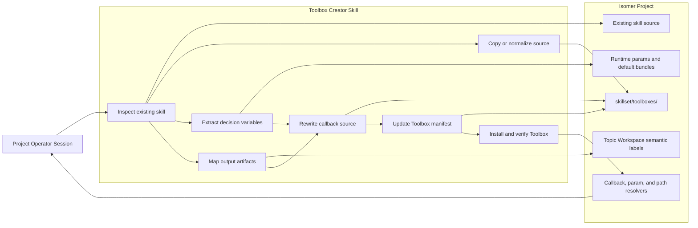
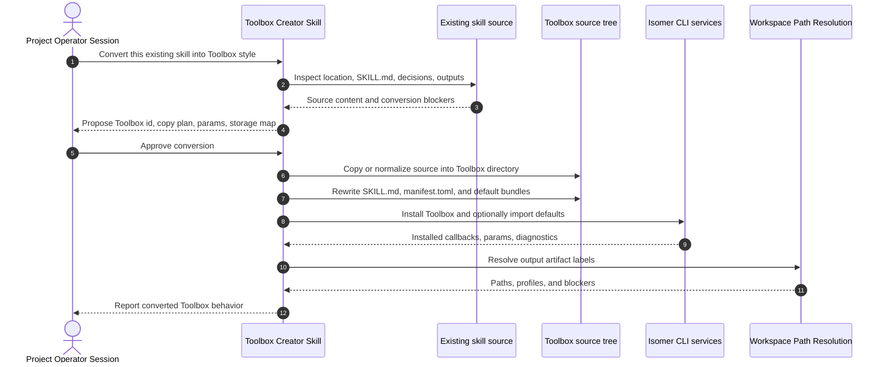

# Use Case 06: Convert Existing Skill to Toolbox Style

## Actor Goal

As a Project Operator Session, I want to ask the Toolbox Creator Skill to convert an existing skill into Toolbox style, so that the skill becomes installable as Toolbox callback material, exposes its dynamic decisions as runtime params, and writes or references output artifacts through the Topic Workspace storage layer.

## Use Case

The user has an existing skill, possibly already under `skillset/toolboxes/<toolbox-id>/` or possibly in another local skill directory. The Toolbox Creator Skill inspects the skill, copies it into a Toolbox directory when needed, identifies which behavior choices should become user-registered runtime params, rewrites the callback instructions to query those params through `isomer-cli` or the equivalent Project runtime-param service, identifies output artifacts the skill asks agents to create, maps those artifacts to semantic Topic Workspace storage labels, updates the Toolbox manifest, and installs or verifies the converted Toolbox when requested.

## Supported Actions

### Inspect Existing Skill Location

The user points to an existing skill and asks whether it can become a Toolbox.

- context
  - Actor **has** an existing skill directory, prompt file, or callback-like instruction source.
  - System **has** the Toolbox source layout rule that installable callback skill directories must live inside or be copied into a Toolbox directory before manifest validation.
- intent
  - Actor **wants** to preserve useful skill behavior while making it project-local, installable, and configurable.
  - Actor **wonders** "Can this existing skill become a Toolbox callback without losing its intent?"
- action
  - Actor then **asks** the skill to inspect or convert the existing skill.
- result
  - Actor **gets** a conversion-readiness report: current source path, whether it already lives inside a Toolbox directory, whether it contains `SKILL.md`, proposed Toolbox directory, copy plan when needed, and any path-safety blockers.

### Copy or Normalize Source into Toolbox Directory

The existing skill is outside a Toolbox directory or does not match the expected Toolbox layout.

- context
  - Actor **has** approved moving or copying source material into `skillset/toolboxes/<toolbox-id>/`.
  - System **has** callback source path validation that requires Toolbox manifest source paths to be relative to the Toolbox directory.
- intent
  - Actor **wants** a durable Toolbox source tree without mutating unrelated skill packages.
  - Actor **wonders** "Should we edit the original skill, or make a Toolbox-owned copy?"
- action
  - Actor then **asks** the skill to copy or normalize the source.
- result
  - Actor **gets** a Toolbox-owned callback source directory, preserved original content when possible, renamed files when needed for path safety, and a note that future Toolbox edits happen in the copied Toolbox source unless the user asks to sync back.

### Extract Dynamic Decision Variables

The existing skill contains hard-coded policy choices, thresholds, modes, or local preferences.

- context
  - Actor **has** a skill body with dynamic decisions such as strictness, evidence class, retry count, output style, model family, allowed data sources, or whether to write a checklist.
  - System **has** Toolbox runtime params, value types, enum allowed values, default bundles, Project and Topic manifest layers, and Topic Actor or Topic Agent specialization.
- intent
  - Actor **wants** hard-coded choices replaced by user-owned configuration.
  - Actor **wonders** "Which parts of this skill should become runtime params instead of fixed text?"
- action
  - Actor then **asks** the skill to identify and convert decision variables.
- result
  - Actor **gets** a param extraction table with old hard-coded text, proposed `<toolbox_id>:<key>` ids, value types, default values, allowed values when relevant, suggested scope, and the rewritten callback guidance for querying and branching on each effective value.

### Map Output Artifacts to Topic Workspace Storage

The existing skill asks agents to write reports, data, figures, logs, decisions, evidence, or handoff material.

- context
  - Actor **has** output instructions inside the existing skill.
  - System **has** semantic workspace surface labels such as `topic.records.artifacts`, `topic.records.runs`, `topic.records.views`, `topic.repos.main`, `agent.private_artifacts`, `agent.public_share`, `agent.scratch`, and `custom.*` labels registered through Workspace Path Resolution.
- intent
  - Actor **wants** output artifacts to land in durable, semantically correct storage instead of ad hoc paths.
  - Actor **wonders** "Where should this skill tell agents to put its outputs?"
- action
  - Actor then **asks** the skill to map outputs to Isomer storage.
- result
  - Actor **gets** an output artifact map naming each artifact, storage purpose, semantic label, CLI resolution command, path registration need when the label should be custom, durability, visibility, and whether the output starts as agent-private material or topic-level record material.

### Rewrite Skill Guidance into Toolbox Style

The user asks the skill to apply the conversion plan.

- context
  - Actor **has** approved the Toolbox source path, runtime-param contract, output artifact map, and intended insertion points.
  - System **has** rules that Toolbox callbacks are supplemental instructions and must not override system instructions, owning system skills, current user requests, evidence Gates, validation, or recording obligations.
- intent
  - Actor **wants** converted `SKILL.md` content that is safe and effective as callback material.
  - Actor **wonders** "What should the converted callback skill say now that decisions and outputs are Isomer-managed?"
- action
  - Actor then **asks** the skill to rewrite the copied skill.
- result
  - Actor **gets** a converted callback `SKILL.md` that declares its callback role, queries runtime params before branching, resolves storage labels before naming paths, writes outputs through the Topic Workspace storage layer, and reports blockers when required params or labels cannot be resolved.

### Update Manifest, Install, and Verify

The user asks the skill to make the converted skill installable and effective.

- context
  - Actor **has** a converted Toolbox source directory and selected Project or Research Topic scope.
  - System **has** high-level Toolbox installation, runtime-param default import opt-in, callback resolution, runtime-param resolution, Workspace Path Resolution, and storage validation.
- intent
  - Actor **wants** the converted skill to behave like a first-class Toolbox callback.
  - Actor **wonders** "Will this converted skill install, read params, and write outputs to the right storage?"
- action
  - Actor then **explicitly asks** the skill to update manifest files, install, and verify.
- result
  - Actor **gets** `manifest.toml` callback entries, runtime-param declarations and optional default bundle, installed callback ids, runtime-param import status, effective param values, resolved storage labels, and diagnostics for source, insertion-point, param, or storage blockers.

## Main Flow

1. The user invokes the Toolbox Creator Skill from a Project Operator Session.
2. The user points to an existing skill and asks to convert it into Toolbox style.
3. The skill inspects the source path and determines whether it is already inside `skillset/toolboxes/<toolbox-id>/` or should be copied there before conversion.
4. The skill proposes a Toolbox id, callback source directory name, insertion points, and copy plan. It does not edit the original skill unless the user explicitly asks for in-place conversion.
5. The skill reads the existing skill instructions and identifies dynamic decision variables: modes, thresholds, booleans, enum-like policy choices, default paths, output formats, and topic-specific assumptions.
6. The skill converts those variables into runtime-param definitions with `<toolbox_id>:<key>` ids, value types, defaults, allowed values, descriptions, and recommended Project, Research Topic, Topic Actor, or Topic Agent scope.
7. The skill identifies output artifacts requested by the existing skill and maps each one to a Topic Workspace semantic label. Topic-level durable outputs prefer `topic.records.artifacts`, `topic.records.runs`, `topic.records.views`, or a registered `custom.*` label; agent-local drafts prefer `agent.private_artifacts`, `agent.public_share`, or `agent.scratch`.
8. The skill rewrites the callback source so it queries effective runtime params, resolves semantic storage labels with `isomer-cli project paths get` or an equivalent storage service, and avoids hard-coded ad hoc output paths.
9. The skill writes or updates `manifest.toml`, `[[callbacks]]`, optional `[[runtime_params]]`, optional `[[runtime_param_bundles]]`, README conversion notes, and any default bundle files.
10. The user approves installation scope and whether default runtime-param bundles should be imported.
11. The skill installs the Toolbox through high-level Toolbox installation, then verifies callback resolution, effective runtime params, and storage label resolution for the selected context.
12. The user leaves the interaction with a converted Toolbox, a param map, an output artifact storage map, install status, and clear follow-up actions for tuning params or registering additional `custom.*` storage labels.

## Alternative And Exception Flows

- If the existing skill is already inside a Toolbox directory, the skill preserves that directory as the conversion home and updates only the Toolbox-owned files the user approves.
- If the existing skill is outside the Project or outside allowed source boundaries, the skill refuses direct installation and proposes a project-local copy under `skillset/toolboxes/<toolbox-id>/`.
- If the existing skill has no `SKILL.md`, the skill asks whether the source should become a `prompt_file`, inline `prompt`, or new callback `skill_dir`.
- If a dynamic decision variable is secret-like, user-private, or too large for runtime params, the skill refuses to store it as a runtime param and recommends a secret-safe or storage-layer alternative.
- If a dynamic variable controls output placement, the skill prefers semantic storage labels over runtime params; runtime params may select a mode, but storage path truth comes from Workspace Path Resolution.
- If an output artifact does not match a built-in semantic label, the skill proposes registering a `custom.*` label with an appropriate `storage_profile`, such as `topic_records_dir` for durable topic records.
- If the converted skill wants to write into `.isomer-labs/`, Topic Config files, `state.sqlite`, adapter manifests, or generated runtime internals, the skill rewrites the plan to use supported CLI commands or Topic Workspace storage surfaces.
- If the converted skill asks agents to place accepted topic-level artifacts in `agent.scratch`, the skill keeps scratch as draft-only and maps accepted outputs to topic-level records or an approved custom label.
- If no suitable callback insertion point is visible, the skill stops before installation and reports whether the user likely needs extension discovery, Project extension declaration, or a different owning workflow.
- If the user asks for Topic Agent-specific behavior, the skill uses runtime params for specialization and does not install callbacks at Topic Agent scope.
- If the user only wants an analysis report, the skill stops after producing the conversion plan and does not copy, rewrite, or install anything.

## Mermaid Flow Diagram

## Mermaid Sequence Diagram

## Durable Outputs

- A conversion report showing source path, Toolbox directory, copied files, preserved files, and any source-boundary decisions.
- A dynamic decision variable map from original hard-coded behavior to runtime-param ids, value types, defaults, allowed values, and scopes.
- A converted callback `SKILL.md` that queries runtime params and resolves storage labels instead of hard-coding decisions or output paths.
- A `manifest.toml` with `[[callbacks]]`, optional `[[runtime_params]]`, and optional `[[runtime_param_bundles]]`.
- Optional runtime-param default bundle TOML files.
- An output artifact map naming semantic labels such as `topic.records.artifacts`, `topic.records.runs`, `topic.records.views`, `agent.private_artifacts`, `agent.public_share`, `agent.scratch`, or `custom.*` labels to register.
- Optional installed Toolbox registration, callback records, runtime-param imports, and verification output.

## Example Prompt And Expected Visible AI Response

> **Warning:** The user/AI chat content below is for example purposes only. Implementations should learn its style, intent, and semantics rather than hardcoding the example content.

These examples show only the visible user prompt and the AI response content that should be returned to the user. Do not include hidden reasoning, chain-of-thought, scratchpad notes, private tool-selection deliberation, or thinking process in the AI response unless the user explicitly asks the skill to document that process.

### Event 001 - Convert Existing Skill

> Time: `<example-time>` · Session: `Project Operator Session`

User Prompt:

> Use $toolbox-creator-skill to convert `extern/orphan/bench-evidence-skill` into a Toolbox. It currently tells experiment agents to save `evidence.md` and has a hard-coded strict mode. Make it configurable and use Isomer storage.

AI (visible response):

> I will convert this as a Toolbox-owned callback skill. Because the source is outside the Toolbox directory, I will copy it into `skillset/toolboxes/bench-evidence/bench-evidence-check/` before changing it.
>
> Conversion plan:
>
> | Area | Conversion |
> | --- | --- |
> | `toolbox_id` | `bench-evidence` |
> | `callback_source` | `bench-evidence-check/SKILL.md` |
> | `insertion_point` | `isomer-deepsci-experiment/begin` |
> | `decision_variable` | hard-coded strict mode -> `bench-evidence:evidence/mode` |
> | `value_type` | enum: `strict`, `relaxed` |
> | `default` | `strict` |
> | `output_artifact` | `evidence.md` -> `topic.records.artifacts` under an evidence subdirectory |
> | `storage_rule` | resolve the semantic label before naming a concrete path |
>
> The converted callback will ask the owning experiment agent to query the effective runtime param, branch on the selected mode, and place durable evidence output through the resolved Topic Workspace records surface. It will not write into `.isomer-labs/`, `state.sqlite`, or ad hoc project-root paths.

### Event 002 - Install Converted Toolbox and Verify Storage

> Time: `<example-time>` · Session: `Project Operator Session`

User Prompt:

> Looks right. Copy it, install it for topic `cuda-kernel-study`, import the default params, and verify the output label.

AI (visible response):

> I will copy the skill into the Toolbox directory, rewrite the dynamic decision as a runtime param, install the Toolbox for `cuda-kernel-study`, import the default bundle, and verify both callback and storage resolution.
>
> Expected report:
>
> | Field | Value |
> | --- | --- |
> | `copied_source` | `skillset/toolboxes/bench-evidence/bench-evidence-check/SKILL.md` |
> | `installed_callback_id` | `bench-evidence:bench-evidence-check/experiment/begin` |
> | `runtime_param_import_status` | installed |
> | `effective_param` | `bench-evidence:evidence/mode = strict` |
> | `output_label` | `topic.records.artifacts` |
> | `storage_profile` | topic records directory |
> | `scope` | Research Topic `cuda-kernel-study` |
>
> If the Topic Workspace has no materialized records directory yet, I will resolve or materialize the semantic path through Isomer storage commands rather than inventing a path.

## Assumptions And Open Questions

- Assumption: Conversion creates or edits a Toolbox-owned copy unless the existing skill is already inside the intended Toolbox directory.
- Assumption: Dynamic decision variables should become runtime params when they are user-owned configuration, not when they are fixed safety rules or owning-system-skill obligations.
- Assumption: Output artifact placement should use Workspace Path Resolution and semantic labels, not hard-coded filesystem paths.
- Assumption: Topic-level durable outputs belong under topic records or registered `custom.*` labels; agent-local drafts belong under agent labels until promoted.
- Open question: Should the conversion report include a machine-readable diff table for every changed instruction, or is a human-readable map sufficient for the first version?
- Open question: Should the Toolbox Creator Skill offer automatic `custom.*` label registration when an output artifact map needs a new surface, or should it stop and ask the Project Operator Session first?
