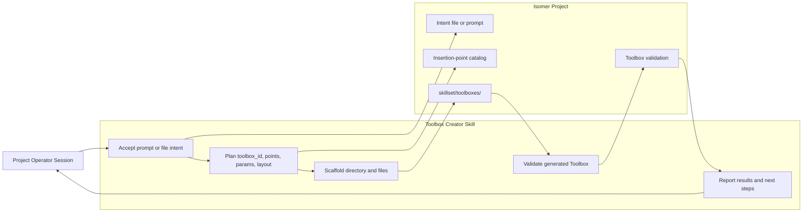
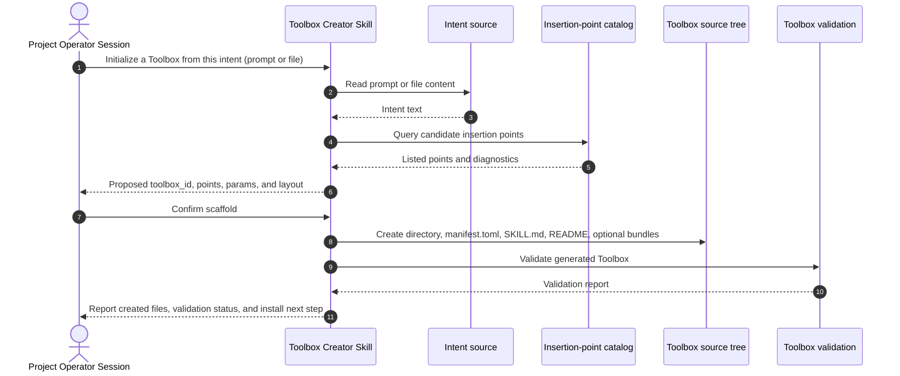

# Use Case 07: Initialize Toolbox from User Intent (Prompt or File)

## Actor Goal

As a Project Operator Session, I want to give the Toolbox Creator Skill a freeform intent prompt or an intent file and have it scaffold a complete Toolbox source tree in one go, so that I receive a valid `toolbox_id`, manifest, callback structure, and optional runtime params without authoring each piece separately.

## Use Case

The user supplies intent as a concise prompt such as "create a Toolbox that makes review agents check for real-hardware evidence before approving claims" or as a file path pointing to a Markdown or plain-text intent description. The Toolbox Creator Skill interprets the intent, plans a Toolbox design, creates the directory structure under `skillset/toolboxes/<toolbox-id>/`, writes `manifest.toml`, callback skill source with `SKILL.md`, an optional runtime-param default bundle, and a short README, validates the generated Toolbox, and reports what was created and what still needs user confirmation before installation.

## Supported Actions

### Accept Intent from Prompt

The user describes the desired Toolbox behavior directly in chat.

- context
  - Actor **has** a short natural-language description of behavior, audience, or workflow concern.
  - System **has** canonical Toolbox language, callback insertion-point discovery, Toolbox manifest schema, and runtime-param design rules.
- intent
  - Actor **wants** the skill to turn the prompt into a project-local Toolbox scaffold.
  - Actor **wonders** "Can you just create the Toolbox files from this description?"
- action
  - Actor then **asks** the skill to initialize a Toolbox from the prompt.
- result
  - Actor **gets** a planned Toolbox summary with proposed `toolbox_id`, insertion points, runtime params, source layout, and confirmation of what files will be written.

### Accept Intent from File

The user points to a file containing a Toolbox intent, requirements, or behavior notes.

- context
  - Actor **has** a project-local file such as `context/toolbox-intents/evidence-quality.md` with intent text.
  - System **has** file read access, path safety checks, and the same Toolbox design capabilities used for prompt input.
- intent
  - Actor **wants** the skill to read the file and scaffold the Toolbox from its content.
  - Actor **wonders** "Can you turn this intent document into a Toolbox directory?"
- action
  - Actor then **asks** the skill to initialize a Toolbox from the file path.
- result
  - Actor **gets** the same planned summary as prompt input, plus confirmation that the file was read and which parts of it shaped the design.

### Plan Toolbox Structure from Intent

The skill derives a complete Toolbox plan before writing files.

- context
  - Actor **has** provided an intent prompt or file.
  - System **has** insertion-point catalog, Toolbox manifest rules, runtime-param design heuristics, and scope selection guidance.
- intent
  - Actor **wants** a coherent plan that maps the intent to valid Toolbox files and CLI behavior.
  - Actor **wonders** "What `toolbox_id`, insertion points, and runtime params should this have?"
- action
  - Actor then **asks** the skill to show the plan before scaffolding, or the skill produces the plan automatically as part of the one-go workflow.
- result
  - Actor **gets** a plan covering `toolbox_id`, target skills and stages, callback source type, runtime-param contract, default bundle decision, scope recommendation, and directory layout.

### Scaffold Toolbox Directory and Files

The skill writes the Toolbox source tree in one go.

- context
  - Actor **has** approved or accepted the planned design.
  - System **has** the canonical Toolbox source layout and validation rules.
- intent
  - Actor **wants** the actual files created under `skillset/toolboxes/<toolbox-id>/`.
  - Actor **wonders** "Please write the manifest, callback skill, and any param files now."
- action
  - Actor then **asks** the skill to scaffold the Toolbox, or the skill scaffolds automatically after showing the plan.
- result
  - Actor **gets** the created directory tree, file list, manifest content, callback `SKILL.md` outline, optional runtime-param default bundle, and README notes.

### Validate and Report Scaffolded Toolbox

The skill checks the generated Toolbox before reporting completion.

- context
  - Actor **has** a freshly scaffolded Toolbox directory.
  - System **has** Toolbox manifest validation, source-path checks, insertion-point validation, and secret-like material detection.
- intent
  - Actor **wants** confidence that the scaffolded Toolbox is installable and safe.
  - Actor **wonders** "Does this pass validation, and what would I need to change before installing?"
- action
  - Actor then **asks** the skill to validate the scaffolded Toolbox, or validation runs automatically after scaffolding.
- result
  - Actor **gets** a validation report listing valid items, warnings such as catalog-only extension points or skipped defaults, and any errors blocking installation.

## Main Flow

1. The user invokes the Toolbox Creator Skill from a Project Operator Session.
2. The user supplies intent as a freeform prompt or as a file path.
3. The skill reads the intent, confirms the input source, and summarizes what it understood.
4. The skill proposes a stable `toolbox_id` derived from the intent, checks that it does not collide with an existing Toolbox directory, and asks for confirmation only when ambiguity or collision exists.
5. The skill queries the Project-visible callback insertion-point catalog and maps the intent to one or more `<skill>/<point-inside-skill>` ids.
6. The skill decides whether runtime params are needed based on variability in the intent, such as strictness modes, evidence classes, output styles, or scope-specific overrides.
7. The skill designs the source layout: a callback skill directory with `SKILL.md`, optional prompt files, optional runtime-param default bundle files, `manifest.toml`, and a short README.
8. The skill creates `skillset/toolboxes/<toolbox-id>/` and writes all planned files.
9. The skill validates the generated Toolbox: manifest schema, callback keys, source paths, insertion points, runtime-param declarations, default bundle paths, duplicate keys, and secret-like material.
10. The skill reports the created files, validation status, scope recommendation, and next steps. It does not install the Toolbox unless the user explicitly asks for installation in a follow-up turn.
11. The user leaves the interaction with a ready-to-install Toolbox source tree and a clear path to install, refine, or discard it.

## Alternative And Exception Flows

- If the intent is too broad for one Toolbox, the skill scopes it to one reusable callback behavior and notes additional Toolboxes that could be created separately.
- If the intent file does not exist or is unreadable, the skill reports the path error and stops before creating files.
- If no Project-visible insertion point matches the intent, the skill reports the gap, suggests explicit extension discovery or Project extension declaration, and stops before writing installable callback entries.
- If the intent implies runtime params but does not define them, the skill proposes a minimal param contract with defaults and asks the user to confirm or edit.
- If the user requests a dry run, the skill shows the planned files and content without writing anything to disk.
- If validation reports errors, the skill describes each error, proposes a fix, and asks whether to apply the fix or leave the Toolbox as-is for manual editing.
- If the generated `toolbox_id` collides with an existing Toolbox directory, the skill proposes an alternative id and waits for user confirmation.
- If the intent asks the generated callback to override system instructions, developer instructions, evidence Gates, validation, or current user intent, the skill rewrites it as supplemental framing, checking, or reporting guidance.
- If the user wants project-wide installation by default, the skill warns that project scope affects all matching contexts and requires explicit confirmation before any install step.
- If the user wants to skip runtime params entirely, the skill generates a Toolbox with only callback entries and no `[[runtime_params]]` section.

## Mermaid Flow Diagram



## Mermaid Sequence Diagram



## Durable Outputs

- A Toolbox source directory under `skillset/toolboxes/<toolbox-id>/`.
- A `manifest.toml` with `schema_version = "isomer-toolbox.v1"`, `kind = "toolbox-callback-bundle"`, stable `toolbox_id`, and `[[callbacks]]` entries.
- A callback source directory with `SKILL.md` that describes the supplemental callback behavior.
- Optional `[[runtime_params]]` declarations and optional runtime-param default bundle TOML files with `schema_version = "isomer-toolbox-runtime-params.v1"`.
- A short `README.md` explaining the Toolbox purpose, insertion points, and how to install or refine it.
- A validation report listing valid items, warnings, and errors.
- No installed callback records, Toolbox registration, or manifest mutations unless the user explicitly asks for installation afterward.

## Example Prompt And Expected Visible AI Response

> **Warning:** The user/AI chat content below is for example purposes only. Implementations should learn its style, intent, and semantics rather than hardcoding the example content.

These examples show only the visible user prompt and the AI response content that should be returned to the user. Do not include hidden reasoning, chain-of-thought, scratchpad notes, private tool-selection deliberation, or thinking process in the AI response unless the user explicitly asks the skill to document that process.

### Event 001 - Initialize Toolbox from Prompt

> Time: `<example-time>` · Session: `Project Operator Session`

User Prompt:

> Use $toolbox-creator-skill to initialize a Toolbox that makes DeepSci review agents reject any claim that lacks real-hardware evidence. I want it strict by default but let topics relax it to proxy-inference if they document the limitation.

AI (visible response):

> I will initialize a Toolbox from your intent and write the source files under `skillset/toolboxes/evidence-quality/`.
>
> Proposed design:
>
> | Field | Value |
> | --- | --- |
> | `toolbox_id` | `evidence-quality` |
> | `primary_insertion_point` | `isomer-deepsci-review/begin` |
> | `secondary_insertion_point` | `isomer-deepsci-review/end` |
> | `runtime_param` | `evidence-quality:evidence/mode` |
> | `value_type` | `enum` |
> | `allowed_values` | `strict`, `relaxed` |
> | `default` | `strict` |
> | `scope_recommendation` | Research Topic first, Project-wide only after explicit confirmation |
>
> Files I will write:
>
> ```text
> skillset/toolboxes/evidence-quality/
>   manifest.toml
>   README.md
>   review-evidence-check/SKILL.md
>   defaults/evidence-mode.toml
> ```
>
> Validation preview: manifest schema valid, insertion point declared, source paths inside Toolbox directory, no secrets detected. I have not installed anything. Say "install it for topic <name>" when you want to make it effective.

### Event 002 - Initialize Toolbox from Intent File

> Time: `<example-time>` · Session: `Project Operator Session`

User Prompt:

> Use $toolbox-creator-skill to initialize a Toolbox from `context/toolbox-intents/gpu-experiment-checklist.md`.

AI (visible response):

> I read `context/toolbox-intents/gpu-experiment-checklist.md` and will initialize a Toolbox from it.
>
> Key intent extracted:
>
> - Target workflow: GPU experiment preparation and closure.
> - Desired behavior: enforce a checklist before benchmark runs and after results exist.
> - Variability: checklist strictness may differ by topic.
>
> Proposed design:
>
> | Field | Value |
> | --- | --- |
> | `toolbox_id` | `gpu-experiment-checklist` |
> | `insertion_points` | `isomer-deepsci-science/begin`, `isomer-deepsci-experiment/end` |
> | `runtime_param` | `gpu-experiment-checklist:strictness` |
> | `value_type` | `enum` |
> | `allowed_values` | `full`, `minimal` |
> | `default` | `full` |
>
> Files written:
>
> ```text
> skillset/toolboxes/gpu-experiment-checklist/
>   manifest.toml
>   README.md
>   science-begin-check/SKILL.md
>   experiment-end-check/SKILL.md
>   defaults/strictness.toml
> ```
>
> Validation passed. The Toolbox is ready to install when you confirm scope.

## Assumptions And Open Questions

- Assumption: The user expects a one-go scaffold and is willing to review the generated files before installation.
- Assumption: The generated `toolbox_id` can be derived from intent keywords when the user does not name one explicitly.
- Assumption: Runtime params are generated only when the intent clearly implies configurable behavior across Project, Research Topic, Topic Actor, or Topic Agent scope.
- Assumption: The skill writes files through normal repository editing and does not need a separate scaffolding CLI command.
- Open question: Should the skill ask for confirmation before writing files, or should it scaffold automatically and let the user review afterward?
- Open question: Should the skill support an explicit `--dry-run` style request that shows the planned files without writing them?
- Open question: Should intent files follow a lightweight schema, or can they be freeform Markdown or plain text?
- Open question: Should the generated README include installation commands, or should it remain a brief purpose and structure summary?
