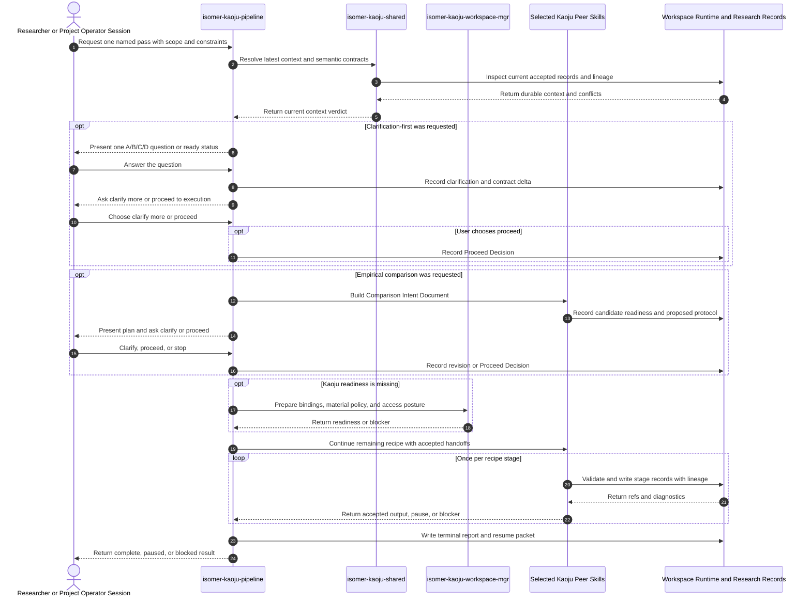
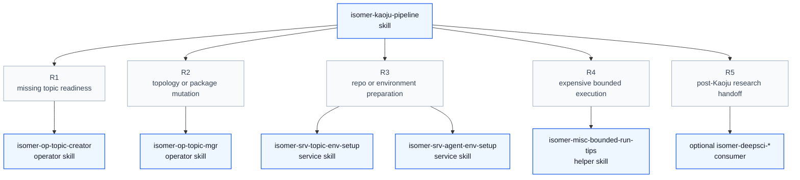

# Isomer Kaoju Pipeline and Skill Family Design Overview

## Proposed Skill Frontmatter

```yaml
---
name: isomer-kaoju-pipeline
description: Use when a Research Topic or Research Inquiry needs a bounded literature, repository, model, dataset, reproduction, or comparative survey with versioned sources and first-hand evidence.
---
```

## Purpose

This note describes the proposed public coordinator skill, `isomer-kaoju-pipeline`, and the peer `isomer-kaoju-*` interfaces it composes before any production skill files are created. Kaoju is an optional built-in research-paradigm extension for determining what existing sources and implementations establish through versioned source study, code and artifact examination, first-hand reproduction, and controlled comparison.

The key orchestration rule is: the pipeline executes exactly one named bounded pass, preserves every peer skill's evidence and blocker contract, and returns a terminal report without choosing an autonomous next loop.

The proposed skill is primarily a discipline-enforcing procedural skill. Its subcommand structure uses the Imsight complex-procedure flavor because later stages consume durable outputs from earlier stages.

Foundational principle: a reported source claim, located passage, inspected implementation, executed Run, reproduced claim, and comparable result are different evidence states; collapsing them violates both the letter and purpose of Kaoju.

## Concepts

- **Kaoju Inquiry Contract**: The Artifact that fixes the Research Inquiry question, source boundary, inclusion rules, coverage target, evidence depth, comparison dimensions, resource envelope, and stopping criteria.
- **Source Identity**: The immutable or version-addressed identity of a paper, repository, model, dataset, benchmark specification, release, issue, or documentation source, separate from its mutable local path.
- **Material Manifest**: The durable acquisition inventory containing source identities, locators, revisions, hashes, licenses, sizes, access status, and Canonical External Repository refs.
- **Related-Work Catalog**: A literature-first catalog whose primary entries are papers and technical reports and whose linked implementation or evidence artifacts include repositories, models, datasets, and benchmark specifications.
- **Field Summary**: A broad synthesis of a Related-Work Catalog covering taxonomy, chronology, major themes, agreements, disputes, evidence limitations, open gaps, and a suggested reading path.
- **Claim-Evidence Ledger**: The appendable central handoff that links stable Research Claims to exact source locators, Evidence Items, Runs, observed values, patches, comparison cells, verdicts, and provenance.
- **Verification Depth**: One of `reported`, `located`, `inspected`, `executed`, `reproduced`, or `compared`, recording which evidence-producing operation has actually occurred.
- **Evidence Verdict**: One of `supported`, `contradicted`, `partial`, `inconclusive`, `blocked`, or `not-comparable`, recorded separately from verification depth.
- **Execution Fidelity**: One of `upstream-faithful`, `adapted`, or `repaired`, preventing modified Runs from overwriting the meaning of faithful attempts.
- **Run Purpose**: Either `reproduction` or `capability-probe`, separating an attempt to evaluate a reported claim from a lightweight run intended only to expose method behavior under declared inputs.
- **Generated Dataset Artifact**: A versioned synthetic input package with generator source, schema, size, distribution assumptions, seeds, validation checks, and limitations. It can support a capability probe but cannot inherit the identity or evidential meaning of a reported dataset.
- **Theory Comparison Artifact**: A source-grounded survey artifact for named works containing a domain-derived Comparison Dimension Set and rationale, an evidence-linked matrix, narrative trade-offs, disagreements, limitations, and empirical follow-up questions.
- **Seed Direction Expansion Contract**: The Artifact that fixes seed work identities, an evidence-backed Direction Signature, relevance and importance criteria, backward and post-seed search bounds, `latest_after`, `searched_through`, budget, and stopping rule for deepening one survey direction.
- **Clarification Record**: The durable interaction record containing the original request, material ambiguity, A/B/C/D options, suggested choice and rationale, user answer, contract delta, remaining assumptions, and clarify-more or proceed decision.
- **Comparison Intent Document**: A survey Artifact created before empirical preparation or Runs that separates the user's goal from Kaoju's field-informed proposal and records candidate readiness, prior-evidence reuse, acquisition, environment, reproduction or reimplementation needs, metrics, fairness, resources, Gates, and unresolved decisions.
- **Topic Dataset Manifest**: A machine-readable topic inventory of Dataset Registrations. Each entry has a stable dataset id, human metadata, source and managed-link locators, access and license posture, observed format and schema, fingerprint or staleness policy, availability, and Provenance refs so later empirical workflows can discover existing data before asking or downloading.
- **Curated Source Intake Contract**: The Artifact that preserves a user-nominated source list, target survey refs, stated relevance, requested inspection depth, access and resource bounds, stopping rule, and read-only execution posture.
- **Source Digest**: A per-item examination record containing resolved identity, source type, contribution or purpose, relevant claims, method or implementation structure, evaluation basis, assumptions, limitations, contradictions, linked artifacts, exact locators, Verification Depth, survey relevance, and terminal disposition.
- **Source Access Blocker**: The per-item record used when a nominated source cannot be examined, containing the resolved or attempted identity, access attempts, blocker reason, evidence limits, and minimum resume action.
- **Curated Source Intake Delta**: The audited set of evidence-linked additions and revisions proposed for an existing Related-Work Catalog, Field Summary, Claim-Evidence Ledger, taxonomy, chronology, limitations, artifact links, and reading path after curated intake.
- **Kaoju Dossier**: A human-readable synthesis rendered from accepted source, claim, evidence, Run, comparison, audit, and provenance records.

## Public Skill Family Interface

Every stage skill is directly invokable and owns one primary procedure. `isomer-kaoju-shared` is an internal coordination contract rather than a research stage. `isomer-kaoju-pipeline` composes peer skills but does not absorb their ownership.

| Skill | Invoke When | Consumes | Produces | Stop or Route Rule |
| --- | --- | --- | --- | --- |
| `isomer-kaoju-shared` | A Kaoju skill needs current context, evidence vocabulary, source identity, lineage, handoff, interaction posture, or worker-output rules. | Coordination question, interaction preference, and relevant durable refs. | Coordination result, selected semantic object, and clarification posture when requested. | Return work to the owning stage; shared produces no research conclusion. |
| `isomer-kaoju-workspace-mgr` | Topic setup exists but Kaoju record bindings, external repository posture, dataset registry, large-material policy, or worker access is not ready. | Topic readiness evidence, selected actor or agent, selected Kaoju skills, storage capabilities, and optional user-approved external dataset directories. | Workspace context, binding registry, Topic Dataset Manifest readiness or registration request, material policy, access plan, validation or blocker. | Route filesystem mutation to the Topic Workspace owner and hand off only when durable targets, link posture, and access are explicit. |
| `isomer-kaoju-frame` | The Research Inquiry lacks a bounded source, coverage, evidence, comparison, or resource protocol. | User question, current records, source seeds, constraints. | Kaoju Inquiry Contract, seed claims, coverage target, resource envelope, route or blocker. | Stop before substantive search or execution once a pass can be selected. |
| `isomer-kaoju-discover` | The eligible paper, technical report, source code repository, dataset, model, benchmark, release, or issue neighborhood is incomplete, or a curated list needs identity and relationship resolution. | Inquiry, expansion, or curated intake contract; source seeds or nominated list; Direction Signature when applicable; prior query log; source catalog; and citation edges. | Discovery ledger with route provenance, per-class coverage, resolved curated items, source catalog or Related-Work Catalog candidates, inclusion decisions, duplicate links, post-seed frontier, coverage status, and acquisition handoff. | Stop at the declared coverage criterion, time cutoff, frontier saturation, curated identity-resolution boundary, or a recorded discovery blocker. |
| `isomer-kaoju-acquire` | Included materials must become versioned, inspectable, or executable after available registered data is considered. | Included source catalog, Topic Dataset Manifest, compatibility requirements, and acquisition targets. | Reused Dataset Registration refs, Material Manifest, repository refs, locators, hashes, licenses, access status, provenance or blocker. | Query and validate registered datasets before new acquisition; stop before interpretation or execution when material identity is durable. |
| `isomer-kaoju-examine` | Claims must be traced into exact source passages, code, configs, checkpoints, tests, evaluators, or benchmark paths, or curated items need per-source digestion. | Inquiry or curated intake contract, Material Manifest, selected claims or nominated items, and prior evidence. | Updated Claim-Evidence Ledger, source examination records, Source Digests or Source Access Blockers, Paper-Code Mapping, drift and contradiction register. | Route gaps to discover or acquire; route execution needs to reproduce or compare. |
| `isomer-kaoju-reproduce` | One existing implementation or reported claim needs a bounded first-hand attempt, including an explicitly declared generated-data capability probe. | Selected method or claim, source identities, mapped execution path, run purpose, input basis, constraints. | Reproduction Contract or Capability Probe Contract, Run refs, Result Table, Evidence Items, generated-data or patch Artifact refs, and calibrated verdict or Finding. | Stop after one procedure is recorded; never promote a capability probe into reproduction evidence. |
| `isomer-kaoju-compare` | Two or more existing works or systems need structured source-grounded or empirical comparison under an explicit mode and protocol. | Named candidates, `comparison_mode`, `comparison_phase`, dimension set, source mappings, survey context, and, for empirical results, accepted intent, reproduction evidence, and resources. | Theory Comparison Contract and Artifact in `theory` mode; Comparison Intent Document in empirical `intent` phase; or Comparison Contract, candidate Run set, Comparison Matrix, fairness findings, and verdicts in empirical `results` phase. | Preserve source depth in theory mode; require accepted intent before empirical preparation; return `not-comparable` rather than weaken semantics or hide adaptation. |
| `isomer-kaoju-audit` | An evidence package needs independent checks for coverage, provenance, drift, hidden patches, Run completeness, or fairness. | Inquiry contract and the complete candidate evidence package. | Audit Report, gap register, readiness verdict and bounded repair routes. | Diagnose and route defects without silently repairing evidence. |
| `isomer-kaoju-synthesize` | Accepted evidence is ready to answer the inquiry, update a survey, or state its limits. | Audited evidence package or explicit audit waiver, final ledger, Source Digests when applicable, contradictions, and limitations. | Kaoju Dossier, Field Summary, or Curated Source Intake Delta; final claim statuses; Findings; appendices; unresolved questions; and optional downstream handoff. | Generate no missing search or Run evidence; route gaps back to their owning stage. |
| `isomer-kaoju-pipeline` | A user wants one named multi-stage Kaoju procedure with automatic durable handoffs and optional clarification-first control. | Pipeline context, accepted input refs, selected pass, interaction preference, optional starting stage, and resource or Gate preferences. | Clarification Records when requested, Proceed Decision, Pipeline Run Record, stage handoffs, terminal report, and resume packet. | Do not start a clarification-first pass before explicit proceed; end the pass `complete`, `paused`, or `blocked`. |

## Core Workflow

When `isomer-kaoju-pipeline` is invoked, execute the following steps in order.

1. **Resolve the pass.** Select one named pass from the user request and build a `kaoju-pipeline-context` with Topic and Inquiry refs, source or claim selection, accepted input refs, cutoff, coverage target, resource envelope, interaction preference, Gate preferences, and optional starting stage.
2. **Run the clarification-first checkpoint when requested.** Inspect the request and accepted context without mutation, ask one structured material question at a time, record the answers, and wait for the user's explicit proceed decision before starting the pass.
3. **Run the empirical comparison intent gate when applicable.** Build and present the Comparison Intent Document from accepted survey and readiness evidence, ask whether the user wants more detail or wants to proceed, and wait before candidate preparation or Runs.
4. **Run context and readiness checks.** Apply `isomer-kaoju-shared` latest-context rules and route missing Kaoju binding, repository, material, actor, agent, or environment readiness to `isomer-kaoju-workspace-mgr` and the owning external setup skill.
5. **Execute the recipe once.** Treat any completed empirical intent phase as the accepted prefix of the selected recipe, invoke each remaining peer skill once in recipe order, hand durable outputs forward automatically, and preserve callbacks, quality gates, lineage, evidence states, worker-output policy, and blocker semantics.
6. **Apply transitions honestly.** Continue only when the current stage's accepted outputs satisfy the next stage; otherwise pause or block with a resume point and exact record refs.
7. **Return the terminal report.** Report `complete`, `paused`, or `blocked`, stage outcomes, accepted outputs, resource use, Gates, blockers, and resume context without choosing another macro pass.

If the user's task does not map cleanly to these steps, build one bounded plan from the closest Kaoju peer skills, preserve the same semantic contracts, and state why no named pass fits.

## Subcommands Design

The pipeline uses the complex-procedure flavor. Individual stage skills remain single-procedure skills without public subcommands.

### Helper Subcommands

No helper subcommands are currently exposed. Clarification-first is an interaction posture triggered by the user's request, not a separate research pass or helper command. Context preflight, transition evaluation, durable handoff, and terminal-report construction remain shared internal contracts rather than user-facing commands.

### Procedural Subcommands

| Subcommand | Use For | Stage Recipe | Load |
| --- | --- | --- | --- |
| `landscape-pass` | Help a user understand a field broadly through a literature-first Related-Work Catalog and Field Summary without requiring first-hand execution. | frame, discover, acquire, examine, audit, synthesize | Future `commands/landscape-pass.md` |
| `direction-expansion-pass` | Deepen an existing survey direction from named seed works through cited predecessors, topic neighbors, forward citations, and time-bounded post-seed discovery. | frame, acquire, examine, discover, acquire, examine, audit, synthesize | Future `commands/direction-expansion-pass.md` |
| `curated-intake-pass` | Read a user-nominated list of references and codebases, account for every item, and integrate useful supported information into an existing survey without broad discovery or execution. | frame, discover(identity and relationships), acquire, examine, audit, synthesize | Future `commands/curated-intake-pass.md` |
| `source-audit-pass` | Inspect named papers, repositories, models, datasets, or benchmark materials without broad discovery. | frame, acquire, examine, audit, synthesize | Future `commands/source-audit-pass.md` |
| `theory-comparison-pass` | Compare named works through domain-derived, source-grounded dimensions and attach the output to the survey artifacts without requiring Runs. | frame, discover, acquire, examine, compare, audit, synthesize | Future `commands/theory-comparison-pass.md` |
| `method-trial-pass` | Obtain a named paper method and return first-hand numbers from either its intended data or an explicitly generated-data capability probe. | frame, discover, acquire, examine, reproduce, audit, synthesize | Future `commands/method-trial-pass.md` |
| `reproduction-pass` | Trace and reproduce one named existing claim or implementation. | frame, acquire, examine, reproduce, audit, synthesize | Future `commands/reproduction-pass.md` |
| `comparative-pass` | Compare an already named candidate set under one controlled protocol after a reviewed empirical intent phase. | frame, discover(context as needed), compare(intent), acquire, examine, reproduce, compare(results), audit, synthesize | Future `commands/comparative-pass.md` |
| `full-kaoju-pass` | Discover the candidate set and conduct the complete bounded comparative investigation after a reviewed empirical intent phase. | frame, discover, compare(intent), acquire, examine, reproduce, compare(results), audit, synthesize | Future `commands/full-kaoju-pass.md` |

The `direction-expansion-pass` uses its first acquire and examine stages to resolve the seed direction, then uses discover and a second acquire and examine pair to curate new work. The `curated-intake-pass` resolves only the nominated items and their direct work-to-artifact relationships, produces a digest and disposition for every item, audits the proposed information and placement, and then applies the accepted delta; broader citation or neighbor discovery routes to `direction-expansion-pass`. The `source-audit-pass` differs by investigating source or claim support without requiring integration into an existing survey. The `theory-comparison-pass` starts from named works, may discover references to justify its dimensions, and does not require Runs. The `method-trial-pass` starts from a named paper or method and may stop at `executed` depth when the user requests a generated-data capability probe. The `reproduction-pass` starts from a selected claim and seeks claim-bearing reproduction evidence. The `comparative-pass` assumes named candidates; `full-kaoju-pass` discovers them. Both empirical passes invoke `isomer-kaoju-compare` first in `intent` phase and later in `results` phase, with the accepted intent controlling acquisition and reproduction. These different intents keep related stage recipes from implying identical evidence. Resume is a pipeline-context posture with a prior resume packet and optional starting stage, not an autonomous loop or separate pass.

### Misc Subcommands

| Subcommand | Use For | Load |
| --- | --- | --- |
| `list-passes` | List available passes, required starting inputs, expected evidence depth, and stage recipes. | Future `commands/list-passes.md` |
| `help` | Explain the pipeline, peer skill boundaries, named passes, verification states, and terminal statuses. | This entrypoint |

## Semantic Evidence Contract

The Claim-Evidence Ledger is the family-wide central handoff. Each claim row has a stable `claim_id` and keeps these dimensions separate:

| Dimension | Required Values or Content |
| --- | --- |
| Verification depth | `reported`, `located`, `inspected`, `executed`, `reproduced`, or `compared`. |
| Evidence verdict | `supported`, `contradicted`, `partial`, `inconclusive`, `blocked`, or `not-comparable`. |
| Comparison mode | `theory` for source-grounded analysis or `empirical` for controlled first-hand comparison. |
| Comparison phase | `intent` for empirical planning before candidate preparation or `results` for the accepted controlled Run comparison. |
| Execution fidelity | `upstream-faithful`, `adapted`, or `repaired` when a Run exists. |
| Run purpose | `reproduction` or `capability-probe` when a Run exists. |
| Input basis | Reported dataset and split, equivalent real data, declared subset, or generated data with exact durable refs. |
| Source locator | Page, section, table, equation, stable URL, repository revision, file and symbol, config, checkpoint, test, dataset split, benchmark task, or equivalent exact locator. |
| Values | Reported result and first-hand observed result in separate fields with metric definition, units, and conditions. |
| Durable refs | Evidence Item, Artifact, Run, patch, environment, comparison, decision, and Provenance Record refs as applicable. |

A passing upstream test proves execution of that test, not reproduction of a paper claim. A repaired Run does not overwrite the faithful verdict. A metric name shared by two systems does not establish comparability. Under ADR 0003, numbers measured on generated data describe the declared capability probe only and cannot support a paper benchmark verdict. Under ADR 0004, a Theory Comparison Artifact may compare named works while its cells retain source verification depth; `compared` depth remains reserved for controlled first-hand comparative evidence.

Every theory comparison records each dimension's definition, rationale, applicability rule, and source refs. If the target works and existing survey artifacts do not establish a useful dimension set, the pipeline may perform bounded reference discovery, but contextual references do not become target works unless the user adds them explicitly.

Every seed-directed candidate records one or more discovery routes from `backward-citation`, `topic-neighbor`, `forward-citation`, and `post-seed-latest`, plus seed or query provenance. Under ADR 0005, `latest_after` defaults to the latest resolved seed date and `searched_through` fixes the current search cutoff. Importance and inclusion require concrete rationales beyond citation count, date, or provider rank.

Under ADR 0006, an explicit clarification-first request records `interaction_mode: clarification-first` and blocks acquisition, mutation, and research Runs until a Proceed Decision exists. Each material question uses one A/B/C/D table: A, B, and C are distinct concrete choices, exactly one is `Suggested`, and D is `Say what you like`. After each answer, the agent asks, `Do you want to clarify more or proceed to execution?`

Under ADR 0007, every empirical comparison records a Comparison Intent Document before new acquisition, environment mutation, candidate reproduction, reimplementation, or comparison Runs. Candidate readiness and prior-evidence reuse decisions cite exact source, Run, environment, and lineage refs. After presenting the plan, the agent asks, `Do you want to clarify for more detail, or proceed?`

Under ADR 0008, user-provided local datasets are registered through an operator-owned, topic-local registry root and managed links. The manifest entry, fingerprint policy, and provenance define discovery identity; the symlink does not. Empirical framing and acquisition query and validate this manifest before asking the user for data or proposing a download.

Under ADR 0009, every user-nominated source receives a stable intake id, resolved identity, Source Digest or Source Access Blocker, and terminal disposition. User nomination sets priority but does not bypass provenance, source support, duplicate handling, type-aware Related-Work Catalog placement, or evidence-depth limits. Curated codebases are inspected at an immutable revision without execution, and the resulting intake does not establish broad survey coverage.

Under ADR 0010, a top-level Kaoju use case represents a user-visible survey intent rather than one public skill, pipeline stage, or generic maintenance operation. Framing, source acquisition, claim tracing, repository refresh, and lineage-preserving resume remain reusable stage contracts inside landscape, method-trial, comparison, and synthesis goals. Direct stage invocation remains available when technically useful, but it does not create another use case.

Source identity must not be a mutable local path alone:

- A paper identity includes DOI or canonical URL, version, access time, and content hash when captured.
- A code identity includes canonical remote, commit, tag when relevant, submodule state, dirty state, and patch Artifact refs.
- A model identity includes provider-neutral locator, immutable revision, file hashes, license, and access status.
- A dataset or benchmark identity includes source, version, split, hashes when available, license, and governing specification.

The family uses canonical Isomer records instead of inventing a Kaoju database model: source material and dossiers are Artifacts with Provenance Records; claims link to Evidence Items; execution attempts are Runs; evidence-grounded interpretations are Findings; route choices and blockers are Decision Records; governed actions use Gates; continuity and cursors use control Artifacts or View Manifests when appropriate.

Structured profile refs should use a Kaoju family namespace such as `isomer:kaoju/record-format/profile/.../v1`. Kaoju begins at its own profile version rather than inheriting DeepSci's migration-driven `v2`, while retaining the common non-empty top-level `title` and `summary` display contract.

Every work survey must look for five source classes: papers, technical reports, source code repositories, datasets, and models. Search and coverage records preserve the result or explicit absence of each class. ADR 0001 remains the presentation rule for landscape outputs: papers and technical reports are primary Related-Work Catalog entries, while repositories, datasets, and models are linked artifacts when their relationship is supported.

## Core Workflow Diagram



## Calls To External Skills

Kaoju uses existing owner skills for topology and environment mutation. Peer `isomer-kaoju-*` skills are internal family interfaces and therefore do not appear in this external-dependency table.



| ID | Caller | Route | Callee | Calling Condition |
| --- | --- | --- | --- | --- |
| R1 | Pipeline or workspace manager | Missing Research Topic or base Topic Workspace readiness | `isomer-op-topic-creator` | The inquiry cannot bind durable records to an initialized topic. |
| R2 | Workspace manager, acquire, reproduce, or compare | Topic topology, canonical repository registration, custom dataset registry surface, managed dataset link, package install, update, removal, or verification | `isomer-op-topic-mgr` | Kaoju needs owner-controlled workspace, local dataset registration, or environment mutation. |
| R3 | Workspace manager or acquire | Canonical external repository, Topic Workspace environment, projection, or bounded setup support | `isomer-srv-topic-env-setup` and, for formal agent readiness, `isomer-srv-agent-env-setup` | The owning operator workflow delegates a bounded setup request. |
| R4 | Acquire, reproduce, or compare | Resource-heavy build, download, GPU execution, or comparison planning | `isomer-misc-bounded-run-tips` | Work could exhaust host memory, disk, build concurrency, GPU time, or scheduler capacity. |
| R5 | Synthesize | Optional comparator, hypothesis, or writing handoff after Kaoju closes | Relevant `isomer-deepsci-*` skill when installed | The user requests downstream research and the dossier contains accepted evidence refs. DeepSci is never a Kaoju prerequisite. |

Provider-backed calls use canonical Literature Provider Bindings, Execution Adapter Command Requests, and Research Operation Extension Points such as `literature_search`, `repository_inspection`, `command_execution`, `package_management`, `credential_use`, `cost_privacy_gate`, and `data_export`. Generic skill text must not hardcode Tavily, GitHub, Hugging Face, a shell wrapper, provider credentials, or scheduler payloads.

## Discipline Rules and Rationalizations

| Rationalization | Required Kaoju Response |
| --- | --- |
| "The official repository must be the paper implementation." | Record the repository identity as a candidate and require paper-to-code mapping evidence. |
| "The upstream tests passed, so the published benchmark reproduced." | Mark the test as executed and require the claim-bearing Run before assigning reproduced depth. |
| "Both systems report latency, so they are comparable." | Check task, input, evaluator, quality, hardware, precision, warmup, and measurement definitions before comparison. |
| "The patched version works, so the upstream claim is supported." | Preserve the faithful failure and record the repaired Run and patch separately. |
| "The generated-data run returned a good score, so the paper result reproduced." | Mark the Run as a capability probe at `executed` depth, preserve the generated-data contract, and prohibit direct benchmark interpretation. |
| "Use the same generic dimensions for every theory comparison." | Derive and justify dimensions from the domain, selected works, and reference evidence; mark inapplicable dimensions explicitly. |
| "The papers were compared in a matrix, so their claims have `compared` depth." | Keep each cell at its achieved source depth and reserve `compared` for controlled first-hand comparative evidence. |
| "The most cited or newest candidates are the important ones." | Apply the direction-specific relevance and importance criteria, preserve discovery-route evidence, and record a concrete inclusion or exclusion rationale. |
| "We searched for recent work, so the survey is up to date." | Record both `latest_after` and `searched_through`, the exact queries and filters, and the remaining frontier or coverage limits. |
| "The request is probably clear enough, so start now." | Honor the explicit clarification-first checkpoint and wait for the user's proceed decision after presenting grounded options or ready status. |
| "Ask every possible question before doing anything." | Resolve context-answerable points internally and ask only material questions, one at a time unless the user requests a batch. |
| "These are standard methods, so use the standard benchmark and start running." | Create the Comparison Intent Document, justify field-specific metrics and fairness conditions, and wait for the user's proceed decision. |
| "A prior Run exists, so the candidate is already reproduced." | Check source, data, evaluator, metric, environment, hardware relevance, and lineage before marking prior evidence reusable. |
| "No implementation exists, so recreate it and treat it as the paper method." | Propose reimplementation explicitly with separate identity, tests, cost, and fidelity; never call it upstream-faithful by default. |
| "The user already mentioned a dataset once, so remember its path from chat." | Resolve the Topic Dataset Manifest and use a stable Dataset Registration with metadata, link validation, and provenance rather than conversational memory. |
| "The symlink exists, so the dataset is valid and suitable." | Validate manifest identity, target availability, fingerprint drift, access, schema, split, evaluator, and license compatibility before reuse. |
| "The user says these sources are important, so add them without checking." | Give each item priority review, resolve its identity, produce a Source Digest, and apply only evidence-backed survey changes with an explicit disposition. |
| "The nominated repository should be a peer related work." | Establish its work relationship and link it as an implementation or evidence artifact unless a qualifying paper or technical report supports a primary entry. |
| "Every public Kaoju skill needs its own use case." | Model the user's survey goal once and treat framing, discovery, acquisition, examination, execution, refresh, and lineage as composed stage behavior. |
| "A repository has a newer revision, so Kaoju needs a refresh use case." | Use the generic repository owner and rerun only the affected stages when an active survey goal requires new evidence. |
| "The final report cites sources, so a durable ledger is unnecessary." | Treat the report as a view and retain claim, evidence, Run, source, and provenance records as authority. |
| "A failed Run adds no value." | Preserve failure status, logs, environment, last-known-good state, and claim impact as evidence. |

Red flags that require correction, pause, or a blocker include:

- A numeric result without a source or Run ref.
- A repository, model, or dataset identified only by a mutable path or branch name.
- One field that mixes verification depth, evidence verdict, and execution fidelity.
- A repaired Run replacing an upstream-faithful attempt.
- A generated-data number shown beside a paper benchmark value without an explicit non-comparability warning.
- A theory-comparison dimension without a definition, rationale, applicability rule, or source basis.
- A missing theory-comparison cell filled by inference instead of marked `not stated`, `not applicable`, `unclear`, or `disputed`.
- A source-only Theory Comparison Artifact labeled with empirical `compared` verification depth.
- A seed-expansion candidate without a discovery route, parent seed or query provenance, and inclusion decision.
- A claim that the survey is latest without explicit `latest_after` and `searched_through` bounds.
- Candidate inclusion based only on citation count, publication date, or provider ordering.
- Acquisition, mutation, command execution, or a research Run started after an explicit clarification-first request but before a Proceed Decision.
- A clarification table missing A, B, C, or D; lacking pros and cons; containing more than one suggested option; or omitting the free-form `Say what you like` choice.
- A clarification answer integrated without asking whether the user wants to clarify more or proceed to execution.
- Candidate acquisition, environment mutation, reproduction, reimplementation, or comparison Runs started before an accepted Comparison Intent Document and Proceed Decision.
- An empirical intent missing the user's goal, candidate readiness, download and environment needs, prior-evidence reuse decision, metric rationale, fairness risks, or resource and Gate requirements.
- A prior reproduction reused without compatibility and staleness evidence, or a reimplementation labeled as the original upstream implementation.
- A material intent change discovered during preparation but not versioned and re-presented before affected Runs.
- An external dataset symlink without a Topic Dataset Manifest entry, stable dataset id, responsible actor, and provenance.
- An external path or symlink used as the dataset's sole identity, or a registered target treated as writable without explicit authorization.
- A dataset request or download proposed before querying the Topic Dataset Manifest, or a registered dataset reused without availability and compatibility checks.
- A user-nominated item omitted without a terminal disposition and either a Source Digest or Source Access Blocker.
- Curated survey text without exact source locators and achieved Verification Depth, or a nominated codebase executed during a read-only intake.
- A curated repository presented as a peer primary work without resolving its paper or technical-report relationship, or a duplicate work family created instead of enriched.
- A top-level use case whose actor goal is only an internal stage, repository update, environment repair, or generic resume operation rather than a survey outcome.
- A comparison matrix that hides candidate-specific adaptations or missing quality checks.
- Synthesis that creates new source or execution evidence instead of routing to the owning stage.
- A pipeline that silently loops, retries, weakens a Gate, or chooses another macro pass.

## Example Prompt And Expected AI Response

> **Warning:** The user/AI chat content below is for example purposes only. Implementations should learn its style, intent, and semantics rather than hardcoding the example content.

These examples show only visible response contracts. They do not prescribe provider selection, hidden reasoning, or exact prose.

### Event 001: Run a Named Comparative Pass

> Time: `2026-07-10T16:00:00Z` · Session: `Prepared Topic Workspace with named candidates`

User Prompt:

> Use `$isomer-kaoju-pipeline comparative-pass` for repositories A, B, and C. Limit downloads to 50 GB and GPU execution to eight hours. Pause on every Gate and report not-comparable results honestly.

AI:

> The agent returns the resolved pipeline context, candidate and source requirements, resource envelope, stage recipe, and any preflight blocker before mutation. It executes the pass once, preserving stage records and Gates, then returns a terminal report with status, stage outcomes, accepted record refs, resource use, not-comparable evidence verdicts, blockers, and resume point.

### Event 002: Inspect Sources Without Running Code

> Time: `2026-07-10T16:30:00Z` · Session: `Source-audit inquiry`

User Prompt:

> Use `$isomer-kaoju-pipeline source-audit-pass` on this paper and repository. Trace the FP8 support claims into code and tests, but do not build or run anything.

AI:

> The agent selects a source-audit recipe, records the no-execution constraint, acquires or identifies only required inspectable material, returns exact claim and code locators, drift and contradiction findings, verification depth no stronger than inspected, an audit result, and a source-backed dossier. It lists optional reproduction needs without executing them.

### Event 003: Resume from Durable Evidence

> Time: `2026-10-01T09:00:00Z` · Session: `Returning Project Operator Session`

User Prompt:

> Resume the prior full Kaoju pass from its terminal report. Reuse unchanged literature evidence, check new repository releases, and rerun only stale claims.

AI:

> The agent performs latest-context and drift checks, returns the still-valid evidence set, affected claims, selected starting stage, resource changes, and resume packet, then waits for required Gates. The bounded resumed pass creates lineage-linked descendants and a new terminal report without overwriting the prior dossier.

## Open Questions

- Should direct exploratory use of `isomer-kaoju-synthesize` allow an explicit audit waiver, and which readiness claims must that waiver prohibit?
- Should Kaoju profiles be registered by `isomer:kaoju/record-format/.../v1` through a family provider or through a new family-neutral research-record provider that preserves existing DeepSci refs?
- Which provider-neutral durable locator and cache policy is sufficient for large checkpoints and datasets that cannot be copied into Topic Workspace records?
- Which coverage-mode defaults should ship for `rapid`, `standard`, and `systematic` investigations without pretending one numeric saturation threshold fits every field?
- A Kaoju-specific Domain Agent Team Template is intentionally deferred until real usage shows that fixed surveyor, reproducer, comparer, and auditor roles improve the workflow.
