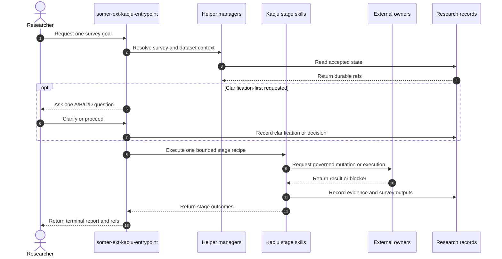

# Isomer Kaoju Skill Family Design Overview

## Proposed Skill Frontmatter

```yaml
---
name: isomer-ext-kaoju-entrypoint
description: Use when a Research Topic needs a bounded literature or codebase survey, curated source intake, related-work expansion, theory comparison, method trial, empirical comparison, dataset registration, or evidence audit.
---
```

## Purpose

`isomer-ext-kaoju-entrypoint` is the user-facing coordinator for the optional Kaoju (考据) research-paradigm extension. It composes focused `isomer-kaoju-*` stage skills to determine what existing literature, code, datasets, models, and first-hand Runs establish, then writes survey artifacts with durable provenance.

The key orchestration rule is: execute one bounded survey procedure, preserve each stage's evidence and blocker semantics, and return one terminal report without starting an autonomous next loop.

Kaoju uses the complex-procedure subcommand flavor. Procedural subcommands represent the survey goals in [UC-01 through UC-09](../../usecases/README.md); helper subcommands group repeated object operations. Generic framing, source checkout, claim tracing, refresh, and resume behavior remains inside stage skills rather than becoming separate procedures or use cases, as required by [ADR 0010](../../adrs/0010-model-survey-intents-not-generic-lifecycle-tasks.md).

Foundational principle: reported, located, inspected, executed, reproduced, and compared evidence are different states. A later or more convenient result never rewrites the meaning of an earlier state.

## Concepts

- **Survey Contract**: The bounded question, source scope, coverage target, evidence depth, resource envelope, outputs, and stopping rule for one procedure.
- **Related-Work Catalog**: The literature-first survey catalog. Papers and technical reports are primary works; repositories, datasets, models, and benchmarks are linked artifacts.
- **Field Summary**: The evidence-linked taxonomy, chronology, themes, agreements, disputes, limitations, gaps, and reading path rendered from the catalog.
- **Source Identity**: A version-addressed identity for a paper, repository, model, dataset, benchmark, or documentation source, separate from a mutable local path.
- **Claim-Evidence Ledger**: The central handoff linking claims to exact source locators, Artifacts, Runs, observed values, verdicts, and provenance.
- **Verification Depth**: One of `reported`, `located`, `inspected`, `executed`, `reproduced`, or `compared`.
- **Evidence Verdict**: One of `supported`, `contradicted`, `partial`, `inconclusive`, `blocked`, or `not-comparable`, recorded separately from depth.
- **Survey Delta**: An audited set of changes from curated-source intake or seed-direction expansion that can be applied to an existing survey.
- **Comparison Intent Document**: The user-reviewable plan required before empirical candidate preparation or Runs.
- **Topic Dataset Manifest**: The topic-local registry of stable dataset ids, metadata, source and managed-link locators, access posture, compatibility information, and provenance.

## Use Case Coverage

| Use Case | User Goal | Public Entry | Primary Outputs |
| --- | --- | --- | --- |
| [UC-01](../../usecases/uc-01-understand-a-field-through-a-related-work-landscape.md) | Understand a field broadly. | `landscape-pass` | Related-Work Catalog, Field Summary, coverage record. |
| [UC-02](../../usecases/uc-02-ingest-curated-references-and-codebases-into-a-survey.md) | Read nominated sources and add useful evidence. | `curated-intake-pass` | Source Digests or blockers, dispositions, Curated Source Intake Delta. |
| [UC-03](../../usecases/uc-03-expand-a-survey-from-interesting-seed-works.md) | Find predecessors, neighbors, and later work around seed works. | `direction-expansion-pass` | Direction contract, discovery routes, Related-Work Catalog Delta. |
| [UC-04](../../usecases/uc-04-compare-named-works-in-theory.md) | Compare named works using source-grounded dimensions. | `theory-comparison-pass` | Dimension set, Theory Comparison Artifact. |
| [UC-05](../../usecases/uc-05-test-a-paper-method-with-real-or-generated-data.md) | Run one paper method on intended or generated data. | `method-trial-pass` | Method Trial Contract, Runs, Result Table, reproduction verdict or capability-probe Finding. |
| [UC-06](../../usecases/uc-06-compare-methods-with-actual-runs.md) | Compare methods through controlled first-hand Runs. | `comparative-pass` | Comparison Intent Document, Comparison Contract, candidate Runs, Comparison Matrix. |
| [UC-07](../../usecases/uc-07-register-local-datasets-for-later-survey-runs.md) | Register and reuse local datasets. | `manage-dataset register` | Dataset Registration, managed link, Topic Dataset Manifest update. |
| [UC-08](../../usecases/uc-08-clarify-a-survey-request-before-execution.md) | Clarify material choices before work starts. | `interaction_mode: clarification-first` on any procedure | Clarification Records and Proceed Decision. |
| [UC-09](../../usecases/uc-09-audit-and-synthesize-survey-evidence.md) | Audit evidence and synthesize defensible conclusions. | `audit-survey-pass` | Audit Report, Claim Status Table, Kaoju Dossier. |

## Core Workflow

When `isomer-ext-kaoju-entrypoint` is invoked, execute these steps in order.

1. **Resolve the survey procedure.** Match the request to one procedural subcommand and load the current survey, dataset, source, evidence, and resource context.
2. **Clarify when requested.** In `clarification-first` mode, inspect available context, ask one material A/B/C/D question at a time, and wait for an explicit Proceed Decision before mutation or research Runs.
3. **Freeze the contract.** Record the procedure-specific scope, outputs, evidence limits, resource envelope, and stopping rule. For `comparative-pass`, present and accept the Comparison Intent Document before preparation.
4. **Execute the stage recipe once.** Invoke the required stage skills in order, reuse valid prior evidence, and route repository, environment, dataset-link, credential, or expensive-compute mutations to their owners.
5. **Audit and synthesize.** Check provenance, coverage, evidence labels, adaptations, failures, and fairness before updating survey outputs.
6. **Return a terminal report.** End `complete`, `paused`, or `blocked` with output refs, resource use, Gates, blockers, and a bounded resume point.

If no procedure fits, build one bounded recipe from the stage skills, state why no public procedure matches, and preserve the same evidence contracts. Do not create a new use case for a generic maintenance operation.

## Subcommands Design

The public surface separates survey procedures from reusable helpers. CRUD-like actions for one object share one manager subcommand rather than becoming separate verbs.

### Helper Subcommands

| Subcommand | Actions | Use For | Load |
| --- | --- | --- | --- |
| `manage-survey` | `list`, `show`, `status`, `export` | Inspect or export existing survey state without creating a new research procedure. | Future `commands/manage-survey.md` |
| `manage-dataset` | `register`, `list`, `show`, `refresh`, `remove` | Maintain the Topic Dataset Manifest and managed links. `register` is the public entry for UC-07; mutating actions route to the Topic Workspace owner. | Future `commands/manage-dataset.md` |

Future CRUD surfaces must follow the same `manage-<object> <action>` shape unless actions have different audiences, Gates, or workflow dependencies.

`manage-survey` excludes evidence-changing create and update actions because survey procedures own those transitions; it groups only inspection and export operations.

### Procedural Subcommands

| Subcommand | Use Case | Stage Recipe | Load |
| --- | --- | --- | --- |
| `landscape-pass` | UC-01 | frame, discover, acquire, examine, audit, synthesize | Future `commands/landscape-pass.md` |
| `curated-intake-pass` | UC-02 | frame, discover identities, acquire, examine, audit, synthesize delta | Future `commands/curated-intake-pass.md` |
| `direction-expansion-pass` | UC-03 | frame, examine seeds, discover, acquire, examine candidates, audit, synthesize delta | Future `commands/direction-expansion-pass.md` |
| `theory-comparison-pass` | UC-04 | frame, discover context as needed, acquire, examine, compare theory, audit, synthesize | Future `commands/theory-comparison-pass.md` |
| `method-trial-pass` | UC-05 | frame, discover, acquire, examine, reproduce or probe, audit, synthesize | Future `commands/method-trial-pass.md` |
| `comparative-pass` | UC-06 | frame, compare intent, acquire, examine, reproduce as needed, compare results, audit, synthesize | Future `commands/comparative-pass.md` |
| `audit-survey-pass` | UC-09 | audit, synthesize | Future `commands/audit-survey-pass.md` |

`clarification-first` is an interaction mode shared by all procedures, not another procedure. Resume is pipeline context containing accepted refs and a starting stage, not a public subcommand.

### Misc Subcommands

| Subcommand | Use For | Load |
| --- | --- | --- |
| `help` | Explain procedures, grouped managers, evidence states, required inputs, and terminal statuses. | This entrypoint |

## Stage Skill Interface

Stage skills remain directly invokable for composition and testing, but their direct invocability does not imply separate user-facing use cases.

| Skill | Owns | Main Outputs |
| --- | --- | --- |
| `isomer-kaoju-shared` | Evidence vocabulary, latest context, lineage, handoff, and interaction rules. | Coordination verdict and semantic refs. |
| `isomer-kaoju-workspace-mgr` | Kaoju bindings, dataset-registry readiness, large-material policy, and worker access posture. | Workspace context, binding registry, access plan, or blocker. |
| `isomer-kaoju-frame` | Procedure-specific scope and stopping rules. | Survey Contract and route. |
| `isomer-kaoju-discover` | Source candidates, citation routes, version families, coverage, and inclusion decisions. | Discovery ledger and acquisition targets. |
| `isomer-kaoju-acquire` | Immutable material identity after registered datasets are considered. | Material Manifest, repository refs, hashes, licenses, access status. |
| `isomer-kaoju-examine` | Exact source and implementation evidence. | Claim-Evidence Ledger updates, Source Digests, paper-code mappings, contradictions. |
| `isomer-kaoju-reproduce` | One intended-data reproduction or generated-data capability probe. | Runs, Result Table, patches, verdict or Finding. |
| `isomer-kaoju-compare` | Theory comparison, empirical intent, and empirical results. | Theory artifact, Comparison Intent Document, or Comparison Matrix. |
| `isomer-kaoju-audit` | Coverage, provenance, evidence-label, adaptation, Run, and fairness checks. | Audit Report, gaps, readiness verdict. |
| `isomer-kaoju-synthesize` | Evidence-backed survey updates and final views. | Survey Delta, Field Summary, Kaoju Dossier, unresolved questions. |

## Semantic Evidence Contract

| Dimension | Contract |
| --- | --- |
| Verification depth | Record only the deepest operation actually performed: `reported`, `located`, `inspected`, `executed`, `reproduced`, or `compared`. |
| Evidence verdict | Record support separately as `supported`, `contradicted`, `partial`, `inconclusive`, `blocked`, or `not-comparable`. |
| Run purpose | Distinguish `reproduction` from `capability-probe`; generated data cannot support a paper benchmark verdict. |
| Execution fidelity | Preserve `upstream-faithful`, `adapted`, and `repaired` Runs separately. |
| Comparison mode | Source-grounded theory cells retain source depth; empirical `compared` depth requires controlled first-hand Runs. |
| Traceability | Every material claim or number cites an exact source locator or Run plus Artifact, Evidence Item, and Provenance refs as applicable. |

## Core Workflow Diagram



## Calls To External Skills

| Route | External Owner | Calling Condition |
| --- | --- | --- |
| Topic creation or topology | `isomer-op-topic-creator`, `isomer-op-topic-mgr` | Topic readiness, repository registration, managed dataset links, or other Topic Workspace mutation is required. |
| Environment preparation | `isomer-srv-topic-env-setup`, optionally `isomer-srv-agent-env-setup` | A method or comparison needs reproducible packages, tools, or worker access. |
| Resource-heavy work | `isomer-misc-bounded-run-tips` | Downloads, builds, memory use, or accelerator Runs need explicit bounds. |
| Downstream research | Relevant `isomer-deepsci-*` skill | The user requests hypothesis, experiment, optimization, or writing work after Kaoju closes. |

Literature search, repository inspection, command execution, package management, credentials, cost or privacy Gates, and data export use canonical provider bindings and Research Operation Extension Points. The generic design does not hardcode providers or credentials.

## Discipline Rules

| Rationalization | Required Response |
| --- | --- |
| "The search result says it, so it is evidence." | Capture and examine the source; provider output remains orientation material. |
| "The official repository must match the paper." | Resolve a paper-code relationship at an immutable revision. |
| "The tests passed, so the paper result reproduced." | Record test execution and require the claim-bearing procedure for reproduction. |
| "Generated data produced a good score." | Label a capability probe and prohibit paper-benchmark interpretation. |
| "These works are in a matrix, so they were compared." | Preserve source depth until controlled comparative Runs exist. |
| "Use the standard benchmark and start running." | Present the Comparison Intent Document and wait for a Proceed Decision. |
| "The user says these sources are important." | Prioritize them, but still resolve identity, inspect evidence, and record a disposition. |
| "The symlink exists, so the dataset is suitable." | Validate the manifest entry, source, fingerprint, access, schema, split, evaluator, and license. |
| "This repository needs a pull, so add a Kaoju procedure." | Use the generic repository owner and rerun affected stages only when a survey goal requires it. |

Red flags requiring correction, pause, or a blocker include:

- A claim or number without an exact source or Run ref.
- A source identified only by a mutable path, branch, or search result.
- A repaired Run replacing the faithful attempt.
- A generated-data value presented as reproduction or benchmark evidence.
- A comparison that hides adaptations, quality constraints, or `not-comparable` results.
- Acquisition or Runs started before a requested clarification or empirical intent checkpoint completes.
- A user-nominated source omitted without a disposition and either a Source Digest or access blocker.
- A standalone procedure created for CRUD, repository refresh, environment repair, or generic resume work.

## Example Prompt And Expected AI Response

> **Warning:** The user/AI chat content below is for example purposes only. Implementations should learn its style, intent, and semantics rather than hardcoding the example content.

### Event 001: Survey a Field

User Prompt:

> Use `$isomer-ext-kaoju-entrypoint use landscape-pass to survey speculative decoding`. Give me the related works, main directions, code and model links, disputes, and open gaps.

AI:

> The agent returns the survey boundary, coverage status, literature-first Related-Work Catalog, linked repositories, datasets and models, Field Summary, evidence limitations, and terminal refs. It does not imply reproduction when the procedure only inspected sources.

### Event 002: Compare Methods with Actual Runs

User Prompt:

> Use `$isomer-ext-kaoju-entrypoint use comparative-pass to compare methods A, B, and C`. Ask me before you start expensive work.

AI:

> The agent first presents the Comparison Intent Document with candidate readiness, required materials and environments, prior-evidence reuse, metrics, fairness rules, resources, and blockers. It waits for clarification or a Proceed Decision, then returns controlled candidate Runs, an evidence-linked Comparison Matrix, variability, adaptations, `not-comparable` results, and a terminal report.

## Open Questions

- Whether direct exploratory synthesis may use an explicit audit waiver, and which readiness claims that waiver must prohibit.
- Which provider-neutral cache and locator policy should govern large checkpoints and datasets that cannot live in Topic Workspace records.
- Whether Kaoju record-format profiles should use a family-specific provider or a family-neutral research-record provider.
