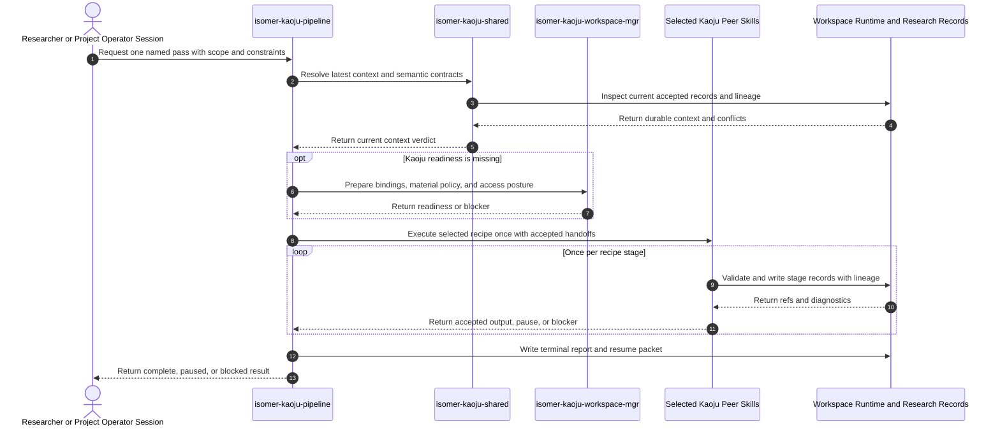
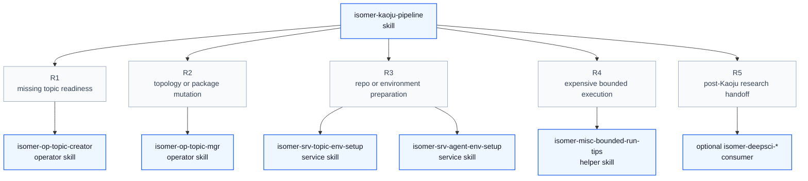

# Isomer Kaoju Pipeline and Skill Family Design Overview

## Proposed Skill Frontmatter

```yaml
---
name: isomer-kaoju-pipeline
description: Use when a Research Topic or Research Inquiry needs a bounded literature, repository, model, dataset, reproduction, or comparative survey with versioned sources and first-hand evidence.
---
```

## Purpose

This note describes the proposed public coordinator skill, `isomer-kaoju-pipeline`, and the peer `isomer-kaoju-*` interfaces it composes before any production skill files are created. Kaoju is an optional built-in research-paradigm extension for determining what existing sources and implementations establish through versioned source study, code and artifact examination, first-hand reproduction, and controlled comparison.

The key orchestration rule is: the pipeline executes exactly one named bounded pass, preserves every peer skill's evidence and blocker contract, and returns a terminal report without choosing an autonomous next loop.

The proposed skill is primarily a discipline-enforcing procedural skill. Its subcommand structure uses the Imsight complex-procedure flavor because later stages consume durable outputs from earlier stages.

Foundational principle: a reported source claim, located passage, inspected implementation, executed Run, reproduced claim, and comparable result are different evidence states; collapsing them violates both the letter and purpose of Kaoju.

## Concepts

- **Kaoju Inquiry Contract**: The Artifact that fixes the Research Inquiry question, source boundary, inclusion rules, coverage target, evidence depth, comparison dimensions, resource envelope, and stopping criteria.
- **Source Identity**: The immutable or version-addressed identity of a paper, repository, model, dataset, benchmark specification, release, issue, or documentation source, separate from its mutable local path.
- **Material Manifest**: The durable acquisition inventory containing source identities, locators, revisions, hashes, licenses, sizes, access status, and Canonical External Repository refs.
- **Claim-Evidence Ledger**: The appendable central handoff that links stable Research Claims to exact source locators, Evidence Items, Runs, observed values, patches, comparison cells, verdicts, and provenance.
- **Verification Depth**: One of `reported`, `located`, `inspected`, `executed`, `reproduced`, or `compared`, recording which evidence-producing operation has actually occurred.
- **Evidence Verdict**: One of `supported`, `contradicted`, `partial`, `inconclusive`, `blocked`, or `not-comparable`, recorded separately from verification depth.
- **Execution Fidelity**: One of `upstream-faithful`, `adapted`, or `repaired`, preventing modified Runs from overwriting the meaning of faithful attempts.
- **Kaoju Dossier**: A human-readable synthesis rendered from accepted source, claim, evidence, Run, comparison, audit, and provenance records.

## Public Skill Family Interface

Every stage skill is directly invokable and owns one primary procedure. `isomer-kaoju-shared` is an internal coordination contract rather than a research stage. `isomer-kaoju-pipeline` composes peer skills but does not absorb their ownership.

| Skill | Invoke When | Consumes | Produces | Stop or Route Rule |
| --- | --- | --- | --- | --- |
| `isomer-kaoju-shared` | A Kaoju skill needs current context, evidence vocabulary, source identity, lineage, handoff, or worker-output rules. | Coordination question and relevant durable refs. | Coordination result and selected semantic object. | Return work to the owning stage; shared produces no research conclusion. |
| `isomer-kaoju-workspace-mgr` | Topic setup exists but Kaoju record bindings, external repository posture, large-material policy, or worker access is not ready. | Topic readiness evidence, selected actor or agent, selected Kaoju skills, storage capabilities. | Workspace context, binding registry, material policy, access plan, validation or blocker. | Hand off only when durable targets and access posture are explicit. |
| `isomer-kaoju-frame` | The Research Inquiry lacks a bounded source, coverage, evidence, comparison, or resource protocol. | User question, current records, source seeds, constraints. | Kaoju Inquiry Contract, seed claims, coverage target, resource envelope, route or blocker. | Stop before substantive search or execution once a pass can be selected. |
| `isomer-kaoju-discover` | The eligible paper, code, model, dataset, benchmark, release, or issue neighborhood is incomplete. | Inquiry contract, source seeds, prior query log and source catalog. | Discovery ledger, source catalog, inclusion decisions, coverage status, acquisition handoff. | Stop at the declared coverage criterion or a recorded discovery blocker. |
| `isomer-kaoju-acquire` | Included materials must become versioned, inspectable, or executable. | Included source catalog and acquisition targets. | Material Manifest, repository refs, locators, hashes, licenses, access status, provenance or blocker. | Stop before interpretation or execution when material identity is durable. |
| `isomer-kaoju-examine` | Claims must be traced into exact source passages, code, configs, checkpoints, tests, evaluators, or benchmark paths. | Inquiry contract, Material Manifest, selected claims and prior evidence. | Updated Claim-Evidence Ledger, source examination records, Paper-Code Mapping, drift and contradiction register. | Route gaps to discover or acquire; route execution needs to reproduce or compare. |
| `isomer-kaoju-reproduce` | One existing implementation or reported claim needs a bounded first-hand attempt. | Selected claim, source identities, mapped execution path, reproduction constraints. | Reproduction Contract, Run refs, Evidence Items, patch Artifact refs, faithful and repaired verdicts. | Stop after one claim-bearing procedure is recorded and routed. |
| `isomer-kaoju-compare` | Two or more existing systems need controlled comparison under a shared protocol. | Named candidates, mappings, reproduction evidence, comparison dimensions and resources. | Comparison Contract, candidate Run set, Comparison Matrix, fairness findings and verdicts. | Return `not-comparable` rather than weaken task semantics or hide adaptation. |
| `isomer-kaoju-audit` | An evidence package needs independent checks for coverage, provenance, drift, hidden patches, Run completeness, or fairness. | Inquiry contract and the complete candidate evidence package. | Audit Report, gap register, readiness verdict and bounded repair routes. | Diagnose and route defects without silently repairing evidence. |
| `isomer-kaoju-synthesize` | Accepted evidence is ready to answer the inquiry or state its limits. | Audited evidence package or explicit audit waiver, final ledger, contradictions and limitations. | Kaoju Dossier, final claim statuses, Findings, appendices, unresolved questions and optional downstream handoff. | Generate no missing search or Run evidence; route gaps back to their owning stage. |
| `isomer-kaoju-pipeline` | A user wants one named multi-stage Kaoju procedure with automatic durable handoffs. | Pipeline context, accepted input refs, selected pass, optional starting stage and resource or Gate preferences. | Pipeline Run Record, stage handoffs, terminal report and resume packet. | End `complete`, `paused`, or `blocked`; macro continuation belongs to the caller. |

## Core Workflow

When `isomer-kaoju-pipeline` is invoked, execute the following steps in order.

1. **Resolve the pass.** Select one named pass from the user request and build a `kaoju-pipeline-context` with Topic and Inquiry refs, source or claim selection, accepted input refs, cutoff, coverage target, resource envelope, Gate preferences, and optional starting stage.
2. **Run context and readiness checks.** Apply `isomer-kaoju-shared` latest-context rules and route missing Kaoju binding, repository, material, actor, agent, or environment readiness to `isomer-kaoju-workspace-mgr` and the owning external setup skill.
3. **Execute the recipe once.** Invoke each peer skill in the selected recipe, hand durable outputs forward automatically, and preserve each skill's callbacks, quality gates, lineage, evidence states, worker-output policy, and blocker semantics.
4. **Apply transitions honestly.** Continue only when the current stage's accepted outputs satisfy the next stage; otherwise pause or block with a resume point and exact record refs.
5. **Return the terminal report.** Report `complete`, `paused`, or `blocked`, stage outcomes, accepted outputs, resource use, Gates, blockers, and resume context without choosing another macro pass.

If the user's task does not map cleanly to these steps, build one bounded plan from the closest Kaoju peer skills, preserve the same semantic contracts, and state why no named pass fits.

## Subcommands Design

The pipeline uses the complex-procedure flavor. Individual stage skills remain single-procedure skills without public subcommands.

### Helper Subcommands

No helper subcommands are currently exposed. Context preflight, transition evaluation, durable handoff, and terminal-report construction remain shared internal contracts rather than user-facing commands.

### Procedural Subcommands

| Subcommand | Use For | Stage Recipe | Load |
| --- | --- | --- | --- |
| `landscape-pass` | Discover and inspect a source neighborhood without first-hand execution. | frame, discover, acquire, examine, audit, synthesize | Future `commands/landscape-pass.md` |
| `source-audit-pass` | Inspect named papers, repositories, models, datasets, or benchmark materials without broad discovery. | frame, acquire, examine, audit, synthesize | Future `commands/source-audit-pass.md` |
| `reproduction-pass` | Trace and reproduce one named existing claim or implementation. | frame, acquire, examine, reproduce, audit, synthesize | Future `commands/reproduction-pass.md` |
| `comparative-pass` | Compare an already named candidate set under one controlled protocol. | frame, acquire, examine, reproduce, compare, audit, synthesize | Future `commands/comparative-pass.md` |
| `full-kaoju-pass` | Discover the candidate set and conduct the complete bounded comparative investigation. | frame, discover, acquire, examine, reproduce, compare, audit, synthesize | Future `commands/full-kaoju-pass.md` |

The `comparative-pass` assumes named candidates; `full-kaoju-pass` discovers the candidate set. This keeps the recipes semantically distinct. Resume is a pipeline-context posture with a prior resume packet and optional starting stage, not an autonomous loop or separate pass.

### Misc Subcommands

| Subcommand | Use For | Load |
| --- | --- | --- |
| `list-passes` | List available passes, required starting inputs, expected evidence depth, and stage recipes. | Future `commands/list-passes.md` |
| `help` | Explain the pipeline, peer skill boundaries, named passes, verification states, and terminal statuses. | This entrypoint |

## Semantic Evidence Contract

The Claim-Evidence Ledger is the family-wide central handoff. Each claim row has a stable `claim_id` and keeps these dimensions separate:

| Dimension | Required Values or Content |
| --- | --- |
| Verification depth | `reported`, `located`, `inspected`, `executed`, `reproduced`, or `compared`. |
| Evidence verdict | `supported`, `contradicted`, `partial`, `inconclusive`, `blocked`, or `not-comparable`. |
| Execution fidelity | `upstream-faithful`, `adapted`, or `repaired` when a Run exists. |
| Source locator | Page, section, table, equation, stable URL, repository revision, file and symbol, config, checkpoint, test, dataset split, benchmark task, or equivalent exact locator. |
| Values | Reported result and first-hand observed result in separate fields with metric definition, units, and conditions. |
| Durable refs | Evidence Item, Artifact, Run, patch, environment, comparison, decision, and Provenance Record refs as applicable. |

A passing upstream test proves execution of that test, not reproduction of a paper claim. A repaired Run does not overwrite the faithful verdict. A metric name shared by two systems does not establish comparability.

Source identity must not be a mutable local path alone:

- A paper identity includes DOI or canonical URL, version, access time, and content hash when captured.
- A code identity includes canonical remote, commit, tag when relevant, submodule state, dirty state, and patch Artifact refs.
- A model identity includes provider-neutral locator, immutable revision, file hashes, license, and access status.
- A dataset or benchmark identity includes source, version, split, hashes when available, license, and governing specification.

The family uses canonical Isomer records instead of inventing a Kaoju database model: source material and dossiers are Artifacts with Provenance Records; claims link to Evidence Items; execution attempts are Runs; evidence-grounded interpretations are Findings; route choices and blockers are Decision Records; governed actions use Gates; continuity and cursors use control Artifacts or View Manifests when appropriate.

Structured profile refs should use a Kaoju family namespace such as `isomer:kaoju/record-format/profile/.../v1`. Kaoju begins at its own profile version rather than inheriting DeepSci's migration-driven `v2`, while retaining the common non-empty top-level `title` and `summary` display contract.

## Core Workflow Diagram



## Calls To External Skills

Kaoju uses existing owner skills for topology and environment mutation. Peer `isomer-kaoju-*` skills are internal family interfaces and therefore do not appear in this external-dependency table.



| ID | Caller | Route | Callee | Calling Condition |
| --- | --- | --- | --- | --- |
| R1 | Pipeline or workspace manager | Missing Research Topic or base Topic Workspace readiness | `isomer-op-topic-creator` | The inquiry cannot bind durable records to an initialized topic. |
| R2 | Workspace manager, acquire, reproduce, or compare | Topic topology, canonical repository registration, package install, update, removal, or verification | `isomer-op-topic-mgr` | Kaoju needs owner-controlled workspace or environment mutation. |
| R3 | Workspace manager or acquire | Canonical external repository, Topic Workspace environment, projection, or bounded setup support | `isomer-srv-topic-env-setup` and, for formal agent readiness, `isomer-srv-agent-env-setup` | The owning operator workflow delegates a bounded setup request. |
| R4 | Acquire, reproduce, or compare | Resource-heavy build, download, GPU execution, or comparison planning | `isomer-misc-bounded-run-tips` | Work could exhaust host memory, disk, build concurrency, GPU time, or scheduler capacity. |
| R5 | Synthesize | Optional comparator, hypothesis, or writing handoff after Kaoju closes | Relevant `isomer-deepsci-*` skill when installed | The user requests downstream research and the dossier contains accepted evidence refs. DeepSci is never a Kaoju prerequisite. |

Provider-backed calls use canonical Literature Provider Bindings, Execution Adapter Command Requests, and Research Operation Extension Points such as `literature_search`, `repository_inspection`, `command_execution`, `package_management`, `credential_use`, `cost_privacy_gate`, and `data_export`. Generic skill text must not hardcode Tavily, GitHub, Hugging Face, a shell wrapper, provider credentials, or scheduler payloads.

## Discipline Rules and Rationalizations

| Rationalization | Required Kaoju Response |
| --- | --- |
| "The official repository must be the paper implementation." | Record the repository identity as a candidate and require paper-to-code mapping evidence. |
| "The upstream tests passed, so the published benchmark reproduced." | Mark the test as executed and require the claim-bearing Run before assigning reproduced depth. |
| "Both systems report latency, so they are comparable." | Check task, input, evaluator, quality, hardware, precision, warmup, and measurement definitions before comparison. |
| "The patched version works, so the upstream claim is supported." | Preserve the faithful failure and record the repaired Run and patch separately. |
| "The final report cites sources, so a durable ledger is unnecessary." | Treat the report as a view and retain claim, evidence, Run, source, and provenance records as authority. |
| "A failed Run adds no value." | Preserve failure status, logs, environment, last-known-good state, and claim impact as evidence. |

Red flags that require correction, pause, or a blocker include:

- A numeric result without a source or Run ref.
- A repository, model, or dataset identified only by a mutable path or branch name.
- One field that mixes verification depth, evidence verdict, and execution fidelity.
- A repaired Run replacing an upstream-faithful attempt.
- A comparison matrix that hides candidate-specific adaptations or missing quality checks.
- Synthesis that creates new source or execution evidence instead of routing to the owning stage.
- A pipeline that silently loops, retries, weakens a Gate, or chooses another macro pass.

## Example Prompt And Expected AI Response

> **Warning:** The user/AI chat content below is for example purposes only. Implementations should learn its style, intent, and semantics rather than hardcoding the example content.

These examples show only visible response contracts. They do not prescribe provider selection, hidden reasoning, or exact prose.

### Event 001: Run a Named Comparative Pass

> Time: `2026-07-10T16:00:00Z` · Session: `Prepared Topic Workspace with named candidates`

User Prompt:

> Use `$isomer-kaoju-pipeline comparative-pass` for repositories A, B, and C. Limit downloads to 50 GB and GPU execution to eight hours. Pause on every Gate and report not-comparable results honestly.

AI:

> The agent returns the resolved pipeline context, candidate and source requirements, resource envelope, stage recipe, and any preflight blocker before mutation. It executes the pass once, preserving stage records and Gates, then returns a terminal report with status, stage outcomes, accepted record refs, resource use, not-comparable evidence verdicts, blockers, and resume point.

### Event 002: Inspect Sources Without Running Code

> Time: `2026-07-10T16:30:00Z` · Session: `Source-audit inquiry`

User Prompt:

> Use `$isomer-kaoju-pipeline source-audit-pass` on this paper and repository. Trace the FP8 support claims into code and tests, but do not build or run anything.

AI:

> The agent selects a source-audit recipe, records the no-execution constraint, acquires or identifies only required inspectable material, returns exact claim and code locators, drift and contradiction findings, verification depth no stronger than inspected, an audit result, and a source-backed dossier. It lists optional reproduction needs without executing them.

### Event 003: Resume from Durable Evidence

> Time: `2026-10-01T09:00:00Z` · Session: `Returning Project Operator Session`

User Prompt:

> Resume the prior full Kaoju pass from its terminal report. Reuse unchanged literature evidence, check new repository releases, and rerun only stale claims.

AI:

> The agent performs latest-context and drift checks, returns the still-valid evidence set, affected claims, selected starting stage, resource changes, and resume packet, then waits for required Gates. The bounded resumed pass creates lineage-linked descendants and a new terminal report without overwriting the prior dossier.

## Open Questions

- Should direct exploratory use of `isomer-kaoju-synthesize` allow an explicit audit waiver, and which readiness claims must that waiver prohibit?
- Should Kaoju profiles be registered by `isomer:kaoju/record-format/.../v1` through a family provider or through a new family-neutral research-record provider that preserves existing DeepSci refs?
- Which provider-neutral durable locator and cache policy is sufficient for large checkpoints and datasets that cannot be copied into Topic Workspace records?
- Which coverage-mode defaults should ship for `rapid`, `standard`, and `systematic` investigations without pretending one numeric saturation threshold fits every field?
- A Kaoju-specific Domain Agent Team Template is intentionally deferred until real usage shows that fixed surveyor, reproducer, comparer, and auditor roles improve the workflow.
