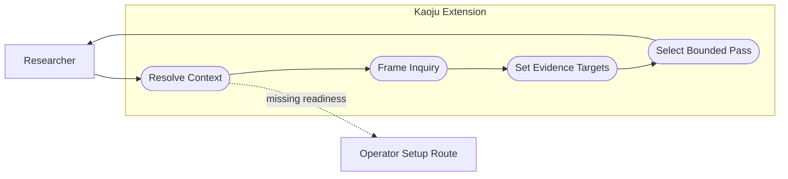
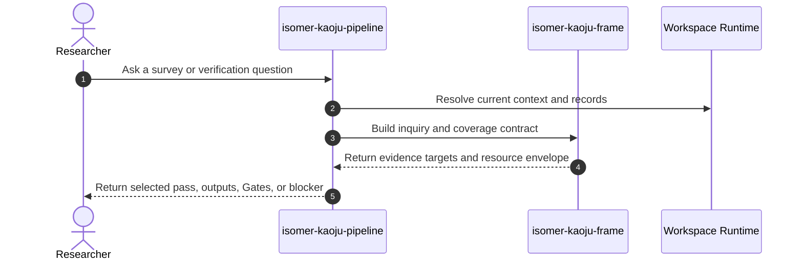

# Use Case 01: Frame an Evidence-Led Kaoju Inquiry

## Actor Goal

As a researcher working through a Project Operator Session, I want to turn a broad survey question into a bounded Kaoju inquiry, so that discovery, acquisition, inspection, execution, and comparison have explicit evidence and stopping rules.

## Use Case

The researcher asks a question such as "What do current open-source FlashAttention implementations actually support on Blackwell GPUs, and which published performance claims reproduce?" The Kaoju extension resolves current Research Topic context, distinguishes claim verification from new-method research, records source and time boundaries, declares required verification states, selects a resource envelope, and chooses the lightest named Kaoju pass that can answer the inquiry responsibly.

## Supported Actions

### Define the Inquiry and Coverage Contract

The researcher converts an open-ended topic into a reviewable evidence protocol.

- context
  - Actor **has** a Research Topic, question, comparison need, disputed claim, or source neighborhood that needs investigation.
  - System **has** Effective Topic Context, existing durable research records when present, and the Kaoju evidence vocabulary.
- intent
  - Actor **wants** explicit scope, inclusion and exclusion rules, source types, cutoff time, verification targets, and a stopping rule.
  - Actor **wonders** "What evidence would let us answer this without turning the survey into endless search?"
- action
  - Actor then **asks** the system to frame the question as a Kaoju inquiry.
- result
  - Actor **gets** a Kaoju Inquiry Contract, seed Research Claims, coverage protocol, known unknowns, resource envelope, and blockers that require setup or a Gate.

### Select a Bounded Kaoju Pass

The researcher chooses a procedure according to the expected evidence depth.

- context
  - Actor **has** an inquiry contract and may state whether first-hand runs or cross-system comparison are required.
  - System **has** named landscape, source-audit, reproduction, comparative, and full passes plus lineage-preserving resume context.
- intent
  - Actor **wants** the smallest procedure that can satisfy the evidence target.
  - Actor **wonders** "Do I need a literature map, a code audit, one reproduction, or a full comparative study?"
- action
  - Actor then **asks** the system to select or validate a named pass.
- result
  - Actor **gets** one selected pass, its stage sequence, expected durable outputs, required capabilities, estimated resource class, and explicit pause or blocker conditions.

## Main Flow

1. The researcher invokes `isomer-kaoju-pipeline` with a question, source seed, file, Research Topic, or explicit pass.
2. The pipeline resolves the current Research Topic, Topic Workspace, Topic Actor or Agent context, relevant durable records, and extension readiness.
3. `isomer-kaoju-frame` separates existing-claim investigation from hypothesis generation and states the inquiry question in claim-addressable form.
4. The skill records source categories, date cutoff, inclusion and exclusion rules, search coverage target, evidence targets, comparison dimensions, and allowed deviations.
5. The skill classifies the requested evidence depth as reported, located, inspected, executed, reproduced, or compared, without treating these states as interchangeable.
6. The skill records compute, network, storage, credential, license, and time constraints in a resource envelope.
7. The pipeline selects the lightest pass that can meet the contract and reports required Gates or setup routes before mutation.
8. The researcher receives the inquiry contract and selected pass, or a blocker that names the missing context or authority.

## Alternative And Exception Flows

- If no initialized Research Topic or Topic Workspace exists, the extension routes setup to `isomer-op-topic-creator` or `isomer-op-topic-mgr` and does not fabricate workspace readiness.
- If the request is to invent or optimize a new method rather than investigate existing claims, the extension recommends a DeepSci route and records why Kaoju is not the owner.
- If the researcher explicitly wants a source-only landscape, the contract excludes downloads, environment mutation, and first-hand Runs.
- If the requested scope exceeds the available resource envelope, the skill narrows the source set or evidence target, opens a policy-controlled Gate when appropriate, or records a blocker.
- If durable context conflicts with the prompt, the skill reports the conflict and asks for a route decision rather than silently overwriting accepted records.

## Mermaid Flow Diagram

## Mermaid Sequence Diagram

## Durable Outputs

- Kaoju Inquiry Contract Artifact linked to the Research Inquiry.
- Seed Research Claims and known-unknown inventory.
- Coverage protocol with cutoff, source classes, inclusion and exclusion rules, and stopping criteria.
- Evidence-target and comparison-dimension contract.
- Resource envelope and capability requirements.
- Selected-pass Decision Record or framing blocker.

## Example Prompt And Expected AI Response

### Event 001: Select a Comparative Investigation

> Time: `2026-07-10T10:00:00Z` · Session: `Project Operator Session in a prepared Topic Workspace`

User Prompt:

> Use `$isomer-kaoju-pipeline comparative-pass` to determine which open-source implementations of method X genuinely support model Y and compare their published throughput claims on our available GPU.

AI:

> The agent returns a concise inquiry contract naming the candidate claim classes, source cutoff, inclusion rules, required repository and model identities, first-hand evidence target, comparison dimensions, resource constraints, selected comparative pass, expected records, and any setup or Gate required before acquisition or execution. It does not report a comparison before Runs exist.

## Assumptions And Open Questions

- The first release may support three declared coverage modes, `rapid`, `standard`, and `systematic`, while leaving their numeric saturation thresholds configurable in the inquiry contract.
- A selected pass is one bounded execution procedure. Repeated search or execution requires an explicit resume, follow-up Research Task, or external controller decision.
