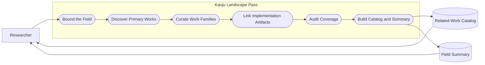
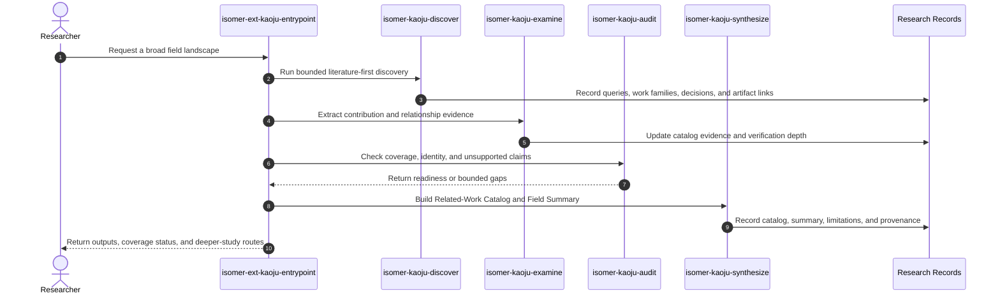

# Use Case 01: Understand a Field Through a Related-Work Landscape

## Actor Goal

As a researcher entering or revisiting a field, I want Kaoju to produce a curated list of related works and a broad summary, so that I can understand the field's main directions, chronology, implementations, agreements, disputes, and open gaps without first designing a reproduction study.

## Use Case

The researcher supplies a field, subfield, problem, technique, or representative seed work and asks for a broad orientation. Kaoju runs a bounded `landscape-pass` from survey framing through source discovery, material acquisition, examination, audit, and synthesis. It curates relevant papers and technical reports as the primary related works, links repositories, models, datasets, and benchmarks as implementation or evidence artifacts, and produces a Field Summary grounded in versioned materials and declared coverage limits.

## Supported Actions

### Request a Broad Field Landscape

The researcher describes the field and the breadth, time range, or themes that matter.

- context
  - Actor **has** a field, problem, method family, representative work, or short description of what they want to understand.
  - System **has** the Kaoju framing, discovery, source-identity, coverage, and synthesis contracts plus a Literature Provider Binding.
- intent
  - Actor **wants** a broad but bounded understanding of the field rather than an unstructured search-result dump.
  - Actor **wonders** "What are the main lines of work in this field, how did they develop, and which works should I read first?"
- action
  - Actor then **asks** the system to run a related-work landscape for the field.
- result
  - Actor **gets** a Kaoju Inquiry Contract that states the field boundary, date cutoff, coverage mode, inclusion rules, requested themes, and the expected Related-Work Catalog and Field Summary.

### Inspect the Related-Work Catalog

The researcher uses the curated catalog to navigate primary works and their practical artifacts.

- context
  - Actor **has** an accepted landscape scope and source-discovery results.
  - System **has** deduplicated paper and technical-report identities, version-family links, inclusion decisions, and linked implementation artifacts.
- intent
  - Actor **wants** a reviewable list of relevant works with enough structure to compare their focus and follow their code or evaluation assets.
  - Actor **wonders** "Which works address the same problem, what does each contribute, and where are their official implementations, models, datasets, or benchmarks?"
- action
  - Actor then **asks** the system to present or export the Related-Work Catalog.
- result
  - Actor **gets** primary entries for papers and technical reports with source identity, contribution, method, evaluation, relevance, and links to versioned repositories, models, datasets, and benchmark specifications when available.

### Read the Field Summary

The researcher asks Kaoju to synthesize the field from the curated and coverage-audited source set.

- context
  - Actor **has** a Related-Work Catalog, Search Query Log, inclusion decisions, coverage status, and linked artifact evidence.
  - System **has** synthesis rules that distinguish reported, located, inspected, executed, reproduced, and compared evidence.
- intent
  - Actor **wants** an accessible account of the field's taxonomy, chronology, recurring methods, evidence patterns, consensus, disputes, and research gaps.
  - Actor **wonders** "What is the field's current shape, where do the approaches differ, and which conclusions are well supported?"
- action
  - Actor then **asks** the system to synthesize the Field Summary.
- result
  - Actor **gets** a summary whose statements link to catalog entries and evidence, state coverage and source limitations, and avoid implying first-hand reproduction when the landscape used only reported or inspected evidence.

## Main Flow

1. The researcher invokes `isomer-ext-kaoju-entrypoint landscape-pass` with a field description, optional seed works, time range, themes, and desired coverage mode.
2. `isomer-kaoju-frame` turns the request into a Kaoju Inquiry Contract with field boundaries, primary source classes, date cutoff, inclusion and exclusion rules, coverage criterion, and output contract.
3. `isomer-kaoju-discover` searches the five required source classes: papers, technical reports, source code repositories, datasets, and models. It follows useful citation and version links, records each provider, query, filter, time, candidate result, inclusion or exclusion rationale, and per-class coverage, and curates candidate papers and technical reports as the primary works.
4. The skill deduplicates preprints, proceedings versions, journal versions, supplements, technical-report revisions, forks, mirrors, releases, and derived implementations into work or artifact families while preserving exact source identities and relationship evidence.
5. The skill records papers and technical reports as the primary Related-Work Catalog entries and links repositories, models, datasets, and benchmark specifications as implementation or evidence artifacts.
6. `isomer-kaoju-acquire` queries the Topic Dataset Manifest and captures only the materials needed for reliable metadata, summaries, and artifact links. Required repositories become registered Canonical External Repositories pinned to immutable revisions and treated as read-only evidence by default; other materials retain immutable locators, hashes when available, licenses, sizes, access status, acquisition time, and Provenance Records without requiring large executable downloads.
7. `isomer-kaoju-examine` extracts each work's problem, contribution, method, evaluation basis, limitations, relationship to other works, and relevant artifact correspondence at no stronger than the achieved verification depth.
8. `isomer-kaoju-audit` checks search coverage, inclusion consistency, source identities, version families, unsupported summary claims, and missing provenance.
9. `isomer-kaoju-synthesize` produces the Related-Work Catalog and Field Summary, including taxonomy, chronology, major themes, agreements, disputes, evidence limitations, open gaps, and a suggested reading path. When the survey includes a requested theory comparison, it also links the resulting Theory Comparison Artifact without promoting its source evidence to empirical comparison.
10. The pipeline returns a terminal report with the output refs, coverage status, unresolved source gaps, and optional routes for deeper source audit, reproduction, or comparison.

## Alternative And Exception Flows

- If the requested field is too broad for one bounded pass, Kaoju proposes explicit subfields or time slices and records the selected boundary before discovery.
- If the user requests only a rapid orientation, Kaoju may stop with lower coverage and lighter inspection but must label the Field Summary accordingly.
- If a repository, model, dataset, or benchmark has no reliable link to a primary work, it remains an unlinked candidate artifact rather than becoming a peer related work.
- If one of the five required source classes yields no eligible or accessible result, Kaoju records the empty class and search evidence instead of omitting it from the coverage report.
- If a work has several publication versions, the catalog presents one work family with version-specific identities and explains which version informed the summary.
- If coverage is incomplete because of provider, language, access, or date limitations, the summary states those limits and does not claim exhaustiveness.
- If a required repository already exists, Kaoju inspects its remote, revision, dirty state, submodules, and license rather than treating its mutable path as source identity or cloning it again.
- If a model or dataset is too large, restricted, credentialed, or license-incompatible, Kaoju records its immutable identity and access blocker. A policy-approved cache or staging path does not become its semantic identity.
- If a material acquisition requires substantial cost, credentials, storage, or compute, Kaoju records the requirement and waits at the governing Gate; denied material remains visible in the coverage record.
- If the researcher later wants to verify performance or implementation claims, the landscape outputs become inputs to a separate source-audit, reproduction, comparative, or full Kaoju pass.
- If the researcher names works for a source-grounded comparison, the landscape may route them to `theory-comparison-pass` and include the returned Theory Comparison Artifact among the survey outputs.
- If the researcher marks catalog works as an interesting direction, the landscape may route them to `direction-expansion-pass` and merge the audited Related-Work Catalog Delta into the survey.
- If the researcher supplies a curated list of important references or codebases, the landscape may route them to `curated-intake-pass` and merge the audited Curated Source Intake Delta without treating the list as proof of broad coverage.

## Mermaid Flow Diagram

## Mermaid Sequence Diagram

## Durable Outputs

- Kaoju Inquiry Contract for the field landscape.
- Search Query Log, inclusion and exclusion decisions, and Coverage Status Record.
- Per-class search coverage for papers, technical reports, source code repositories, datasets, and models.
- Literature-first Related-Work Catalog with stable work-family and source identities.
- Links from primary works to versioned repositories, models, datasets, and benchmark specifications.
- Material Manifest with Canonical External Repository refs, immutable revisions or locators, hashes when available, licenses, sizes, access status, Gate decisions, and acquisition provenance for materials used by the survey.
- Field Summary covering taxonomy, chronology, major themes, agreements, disputes, evidence limitations, open gaps, and suggested reading path.
- Optional Theory Comparison Artifacts for named work sets, with domain-derived dimensions and evidence-linked cells.
- Optional Related-Work Catalog Deltas from seed-directed expansion, with discovery routes, importance rationales, and explicit post-seed search bounds.
- Optional Curated Source Intake Deltas with one Source Digest or Source Access Blocker plus a terminal disposition per user-supplied item.
- Audit Report, source-gap register, Provenance Records, and pipeline terminal report.

## Example Prompt And Expected AI Response

### Event 001: Understand a Field Broadly

> Time: `2026-07-10T17:00:00Z` · Session: `Kaoju landscape pass`

User Prompt:

> Use `$isomer-ext-kaoju-entrypoint use landscape-pass to help me understand speculative decoding broadly`. Produce a list of related works and a summary of the main approach families, how the field developed, important disagreements, and open gaps. Link official repositories, models, datasets, and benchmarks where relevant, but do not run reproduction experiments.

AI:

> The agent returns the field boundary and coverage contract, then produces a literature-first Related-Work Catalog and evidence-linked Field Summary. Papers and technical reports are the primary works; repositories, models, datasets, and benchmarks appear as linked artifacts. The response states search coverage and limitations, distinguishes reported from inspected evidence, and offers optional routes for deeper source audit or reproduction without executing them.

## Assumptions And Open Questions

- The Related-Work Catalog is literature-first by accepted ADR 0001; linked artifacts do not become peer primary works.
- A landscape pass may inspect lightweight source material but does not require first-hand Runs. Any execution evidence comes from a separately requested pass.
