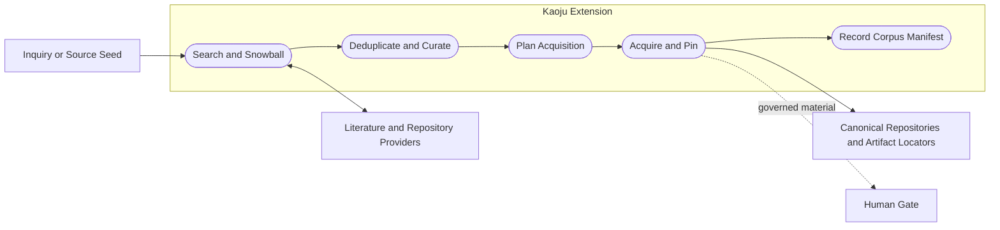
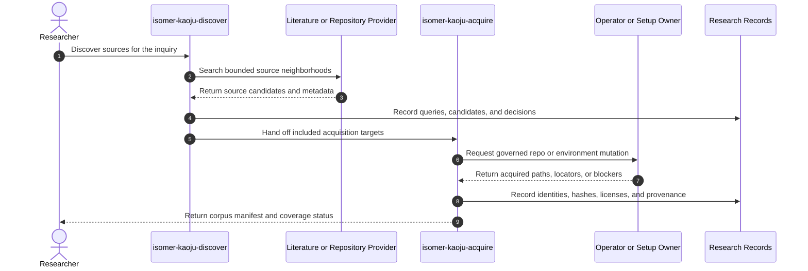

# Use Case 02: Discover and Acquire a Versioned Source Corpus

## Actor Goal

As a researcher, I want Kaoju to discover and materialize a versioned corpus of papers, repositories, models, datasets, benchmark specifications, and implementation records, so that later claims can be traced to stable source identities rather than transient search results.

## Use Case

The researcher supplies a topic, seed paper, repository, model name, benchmark, or claim. Kaoju searches provider-bound literature and repository neighborhoods, follows backward and forward references when useful, records inclusion and exclusion decisions, deduplicates related versions, then acquires only the materials required by the inquiry contract. Code repositories become registered Canonical External Repositories; other large or restricted materials retain immutable locators, revisions, checksums, licenses, and access evidence under governed storage policy.

## Supported Actions

### Discover the Source Neighborhood

The researcher asks Kaoju to identify relevant primary and implementation sources with inspectable search provenance.

- context
  - Actor **has** a Kaoju Inquiry Contract or a concrete source seed.
  - System **has** Literature Provider Binding, repository lookup, local durable records, and source-deduplication guidance.
- intent
  - Actor **wants** a defensible candidate corpus and evidence that the declared coverage rule was applied.
  - Actor **wonders** "Which papers, releases, repositories, checkpoints, benchmark rules, issues, and follow-up sources could change the answer?"
- action
  - Actor then **asks** the system to discover the unresolved source neighborhood.
- result
  - Actor **gets** a query log, candidate source catalog, inclusion and exclusion decisions, version-family links, coverage status, and unresolved access gaps.

### Acquire and Pin Required Materials

The researcher asks Kaoju to make selected materials inspectable or executable without erasing their origin.

- context
  - Actor **has** an included source catalog and an acquisition target set.
  - System **has** canonical repository registration, provider-neutral execution and credential extension points, Artifact recording, and Gate policies.
- intent
  - Actor **wants** stable source snapshots with enough identity and license evidence for later inspection and Runs.
  - Actor **wonders** "Which commit, model revision, dataset release, and benchmark specification did we actually use?"
- action
  - Actor then **asks** the system to acquire the selected materials.
- result
  - Actor **gets** registered read-only repositories, immutable material locators, revisions, hashes, licenses, sizes, acquisition status, Provenance Records, and explicit blockers for unavailable material.

## Main Flow

1. `isomer-kaoju-discover` loads the inquiry contract, existing source catalog, prior search log, and local repositories before opening broad discovery.
2. The skill searches primary literature, official repositories, release histories, model and dataset registries, benchmark documentation, issues, pull requests, and citation links that can affect the inquiry.
3. Every search batch records provider, query, filters, time, candidate results, and source metadata as provider-output Artifacts with Provenance Records.
4. The skill links preprints, published versions, supplements, forks, mirrors, releases, and derived implementations into version families rather than counting each item as independent evidence.
5. The skill applies the inquiry's inclusion and exclusion rules and records reasons for decisions.
6. `isomer-kaoju-acquire` builds an acquisition plan for only the included materials needed by examination, reproduction, or comparison.
7. Required code repositories are resolved or registered under `topic.repos.*`, acquired through the owning setup route, pinned to a revision, and treated as read-only evidence by default.
8. Papers, documentation, model checkpoints, datasets, and benchmark specifications receive immutable locators, revision or publication identity, checksums when available, license and access classification, and acquisition timestamps.
9. Restricted, credentialed, expensive, or unusually large acquisition is governed by the selected Gate Policy; denial becomes a durable access blocker rather than a silent omission.
10. The researcher receives the versioned source catalog, material manifest, coverage status, and next route to examination or a blocker.

## Alternative And Exception Flows

- If an official repository does not identify the paper-matching commit, Kaoju records the ambiguity and keeps repository authority separate from paper implementation identity.
- If a repository is already present, the skill inspects its remote, revision, dirty state, submodules, and license instead of recloning it.
- If a source cannot be downloaded legally or technically, the catalog retains metadata and access status but does not claim that the material was inspected.
- If two sources disagree about version or benchmark configuration, both remain in the catalog and the contradiction routes to `isomer-kaoju-examine`.
- If a model or dataset is too large for durable local preservation, Kaoju records its immutable locator and checksum and uses policy-approved cache or staging without treating the cache path as the semantic identity.
- If discovery reaches the declared coverage criterion without finding executable material, the skill may complete the corpus stage and record reproduction as blocked.

## Mermaid Flow Diagram

## Mermaid Sequence Diagram

## Durable Outputs

- Search Query Log and provider-output Artifacts.
- Candidate Source Catalog with inclusion, exclusion, and version-family relationships.
- Coverage Status Record and unresolved-source gaps.
- Acquisition Plan and Material Manifest.
- Registered Canonical External Repository refs and revision identities.
- Paper, documentation, model, dataset, and benchmark locators with checksums, licenses, sizes, and access status.
- Acquisition Provenance Records, Gate decisions, and access blockers.

## Example Prompt And Expected AI Response

### Event 001: Build an Executable Corpus

> Time: `2026-07-10T10:30:00Z` · Session: `Kaoju source-audit pass`

User Prompt:

> Find the primary papers and official implementations for sparse MoE inference kernels, check out the relevant repositories, and download only the checkpoints needed to verify their advertised examples.

AI:

> The agent returns a source catalog and acquisition plan before large downloads. It records search queries, version families, included and excluded sources, repository revision targets, checkpoint locators and sizes, licenses, required credentials, and Gates. After authorized acquisition it reports registered repository refs, hashes, provenance, and unavailable materials. It does not describe search snippets as inspected evidence.

## Assumptions And Open Questions

- Repository acquisition is delegated to the existing Topic Workspace setup and repository-management owners because Kaoju does not own environment topology mutation.
- The first implementation should preserve large binary identity and provenance without requiring Isomer to vendor every model or dataset into Git.
