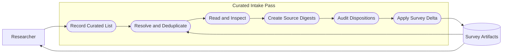
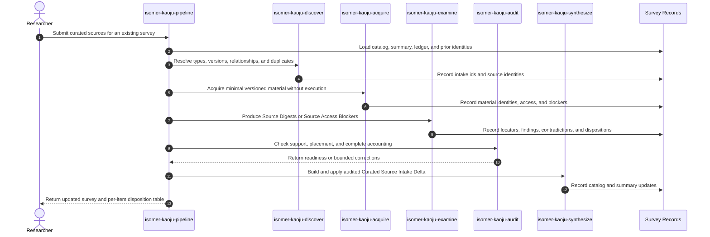

# Use Case 02: Ingest Curated References and Codebases into a Survey

## Actor Goal

As a researcher who knows important references or codebases, I want Kaoju to read every nominated source and integrate its useful supported information into an existing survey, so that my domain knowledge improves the survey without losing provenance, source relationships, or evidence discipline.

## Use Case

The researcher supplies a list of papers, technical reports, repositories, documentation, or other source locators and identifies the survey they should inform. Kaoju runs a bounded `curated-intake-pass`, resolves and deduplicates each source, acquires enough versioned material for read-only examination, produces a Source Digest and disposition for every item, and applies an audited Curated Source Intake Delta to the Related-Work Catalog and Field Summary.

## Supported Actions

### Submit a Curated Source List

The researcher provides sources they consider important and may explain why they matter.

- context
  - Actor **has** an existing survey or survey topic plus one or more reference, repository, documentation, model, dataset, or other stable or resolvable locators.
  - System **has** the current Related-Work Catalog, Field Summary, Claim-Evidence Ledger, source-identity rules, and prior acquisition records when the survey already exists.
- intent
  - Actor **wants** the nominated material to receive priority review rather than compete with general search candidates.
  - Actor **wonders** "What useful information do these sources add to the survey?"
- action
  - Actor then **asks** the system to read the list and add relevant information to the survey.
- result
  - Actor **gets** a Curated Source Intake Contract that preserves the supplied list, target survey, stated relevance, desired depth, access and resource bounds, and read-only default.

### Review Source Digests and Dispositions

The researcher inspects what Kaoju learned from every nominated item.

- context
  - Actor **has** an accepted intake contract and the submitted source list.
  - System **has** resolved source identities, version families, duplicate links, acquired materials, and exact source locators.
- intent
  - Actor **wants** each item accounted for and interpreted at its achieved evidence depth.
  - Actor **wonders** "What does each source contribute, how does it relate to the survey, and was it included?"
- action
  - Actor then **asks** the system to present the Source Digests and dispositions.
- result
  - Actor **gets** a per-item Source Digest containing identity, type, contribution or purpose, relevant claims, method or implementation structure, evaluation basis, limitations, linked artifacts, survey relevance, evidence depth, exact locators, and terminal disposition, or a Source Access Blocker when examination was impossible.

### Merge Useful Information into the Survey

The researcher accepts the evidence-backed survey update after intake audit.

- context
  - Actor **has** Source Digests or Source Access Blockers for every submitted item, audited dispositions, and evidence-backed survey changes ready for synthesis.
  - System **has** checked provenance, duplicates, type-aware placement, claim support, contradictions, and completeness of per-item accounting.
- intent
  - Actor **wants** useful information to enrich the survey's durable artifacts rather than remain in a detached source summary.
  - Actor **wonders** "How do these sources change the related-work list, field narrative, evidence ledger, and reading path?"
- action
  - Actor then **asks** the system to apply the audited delta.
- result
  - Actor **gets** updated survey artifacts with source-linked additions, revisions, contradictions, artifact relationships, and an intake report that explains every item that was merged, linked, excluded, duplicated, or blocked.

## Main Flow

1. The researcher invokes `isomer-kaoju-pipeline curated-intake-pass` with a target survey and a list of references, codebases, or other source locators, optionally stating why each item matters.
2. `isomer-kaoju-frame` creates a Curated Source Intake Contract containing the original list, target survey refs, themes or questions, requested depth, resource and access limits, stopping rule, and `execution_allowed: false` unless the user requested another pass.
3. The pipeline loads the current Related-Work Catalog, Field Summary, Claim-Evidence Ledger, Material Manifest, and prior source identities so the intake can update existing work rather than duplicate it.
4. `isomer-kaoju-discover` resolves canonical identities, source types, versions, work families, and supported paper-to-code or artifact relationships. Discovery remains limited to identity and relationship resolution rather than broad survey expansion.
5. The skill gives each submitted item a stable intake id and detects duplicates within the list and against existing survey entries.
6. `isomer-kaoju-acquire` captures the minimum material needed for reliable examination, pins repositories to immutable revisions, records access and license posture, and preserves blockers without executing code.
7. `isomer-kaoju-examine` reads each accessible paper, report, or documentation source and inspects each accessible codebase at the accepted depth. It records exact locators and does not infer unsupported paper-to-code correspondence.
8. The skill produces one Source Digest per accessible item covering contribution or purpose, relevant claims, method or implementation structure, evaluation basis, assumptions, limitations, contradictions, linked artifacts, survey relevance, and achieved Verification Depth. An inaccessible item receives a Source Access Blocker instead.
9. Each item receives one disposition: `included-primary-work`, `linked-artifact`, `contextual-reference`, `merged-duplicate`, `excluded`, or `blocked`, with a concrete rationale and durable evidence refs.
10. `isomer-kaoju-audit` verifies that every submitted item has a disposition, every proposed statement has exact support, work and artifact types are placed correctly, duplicate families will be merged, contradictions remain visible, and the intake does not claim survey completeness.
11. `isomer-kaoju-synthesize` applies the accepted Curated Source Intake Delta to the Related-Work Catalog, taxonomy, chronology, Field Summary, Claim-Evidence Ledger, limitations, artifact links, and suggested reading path as applicable.
12. The pipeline returns updated survey refs, a per-item disposition table, access or evidence gaps, and optional routes for broader direction expansion, source audit, reproduction, or comparison.

## Alternative And Exception Flows

- If a locator is ambiguous, Kaoju resolves candidate identities from available metadata and asks for clarification only when choosing the wrong source would materially change the survey.
- If an item already exists in the survey, Kaoju enriches its existing work family or artifact record and marks the intake item `merged-duplicate` rather than creating a second entry.
- If several supplied locators identify versions of the same work, Kaoju preserves their source identities under one work family and states which version informed each digest statement.
- If a supplied codebase has a supported relationship to a paper or technical report, Kaoju links it to that primary work. If the relationship is uncertain, it remains a candidate or contextual artifact with the uncertainty recorded.
- If a source is irrelevant under the accepted survey boundary, Kaoju marks it `excluded` with a concrete reason rather than forcing it into the narrative.
- If a source is inaccessible, missing, malicious-looking, too large, license-restricted, or beyond the resource envelope, Kaoju records a `blocked` disposition and the minimum action needed to resume.
- If code understanding would benefit from execution, Kaoju records the proposed follow-up question and routes execution to a method-trial, reproduction, or source-audit request with explicit execution scope; curated intake itself remains read-only.
- If an item identifies useful neighboring or cited work, Kaoju records the leads but routes broad backward, neighboring, forward, or post-seed discovery to `direction-expansion-pass` rather than silently widening the intake.
- If the list is too large for one bounded pass, Kaoju divides it into stable batches, preserves completed digests and dispositions, and returns coverage and resume state for the remainder.
- If a nominated source contradicts the existing survey, Kaoju records both positions and their evidence depths; it does not erase the earlier claim or invent a resolution.

## Mermaid Flow Diagram

## Mermaid Sequence Diagram

## Durable Outputs

- Curated Source Intake Contract preserving the original user-supplied list and stated relevance.
- Stable intake ids, resolved Source Identities, work-family links, paper-to-code mappings, and duplicate records.
- Material Manifest additions with immutable revisions, access, license, and acquisition provenance.
- One Source Digest or Source Access Blocker, plus a terminal disposition, for every supplied item.
- Curated Source Intake Delta with evidence-linked changes to applicable survey artifacts.
- Updated Related-Work Catalog, Field Summary, Claim-Evidence Ledger, taxonomy, chronology, limitations, artifact links, and suggested reading path as applicable.
- Audit Report, unresolved source leads, access or evidence blockers, Provenance Records, coverage and resume state, and pipeline terminal report.

## Example Prompt And Expected AI Response

### Event 001: Add Known Important Sources to a Survey

> Time: `2026-07-10T20:00:00Z` · Session: `Kaoju curated intake`

User Prompt:

> I know this list of papers and codebases is important to the survey. Read each one and add the useful information to the survey.

AI:

> The agent records the exact list, resolves and deduplicates each source, pins codebases for read-only inspection, and returns one Source Digest or Source Access Blocker plus a disposition per item. It applies only evidence-backed information to the survey, preserves papers and reports as primary works and codebases as linked artifacts where supported, records contradictions and blockers, and does not claim that the curated list establishes broad survey coverage.

## Assumptions And Open Questions

- User nomination sets review priority but does not replace source verification, relevance checks, type-aware placement, or provenance.
- The default intake reads and inspects source material without building or executing code. A separate execution-oriented request may reuse the resulting identities and mappings.
