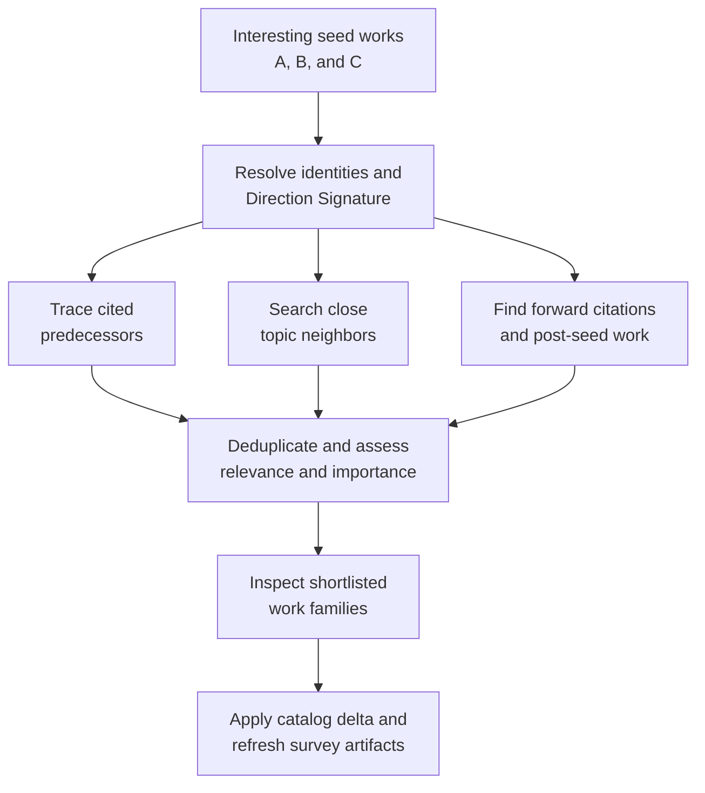
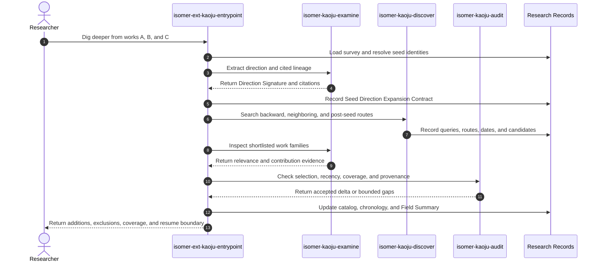

# Use Case 03: Expand a Survey from Interesting Seed Works

## Actor Goal

As a researcher, I want Kaoju to expand an interesting direction from works A, B, and C, so that the survey includes its important predecessors, close neighbors, and relevant later developments.

## Use Case

The researcher identifies several works as an interesting direction and asks Kaoju to dig deeper. Kaoju resolves the seed work families, extracts an evidence-backed direction boundary, traces works cited by the seeds, searches the surrounding survey topic, and finds closely related work published after the seed set. It evaluates candidate importance and relevance with explicit reasons, adds the selected works to the Related-Work Catalog, and refreshes the connected survey artifacts.

## Supported Actions

### Define the Direction from Seed Works

The researcher marks works A, B, and C as seeds for a narrower survey direction.

- context
  - Actor **has** two or more named works or stable work references that appear related and worth deeper study.
  - System **has** source identity resolution, existing survey context when available, and source-examination capabilities.
- intent
  - Actor **wants** the seeds converted into a bounded direction that can guide discovery without reducing the search to title keywords.
  - Actor **wonders** "What common problem, mechanism, or research direction connects A, B, and C, and what should count as relevant?"
- action
  - Actor then **asks** the system to resolve the seed works and frame the direction for deeper survey expansion.
- result
  - Actor **gets** stable seed identities, a Direction Signature, inclusion and exclusion rules, importance criteria, time bounds, search budget, and stopping criteria.

### Trace Predecessors and Close Neighbors

The researcher asks Kaoju to follow the seed works' intellectual lineage and find other important work in the same direction.

- context
  - Actor **has** an accepted seed set and Direction Signature within a survey topic.
  - System **has** the seeds' citations, source text, topic vocabulary, citation search, and the five-class discovery contract.
- intent
  - Actor **wants** foundational cited works and closely related candidates that clarify how the direction formed and which contributions matter.
  - Actor **wonders** "Which earlier or neighboring works are necessary to understand why A, B, and C matter?"
- action
  - Actor then **asks** the system to trace cited works, search the topic neighborhood, and curate important additions.
- result
  - Actor **gets** a route-labeled candidate ledger, citation edges, relevance and importance reasons, inclusion decisions, and selected predecessor or neighboring works added to the survey.

### Find and Include Post-Seed Work

The researcher asks Kaoju to extend the direction beyond A, B, and C to closely related later work.

- context
  - Actor **has** resolved seed publication dates, a Direction Signature, and an explicit current search cutoff.
  - System **has** forward-citation search, time-filtered topic discovery, source deduplication, and survey-update capabilities.
- intent
  - Actor **wants** the survey to include important developments that appeared after the seed works rather than ending at their publication dates.
  - Actor **wonders** "What closely related work came after A, B, and C, and which of it materially advances, challenges, or redirects this line?"
- action
  - Actor then **asks** the system to search from the post-seed boundary through the declared cutoff and include the important results.
- result
  - Actor **gets** a time-bounded list of post-seed candidates, explicit selection reasons, version-family identities, and an updated catalog, chronology, and Field Summary.

## Main Flow

1. The researcher invokes `isomer-ext-kaoju-entrypoint direction-expansion-pass` with works A, B, and C, the active survey topic, and optional direction or time constraints.
2. `isomer-kaoju-frame` creates a Kaoju Inquiry Contract that fixes the seed selection, requested direction, relevance and importance criteria, date preferences, search budget, stopping rule, and survey outputs to update.
3. The pipeline resolves the proposed `latest_after`, which defaults to the latest publication date among the seed work families, and `searched_through`, which records the current pass's search cutoff.
4. The pipeline loads the Related-Work Catalog, Field Summary, Search Query Log, source catalog, Claim-Evidence Ledger, and prior inclusion decisions for the active survey.
5. The first acquire and examine stages materialize any missing seed sources and extract a Direction Signature covering the shared problem, methods, concepts, terminology, assumptions, cited lineage, exclusions, and distinguishing claims.
6. The pipeline records a Seed Direction Expansion Contract that binds the stable seed identities and Direction Signature to the relevance rules, importance criteria, `latest_after`, `searched_through`, budget, and stopping rule.
7. `isomer-kaoju-discover` traces backward citations from each seed and records the citation edge and exact seed reference that led to every candidate.
8. The skill searches the direction's topic neighborhood across papers, technical reports, source code repositories, datasets, and models, preserving ADR 0002 coverage and ADR 0001 presentation rules.
9. The skill searches forward citations to the seeds and runs time-filtered topic queries for closely related works after `latest_after` and no later than `searched_through`.
10. Every candidate records its discovery routes, parent seeds, queries, dates, preliminary relevance evidence, and source identity before selection.
11. The skill deduplicates preprints, proceedings papers, journal versions, technical reports, supplements, and renamed projects into work families while retaining version-specific identities and dates.
12. Kaoju assesses candidates against the contract using direct direction relevance, foundational lineage, distinct contribution, field influence, contradictory evidence, and meaningful new settings. It records concrete reasons rather than using citation count or recency alone.
13. The second acquire and examine stages inspect the shortlisted candidates deeply enough to confirm their contribution, relation to the seeds, source dates, limitations, and linked implementation artifacts.
14. Included papers and technical reports become primary Related-Work Catalog entries. Relevant repositories, datasets, models, and benchmark specifications become linked implementation or evidence artifacts.
15. `isomer-kaoju-audit` checks route provenance, citation edges, date bounds, importance rationales, inclusion consistency, version-family handling, five-class coverage, and unsupported claims of recency or exhaustiveness.
16. `isomer-kaoju-synthesize` applies a Related-Work Catalog Delta and updates the direction taxonomy, chronology, Field Summary, reading path, coverage limits, and open questions.
17. The researcher receives the added works, excluded shortlist with reasons, backward and post-seed coverage, updated survey refs, unresolved gaps, and a durable refresh boundary for later continuation.

## Alternative And Exception Flows

- If a seed name is ambiguous, Kaoju records candidate identities and blocks direction extraction until every seed resolves to a stable work family and source version.
- If A, B, and C span several distinct directions, Kaoju records the candidate branches and narrows the expansion to the direction supported by the user's request instead of merging unrelated neighborhoods.
- If citation metadata is incomplete or unavailable, Kaoju uses source reference lists, title and author lookup, and alternative providers while recording the coverage limitation.
- If a cited work is inaccessible, its identity and citation edge remain in the candidate ledger, but Kaoju does not claim that its contribution was inspected.
- If a work appears in several discovery routes, Kaoju preserves all routes on one deduplicated work family rather than counting it several times.
- If a recent work has little citation history, Kaoju may still include it for strong direct relevance or a distinct contribution, provided the rationale and weaker influence evidence remain visible.
- If a highly cited work is only tangentially related, Kaoju excludes it or places it in contextual references instead of treating popularity as relevance.
- If publication versions have different dates, the contract records which date semantics define `latest_after` and keeps the full version chronology.
- If post-seed discovery reaches `searched_through` with no eligible additions, Kaoju records an empty result and the queries used rather than implying that the direction ended.
- If newly found work changes the direction boundary materially, Kaoju records a proposed branch or reframing Decision Record instead of silently widening the survey.
- If the resource or coverage budget is exhausted, the pass returns a partial Catalog Delta, remaining candidate frontier, and resume point without claiming completeness.

## Mermaid Flow Diagram

## Mermaid Sequence Diagram

## Durable Outputs

- Seed Direction Expansion Contract with seed identities, direction boundary, importance criteria, search budget, stopping rule, `latest_after`, and `searched_through`.
- Direction Signature with problem, methods, concepts, terminology, assumptions, exclusions, cited lineage, and distinguishing claims.
- Search Query Log and per-class coverage for papers, technical reports, source code repositories, datasets, and models.
- Candidate Discovery Ledger with `backward-citation`, `topic-neighbor`, `forward-citation`, and `post-seed-latest` routes, parent seeds, citation edges, query provenance, and source dates.
- Deduplicated work-family identities and version chronology for every included or shortlisted candidate.
- Importance and Inclusion Decision Records with direct relevance, lineage, contribution, influence, contradiction, or new-setting reasons.
- Related-Work Catalog Delta with added primary works and links to repositories, datasets, models, and benchmark specifications.
- Updated direction taxonomy, chronology, Field Summary, reading path, coverage record, open questions, and source-gap register.
- Audit Report, Provenance Records, pipeline terminal report, remaining candidate frontier, and refresh resume point.

## Example Prompt And Expected AI Response

### Event 001: Expand an Interesting Survey Direction

> Time: `2026-07-10T20:00:00Z` · Session: `Kaoju direction expansion over an existing survey`

User Prompt:

> I think these works A, B, and C are interesting. We need to dig more into this direction. Trace the works they cite, find other relevant work for the survey topic, select the important works, and also include closely related work that appeared after A, B, and C.

AI:

> The agent resolves the seed work families and states the Direction Signature, inclusion criteria, importance criteria, `latest_after`, `searched_through`, and search budget. It traces cited predecessors, searches topic neighbors, and finds forward and post-seed work while recording every discovery route. It returns the selected additions and exclusions with reasons, updated Related-Work Catalog and Field Summary refs, coverage limits, and a resume frontier without treating citation count, recency, or provider ranking as sufficient evidence of importance.

## Assumptions And Open Questions

- The default `latest_after` boundary is the latest resolved publication date among A, B, and C. A user-provided date or version boundary overrides this default.
- “Important” means important to the declared direction and survey purpose, not universally influential. Every inclusion therefore requires a concrete rationale.
- “Latest” is time-bounded by `searched_through`. A later refresh may add new work without invalidating the earlier Catalog Delta or its provenance.
