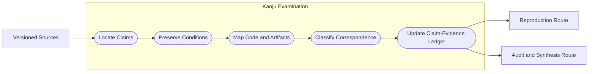
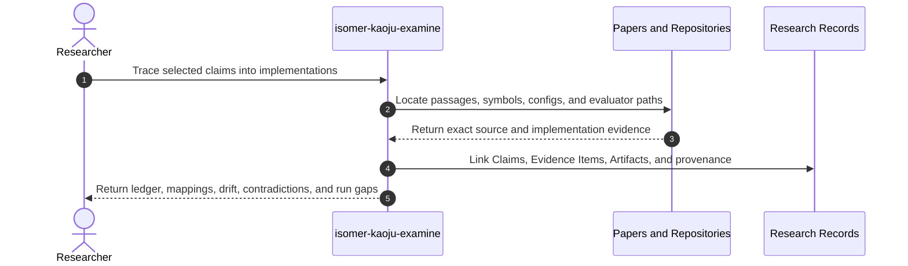

# Use Case 03: Trace Claims Across Papers and Implementations

## Actor Goal

As a researcher, I want Kaoju to trace important claims from papers and documentation into exact implementation and artifact locations, so that I can distinguish what is reported, what exists in code, and where paper-to-code drift or contradiction begins.

## Use Case

The researcher selects claims such as supported hardware, algorithm behavior, model compatibility, numerical accuracy, throughput, memory use, or reproducibility. Kaoju reads the acquired source corpus, locates each claim precisely, maps it to code symbols, configuration, scripts, checkpoints, tests, and benchmark recipes, and records whether the implementation matches, narrows, broadens, or contradicts the source claim. This use case can complete without executing code when inspection is the requested evidence target.

## Supported Actions

### Locate and Normalize Source Claims

The researcher asks Kaoju to convert prose and tables into claim-addressable records without losing qualifiers.

- context
  - Actor **has** one or more included papers, documents, issues, releases, or reported results.
  - System **has** versioned source identities, inspectable material, and Research Claim and Evidence Item recording.
- intent
  - Actor **wants** exact locators, original scope, conditions, and qualifiers for every material claim.
  - Actor **wonders** "What exactly did the source claim, and under which hardware, model, dataset, metric, and version conditions?"
- action
  - Actor then **asks** the system to extract and normalize the selected claims.
- result
  - Actor **gets** Research Claims with exact source locators, reported values, qualifiers, source identity, and links to supporting or contradicting Evidence Items.

### Map Claims to Implementations and Artifacts

The researcher asks Kaoju to find how each claim is represented in executable or inspectable material.

- context
  - Actor **has** normalized claims and acquired repositories, models, datasets, or benchmark specifications.
  - System **has** repository inspection, file and symbol search, source revision metadata, and Artifact lineage.
- intent
  - Actor **wants** a white-box map from claim to code path, configuration, model revision, evaluator, test, and benchmark command.
  - Actor **wonders** "Does the official implementation actually contain the mechanism and evaluation path described by the paper?"
- action
  - Actor then **asks** the system to examine paper-to-code and paper-to-artifact correspondence.
- result
  - Actor **gets** a Claim-Evidence Ledger, Paper-Code Mapping, contradiction and drift register, executable-candidate shortlist, and gaps that require acquisition or a Run.

## Main Flow

1. `isomer-kaoju-examine` loads selected claims, source identities, material manifests, and prior Evidence Items.
2. The skill records the exact page, section, table, figure, paragraph, issue, release note, documentation heading, or other stable locator for each claim.
3. The skill preserves claim qualifiers such as hardware, software version, model, dataset, precision, sequence length, batch size, metric definition, and comparison basis.
4. For each implementation source, the skill locates relevant files, symbols, configuration keys, build flags, tests, examples, model revisions, evaluator logic, and benchmark scripts.
5. The skill links the source claim to implementation and artifact Evidence Items without assuming that an official or popular repository is the paper-matching implementation.
6. The skill classifies the relation as aligned, narrower, broader, version-shifted, ambiguous, absent, or contradictory.
7. The skill records whether the claim is only reported, has been located, or has been inspected. It does not assign executed, reproduced, or compared status without corresponding Runs.
8. Gaps route explicitly to more discovery, acquisition, reproduction, or comparison; resolved inspection findings route to synthesis or audit.
9. The researcher receives a queryable claim ledger and exact evidence pointers rather than a prose-only paper summary.

## Alternative And Exception Flows

- If a source is image-only, incomplete, or inaccessible, Kaoju records the locator and access limitation and does not invent missing text or code correspondence.
- If multiple repository branches plausibly correspond to the paper, each candidate retains a distinct revision identity until evidence resolves the mapping.
- If code implements behavior that the paper does not describe, the behavior becomes a separate Research Claim rather than silently expanding the paper claim.
- If documentation reflects a newer implementation than the paper, Kaoju records version drift and keeps both claims visible.
- If reported numerical values cannot be tied to evaluator code or raw outputs, they remain reported evidence and route to reproduction when needed.
- If inspection alone answers the inquiry, the skill may route directly to audit and synthesis without forcing a Run.

## Mermaid Flow Diagram

## Mermaid Sequence Diagram

## Durable Outputs

- Normalized Research Claims with exact source locators and preserved qualifiers.
- Claim-Evidence Ledger linking claims to supporting, contradicting, or contextual Evidence Items.
- Paper-Code Mapping with repository, revision, file, symbol, config, model, evaluator, and benchmark refs.
- Implementation Drift and Contradiction Register.
- Executable Candidate Shortlist and missing-material or missing-run routes.
- Examination Provenance Records and updated coverage status.

## Example Prompt And Expected AI Response

### Event 001: Audit a Hardware Support Claim

> Time: `2026-07-10T11:00:00Z` · Session: `Kaoju source-audit pass`

User Prompt:

> Trace the claim that repository A supports FP8 training on architecture B. Show where the claim appears, which code path implements it, which configs enable it, and whether the tests exercise the same path. Do not run anything yet.

AI:

> The agent returns the normalized claim and qualifiers, exact paper or documentation locators, repository revision, relevant files and symbols, configuration and build conditions, test coverage mapping, contradictions or version drift, and an evidence status no stronger than `inspected`. It lists the minimum first-hand Run needed to advance the claim to executed or reproduced evidence.

## Assumptions And Open Questions

- Exact source locators may use page and section references, repository revision plus file and symbol, or provider-stable identifiers according to source type.
- Claim correspondence categories are Kaoju profile vocabulary attached to canonical Isomer Research Claims and Evidence Items; they are not new core lifecycle entities.
