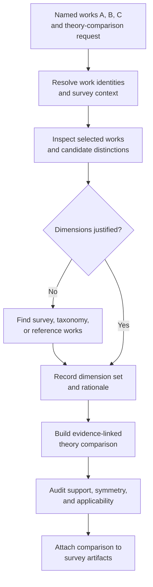
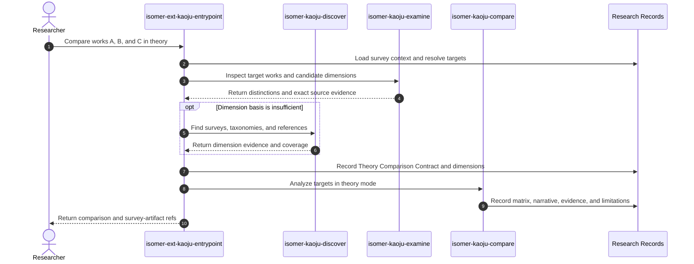

# Use Case 04: Compare Named Works in Theory

## Actor Goal

As a researcher, I want Kaoju to compare named works through domain-relevant theoretical and conceptual dimensions, so that I can understand their assumptions, mechanisms, guarantees, trade-offs, and limitations without first running their implementations.

## Use Case

The researcher supplies works A, B, and C and asks for a comparison in theory. Kaoju resolves the exact work identities, examines the selected sources and existing survey context, derives the dimensions that matter in that domain, and performs bounded reference discovery when the useful dimensions are unclear. It then produces an evidence-linked Theory Comparison Artifact and attaches it to the survey artifacts without presenting source analysis as empirical comparison.

## Supported Actions

### Derive Domain-Relevant Comparison Dimensions

The researcher delegates discovery of the useful comparison aspects instead of supplying a fixed checklist.

- context
  - Actor **has** two or more named papers, technical reports, methods, or stable work references and a broad comparison intent.
  - System **has** access to the selected works, existing Related-Work Catalog or Field Summary when available, and bounded discovery and source-examination capabilities.
- intent
  - Actor **wants** comparison dimensions that expose the important distinctions in the survey domain rather than generic headings applied mechanically.
  - Actor **wonders** "For works A, B, and C, which theoretical aspects actually reveal how their approaches differ?"
- action
  - Actor then **asks** the system to determine and justify the dimensions for a theory comparison, finding reference papers when the selected works do not provide enough context.
- result
  - Actor **gets** a Comparison Dimension Set in which every dimension has a definition, rationale, applicability rule, and source refs, plus a record of any supplemental discovery used to derive it.

### Produce the Source-Grounded Theory Comparison

The researcher asks Kaoju to analyze each selected work against the accepted domain-derived dimensions.

- context
  - Actor **has** named target works and a justified Comparison Dimension Set.
  - System **has** versioned source identities, exact source locators, Claim-Evidence Ledger support, and rules that keep theoretical and empirical comparison distinct.
- intent
  - Actor **wants** a structured account of common ground, decisive differences, trade-offs, applicability, and unresolved claims across the works.
  - Actor **wonders** "How do A, B, and C differ in assumptions, core mechanism, guarantees, complexity, and likely use cases, and where is the evidence for each conclusion?"
- action
  - Actor then **asks** the system to analyze the selected works and add the comparison output to the survey artifacts.
- result
  - Actor **gets** an evidence-linked matrix and narrative analysis with explicit unknown, inapplicable, unclear, and disputed cells, preserved verification depth, limitations, and empirical questions that would require later Runs.

## Main Flow

1. The researcher invokes `isomer-ext-kaoju-entrypoint theory-comparison-pass` with two or more named works and an optional comparison question, domain boundary, or preferred aspects.
2. `isomer-kaoju-frame` resolves the target work identities and creates a Kaoju Inquiry Contract that selects `comparison_mode: theory` and fixes the evidence boundary, output placement, resource envelope, and stopping criteria.
3. The pipeline loads relevant Related-Work Catalog, Field Summary, source catalog, Claim-Evidence Ledger, and prior examination records so it can reuse accepted survey context.
4. `isomer-kaoju-examine` inspects the selected works' problem formulations, assumptions, mechanisms, representations, formal claims, complexity statements, intended settings, limitations, and relationships to the field.
5. The pipeline proposes candidate comparison dimensions based on the user's question, repeated distinctions across the target works, and the domain taxonomy already supported by survey evidence.
6. If the evidence does not support a useful dimension set, `isomer-kaoju-discover` performs a bounded search for surveys, taxonomies, seminal papers, or other reference works that expose accepted distinctions. When this becomes a work-survey subtask, it preserves the five source-class coverage required by ADR 0002.
7. The skill records a Comparison Dimension Set whose entries contain stable dimension ids, definitions, rationales, applicability rules, source refs, and cautions against misleading interpretations.
8. `isomer-kaoju-acquire` captures only the target and reference material needed to inspect the selected dimensions, and `isomer-kaoju-examine` records exact passages, equations, tables, figures, code locations, or other stable evidence locators.
9. `isomer-kaoju-compare` records a Theory Comparison Contract that binds the target works to the Comparison Dimension Set, then evaluates each target per dimension while separating source statements from Kaoju's evidence-grounded interpretations and preserving contradictions and version differences.
10. The skill constructs a Theory Comparison Matrix whose cells carry exact evidence refs and a status such as supported description, `not stated`, `not applicable`, `unclear`, or `disputed`.
11. `isomer-kaoju-audit` checks dimension relevance, symmetric treatment of target works, source support, applicability, missing cells, unsupported rankings, and accidental promotion to empirical evidence.
12. `isomer-kaoju-synthesize` produces the Theory Comparison Artifact with dimension rationale, matrix, narrative trade-offs, common ground, disagreements, limitations, and empirical follow-up questions, then links it from the Related-Work Catalog, Field Summary, or Kaoju Dossier.
13. The researcher receives the comparison, supplemental reference list, evidence and survey-artifact refs, achieved verification depths, and optional routes to source audit or empirical comparison.

## Alternative And Exception Flows

- If A, B, or C is ambiguous, Kaoju presents the candidate identities and blocks comparison until each target resolves to a stable work family and source version.
- If the selected works solve materially different problems, Kaoju separates the matrix into explicit strata or marks affected dimensions `not applicable` instead of forcing a common ranking.
- If a candidate dimension merely repeats one work's terminology, Kaoju normalizes it into a field-level definition or records why symmetric comparison is impossible.
- If no source supports a cell, Kaoju records `not stated` or `unclear`; it does not infer a method property from absence of discussion.
- If reference works disagree about the field taxonomy, Kaoju preserves the alternative dimension sets or explains the selected framing and records the disagreement.
- Supplemental reference works justify the dimension set but remain contextual sources unless the researcher explicitly adds them to the target comparison set.
- If a dimension depends on observed accuracy, latency, memory, robustness, or other first-hand behavior, Kaoju records an empirical follow-up question and routes it to `comparative-pass` rather than speculating.
- If code inspection reveals behavior absent from the paper, Kaoju records the version and source distinction and does not silently rewrite the paper's theoretical description.
- If the evidence supports trade-offs but no universal winner, the narrative reports conditional strengths and limitations rather than forcing a total ranking.

## Mermaid Flow Diagram

## Mermaid Sequence Diagram

## Durable Outputs

- Theory Comparison Contract with target work identities, question, `comparison_mode: theory`, evidence boundary, output placement, and stopping criteria.
- Comparison Dimension Set with stable ids, definitions, rationales, applicability rules, source refs, and interpretation cautions.
- Supplemental Discovery Ledger, coverage record, and contextual reference list when additional domain evidence was needed.
- Exact source and work-version identities for every target and reference work.
- Theory Comparison Matrix with evidence refs and explicit `not stated`, `not applicable`, `unclear`, and `disputed` cells.
- Narrative analysis of common ground, mechanisms, assumptions, guarantees, complexity, trade-offs, applicability, disagreements, and limitations as supported by the selected dimensions.
- Updated Claim-Evidence Ledger, Evidence Items, Findings, Provenance Records, and achieved source verification depths.
- Theory Comparison Artifact linked from the Related-Work Catalog, Field Summary, Kaoju Dossier, or other applicable survey artifact.
- Empirical follow-up questions and optional route to `comparative-pass` when source analysis cannot answer a dimension.

## Example Prompt And Expected AI Response

### Event 001: Compare Three Works in Theory

> Time: `2026-07-10T19:00:00Z` · Session: `Kaoju theory comparison over an existing survey`

User Prompt:

> For these works A, B, and C, do a comparison of them in theory. Figure out which aspects are interesting in this domain, find reference papers if needed, analyze the works, and add the comparison to the survey artifacts.

AI:

> The agent resolves A, B, and C to stable work identities, reuses the existing survey taxonomy, and performs bounded reference discovery only where the dimension basis is weak. It returns the justified dimension set, contextual references, an evidence-linked matrix and trade-off narrative, unknown or inapplicable cells, source verification depths, and the updated survey-artifact refs. It does not require Runs, infer missing properties, or label the source-only result as empirical `compared` evidence.

## Assumptions And Open Questions

- "In theory" means a source-grounded, non-experimental comparison of concepts, assumptions, mechanisms, formal claims, complexity, applicability, and limitations. It does not mean independently proving every theorem or predicting benchmark performance.
- The user may provide preferred dimensions, but Kaoju remains responsible for checking their relevance and identifying important omitted dimensions from domain evidence.
- The first implementation may expose theory and empirical modes through the same `isomer-kaoju-compare` skill because both own structured comparison; the mode-specific contracts keep their evidence requirements and outputs distinct.
