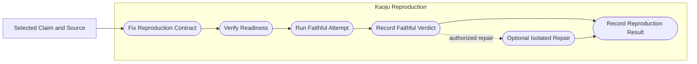
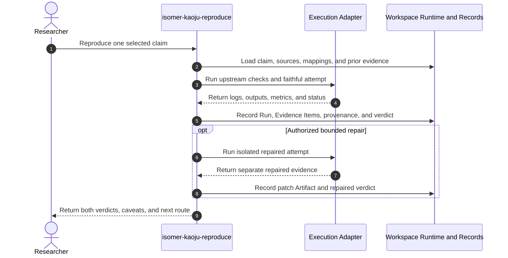

# Use Case 04: Reproduce a Published Claim with First-Hand Runs

## Actor Goal

As a researcher, I want Kaoju to run a bounded first-hand reproduction of one published or implementation claim, so that I can distinguish reported behavior from what executed in the current environment and preserve faithful and repaired attempts separately.

## Use Case

The researcher selects one claim and its mapped implementation, such as a test claim, supported configuration, accuracy result, latency result, memory result, or model compatibility statement. Kaoju fixes a reproduction contract, verifies the source and environment, runs upstream checks and the claim-bearing procedure, records complete Run evidence, and issues a conservative verdict. When an upstream-faithful attempt fails, an isolated repair may follow, but the repaired Run never overwrites the faithful result.

## Supported Actions

### Run an Upstream-Faithful Reproduction

The researcher asks Kaoju to execute the implementation as close as possible to the identified source contract.

- context
  - Actor **has** a selected Research Claim, exact source and implementation identity, and an inspectable reproduction candidate.
  - System **has** a prepared Topic Workspace, execution capability, environment facts, bounded-run guidance, and Run recording.
- intent
  - Actor **wants** direct evidence of whether the upstream claim holds under declared conditions or an explicitly documented adaptation.
  - Actor **wonders** "Can the published command, test, or benchmark produce the claimed behavior here?"
- action
  - Actor then **asks** the system to reproduce the claim with an upstream-faithful attempt.
- result
  - Actor **gets** a reproduction contract, environment and hardware record, commands, configs, logs, outputs, measurements, deviations, and a faithful verdict of supported, contradicted, partial, inconclusive, or blocked.

### Diagnose and Run an Isolated Repair

The researcher permits a bounded repair after a faithful attempt fails or cannot run.

- context
  - Actor **has** a failed or blocked faithful Run with preserved last-known-good state and an identified repair hypothesis.
  - System **has** isolated writable materialization, patch Artifact recording, and a rule that repaired evidence remains distinct.
- intent
  - Actor **wants** to learn whether a minimal environment or implementation repair makes the claim executable without rewriting history.
  - Actor **wonders** "Is this a source defect, version drift, environment incompatibility, or evidence that the claim no longer holds?"
- action
  - Actor then **asks** the system to apply one bounded repair and rerun the relevant check.
- result
  - Actor **gets** a separate repaired Run, patch or adaptation Artifact, changed assumptions, observed result, and a verdict that does not replace the upstream-faithful verdict.

## Main Flow

1. `isomer-kaoju-reproduce` loads the selected claim, Claim-Evidence Ledger row, source identities, mapped code and evaluator paths, and acquisition manifest.
2. The skill defines a Reproduction Contract with claim scope, expected result, input, dataset split, metric, tolerance, hardware, software, source revision, commands, output requirements, stop conditions, and permitted adaptations.
3. The skill verifies environment, package, backend, model, dataset, credential, license, disk, memory, and compute readiness; missing mutation routes to the owning operator or service skill.
4. The skill runs the smallest relevant upstream tests or smoke checks to verify command path and output schema without calling smoke success a reproduction result.
5. The skill executes the real bounded attempt and records commands, environment, configs, inputs, seeds, logs, outputs, metrics, duration, resource use, and failure state as a Run with Provenance Records.
6. The skill compares the observed result with the source claim under the declared tolerance and records execution fidelity as `upstream-faithful`.
7. If authorized and useful, the skill diagnoses one bounded repair, creates an isolated writable materialization, records the patch or adaptation Artifact, and executes a separate Run marked `adapted` or `repaired`.
8. The skill advances verification depth to `executed` or `reproduced` only when the corresponding evidence exists and records the evidence verdict separately.
9. The researcher receives faithful and repaired verdicts, evidence refs, deviations, blockers, and the next route to comparison, audit, more acquisition, or stop.

## Alternative And Exception Flows

- If the exact hardware or dataset is unavailable, Kaoju may run an explicitly adapted procedure but cannot call it a faithful reproduction.
- If only upstream tests pass, the claim advances to `executed`; it advances to `reproduced` only when the claim-bearing result and conditions are checked.
- If a Run is queued or still active, the skill reports running state and a resume point rather than a completed result.
- If the source repository is dirty or modified, the skill records the state and requires a clean pinned materialization for a faithful attempt.
- If a repair would change the algorithm, evaluator, dataset, or comparison meaning, the skill records a blocker or routes to a different Research Task instead of labeling it a repair.
- Failed, crashed, timed-out, and non-finite Runs remain durable evidence and are not deleted from the dossier.

## Mermaid Flow Diagram

## Mermaid Sequence Diagram

## Durable Outputs

- Reproduction Contract and readiness evidence.
- Environment, hardware, package, model, dataset, and source identity records.
- Smoke Check Record when needed.
- Upstream-faithful Run with commands, configs, logs, outputs, metrics, and failure state.
- Optional patch or adaptation Artifact and separate repaired Run.
- Reproduction Verdict with verification depth, evidence verdict, execution fidelity, deviations, and exact refs.
- Updated Claim-Evidence Ledger, Evidence Items, Provenance Records, and blocker or route Decision Record.

## Example Prompt And Expected AI Response

### Event 001: Reproduce a Latency Claim

> Time: `2026-07-10T12:00:00Z` · Session: `Kaoju reproduction pass on a prepared GPU Topic Workspace`

User Prompt:

> Use `$isomer-kaoju-reproduce` to reproduce repository A's batch-1 latency claim on the available GPU. Run its upstream tests first. If the faithful run fails because of version drift, propose one minimal repair and keep the repaired result separate.

AI:

> The agent reports the reproduction contract and readiness before the main Run. It then returns the pinned source and environment, upstream-test status, faithful commands and evidence, observed versus reported result, deviations, faithful verdict, and, only if authorized, a separate patch Artifact and repaired verdict. It does not promote a test pass or repaired Run into a faithful reproduction claim.

## Assumptions And Open Questions

- One reproduction invocation owns one claim-bearing procedure. Multiple unrelated claims should become separate Research Tasks or explicit sibling Runs under a shared generation group.
- Hardware substitution rules belong in the Reproduction Contract and cannot be inferred from similar product names.
