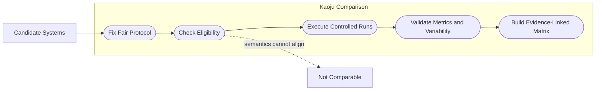
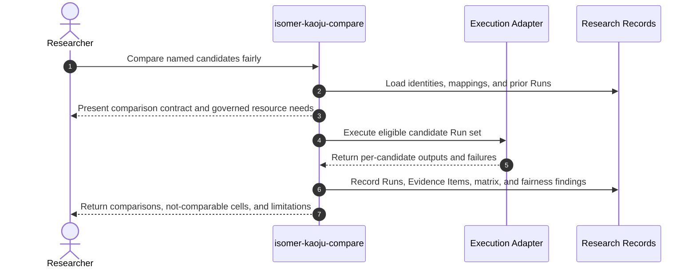

# Use Case 05: Compare Existing Implementations Under a Fair Protocol

## Actor Goal

As a researcher, I want Kaoju to compare existing implementations under one explicit and reviewable protocol, so that numeric rankings reflect controlled first-hand evidence and invalid normalization is reported as not comparable.

## Use Case

The researcher selects two or more existing systems and a comparison question. Kaoju checks that each candidate has stable source identity and a runnable path, defines common and candidate-specific conditions, records necessary adaptations, executes bounded repeated Runs, calculates uncertainty or variability appropriate to the metric, and produces a comparison matrix whose cells link to exact evidence. The comparison refuses to force a ranking when systems differ in task, quality, evaluator, unsupported configuration, or required semantics.

## Supported Actions

### Define a Fair Comparison Contract

The researcher asks Kaoju to make comparability assumptions and deviations explicit before running candidates.

- context
  - Actor **has** named candidates, a comparison question, and inspected or reproduced execution paths.
  - System **has** candidate source identities, claim mappings, environment facts, and comparison-contract guidance.
- intent
  - Actor **wants** shared task, input, hardware, software, metric, warmup, repetition, tolerance, and quality conditions plus visible candidate exceptions.
  - Actor **wonders** "Can these systems answer the same question without changing what one of them is designed to do?"
- action
  - Actor then **asks** the system to define a fair comparison protocol.
- result
  - Actor **gets** a Comparison Contract, candidate eligibility table, normalization rules, adaptation disclosures, stop conditions, resource envelope, and pre-run comparability verdicts.

### Execute and Interpret the Candidate Run Set

The researcher asks Kaoju to run eligible candidates and construct an evidence-linked comparison.

- context
  - Actor **has** an accepted Comparison Contract and authorized resource envelope.
  - System **has** executable candidate paths, bounded-run capability, Run recording, and statistical or validity checks appropriate to the metrics.
- intent
  - Actor **wants** repeated first-hand measurements and a ranking only where evidence supports one.
  - Actor **wonders** "Which system performs best under the shared protocol, how variable is the result, and which cells are not genuinely comparable?"
- action
  - Actor then **asks** the system to execute the comparative study.
- result
  - Actor **gets** per-candidate Runs, observed measurements, uncertainty or variability, failure evidence, adaptation disclosures, a Comparison Matrix, fairness findings, and supported or not-comparable verdicts.

## Main Flow

1. `isomer-kaoju-compare` loads the selected candidates, source and material identities, Claim-Evidence Ledger, reproduction evidence, and resource constraints.
2. The skill states the comparison question and freezes required task semantics, inputs, datasets and splits, evaluator logic, metric ids and directions, quality constraints, hardware, software, precision, warmups, repetitions, seeds, and tolerances.
3. The skill records candidate-specific build steps, unsupported conditions, unavoidable adaptations, and whether each adaptation preserves the comparison meaning.
4. Candidates that cannot satisfy the shared contract receive an explicit `not-comparable` or blocked pre-run status instead of silent parameter substitution.
5. The skill runs eligible candidates through the same controlled schedule where order effects, cache state, thermal state, and shared-resource interference matter.
6. Each attempt becomes a Run with exact command, config, input, environment, logs, outputs, measurements, status, and Provenance Records.
7. The skill checks required metrics for finite values, schema validity, repeatability, variability, quality constraints, and traceability to raw outputs.
8. The skill constructs a Comparison Matrix whose cells cite Run and Evidence Item refs and keep reported source values separate from observed values.
9. The skill records comparison verdicts per claim and candidate pair, including supported, contradicted, partial, inconclusive, blocked, and not comparable.
10. The researcher receives the matrix, fairness findings, limitations, and route to audit, targeted reproduction, or acquisition of missing evidence.

## Alternative And Exception Flows

- If candidates use different tasks, dataset splits, quality targets, or evaluator definitions, Kaoju separates them into different comparison strata or returns `not comparable`.
- If one candidate requires a patch, the matrix exposes the patch and execution fidelity rather than presenting it as an unmodified system.
- If one candidate fails after others complete, the failure remains in the Run set; Kaoju does not drop the candidate without recording why.
- If resource limits prevent the declared repetition count, the result is partial or inconclusive and reports the achieved evidence level.
- If hardware is shared with uncontrolled workloads or thermal state cannot be stabilized, the skill records the validity risk and may block strong performance claims.
- If a later audit finds unfair normalization, the Comparison Matrix is revised through record lineage rather than edited invisibly.

## Mermaid Flow Diagram

## Mermaid Sequence Diagram

## Durable Outputs

- Comparison Contract and candidate eligibility table.
- Resource envelope, schedule, normalization rules, and adaptation disclosures.
- Per-candidate Run records with raw-output and Provenance refs.
- Metric validation, repeatability, variability, and quality-constraint records.
- Evidence-linked Comparison Matrix with separate reported and observed values.
- Fairness Findings and per-claim comparability and evidence verdicts.
- Updated Claim-Evidence Ledger and next-route or blocker Decision Record.

## Example Prompt And Expected AI Response

### Event 001: Compare Three Kernel Implementations

> Time: `2026-07-10T13:00:00Z` · Session: `Kaoju comparative pass with an eight GPU-hour budget`

User Prompt:

> Use `$isomer-kaoju-compare` to compare repositories A, B, and C for latency and peak memory on the same model shapes. Preserve each system's required quality constraint, use repeated Runs, disclose patches, and report `not comparable` where normalization would distort a system.

AI:

> The agent first returns the proposed Comparison Contract, eligibility decisions, adaptations, schedule, repetitions, metrics, quality checks, and resource requirement. After execution it returns evidence-linked per-candidate Runs, observed values and variability, failures, patch disclosures, comparison cells and verdicts, and explicit not-comparable results. It does not force a total ranking from semantically different measurements.

## Assumptions And Open Questions

- The comparison method should choose statistical summaries appropriate to the measurement rather than mandate one significance test for every domain.
- Comparison terminal status and evidence verdict remain separate: a pipeline may complete while some candidate pairs correctly end as `not-comparable`.
