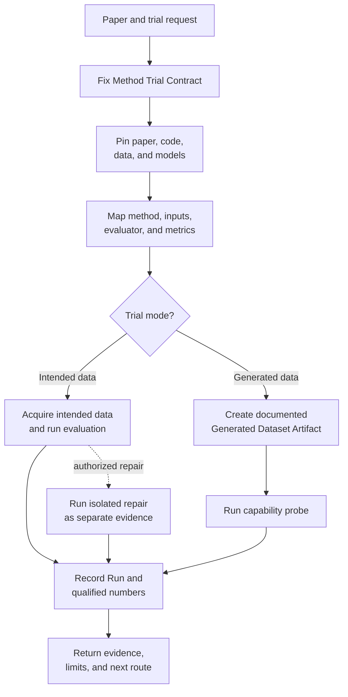
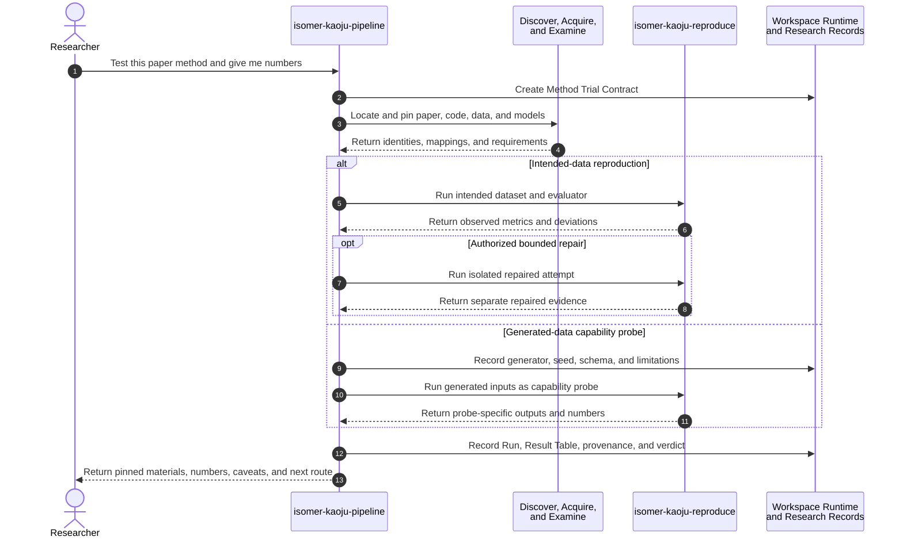

# Use Case 05: Test a Paper Method with Real or Generated Data

## Actor Goal

As a researcher, I want Kaoju to obtain a paper's implementation and run it on either its intended dataset or explicitly generated data, so that I receive first-hand numbers and can judge whether a deeper reproduction study is worthwhile.

## Use Case

The researcher identifies a paper and asks Kaoju to get the relevant source code, obtain the required dataset and model dependencies, run the method, and report observed numbers. On intended data, Kaoju attempts the claim-bearing procedure under the closest feasible reported conditions and preserves any later repair as separate evidence. The researcher may instead request a lightweight capability probe when the real dataset is too large, restricted, costly, or unnecessary for initial understanding. Kaoju then generates a documented input dataset that exercises the method's declared input contract, runs the implementation, and labels every resulting number as probe-specific rather than as reproduction of the paper's benchmark claim.

## Supported Actions

### Run the Method on Its Intended Data

The researcher asks Kaoju to execute a paper method under the closest feasible version of its reported evaluation conditions.

- context
  - Actor **has** a paper, technical report, title, URL, DOI, or another stable reference to the method of interest.
  - System **has** discovery, acquisition, paper-to-code examination, bounded execution, and Run-recording capabilities.
- intent
  - Actor **wants** the implementation, dataset, dependencies, commands, and first-hand numeric results needed to assess the reported method.
  - Actor **wonders** "Can I run this paper's method, and what numbers does it produce in the available environment?"
- action
  - Actor then **asks** the system to find and acquire the method's source code and intended dataset, execute the relevant procedure, and report observed numbers.
- result
  - Actor **gets** pinned source and data identities, a declared execution contract, environment and command records, first-hand metrics linked to a Run, deviations from the paper, and a calibrated reproduction verdict when the conditions support one.

### Run a Lightweight Capability Probe

The researcher asks Kaoju to avoid a large or inaccessible dataset and use generated inputs to obtain an initial operational view of the method.

- context
  - Actor **has** a paper method they want to inspect and an explicit preference for a lightweight generated-data trial rather than a benchmark reproduction.
  - System **has** an inspectable input contract, the method's source code or a disclosed substitute implementation, and the ability to create a versioned Generated Dataset Artifact.
- intent
  - Actor **wants** rough first-hand evidence of what the implementation can execute and produce without paying the cost of the intended dataset.
  - Actor **wonders** "Can you run the core method on small generated data so I can see its outputs, runtime behavior, and rough metric values?"
- action
  - Actor then **asks** the system to acquire the source code, generate a small documented input dataset, run the method, and return clearly qualified numbers.
- result
  - Actor **gets** the pinned source, generator and seed, generated-data schema and limitations, commands, outputs, resource measurements, method-defined metrics when meaningful, and a capability-probe result that is not presented as paper reproduction or benchmark performance.

### Diagnose a Failed Intended-Data Attempt

The researcher permits one bounded repair after the upstream-faithful method run fails or is blocked.

- context
  - Actor **has** a failed or blocked intended-data Run with preserved logs, environment, source identity, and last-known-good state.
  - System **has** an isolated writable materialization, patch Artifact recording, and a rule that repaired evidence cannot replace faithful evidence.
- intent
  - Actor **wants** to determine whether a minimal source or environment repair makes the method executable without rewriting the original result.
  - Actor **wonders** "Did the paper method fail because of version drift or environment incompatibility, and does one minimal repair change the outcome?"
- action
  - Actor then **asks** the system to diagnose and try one bounded repair.
- result
  - Actor **gets** a separate repaired Run, patch or adaptation Artifact, changed assumptions, observed result, and verdict alongside the preserved upstream-faithful result.

## Main Flow

1. The researcher identifies the paper and requests a `method-trial-pass`, selecting intended-data reproduction or a generated-data capability probe through plain-language constraints.
2. `isomer-kaoju-frame` creates a Method Trial Contract that fixes the target method, trial mode, requested numbers, source boundary, resource envelope, permitted adaptations, stop conditions, and the claim strength allowed for the result.
3. `isomer-kaoju-discover` locates the paper or technical report, candidate source code repositories, intended datasets, required models, and execution documentation.
4. `isomer-kaoju-acquire` checks the Topic Dataset Manifest before downloading data, pins the selected repository revision, and obtains or records identities for only the remaining data and model material required by the selected mode.
5. `isomer-kaoju-examine` confirms the paper-to-code relationship, locates the method entry point, input schema, evaluator, metric definitions, reference configuration, and expected outputs.
6. The pipeline estimates download, storage, memory, compute, credential, and license requirements before expensive acquisition or execution.
7. For an intended-data run, `isomer-kaoju-reproduce` fixes the claim-bearing expected result, tolerance, dataset and split, metric, source revision, hardware and software conditions, commands, outputs, stop conditions, and permitted adaptations within the Method Trial Contract.
8. The skill runs only the smallest necessary upstream checks before the claim-bearing procedure. A passing smoke check establishes command and output-path viability but does not establish reproduction.
9. The skill executes the upstream-faithful evaluation with the closest feasible reported dataset, split, configuration, and evaluator, records all deviations, and assigns execution fidelity `upstream-faithful`.
10. If the faithful route fails and the researcher authorizes repair, Kaoju diagnoses one bounded repair in an isolated writable materialization, records the patch or adaptation Artifact, and executes a separate Run marked `adapted` or `repaired` without replacing the faithful result.
11. For a capability probe, the skill creates a Generated Dataset Artifact with generator source, schema, size, distribution assumptions, seeds, checks, and known semantic gaps, then executes the method with `run_purpose: capability-probe` and `input_basis: generated`.
12. The skill records commands, environment, inputs, configs, seeds, logs, outputs, metrics, units, duration, resource use, and failure state for every Run with Provenance Records.
13. The skill emits a Result Table in which every observed number links to its Run and conditions. Paper-reported, upstream-faithful, repaired, and probe-specific values remain separate.
14. The intended-data route may issue a reproduction verdict when the execution contract justifies it. The generated-data route stops at verification depth `executed` and describes only probe-specific behavior, limitations, and whether a deeper run appears useful.
15. The researcher receives the source, material and Run refs, observed numbers, failures or caveats, and a route to stop, acquire the real dataset, or perform controlled comparison.

## Alternative And Exception Flows

- If the intended dataset exceeds the resource envelope, Kaoju reports its identity, estimated size and requirements, preserves the blocked intended-data route, and offers a generated-data capability probe rather than silently substituting inputs.
- If the dataset is restricted, private, or license-incompatible, Kaoju records the access blocker. Generated data may support a capability probe only when it can exercise the public input contract without reconstructing protected data.
- If no official source repository is available, Kaoju may use a clearly disclosed third-party implementation after recording the weaker paper-to-code relationship.
- If required pretrained model weights are large, unavailable, or incompatible with generated inputs, the probe records the substitution or stops; it does not invent capability evidence from an unrelated model.
- If generated data cannot represent the task's semantics, distribution, labels, scale, or evaluator assumptions, Kaoju limits the output to execution behavior and resource measurements or records the probe as inconclusive.
- If a method-defined metric is meaningless on generated data, Kaoju omits that metric and reports concrete outputs, invariants, runtime, memory, throughput, or failure behavior instead of manufacturing a score.
- If the implementation fails, times out, produces non-finite values, or violates its declared output schema, the failed Run remains durable evidence with logs and a bounded diagnosis route.
- If an adaptation changes the algorithm or evaluator, Kaoju records it separately and does not compare its numbers directly with the paper's reported values.
- If the selected repository is dirty or its paper-matching revision is unclear, Kaoju requires a clean pinned materialization before assigning `upstream-faithful` execution fidelity.
- If a repair changes the algorithm, dataset semantics, evaluator, or claim meaning, Kaoju records a blocker or a distinct adapted study instead of labeling the result a repair.
- Failed, crashed, timed-out, and non-finite faithful or repaired Runs remain durable survey evidence and are not removed when a later attempt succeeds.

## Mermaid Flow Diagram

## Mermaid Sequence Diagram

## Durable Outputs

- Method Trial Contract with target method, `run_purpose`, input basis, requested numbers, resource envelope, and permitted claim strength.
- Stable identities for the paper or technical report, source repository revision, intended dataset, required models, and execution documentation.
- Paper-Code Mapping and located input, evaluator, metric, config, and output contracts.
- Material Manifest with sizes, hashes, licenses, access status, and acquisition decisions.
- Intended dataset record or Generated Dataset Artifact with generator source, version, schema, seed, size, assumptions, validation checks, and limitations.
- Environment and hardware record plus commands, configs, logs, outputs, metrics, duration, and resource use for every Run.
- Result Table that separates paper-reported values from first-hand observed values and links every observed number to its Run and conditions.
- Reproduction Verdict for a qualifying intended-data run or Capability Probe Finding with verification depth `executed` for a generated-data run.
- Preserved upstream-faithful Run and verdict plus an optional patch or adaptation Artifact and separate repaired Run and verdict.
- Updated Claim-Evidence Ledger, Evidence Items, Provenance Records, blockers, and route Decision Record.

## Example Prompt And Expected AI Response

### Event 001: Run the Paper Method on Its Dataset

> Time: `2026-07-10T18:00:00Z` · Session: `Kaoju method trial in a prepared Topic Workspace`

User Prompt:

> I would like to test the method described in this paper. Get its source code and dataset, run it, and give me the numbers.

AI:

> The agent identifies and pins the paper, implementation, dataset, model dependencies, evaluator, and reported configuration before expensive work. It returns the executed commands and environment, first-hand Result Table, paper-versus-observed values when comparable, deviations, Run refs, and a conservative reproduction verdict or blocker. If an authorized repair follows a faithful failure, the response preserves both outcomes and links the patch rather than replacing the faithful evidence.

### Event 002: Run a Generated-Data Capability Probe

> Time: `2026-07-10T18:30:00Z` · Session: `Resource-limited Kaoju method trial`

User Prompt:

> The dataset is too large to download. Get the source code and use some generated data. I only want a rough idea of what the proposed method is capable of.

AI:

> The agent pins and examines the implementation, states which real-data semantics the probe cannot represent, and creates a Generated Dataset Artifact with generator source, schema, size, checks, and seeds. It runs the method, returns concrete outputs and meaningful first-hand numbers with Run refs, labels them as capability-probe results, and does not compare them directly with the paper's benchmark values.

## Assumptions And Open Questions

- Generated data is a user-authorized input substitution for exercising the method, not a substitute for the paper's evaluation dataset.
- A capability probe may support claims about successful execution, output shape, invariants, failure behavior, and measured resource use under its declared conditions. It does not support claims about benchmark quality or real-data generalization.
- The first implementation may use the existing `isomer-kaoju-reproduce` execution owner for both routes, provided the contract and result preserve `run_purpose` and input basis explicitly.
