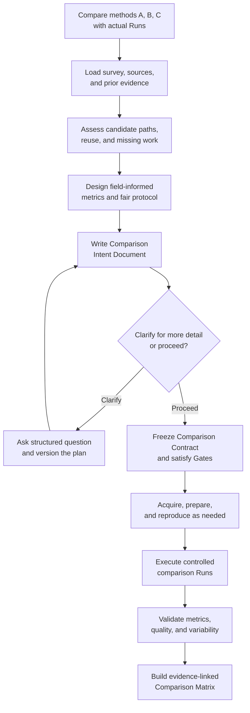
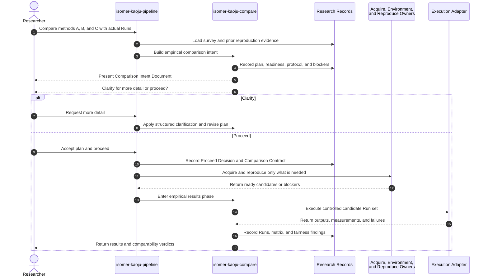

# Use Case 06: Compare Methods with Actual Runs

## Actor Goal

As a researcher, I want Kaoju to plan and execute an empirical comparison of methods A, B, and C, so that I can review the protocol before spending resources and receive fair first-hand numbers with explicit uncertainty and comparability limits.

## Use Case

The researcher asks Kaoju to compare named methods through actual Runs. Kaoju first creates a Comparison Intent Document within the survey artifacts. It records what the researcher wants, derives a field-appropriate comparison protocol, identifies how each method can be run, inventories code, data, model, environment, and hardware needs, checks whether earlier reproductions remain reusable, and states when reproduction or reimplementation is required. The agent presents the plan and waits for the researcher to clarify it or proceed. After an accepted Proceed Decision, the same use case prepares eligible candidates, executes controlled repeated Runs, validates the measurements, and produces an evidence-linked Comparison Matrix without forcing invalid rankings.

## Supported Actions

### Request an Empirical Comparison Plan

The researcher names methods and asks for a comparison based on first-hand Runs.

- context
  - Actor **has** two or more named methods, works, implementations, repositories, or survey entries and an empirical comparison goal.
  - System **has** the active survey context, source identity records, prior Kaoju evidence when available, and field-oriented framing and comparison guidance.
- intent
  - Actor **wants** a concrete plan for obtaining defensible comparative numbers instead of immediate ad hoc execution.
  - Actor **wonders** "What exactly should we compare, how will each method run, and what must be prepared before the numbers mean anything?"
- action
  - Actor then **asks** the system to compare methods A, B, and C with actual Runs.
- result
  - Actor **gets** an empirical-comparison intent phase that blocks candidate preparation and Runs until a reviewable Comparison Intent Document is presented and accepted.

### Review Candidate Readiness and Field-Informed Protocol

The researcher reviews Kaoju's judgment about each method and the common comparison basis.

- context
  - Actor **has** a named candidate set and an existing survey or enough source context to identify the field and intended question.
  - System **has** candidate source identities, available documentation and code evidence, prior Run and reproduction records, and metric and benchmark context from the field.
- intent
  - Actor **wants** to see what can be reused, what must be downloaded or built, which methods need reproduction or reimplementation, and why the proposed metrics are suitable.
  - Actor **wonders** "Did we already reproduce any candidate, can that evidence be reused fairly, and which datasets, environments, commands, metrics, and repetitions will the comparison require?"
- action
  - Actor then **asks** the system to present the Comparison Intent Document and its candidate readiness and protocol judgments.
- result
  - Actor **gets** a source-backed plan with per-candidate readiness, dependencies, run paths, evidence reuse decisions, missing work, common and candidate-specific conditions, metrics, statistics, fairness risks, resources, Gates, and unresolved details.

### Clarify the Plan or Proceed

The researcher decides whether the plan needs more detail or is ready to become the executable comparison basis.

- context
  - Actor **has** a versioned Comparison Intent Document with visible judgments, assumptions, blockers, and preparation routes.
  - System **has** the clarification-first interaction from UC-08, a draft Comparison Contract, and readiness and Gate information.
- intent
  - Actor **wants** control over the final protocol before expensive downloads, environment changes, reproduction, reimplementation, or comparison Runs begin.
  - Actor **wonders** "Should I refine the plan further, or does it contain enough detail to start preparing and running the candidates?"
- action
  - Actor then **asks** the system to clarify for more detail or proceed.
- result
  - Actor **gets** either structured clarification that versions the intent document or an accepted Proceed Decision, finalized Comparison Contract, and handoff to candidate preparation and empirical comparison.

### Execute and Interpret the Accepted Comparison

The researcher proceeds with the reviewed protocol and asks Kaoju to produce the comparative numbers.

- context
  - Actor **has** an accepted Comparison Intent Document, Proceed Decision, Comparison Contract, and authorized resource envelope.
  - System **has** stable candidate identities, prepared or reproducible run paths, bounded execution, Run recording, and metric-validity checks appropriate to the field.
- intent
  - Actor **wants** controlled repeated measurements and a ranking only where the evidence supports one.
  - Actor **wonders** "Which method performs best under the accepted protocol, how variable are the results, and which comparisons are not genuinely comparable?"
- action
  - Actor then **asks** the system to prepare eligible candidates, execute the comparative study, and interpret the results.
- result
  - Actor **gets** per-candidate Runs, observed measurements, uncertainty or variability, failure evidence, adaptation disclosures, an evidence-linked Comparison Matrix, fairness findings, and supported, inconclusive, blocked, or not-comparable verdicts.

## Main Flow

1. The researcher requests an actual-run comparison of named methods A, B, C, and any additional candidates.
2. `isomer-kaoju-pipeline` selects `comparative-pass` with `comparison_mode: empirical` and `comparison_phase: intent`, preserving the original request and blocking candidate preparation and research Runs.
3. The pipeline loads the Related-Work Catalog, Field Summary, Theory Comparison Artifacts, Claim-Evidence Ledger, Paper-Code Mappings, Material Manifests, prior Comparison Intent Documents, Reproduction Verdicts, Runs, environment records, and current resource constraints.
4. `isomer-kaoju-frame` resolves stable candidate identities and separates the user's requested outcome, preferred constraints, and success criteria from Kaoju's proposed judgments.
5. `isomer-kaoju-compare` derives the comparison question and candidate eligibility dimensions from the field's task semantics, established benchmarks, reported claims, known quality constraints, and survey evidence. When field context is weak, `isomer-kaoju-discover` performs bounded non-mutating source discovery and records the resulting metric or benchmark basis before protocol finalization.
6. For each candidate, the skill identifies the authoritative or selected implementation, pinned revision when known, documented run path, entry points, configs, evaluators, expected outputs, build steps, and known adaptations. Unverified details remain marked `proposed` or `unresolved`.
7. The skill inventories prior evidence and classifies each candidate as `reusable`, `needs-reproduction`, `needs-repair`, `needs-reimplementation`, `blocked`, or `unresolved` for this comparison.
8. A previous reproduction becomes `reusable` only when its source revision, dataset or input, evaluator, metric definitions, environment, hardware relevance, configuration, and lineage satisfy the new comparison intent. Otherwise the document explains why it is stale or insufficient.
9. When no adequate implementation exists, Kaoju may propose a bounded reimplementation with its own source basis, acceptance tests, Artifact identity, estimated effort, and weaker fidelity status. It never silently presents the reimplementation as the published implementation.
10. The skill queries the Topic Dataset Manifest, validates potentially compatible registrations, and creates an acquisition inventory for only the remaining code repositories, datasets, models, checkpoints, benchmark specifications, system packages, credentials, and licenses, including known locators, revisions, sizes, access conditions, and Gates.
11. The skill proposes a candidate environment plan covering operating system, language and package versions, accelerator stack, hardware class, precision, build tools, isolation, storage, memory, and reproducibility requirements.
12. The skill defines the shared datasets, splits, inputs, preprocessing, evaluator, metrics, units, optimization directions, quality constraints, tolerances, seeds, warmups, repetitions, uncertainty summaries, and raw outputs required for each comparison claim.
13. Kaoju records candidate-specific deviations and decides whether they preserve the comparison meaning, require separate comparison strata, or make a candidate or metric `not-comparable`.
14. The skill estimates download volume, disk use, setup effort, compute and accelerator time, human review points, credential needs, and stop conditions. It lists every required policy or resource Gate.
15. `isomer-kaoju-compare` writes the Comparison Intent Document as a survey Artifact. Each section distinguishes `user-requested`, `agent-proposed`, `accepted-evidence`, `unresolved`, and `blocked` content and links judgments to source or prior-Run refs.
16. The agent presents the plan with its candidate readiness matrix, acquisition and environment plan, reproduction or reimplementation routes, metrics and run protocol, fairness risks, resource estimate, Gates, and open decisions.
17. The agent asks exactly: `Do you want to clarify for more detail, or proceed?`
18. If the researcher chooses clarification, the pipeline applies UC-08's A/B/C/D interaction to the highest-impact unresolved detail, versions the Comparison Intent Document, and presents the updated plan again.
19. If the researcher chooses proceed, the pipeline lists accepted decisions and assumptions, verifies non-bypassable Gates, records the Proceed Decision, and freezes the executable Comparison Contract.
20. The accepted preparation route acquires required materials, prepares environments, reuses valid prior reproductions, and invokes `isomer-kaoju-reproduce` for candidates that require faithful reproduction, isolated repair, or clearly separated reimplementation evidence.
21. If preparation changes candidate eligibility, metric meaning, fairness, or resource cost materially, Kaoju versions and re-presents the Comparison Intent Document before the affected Runs begin.
22. `isomer-kaoju-compare` enters `comparison_phase: results`, reloads the accepted intent and contract, and freezes task semantics, inputs, datasets and splits, evaluator logic, metric ids and directions, quality constraints, hardware, software, precision, warmups, repetitions, seeds, tolerances, and stop conditions.
23. The skill records candidate-specific build steps, unsupported conditions, unavoidable adaptations, and whether each adaptation preserves the comparison meaning. Candidates that cannot satisfy the contract receive a pre-run `not-comparable` or blocked status instead of silent substitution.
24. The skill runs eligible candidates through the controlled schedule, accounting for order effects, cache state, thermal state, and shared-resource interference where these affect validity.
25. Each attempt becomes a Run with exact command, config, input, environment, logs, outputs, measurements, status, failure state, and Provenance Records.
26. The skill checks metrics for finite values, schema validity, repeatability, variability, quality constraints, and traceability to raw outputs.
27. The skill constructs a Comparison Matrix whose cells cite Run and Evidence Item refs and keep reported source values separate from observed values.
28. The skill records verdicts per comparison claim and candidate pair, including `supported`, `contradicted`, `partial`, `inconclusive`, `blocked`, and `not-comparable`.
29. The researcher receives the Comparison Matrix, fairness findings, limitations, survey artifact refs, and any bounded follow-up route.

## Alternative And Exception Flows

- If a candidate name is ambiguous, the document lists candidate identities and blocks protocol finalization until the target resolves to a stable work, method, or implementation version.
- If the methods solve different tasks or preserve different quality semantics, Kaoju proposes explicit strata or a `not-comparable` outcome instead of designing one misleading benchmark.
- If the field lacks an accepted benchmark or metric, Kaoju proposes a source-backed evaluation basis and marks the choice for user clarification rather than inventing a standard.
- If earlier Runs exist but lack compatible source, data, evaluator, metric, environment, or lineage evidence, Kaoju records them as context but not reusable comparison evidence.
- If a candidate needs only a small compatibility repair, Kaoju keeps the upstream-faithful attempt and proposed repaired route separate.
- If a candidate lacks runnable code, Kaoju may propose reimplementation, exclusion, source-only analysis, or a blocked comparison cell. The user sees the fidelity and cost trade-off before proceeding.
- If a dataset, model, or environment requirement is too large or restricted, the intent document records the blocker and proposes a fair scope reduction only when it preserves the comparison question.
- If exact commands cannot be established from available sources, the document labels them unresolved and schedules acquisition or examination before promising a Run.
- If the researcher proceeds while a required credential, license, safety, authority, resource, or semantic Gate remains unresolved, Kaoju records the Proceed Decision but pauses the pass at that Gate.
- If acquisition, environment verification, or reproduction reveals a material change to candidate eligibility, metrics, fairness, or resource cost, Kaoju versions and re-presents the Comparison Intent Document before affected comparison Runs start.
- If the researcher cancels after reviewing the plan, the Comparison Intent Document remains a survey artifact with a stopped Decision Record and a possible resume path.
- If one candidate fails after others complete, the failure remains in the Run set; Kaoju does not remove the candidate or rerun only favorable conditions without recording the decision.
- If resource limits prevent the declared repetition count, the affected result remains partial or inconclusive and reports the achieved evidence level.
- If hardware is shared with uncontrolled workloads or thermal state cannot be stabilized, Kaoju records the validity risk and may block strong performance conclusions.
- If a later audit finds unfair normalization, the Comparison Matrix receives a lineage-linked revision rather than an invisible edit.

## Required Comparison Intent Contents

- User request, intended decision, candidate set, and success criteria.
- Field-informed comparison question, dimensions, metric rationale, and known benchmark context.
- Candidate readiness matrix with source identity, implementation authority, run path, reproduction status, prior evidence, reuse or staleness decision, and blocker status.
- Acquisition inventory for code, datasets, models, checkpoints, specifications, packages, credentials, licenses, sizes, and locators.
- Environment and hardware plan for every candidate and the shared comparison context.
- Dataset, split, input, preprocessing, evaluator, metric, unit, direction, quality, tolerance, seed, warmup, repetition, statistics, and raw-output contract.
- Proposed reproduction, repair, reimplementation, exclusion, or not-comparable route per candidate.
- Fairness risks, candidate-specific deviations, comparison strata, and unsupported assumptions.
- Resource estimate, Gates, stopping criteria, unresolved details, and intended next step.

## Mermaid Flow Diagram

## Mermaid Sequence Diagram

## Durable Outputs

- Versioned Comparison Intent Document stored with the survey artifacts.
- Stable candidate identities and candidate readiness matrix.
- Field-informed comparison dimensions, metric rationale, evaluator and dataset basis, and candidate eligibility findings.
- Prior reproduction reuse and staleness decisions with exact source, Run, environment, and lineage refs.
- Acquisition inventory and Material Manifest targets for code, datasets, models, checkpoints, packages, credentials, and specifications.
- Environment, hardware, build, isolation, and resource plan.
- Proposed reproduction, repair, reimplementation, exclusion, and not-comparable routes with fidelity boundaries.
- Clarification Records, intent-document revisions, accepted assumptions, Proceed or Stop Decision Record, and Gate status.
- Finalized Comparison Contract, candidate eligibility table, normalization rules, adaptation disclosures, schedule, and resource envelope.
- Per-candidate Run records with commands, configs, raw outputs, failures, measurements, environment facts, and Provenance refs.
- Metric-validation, repeatability, variability, and quality-constraint records.
- Evidence-linked Comparison Matrix with separate reported and observed values.
- Fairness Findings, per-claim evidence and comparability verdicts, updated Claim-Evidence Ledger, and next-route or blocker Decision Record.

## Example Prompt And Expected AI Response

### Event 001: Compare Three Methods Empirically

> Time: `2026-07-10T22:00:00Z` · Session: `Kaoju empirical comparison intent phase`

User Prompt:

> I want to compare methods A, B, and C with actual runs.

AI:

> The agent first creates and presents a Comparison Intent Document. It restates the user's intended decision, identifies each method and runnable implementation, checks prior reproduction evidence for reuse or staleness, lists required code, datasets, models, environments, hardware, downloads, and Gates, and proposes field-appropriate metrics and a fair run protocol with rationale. It marks unresolved commands or comparability risks explicitly, then asks, “Do you want to clarify for more detail, or proceed?” No candidate preparation or research Run begins before the user proceeds. After the user proceeds, the agent prepares eligible candidates, executes repeated controlled Runs, preserves failures and adaptations, and returns the evidence-linked Comparison Matrix, variability, fairness findings, and explicit `not-comparable` cells.

## Assumptions And Open Questions

- The Comparison Intent Document is a survey artifact and remains useful even when the researcher cancels or the empirical comparison is blocked.
- The document is not the executable Comparison Contract. Proceeding accepts it as the basis from which Kaoju freezes the contract after remaining readiness and Gate checks.
- “Actual Runs” means first-hand candidate execution under a declared common or stratified protocol. Reported paper numbers may appear as context but cannot replace the planned Run evidence.
