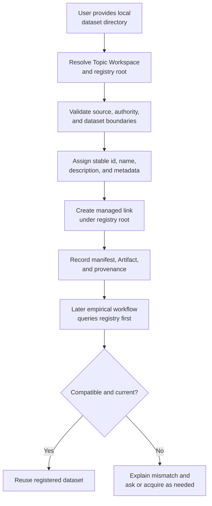
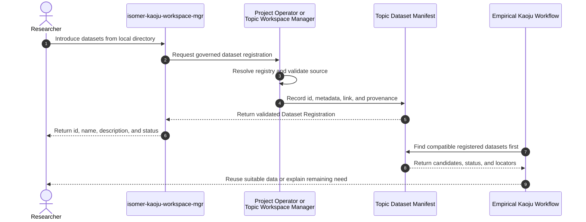

# Use Case 07: Register Local Datasets for Later Survey Runs

## Actor Goal

As a researcher, I want to register datasets that already exist in a local directory with my Topic Workspace, so that later Kaoju survey Runs can find and reuse them without asking me for data I already supplied.

## Use Case

The researcher points to one or more user-owned dataset directories and says they may be useful later. Kaoju coordinates the Topic Workspace owner route to validate each directory, assign a stable id, name, and description, create a managed symlink inside a topic-local dataset registry, and write a machine-readable Topic Dataset Manifest entry with provenance and staleness information. Later empirical planning and acquisition consult this manifest before asking the researcher for datasets or downloading another copy.

## Supported Actions

### Register an External Local Dataset

The researcher introduces an existing local dataset without transferring ownership or duplicating its contents.

- context
  - Actor **has** a readable local directory containing one dataset or a clear set of dataset directories and authority to expose them to the selected Research Topic.
  - System **has** a resolved Topic Workspace, Workspace Path Resolution, an operator-owned mutation route, and durable Artifact and Provenance recording.
- intent
  - Actor **wants** the dataset to become discoverable within the topic while its physical files remain in the original location.
  - Actor **wonders** "Can you make the datasets in `/data/my-corpus` available to this topic without copying them?"
- action
  - Actor then **asks** the system to introduce the local dataset directory into the Topic Workspace for possible later use.
- result
  - Actor **gets** a Dataset Registration with stable id, name, description, source and link locators, metadata and access posture, plus a validated managed symlink and manifest ref.

### Inspect the Topic Dataset Inventory

The researcher reviews which external and topic-local datasets are already registered.

- context
  - Actor **has** an initialized Topic Workspace with zero or more Dataset Registrations.
  - System **has** a resolvable `custom.datasets.registry` root and a readable Topic Dataset Manifest.
- intent
  - Actor **wants** to see dataset identities, descriptions, locations, availability, versions, formats, access constraints, and staleness before planning experiments.
  - Actor **wonders** "Which datasets have I already introduced, and are their links and source directories still valid?"
- action
  - Actor then **asks** the system to list or inspect the registered datasets for the topic.
- result
  - Actor **gets** the manifest inventory with stable ids, names, descriptions, aliases, metadata, status, source fingerprints, link validation, and any unavailable or stale entries.

### Reuse a Registered Dataset During Empirical Planning

The researcher requests a method trial or empirical comparison whose input may already exist in the topic registry.

- context
  - Actor **has** a new empirical request and may not remember every dataset previously registered.
  - System **has** the Topic Dataset Manifest, the requested task and evaluator requirements, and dataset compatibility and staleness checks.
- intent
  - Actor **wants** Kaoju to reuse suitable available data and avoid redundant questions or downloads.
  - Actor **wonders** "Do we already have a compatible dataset for this run, or do I need to provide or download something else?"
- action
  - Actor then **asks** the system to plan or execute a method trial, reproduction, or actual-run comparison.
- result
  - Actor **gets** a plan that checks registered datasets first, cites any suitable `dataset_id`, explains compatibility and access conditions, and asks for new data only when no registered entry satisfies the contract.

## Main Flow

1. The researcher names a local dataset directory and the selected Research Topic, or invokes the request from a context where the Topic Workspace resolves unambiguously.
2. `isomer-kaoju-workspace-mgr` recognizes dataset introduction as Topic Workspace mutation and routes it to the Project Operator Session, Topic Service Master, or `isomer-op-topic-mgr` rather than creating an arbitrary link itself.
3. The owner route resolves the Project, Research Topic, Topic Workspace, Topic Workspace Manifest, Workspace Runtime, `topic.records.artifacts`, and any existing `custom.datasets.registry` binding through Workspace Path Resolution.
4. If the registry binding does not exist, the owner registers a topic-local `custom.datasets.registry` surface with an appropriate durable topic records storage profile and materializes its root without binding the external directory itself.
5. The owner validates that the supplied source exists, is a directory, is readable for the intended execution actor, and was explicitly authorized by the user. It records the lexical source path, resolved target, filesystem facts, and trust-boundary decision.
6. For a directory containing several possible datasets, the owner performs bounded structural inspection and resolves the intended registration units. Ambiguous groupings route to UC-08 rather than inventing dataset boundaries.
7. For each registration unit, the owner detects an existing manifest entry by source locator, stable fingerprint, or declared identity before generating a new id.
8. A new entry receives a path-safe stable `dataset_id`, a human-readable name, a concrete description, aliases or tags, source kind `external-local`, registration actor and time, and an initial availability status.
9. Bounded inspection records useful metadata when feasible: version, format, file count and size, schema, splits, task or modality, label availability, license, sensitivity, expected evaluator use, and a fingerprint strategy. Unknown fields remain explicit.
10. The owner creates a managed link below the registry root, such as `links/<dataset-id>`, using an atomic and collision-safe operation. It records both the link locator and external target without treating either path alone as identity.
11. The owner writes or updates the Topic Dataset Manifest and creates the matching dataset-profile Artifact, Provenance Record, Path Plan or semantic label refs, and registration Decision Record.
12. Validation checks that the registry root remains topic-local, the managed link points to the approved target, the target is available, the manifest id is unique, the recorded metadata is readable, and no source content was copied or modified.
13. The researcher receives the `dataset_id`, name, description, source status, workspace link, manifest ref, access posture, fingerprint or staleness policy, and any metadata limitations.
14. When a later Kaoju workflow needs data, `isomer-kaoju-frame`, `isomer-kaoju-acquire`, `isomer-kaoju-reproduce`, or empirical `isomer-kaoju-compare` intent first queries the Topic Dataset Manifest by id, name, alias, task, modality, schema, split, and evaluator needs.
15. The workflow revalidates the source and link, checks fingerprint drift, and assesses license, sensitivity, access, schema, split, preprocessing, and evaluator compatibility.
16. A suitable entry becomes the proposed input in the Method Trial Contract, Reproduction Contract, or Comparison Intent Document. An incompatible, missing, ambiguous, or stale entry remains visible but does not suppress a necessary question or acquisition route.

## Alternative And Exception Flows

- If the source directory does not exist or is unreadable, Kaoju records a blocked registration and does not create a dangling link or active manifest entry.
- If the supplied directory contains multiple datasets with unclear boundaries, Kaoju asks the researcher to choose the registration units and suggested names before mutation.
- If the same source or fingerprint is already registered, Kaoju returns the existing `dataset_id` and may add an alias or description revision instead of creating a duplicate.
- If a proposed id or link path collides with another entry, the owner generates or requests a distinct path-safe id and preserves the existing registration.
- If a source is already stored inside the Topic Workspace, the owner records its topic-local locator and may omit the external symlink while preserving the same manifest contract.
- If a source path moves or disappears, validation marks the entry `unavailable`; a later update may retarget the managed link while preserving manifest history and the stable dataset id when identity evidence supports it.
- If the external directory changes, Kaoju marks it `stale` or records a new observed revision according to the fingerprint policy before any Run treats it as the previous dataset version.
- If the dataset is sensitive, restricted, credentialed, or license-limited, registration records the access posture and worker projection policy. A symlink does not grant authorization.
- If agents need access during a Run, the owner creates an approved read-only topic projection or execution input binding. It does not instruct workers to browse Topic Workspace records directly.
- If the dataset is registered but does not satisfy the requested task, schema, split, preprocessing, evaluator, or license contract, Kaoju explains the mismatch before requesting or downloading another dataset.
- If a registration is removed, the owner removes only the managed symlink and active manifest entry or marks it inactive. It never deletes or edits the external dataset target.

## Mermaid Flow Diagram

## Mermaid Sequence Diagram

## Durable Outputs

- Topic-local `custom.datasets.registry` semantic binding, Path Plan, and materialized registry root when needed.
- Managed symlink under the registry root for each external-local dataset.
- Topic Dataset Manifest with stable dataset ids and active, stale, unavailable, superseded, or inactive status.
- Dataset Registration entries with name, description, aliases, tags, source and link locators, version, format, schema, splits, size, license, sensitivity, access posture, fingerprint policy, and validation time as available.
- Dataset-profile Artifacts, Provenance Records, registration or update Decision Records, and responsible actor and authorization refs.
- Validation Report covering target availability, id uniqueness, link correctness, topic-local registry containment, and source non-mutation.
- Later Method Trial, Reproduction, or Comparison Intent refs that select or reject a registered `dataset_id` with compatibility reasons.

## Example Prompt And Expected AI Response

### Event 001: Register Existing Local Data

> Time: `2026-07-10T23:00:00Z` · Session: `Prepared Topic Workspace with dataset registry support`

User Prompt:

> I have datasets in `/data/local/vision-benchmarks`. Introduce them into the Topic Workspace; they may be useful later.

AI:

> The agent resolves the selected Topic Workspace and routes the mutation through its owner. It identifies the registration units, validates the external directories, proposes stable ids, names, and descriptions, creates managed links under the topic-local dataset registry, and records manifest, metadata, access, fingerprint, and provenance refs. It returns the registered inventory and explains that later empirical planning will query this manifest before asking for or downloading data.

## Assumptions And Open Questions

- The external directory remains user-owned and may be mutable. Registration therefore records observed identity and staleness evidence rather than claiming an immutable snapshot.
- `custom.datasets.registry` is a topic-local storage surface for manifest and link management. Individual external targets are Dataset Registrations, not semantic Workspace Path Resolution bindings.
- Full recursive hashing may be inappropriate for very large datasets. The fingerprint policy may use declared versions, metadata snapshots, file inventories, sampled hashes, or full hashes according to cost and evidence needs.
