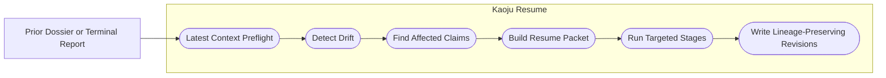
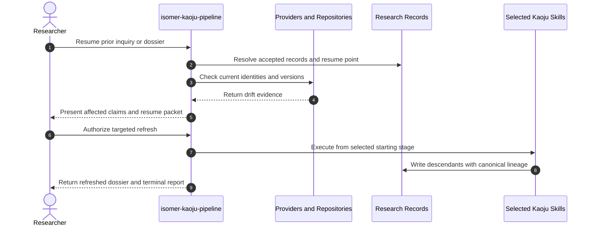

# Use Case 07: Resume and Refresh a Kaoju Investigation

## Actor Goal

As a researcher returning to an existing Research Inquiry, I want Kaoju to identify what changed and refresh only affected evidence, so that the dossier remains current without discarding prior source identities, failed Runs, decisions, or lineage.

## Use Case

The researcher resumes a paused or completed Kaoju investigation after time has passed, a source has released a new version, a repository has changed, a model or dataset revision has moved, or new hardware has become available. Kaoju resolves the latest durable context, compares current source and environment identity with the accepted dossier, marks affected claims and comparisons stale, constructs a targeted resume packet, runs only the necessary stages, and creates descendant records rather than rewriting accepted history.

## Supported Actions

### Inspect Drift and Build a Resume Packet

The researcher asks Kaoju to decide which accepted records remain current and where the procedure should resume.

- context
  - Actor **has** an existing Kaoju dossier, paused pipeline terminal report, or prior Research Inquiry records.
  - System **has** latest-context preflight, record lineage, source identities, pipeline resume points, and current provider or repository inspection.
- intent
  - Actor **wants** a bounded refresh plan based on actual source, material, environment, or requirement drift.
  - Actor **wonders** "Which conclusions still hold, what changed, and which stage must run again?"
- action
  - Actor then **asks** the system to resume or refresh the investigation.
- result
  - Actor **gets** a Latest Context Snapshot, drift report, affected-claim set, still-valid evidence set, selected starting stage, accepted input refs, resource update, and resume blockers.

### Execute a Targeted Lineage-Preserving Refresh

The researcher authorizes the selected bounded stages.

- context
  - Actor **has** a reviewed resume packet and any required Gate decisions.
  - System **has** the named pass recipes, prior stage outputs, record revision and lineage operations, and current execution capabilities.
- intent
  - Actor **wants** to update only stale parts of the evidence package and preserve the prior dossier as historical evidence.
  - Actor **wonders** "Can we rerun the changed repository and comparison without repeating the whole literature survey?"
- action
  - Actor then **asks** the system to execute the named pass from the selected starting stage.
- result
  - Actor **gets** refreshed source, examination, Run, comparison, audit, and dossier records as applicable, canonical lineage to prior records, a terminal report, and a new resume point if work pauses again.

## Main Flow

1. The researcher invokes `isomer-kaoju-pipeline` with a prior terminal report, dossier, Research Inquiry ref, or explicit record refs.
2. The pipeline runs Kaoju shared latest-context preflight and resolves current Research Topic, Topic Workspace, actor or agent identity, source catalog, material manifest, Claim-Evidence Ledger, Runs, audit, and dossier records.
3. The pipeline compares current paper versions, repository remotes and commits, releases, model and dataset revisions, benchmark specifications, environment facts, and user requirements with the accepted identities.
4. The skill records a Drift Report that classifies each prior record as current, stale, superseded, inaccessible, or requiring review.
5. The skill propagates staleness through canonical lineage to affected claims, mappings, reproduction verdicts, comparison cells, Findings, and dossier sections without invalidating unrelated evidence.
6. The pipeline constructs a Resume Packet with named pass, starting stage, accepted input refs, affected claims, coverage delta, resource envelope, Gate preferences, and explicit stop conditions.
7. After user authorization where required, the pipeline executes only the selected stages and preserves every wrapped skill's callbacks, quality gates, blockers, and evidence rules.
8. Content-changing accepted updates become descendant revisions with canonical parents; prior records remain inspectable.
9. Audit and synthesis update affected conclusions and limitations, leaving unchanged claim rows linked to their still-current evidence.
10. The researcher receives the refreshed dossier, drift resolution, lineage summary, terminal status, and future resume point.

## Alternative And Exception Flows

- If no material drift is found, Kaoju records a refresh check and leaves the dossier unchanged.
- If only a new paper has appeared, the pipeline may resume at discovery and examination without repeating unaffected Runs.
- If only hardware or package context changed, the pipeline may resume at reproduction or comparison using existing source mappings.
- If a prior source is now inaccessible, the old captured Artifact and provenance remain visible while current access status becomes a new Evidence Item.
- If prompt instructions conflict with durable accepted context, the skill reports the conflict and requires an explicit Decision Record for any claim-shaping override.
- If a prior Run cannot be reproduced because its environment is unavailable, the skill records the blocker and does not erase the prior observed result.

## Mermaid Flow Diagram

## Mermaid Sequence Diagram

## Durable Outputs

- Latest Context Snapshot and prompt-versus-durable-context verdict.
- Source, material, requirement, and environment Drift Report.
- Affected-Claim and Still-Valid-Evidence sets.
- Pipeline Resume Packet with starting stage, accepted refs, resource envelope, and Gate preferences.
- Targeted stage outputs and descendant record revisions with canonical lineage.
- Refreshed Audit Report, Dossier, Claim Status Table, limitations, and terminal report.
- New resume point and blockers when the refresh pauses or cannot complete.

## Example Prompt And Expected AI Response

### Event 001: Refresh After Repository Releases

> Time: `2026-10-01T09:00:00Z` · Session: `Returning Project Operator Session`

User Prompt:

> Resume the Kaoju comparative pass from dossier `kaoju-dossier-17`. Repositories A and C have new releases and we now have a different GPU. Reuse unchanged literature evidence, identify stale claims, and rerun only what the changes affect.

AI:

> The agent returns a latest-context and drift report before mutation, naming current and stale source identities, affected claims and comparison cells, reusable evidence, the proposed starting stage, resource and Gate changes, and the resume packet. After authorization it produces lineage-linked new Runs and revisions, a refreshed audit and dossier, and a terminal status without overwriting the earlier dossier.

## Assumptions And Open Questions

- Resume is a pipeline input posture, not a separate autonomous looping mode. The pipeline still executes one bounded named pass and returns one terminal report.
- Staleness propagation follows canonical record lineage and explicit claim-evidence links; it must not rely only on matching filenames or prose strings.
