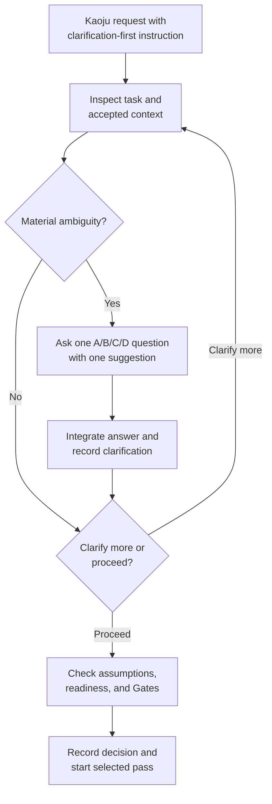
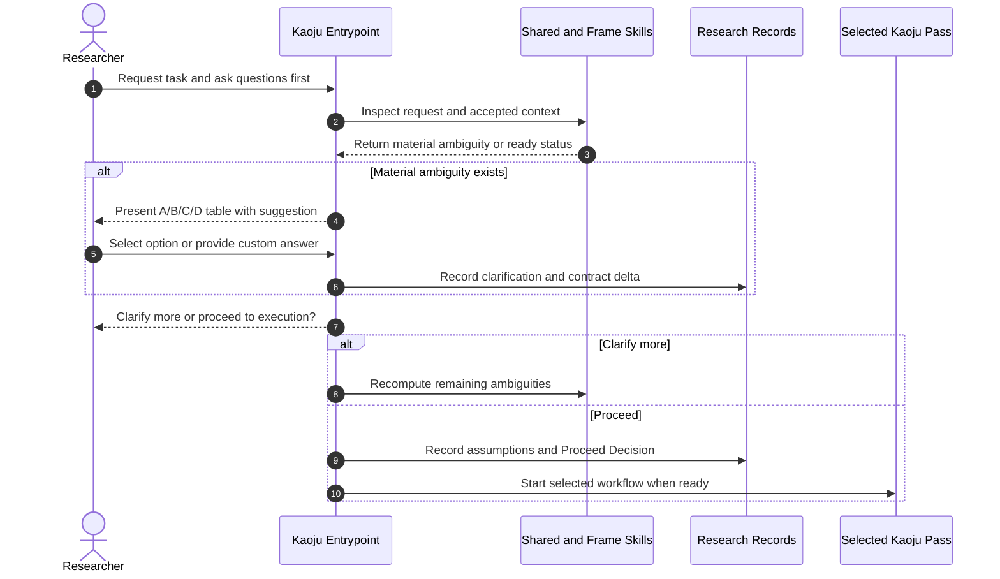

# Use Case 08: Clarify a Survey Request Before Execution

## Actor Goal

As a researcher, I want Kaoju to inspect my survey request and ask structured questions before starting, so that I can resolve important ambiguities and decide when the workflow is ready to proceed.

## Use Case

The researcher requests a Kaoju survey workflow and adds a clarification-first instruction such as, “If you have any question, ask me first.” Kaoju inspects the request and accepted context, resolves what it can without asking, identifies material uncertainties, and presents one decision at a time through an A/B/C/D option table. After each answer, the researcher chooses whether to clarify more or proceed to the selected workflow.

## Supported Actions

### Request Clarification Before Work Starts

The researcher attaches a clarification-first preference to a landscape, curated intake, direction expansion, theory comparison, method trial, empirical comparison, dataset registration, or survey synthesis request.

- context
  - Actor **has** a survey topic, source set, survey artifact, method, dataset, or comparison request that may contain unstated choices.
  - System **has** the original request, accepted Topic and Inquiry context, existing Kaoju records, and read-only inspection capabilities.
- intent
  - Actor **wants** the system to find decision-relevant ambiguities before spending resources or committing to an interpretation.
  - Actor **wonders** "Is anything important unclear in my request, and can I choose among concrete options before you begin?"
- action
  - Actor then **asks** the system to inspect the task and ask questions first when clarification is useful.
- result
  - Actor **gets** a clarification-first checkpoint that blocks acquisition, mutation, and research Runs while permitting non-mutating inspection of the prompt and available context.

### Answer a Structured Clarification Question

The researcher selects a concrete option or supplies a custom answer.

- context
  - Actor **has** one material clarification question presented with choices A, B, C, and D.
  - System **has** three distinct concrete options, one evidence-based suggestion, a free-form option, and explicit pros and cons.
- intent
  - Actor **wants** to understand the consequences of each choice without having to invent the design space from scratch.
  - Actor **wonders** "Which option best fits my goal, what does the agent suggest, and what trade-off do I accept?"
- action
  - Actor then **asks** the system to apply option A, B, or C, or selects D and says what they prefer.
- result
  - Actor **gets** the answer integrated into a Clarification Record and the draft Kaoju Inquiry Contract, with conflicts or new ambiguities surfaced before any workflow starts.

### Choose Whether to Clarify More or Proceed

The researcher controls the transition from clarification into the selected Kaoju workflow.

- context
  - Actor **has** answered a clarification question or received confirmation that no material ambiguity remains.
  - System **has** the updated request interpretation, accepted decisions, remaining assumptions, readiness status, and applicable Gate requirements.
- intent
  - Actor **wants** to decide whether another question would improve the contract or whether the task is ready to begin.
  - Actor **wonders** "Should we resolve another point, or is the current contract good enough to start?"
- action
  - Actor then **asks** the system to clarify more or proceed to execution.
- result
  - Actor **gets** either the next structured question or a recorded Proceed Decision followed by the selected pass, subject to readiness and non-bypassable Gates.

## Main Flow

1. The researcher requests an existing Kaoju use case or named pass and says, “If you have any question, ask me first,” or provides an equivalent clarification-first instruction.
2. The entrypoint records `interaction_mode: clarification-first`, preserves the original task text, and blocks acquisition, environment mutation, command execution, and research Runs.
3. `isomer-kaoju-shared` and `isomer-kaoju-frame` inspect the prompt, current Topic and Inquiry context, accepted records, source identities, constraints, and relevant prior decisions without changing external or research state.
4. The agent resolves uncertainties already answered by reliable context and builds an internal ambiguity inventory covering scope, actors, source set, date cutoff, evidence depth, comparison dimensions, resource envelope, outputs, and stopping criteria.
5. If no material ambiguity remains, the agent reports that the request is ready and advances to the clarify-or-proceed prompt.
6. Otherwise, the agent selects the highest-impact unresolved ambiguity whose answer can materially change the selected workflow or its acceptance criteria.
7. The agent asks one question and presents exactly four rows in a Markdown table with columns `ID`, `Option`, `Explanation`, `Pros`, and `Cons`.
8. Rows A, B, and C contain three distinct concrete choices. Row D is `Say what you like` and accepts free-form input. Exactly one of A, B, or C is marked `Suggested`, and the agent states why.
9. The researcher replies with A, B, C, D plus free-form text, or an equivalent unambiguous answer.
10. The agent validates and integrates the answer, records the table, suggestion, rationale, user selection, and resulting contract change in a Clarification Record, then recomputes the remaining ambiguity inventory.
11. The agent asks exactly: `Do you want to clarify more or proceed to execution?`
12. If the researcher chooses `clarify more`, the workflow returns to the next highest-impact material ambiguity and presents another A/B/C/D table.
13. If the researcher chooses `proceed to execution`, the agent displays the accepted decisions and any remaining non-blocking assumptions, then verifies that no unresolved blocker, required Gate, missing authority, or contradictory constraint prevents the transition.
14. The agent records a Proceed Decision and finalizes the Kaoju Inquiry Contract, selected pass, Pipeline Run context, and resume boundary.
15. The selected Kaoju pass begins. A source-only pass remains source-only; the word `execution` does not promote its verification depth or authorize code Runs that were not requested.

## Alternative And Exception Flows

- If a question can be answered from the prompt or accepted durable context, Kaoju resolves it internally and does not burden the researcher with that question.
- If the user requests all questions at once, Kaoju may use a batch of independent A/B/C/D tables while preserving one suggestion and pros and cons per question.
- If the user's custom D answer is ambiguous, Kaoju asks a concise disambiguation for the same question before moving to the clarify-or-proceed choice.
- If one answer makes another ambiguity irrelevant, Kaoju removes the stale question instead of asking it from a fixed queue.
- If an answer creates a contradiction with an accepted ADR, Inquiry Contract, source identity, or resource constraint, Kaoju reports the conflict and offers three concrete resolution options plus D.
- If the user chooses `proceed to execution` while non-blocking ambiguities remain, Kaoju lists the assumptions it will use and records them in the contract before starting.
- If the user chooses `proceed to execution` while a safety, authority, credential, license, resource, or semantic blocker remains, Kaoju reports the blocker and cannot treat the choice as a Gate approval.
- If the user asks to stop, defer, or cancel, Kaoju records the clarification state and resume point without starting the selected pass.
- If no material ambiguity exists, Kaoju does not manufacture a question merely to fill the table format; it reports readiness and asks the clarify-or-proceed question.

## Required Clarification Table

```markdown
| ID | Option | Explanation | Pros | Cons |
| --- | --- | --- | --- | --- |
| A | Concrete choice A | State what this choice means. | State its benefits. | State its costs or risks. |
| B | Concrete choice B (Suggested) | State what this choice means and why it is suggested. | State its benefits. | State its costs or risks. |
| C | Concrete choice C | State what this choice means. | State its benefits. | State its costs or risks. |
| D | Say what you like | Provide a custom answer in your own words. | Fits needs not covered above. | May require brief disambiguation. |
```

After the user answers and the agent integrates the choice, the agent asks:

> Do you want to clarify more or proceed to execution?

## Mermaid Flow Diagram



## Mermaid Sequence Diagram



## Durable Outputs

- Clarification Record containing the original task, interaction mode, asked question, A/B/C/D option table, suggested option, rationale, user answer, and contract delta.
- Material ambiguity inventory with resolved, remaining, invalidated, and blocking entries.
- Draft and accepted Kaoju Inquiry Contract with explicit assumptions, evidence target, source boundary, resource envelope, outputs, and stopping criteria.
- Clarify-More or Proceed Decision Record and exact transition time.
- Selected-pass Decision Record, Pipeline Run context, readiness and Gate status, and resume boundary.
- Cancellation or defer record when the researcher stops before starting the pass.

## Example Prompt And Expected AI Response

### Event 001: Clarify a Direction Expansion Request

> Time: `2026-07-10T21:00:00Z` · Session: `Kaoju clarification-first checkpoint`

User Prompt:

> Expand the survey from works A, B, and C and include the latest related work. If you have any question, ask me first.

AI:

> The agent inspects the accepted survey and sees that “latest” could mean several useful time boundaries. It asks one question through the required A/B/C/D table, marks the evidence-based default as suggested, and explains every option's pros and cons. After the researcher answers, it updates the Seed Direction Expansion Contract and asks, “Do you want to clarify more or proceed to execution?” It starts `direction-expansion-pass` only after the researcher chooses to proceed and required readiness checks succeed.

## Assumptions And Open Questions

- Clarification-first is an interaction posture shared by every Kaoju entrypoint, not a separate research pass or verification depth.
- The default clarification flow is sequential because answers can change the remaining design space. A user may explicitly request batch questions.
- Read-only inspection covers the prompt and already available accepted context. New paid, credentialed, privacy-sensitive, or state-changing retrieval remains part of the selected workflow or a governed Gate.
