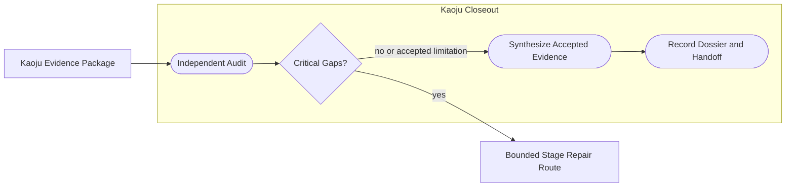
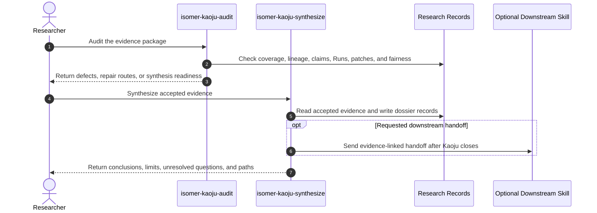

# Use Case 09: Audit and Synthesize Survey Evidence

## Actor Goal

As a researcher or reviewer, I want Kaoju to audit the survey evidence package and synthesize a claim-calibrated dossier, so that conclusions remain traceable to source inspection and first-hand Runs and missing evidence is visible rather than repaired in prose.

## Use Case

The survey has a Related-Work Catalog, Claim-Evidence Ledger, examination records, optional method-trial Runs, and optional comparison results. An independent Kaoju audit checks coverage, identity, provenance, source drift, hidden adaptations, failed-run retention, claim status, and comparison fairness. The synthesis stage then answers the survey question only from accepted records, labels verification depth and evidence verdict separately, records contradictions and limitations, and produces an optional handoff to downstream DeepSci or writing work.

## Supported Actions

### Audit the Evidence Package

The researcher asks an independent reviewer posture to identify evidence defects without silently repairing them.

- context
  - Actor **has** a Kaoju evidence package or an in-progress dossier that claims readiness for synthesis.
  - System **has** durable source, claim, Artifact, Run, Evidence Item, lineage, and provenance records plus the inquiry's coverage contract.
- intent
  - Actor **wants** a skeptical assessment of whether the package supports its intended conclusions.
  - Actor **wonders** "Which claims lack exact sources, which Runs hide adaptations, and which comparisons violate their own contract?"
- action
  - Actor then **asks** the system to audit the evidence package.
- result
  - Actor **gets** an Audit Report, evidence-gap register, coverage and drift findings, hidden-adaptation findings, fairness findings, blocked claims, and bounded repair routes without evidence mutation.

### Synthesize the Audited Dossier

The researcher asks Kaoju to answer the inquiry from accepted evidence and state its limits.

- context
  - Actor **has** an audit result or explicitly records why synthesis may proceed with known gaps.
  - System **has** accepted source, claim, inspection, Run, comparison, contradiction, and limitation records.
- intent
  - Actor **wants** a readable account whose statements expose their verification depth, verdict, and evidence refs.
  - Actor **wonders** "What can we responsibly conclude, what remains only reported, and what should downstream research do next?"
- action
  - Actor then **asks** the system to synthesize the Kaoju dossier.
- result
  - Actor **gets** a Dossier, final Claim Status Table, source catalog, contradiction register, reproducibility and comparison appendix, limitations, unresolved questions, and an optional evidence-linked downstream handoff.

## Main Flow

1. `isomer-kaoju-audit` loads the inquiry and coverage contract, source and material manifests, Claim-Evidence Ledger, lineage, Runs, patches, comparison contracts, and prior blockers.
2. The audit checks source identity, exact locators, inclusion decisions, coverage status, acquisition integrity, paper-code mappings, verification-depth assignments, evidence verdicts, execution fidelity, failed-run retention, patch disclosure, metric traceability, and comparison fairness.
3. The audit records defects and bounded repair routes but does not search for missing sources, rerun code, edit verdicts, or rewrite evidence.
4. If critical gaps prevent responsible synthesis, the audit returns a blocker or explicit route to discover, acquire, examine, reproduce, or compare.
5. `isomer-kaoju-synthesize` loads the accepted evidence package and audit findings after repair or an explicit decision to proceed with known limitations.
6. The skill answers the inquiry claim by claim and keeps verification depth, evidence verdict, and execution fidelity as separate dimensions.
7. The skill distinguishes reported source values from first-hand observed values and includes contradictions, failed attempts, not-comparable results, source drift, and access gaps.
8. Findings are created only when Evidence Items support a reusable interpretation; unsupported narrative does not become a Finding.
9. The skill records the final dossier, Claim Status Table, source catalog, reproducibility appendix, comparison appendix, limitations, unresolved questions, and terminal route.
10. If requested and available, the skill produces a handoff to DeepSci baseline, idea, or writing work without making DeepSci a Kaoju dependency.

## Alternative And Exception Flows

- If the same actor performed the evidence work and audit, the report records that independence is limited.
- If coverage is sufficient for a source audit but not for a systematic claim, synthesis narrows the claim rather than calling the whole topic settled.
- If a user asks synthesis to fill missing evidence by searching or running code, the skill routes that work to the owning Kaoju stage and pauses synthesis.
- If an audit defect affects only one claim, unaffected claims may proceed while the affected claim remains blocked or qualified.
- If no first-hand Runs were requested, the dossier may complete with reported, located, and inspected evidence, but it must not imply reproduction.
- If downstream DeepSci is not installed, the dossier still completes and names a semantic next route without invoking that extension.

## Mermaid Flow Diagram

## Mermaid Sequence Diagram

## Durable Outputs

- Kaoju Audit Report and synthesis-readiness verdict.
- Evidence-Gap, Coverage, Drift, Hidden-Adaptation, and Fairness Findings.
- Bounded repair routes, blocked claims, and Decision Records.
- Kaoju Dossier and final Claim Status Table.
- Final source catalog, contradiction register, and limitation map.
- Reproducibility and comparison appendices with exact Run and Evidence Item refs.
- Evidence-linked Findings, unresolved-question register, pipeline terminal report, and optional downstream handoff.

## Example Prompt And Expected AI Response

### Event 001: Audit Before Final Synthesis

> Time: `2026-07-10T15:00:00Z` · Session: `Kaoju full pass closeout`

User Prompt:

> Audit this Kaoju evidence package for source coverage, provenance, version drift, hidden patches, failed-run retention, and comparison fairness. If it is ready, synthesize which implementations are supported by first-hand evidence and prepare a comparator handoff for DeepSci.

AI:

> The agent first returns the audit readiness verdict and defect list without silently repairing records. If synthesis can proceed, it returns the dossier path, final claim statuses with verification depth and evidence verdict, source and contradiction summaries, faithful and repaired Run distinctions, not-comparable results, limitations, unresolved questions, and an optional DeepSci handoff containing only accepted evidence refs.

## Assumptions And Open Questions

- `isomer-kaoju-audit` is mandatory in full and comparative passes. A direct exploratory synthesis may record an explicit audit waiver, but cannot claim audited readiness.
- Dossier prose is a rendered view; the Claim-Evidence Ledger, Evidence Items, Runs, and Provenance Records remain the durable evidence authority.
