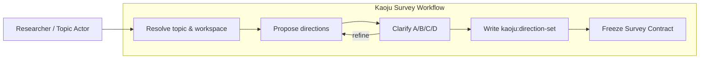
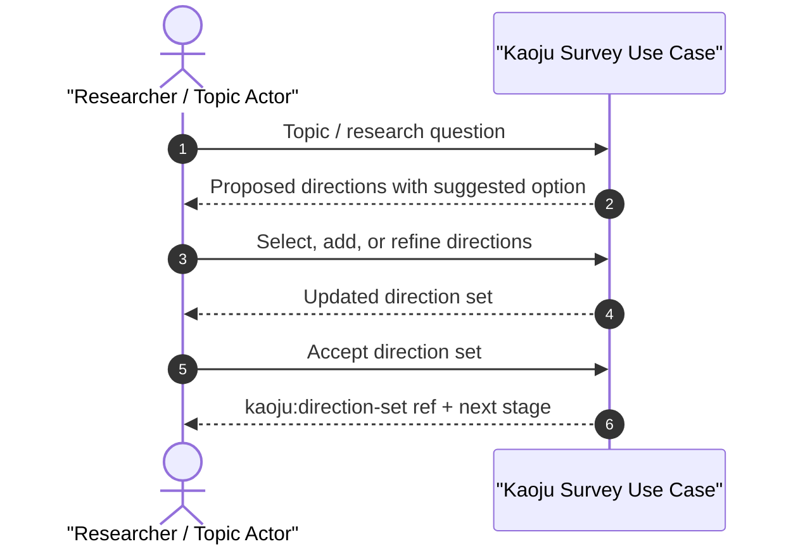

# Use Case 01: Survey Direction From Topic

## Actor Goal

As a researcher or Topic Actor, I want to give the system a topic and receive one or more proposed survey directions, so that I can select one or more bounded, evidence-led paths (or add my own) and have the system remember which directions are queued for exploration.

## Use Case

The user (or a Topic Actor acting on behalf of the user) provides a topic, research question, or rough area of interest. The system inspects the topic intent, existing related works if any, and the Survey Contract boundary rules, then proposes concrete survey directions. Each direction includes a scoped research question, candidate source classes, coverage date, expected depth, and deliverables. The user selects one or more directions, adds a new custom direction, or refines/rejects directions through clarification-first A/B/C/D choices. The accepted directions are recorded as `kaoju:direction-set`, the durable "next direction set to be explored." The set becomes the input to the next use case (online collection / discovery) and may optionally be frozen into one or more Survey Contracts.

## Supported Actions

### Propose Survey Direction

Given a topic, propose one or more bounded survey directions.

- context
  - Actor **has** a topic, research question, or rough interest area, plus access to a registered Research Topic and Topic Workspace.
  - System **has** the topic statement, prior intent documents (`topic.intent.overview`), existing related-work references if any, and Kaoju framing rules.
- intent
  - Actor **wants** to narrow the topic into a concrete, auditable survey plan.
  - Actor **wonders** "What is the smallest useful survey I can run on this topic, and what would it cover?"
- action
  - Actor then **asks** the system to propose survey directions for the topic.
- result
  - Actor **gets** a short list of proposed directions, each with a scoped question, boundary, source classes, coverage date, and expected deliverables, plus a clarification prompt to select or refine.

### Select, Add, or Refine Directions

Select one or more proposed directions, add a custom direction, or refine directions before recording the next direction set.

- context
  - Actor **has** the list of proposed directions and understands the trade-offs.
  - System **has** the draft directions and the clarification-first contract.
- intent
  - Actor **wants** to lock the set of directions that will be explored next.
  - Actor **wonders** "Which directions should I pursue, and can I add one the system did not propose?"
- action
  - Actor then **selects** one or more directions, **adds** a new custom direction with a scoped question and boundary, or **asks** the system to refine a specific aspect (e.g., narrower boundary, different source class, later coverage date).
- result
  - Actor **gets** an updated direction set and, once accepted, a durable `kaoju:direction-set` ref that records every direction queued for exploration.

## Main Flow

1. Actor provides a topic or research question to the system.
2. System resolves the Research Topic, Topic Workspace, and existing intent/related-work context.
3. System inspects the topic for ambiguity (boundary, source classes, coverage date, depth, deliverables, Gates).
4. System proposes one or more survey directions, marking a suggested option.
5. Actor selects one or more directions, adds a custom direction, asks for refinement, or requests more options.
6. System updates the direction set and repeats clarification until the actor accepts the set.
7. System writes the durable `kaoju:direction-set` recording every queued direction.
8. System optionally freezes one or more `kaoju:survey-contract` artifacts from the direction set.
9. System reports the next allowed stage (online collection / discovery) and the `kaoju:direction-set` ref.

## Alternative And Exception Flows

- **A1. Topic not registered**: If the topic has no Research Topic or Topic Workspace, the system routes to `isomer-op-topic-creator` and reports a blocker instead of proposing directions.
- **A2. No viable direction**: If the topic is too broad or lacks reachable primary sources, the system reports the coverage gap and asks the actor to narrow the topic or accept a high-risk boundary.
- **A3. Existing contract**: If a Survey Contract already exists for the topic, the system offers to reuse, replace, or fork it rather than create a duplicate.
- **E1. Callback conflict**: If `project skill-callbacks resolve` returns conflicting instructions, the system reports the conflict and pauses.

## Mermaid Flow Diagram

## Mermaid Sequence Diagram

## Durable Outputs

Each durable output below is registered as an entry in the topic workspace state database. The entry contains the artifact metadata and a link to the actual file stored in the topic workspace filesystem, so the agent can look it up by querying the state DB rather than scanning directories.

- `kaoju:direction-set` — durable record of the next direction set to be explored, including each direction's scoped question, boundary, source classes, coverage date, expected depth, and deliverables.
- `kaoju:survey-contract` — frozen Survey Contract(s) derived from the direction set when the actor chooses to lock scope.
- `kaoju:proceed-decision` — if any direction implies empirical work later.
- Clarification record — retained A/B/C/D choices, custom direction input, and rationale (inside direction-set lineage).

## Example Prompt And Expected AI Response

### Event 001 - Propose a Direction

> Time: `2026-07-14T10:00:00Z` · Session: `topic:predictive-memory-tiering-survey`

User Prompt:

> I want to survey predictive memory tiering for LLM inference. Propose a focused direction.

AI:

> Here are three bounded directions for your topic:
>
> **A. OS/product-level predictive memory only** — survey MEXT, Meta TMO, Google far memory, Linux DAMON/MGLRU, and academic systems (HeMem, TPP, FarSight). No LLM framework code execution.
>
> **B. LLM inference offloading only** — survey vLLM, SGLang, TensorRT-LLM, Accelerate, DeepSpeed, llama.cpp offloading knobs and KV-cache offload research. Includes import/install smoke tests but no systematic benchmarks.
>
> **C. Activation-sparsity lineage** — survey LLM in a Flash, CATS, TEAL, DIP, PowerInfer, PowerInfer-2, TurboSparse, and related methods. Focus on mechanisms and reported speedups.
>
> **D. Custom** — add your own direction.
>
> I suggest **B** because it directly addresses whether MEXT-style transparent paging appears in mainstream LLM frameworks. You can select one or more letters, or type a custom direction. Which do you want?

### Event 002 - Accept Direction Set

> Time: `2026-07-14T10:05:00Z` · Session: `topic:predictive-memory-tiering-survey`

User Prompt:

> Select B and C. Also add a custom direction: "compare the bandwidth assumptions in OS far-memory papers (FarSight, Google) with the bandwidth claims in LLM offloading papers (vLLM cpu_offload_gb, SGLang HiCache)."

AI:

> Accepted direction set:
>
> 1. **B** — LLM inference offloading
> 2. **C** — Activation-sparsity lineage
> 3. **Custom** — Compare bandwidth assumptions in OS far-memory vs. LLM offloading papers
>
> I recorded this as `kaoju:direction-set` (`artifact-...`). The set contains 3 directions queued for exploration. Next stage is online collection / discovery. Do you want me to freeze a single combined Survey Contract now, or create one contract per direction?

## Assumptions And Decisions

- Assumption: The topic already has at least a title and statement; very vague prompts require an extra clarification round.
- Assumption: The system can read `topic.intent.overview` and existing related-work links if present.
- Decision: The system considers host hardware and environment only when empirical feasibility is relevant. It records feasibility as an annotation and does not exclude or rank other directions solely because of the current host.
- Decision: The system proposes three directions by default and always permits the actor to add a custom direction.
