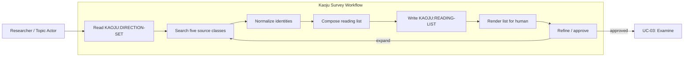
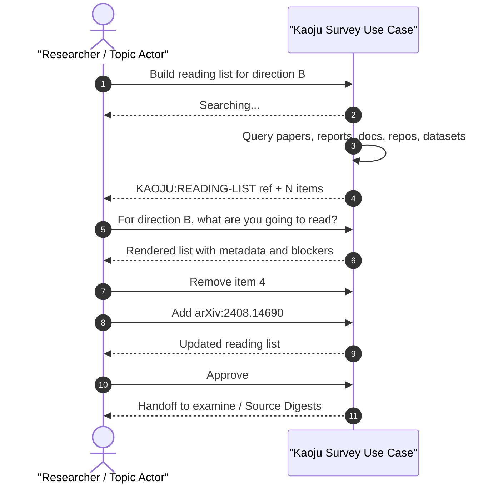

# Use Case 02: Collect Online Info And Build In-Depth Reading List

## Actor Goal

As a researcher or Topic Actor, I want the agent to collect online information for a survey direction and compose an in-depth reading list with metadata, so that I can inspect and approve what will be read before deeper analysis begins.

## Use Case

The system reads the `KAOJU:DIRECTION-SET` produced by UC-01 and selects a survey direction (either automatically or at the human's request). It resolves the direction-owned Reading List target from the 3-priority and 3-secondary default, actor-supplied category counts, or one actor-supplied total split with the odd item assigned to priority. For that direction, it searches across five source classes: peer-reviewed papers, technical reports, framework documentation, code repositories, and datasets/models, while treating papers and reports as primary related works. It normalizes source identities, groups version families, records query provenance, and composes an in-depth reading list. Each item in the list carries metadata: title/name, stable links, source type, one-line relevance, summary, estimated inspection depth, and any access blockers. The list is stored as a durable `KAOJU:READING-LIST` record under `topic.records.artifacts`. The human can ask, "For direction X, what are you going to read?" and receive the current reading list with its target and item metadata. The human can approve the list, remove items, add nominations, revise the target, or ask the agent to expand a particular thread.

## Supported Actions

### Build Reading List For Direction

Collect online information for a survey direction and compose a reading list with metadata.

- context
  - Actor **has** an accepted `KAOJU:DIRECTION-SET` from UC-01.
  - System **has** the direction-set record, search providers, and Kaoju discovery rules.
- intent
  - Actor **wants** to know which sources the agent will inspect for a given direction.
  - Actor **wonders** "What papers, reports, docs, and repos will you read for direction B?"
- action
  - Actor then **asks** the system to build the reading list for a specific direction (or lets the system pick the next unprocessed direction).
- result
  - Actor **gets** a durable `KAOJU:READING-LIST` ref and a rendered view of items with metadata (name, links, source type, summary, relevance, depth).

### Inspect Reading List

Ask what the agent plans to read for a given direction.

- context
  - Actor **has** a reading list record for the direction.
  - System **has** the `KAOJU:READING-LIST` artifact.
- intent
  - Actor **wants** to inspect the planned reading before the agent spends time on deep analysis.
  - Actor **wonders** "For direction B, what are you going to read?"
- action
  - Actor then **asks** the system, "For \<survey-direction\>, what are you going to read?"
- result
  - Actor **gets** the current reading list for that direction: titles, links, source types, summaries, and any blockers or excluded items.

### Approve Or Refine Reading List

Approve the list, remove items, add nominations, or ask for more coverage on a thread.

- context
  - Actor **has** the rendered reading list and understands its coverage.
  - System **has** the `KAOJU:READING-LIST` artifact and clarification-first contract.
- intent
  - Actor **wants** to control what gets analyzed in depth.
  - Actor **wonders** "Should I remove that blog, add the original paper, or expand the kernel-memory thread?"
- action
  - Actor then **approves** the list, **removes** items, **adds** nominated items, or **asks** the agent to expand a thread.
- result
  - Actor **gets** an updated `KAOJU:READING-LIST` and, once approved, a handoff ref to the examine stage.

## Main Flow

1. System reads `KAOJU:DIRECTION-SET` and resolves the selected survey direction.
2. System resolves the default, actor-category, or actor-total target before discovery and asks for clarification if the request is invalid or mixes count modes.
3. System runs bounded searches across the five source classes defined in the direction's Survey Contract.
4. System normalizes identities, groups version families, and records query provenance for each candidate.
5. System decides inclusion, exclusion, duplicate, or blocked status for each candidate and retains reasons.
6. System composes the in-depth reading list with metadata for each included item and records effective and achieved category counts.
7. System writes the durable `KAOJU:READING-LIST` artifact.
8. Human asks, "For \<survey-direction\>, what are you going to read?"
9. System renders the reading list with target metadata, item metadata, blockers, and deficits.
10. Human approves the list or refines it (remove, add, expand, or revise the target).
11. System updates the reading list and reports the next stage (deep examination / Source Digests).

## Alternative And Exception Flows

- **A1. No direction set**: If `KAOJU:DIRECTION-SET` is missing, the system routes back to UC-01 and reports a blocker.
- **A2. Direction already read**: If a reading list already exists for the direction, the system offers to refresh, append, or show the existing list.
- **A3. Access blocker**: If a source cannot be reached, the system records it as a blocked item with attempted locators and a recovery route, rather than omitting it.
- **A4. Human nomination**: If the human adds a source not found by search, the system resolves its identity and treats it as a curated intake item.
- **A5. Custom target**: If the human supplies category counts, the system defaults an omitted category to 3. If the human supplies total `N`, the system assigns `ceil(N / 2)` to priority and `floor(N / 2)` to secondary.
- **A6. Invalid or mixed target**: If counts are invalid, form an empty target, or mix total and category modes, the system requests clarification before discovery.
- **E1. Search provider failure**: If search providers fail, the system reports the failure, retains partial results, and asks whether to retry or proceed with reduced coverage.

## Mermaid Flow Diagram

## Mermaid Sequence Diagram

## Durable Outputs

Each durable output below is registered as an entry in the topic workspace state database. The entry contains the artifact metadata and a link to the actual file stored in the topic workspace filesystem, so the agent can look it up by querying the state DB rather than scanning directories.

- `KAOJU:READING-LIST` — one durable artifact per direction, containing the effective target and derivation, achieved counts, and planned in-depth reads with metadata per item.
- `KAOJU:DISCOVERY-LEDGER` — query provenance and inclusion/exclusion decisions.
- `KAOJU:CURATED-INTAKE-DELTA` — if the human adds nominated sources.
- `KAOJU:SOURCE-ACCESS-BLOCKER` — for items that cannot be reached.

## Reading List Target Metadata

Each new configurable `KAOJU:READING-LIST` includes:

| Field | Description |
| --- | --- |
| `target_counts.basis` | `default`, `user-total`, or `user-categories`. |
| `target_counts.priority` | Effective non-negative priority target. |
| `target_counts.secondary` | Effective non-negative secondary target. |
| `target_counts.requested_total` | Positive actor-supplied total when the basis is `user-total`. |
| `achieved_counts.priority` | Reachable priority items in the current list. |
| `achieved_counts.secondary` | Reachable secondary items in the current list. |

Existing Reading Lists without target metadata retain the legacy 3-priority and 3-secondary interpretation.

## Reading List Item Metadata

Each item in `KAOJU:READING-LIST` includes:

| Field | Description |
| --- | --- |
| `item_id` | Stable identifier within the list. |
| `title` | Title or name of the source. |
| `source_type` | paper, technical_report, framework_doc, repository, dataset, model, product_page, etc. |
| `urls` | Stable primary and secondary links. |
| `summary` | One-paragraph summary of relevance. |
| `relevance_rationale` | Why this item matters for the direction. |
| `estimated_depth` | Abstract, section-level, full-text, or code-level inspection planned. |
| `query_provenance` | Search query or parent seed that found the item. |
| `status` | planned, blocked, excluded, duplicate, or human-added. |
| `priority` | `priority` or `secondary`; target counts are stored at list level. |
| `blocker_reason` | If status is blocked, why and the recovery route. |

## Example Prompt And Expected AI Response

### Event 001 - Build Reading List

> Time: `2026-07-14T10:10:00Z` · Session: `topic:predictive-memory-tiering-survey`

User Prompt:

> Build the reading list for direction B: LLM inference offloading.

AI:

> Building the reading list for **direction B: LLM inference offloading**.
>
> Found 6 primary sources across papers, framework docs, and repositories (3 priority, 3 secondary). I recorded them as `KAOJU:READING-LIST` (`artifact-...`).
> Target basis: default. Achieved: 3 priority and 3 secondary.
>
> You can ask: "For direction B, what are you going to read?"

### Event 002 - Inspect Reading List

> Time: `2026-07-14T10:11:00Z` · Session: `topic:predictive-memory-tiering-survey`

User Prompt:

> For direction B, what are you going to read?

AI:

> **Direction B: LLM inference offloading — planned reading list**
>
> **Priority reads**
>
> 1. **vLLM CacheConfig docs** (framework_doc, priority) — https://docs.vllm.ai/en/v0.11.2/api/vllm/config/cache/ — covers `cpu_offload_gb`, KV offloading backend, swap space, prefix caching.
> 2. **SGLang HiCache blog** (technical_report/blog, priority) — https://www.lmsys.org/blog/2025-09-10-sglang-hicache/ — hierarchical KV cache across GPU/CPU/disk/remote.
> 3. **TensorRT-LLM KV cache docs** (framework_doc, priority) — https://nvidia.github.io/TensorRT-LLM/latest/features/kvcache.html — KV reuse, LRU eviction, host-memory offload.
>
> **Secondary reads**
>
> 4. **DeepSpeed ZeRO-Inference** (technical_report/blog, secondary) — https://www.deepspeed.ai/2022/09/09/zero-inference.html — layer-wise weight offload to CPU/NVMe.
> 5. **LMCache paper** (paper, secondary) — https://arxiv.org/abs/2510.09665 — open-source KV-cache offloading layer.
> 6. **HeadInfer paper** (paper, secondary) — https://arxiv.org/abs/2502.12574 — selective attention-head KV offload.
>
> Status: 6 planned (3 priority, 3 secondary), 0 blocked. Approve, remove items, add nominations, or ask me to expand a thread.

### Event 003 - Build a Five-Work Reading List

User Prompt:

> Find 5 works for direction B.

AI:

> Building a five-work reading list for **direction B: LLM inference offloading** with 3 priority and 2 secondary targets.
>
> I will record the `user-total` target basis, requested total 5, and the achieved category counts in `KAOJU:READING-LIST`.

## Assumptions And Decisions

- Assumption: Search providers can access papers, arXiv, framework docs, and public repositories.
- Assumption: The direction's source classes and coverage date from UC-01 bound the search.
- Assumption: One `KAOJU:READING-LIST` artifact is created per direction; this use case does not decide which direction to explore next.
- Assumption: A Reading List defaults to 3 priority items and 3 secondary items. An actor may override either category, with the omitted category retaining 3, or request total `N`, which derives `ceil(N / 2)` priority and `floor(N / 2)` secondary items.
- Decision: New configurable lists persist target derivation and achieved counts; legacy lists without target metadata retain the 3+3 default.
- Decision: Blocked items remain in discovery provenance but do not count toward the effective reachable target. The agent performs bounded backfill; if suitable reachable sources remain insufficient, it records a coverage warning and lets the human approve the shorter list or request more discovery.
