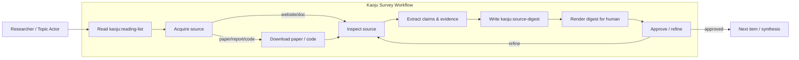
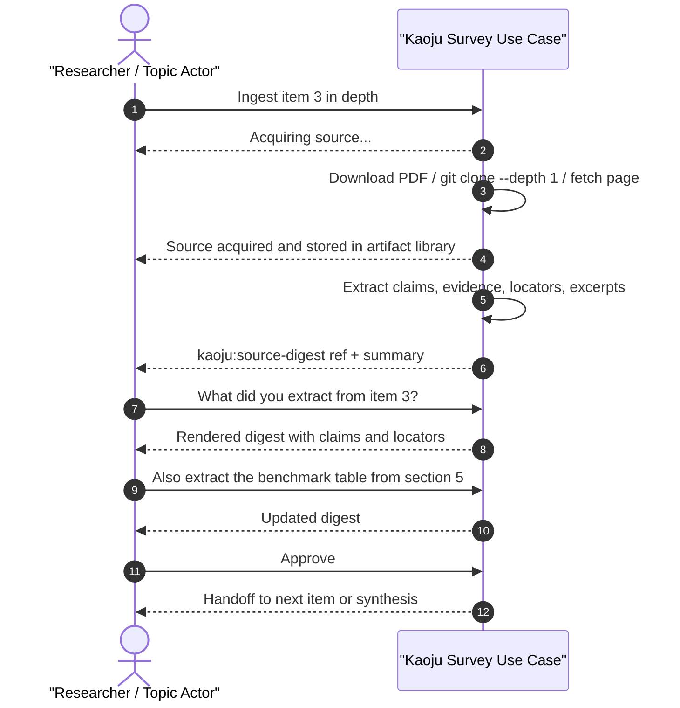

# Use Case 03: Ingest Reading Item In Depth

## Actor Goal

As a researcher or Topic Actor, I want the agent to ingest a selected reading item in depth, so that the survey record captures the claims, evidence, locators, contradictions, limitations, and reusable excerpts that matter for the direction.

## Use Case

The system reads the `kaoju:reading-list` produced by UC-02 and resolves the reading item the human selects. For that item, it fetches or downloads the primary source: a paper PDF, a web page or documentation, or a source-code repository. Papers and code repositories are downloaded into the artifact library rather than read online; web pages and documentation are read online but may be snapshotted. The agent decides an inspection depth based on the item's `estimated_depth` and the direction's Survey Contract, then produces a structured `kaoju:source-digest` that records what is useful for the survey. The digest links back to the original item, the downloaded artifact, and any extracted claims. The human can review the digest, ask for deeper inspection of a specific section, or approve it and move to the next item.

## Supported Actions

### Ingest Item In Depth

Ingest a selected reading item and produce a structured source digest.

- context
  - Actor **has** an accepted `kaoju:reading-list` from UC-02.
  - System **has** the reading-list artifact, access providers, and the item's metadata.
- intent
  - Actor **wants** the source converted into survey-ready structured information.
  - Actor **wonders** "What does this paper actually claim, and where is the evidence?"
- action
  - Actor then **selects** an item and asks the system to ingest it in depth.
- result
  - Actor **gets** a durable `kaoju:source-digest` ref and a rendered summary of claims, evidence, limitations, and reusable excerpts.

### Inspect Source Digest

Review the structured digest for an ingested item.

- context
  - Actor **has** a `kaoju:source-digest` for the item.
  - System **has** the digest artifact and the parent reading-list item.
- intent
  - Actor **wants** to verify what the agent extracted before it is used in synthesis.
  - Actor **wonders** "What did you extract from paper X?"
- action
  - Actor then **asks** the system to show the digest for the item.
- result
  - Actor **gets** the rendered digest with claims, locators, excerpts, and confidence notes.

### Approve Or Refine Source Digest

Approve the digest, ask for deeper inspection of a section, or reject it and request re-ingestion.

- context
  - Actor **has** the rendered source digest.
  - System **has** the `kaoju:source-digest` artifact and the underlying artifact-library copy.
- intent
  - Actor **wants** to control which extracted information enters the survey record.
  - Actor **wonders** "Can you also extract the benchmark table?" or "This claim looks wrong; re-check section 4."
- action
  - Actor then **approves** the digest, **asks** for deeper inspection, or **requests re-ingestion**.
- result
  - Actor **gets** an updated digest and, once approved, a handoff ref to the next item or to synthesis.

### Acquire Associated Source Code For Paper

For a paper reading item, find and acquire its associated source-code repository so it can be inspected alongside the paper.

- context
  - Actor **has** a paper or report item in `kaoju:reading-list`.
  - System **has** the item metadata and can search for linked repositories (paper frontmatter, arXiv, project page, GitHub references).
- intent
  - Actor **wants** to read the implementation behind the paper.
  - Actor **wonders** "For this paper, get its source code to read about."
- action
  - Actor then **asks** the system to find and acquire the source code associated with the paper.
- result
  - Actor **gets** the repository cloned into the artifact library, a new or updated reading-list item for the code, and a note in the paper's source digest linking the paper to its implementation.

## Main Flow

1. Actor selects a reading item and asks the system to ingest it in depth, or asks specifically for the paper's associated source code.
2. System resolves the item from `kaoju:reading-list` and determines its source type and estimated depth.
3. System acquires the source, preferring a local copy already indexed in the topic workspace:
   - Check `kaoju:artifact-library` index for an existing copy. If one exists and is fresh enough, reuse it.
   - For a source-code repository, query `isomer-cli` for the resolved extern-repo path (e.g., `topic.repos.extern.<repo-name>`) and clone with `git clone --depth 1`.
   - For a paper or report, query `isomer-cli` for the resolved artifact-storage path (e.g., `topic.records.artifacts`) and download the PDF or full text there.
   - For a paper, if the actor asks for associated source code, search for linked repositories, clone the best match into the artifact library, and create or update a reading-list item for the code.
   - If a provider restriction prevents download or clone, read/browse the source online and record the restriction in provenance.
   - For a web page or framework documentation, read it online (with an optional snapshot).
4. System inspects the source according to the estimated depth and records query/extraction provenance.
5. System extracts useful survey information: claims, evidence, exact locators, contradictions, limitations, reusable excerpts, and code references.
6. System writes the `kaoju:source-digest` artifact, linking the digest to the reading-list item and the artifact-library copy.
7. Actor asks for the digest or the system offers it.
8. Actor approves the digest or asks for refinement.
9. System updates the digest and reports the next allowed stage (next item, re-ingestion, or synthesis).

## Alternative And Exception Flows

- **A1. Item already ingested**: If a source digest already exists for the item, the system offers to refresh from the existing artifact-library copy or re-acquire it.
- **A2. Provider restriction on download**: If a paper, report, or repository cannot be downloaded because of a provider restriction (paywall, rate limit, IP block, anti-bot), the system records the restriction and falls back to online reading or browsing. This is a warning, not a blocker.
- **A3. Access blocker**: If the source cannot be reached even online, the system records a `kaoju:source-access-blocker` with attempted locators and recovery route, and asks whether to skip or retry.
- **A4. Partial extraction**: If the agent can acquire the source but cannot extract all intended fields, it records which fields are missing and why.
- **A5. Human asks for section-level depth**: If the human wants only a specific section or file inspected, the system narrows the digest to that scope and records the narrower request.
- **E1. Git clone failure**: If `git clone --depth 1` fails, the system reports the error, records attempted URL and ref, and asks whether to try a full clone or fall back to online browsing.
- **A6. No associated source code found**: If the system cannot find a linked repository for a paper, it records the search attempts and asks the actor to supply a URL or skip the code inspection.
- **E2. PDF parse failure**: If the downloaded PDF cannot be parsed, the system records the parse error and asks whether to try an alternate format or mark the item blocked.
- **E3. Source code mismatch**: If multiple candidate repositories are found for a paper, the system lists them and asks the actor which one to clone.

## Mermaid Flow Diagram

## Mermaid Sequence Diagram

## Durable Outputs

Each durable output below is registered as an entry in the topic workspace state database. The entry contains the artifact metadata and a link to the actual file stored in the topic workspace filesystem, so the agent can look it up by querying the state DB rather than scanning directories.

- `kaoju:source-digest` — structured extraction for one reading item, with claims, evidence, locators, excerpts, limitations, and confidence notes.
- `kaoju:artifact-library` — downloaded paper PDFs, checked-out source code, and optional web snapshots, plus an index that maps source identities to workspace paths so re-ingestion can reuse them.
- `kaoju:associated-source-code` — when a paper has an acquired implementation repository, a record linking the paper to the cloned repo.
- `kaoju:discovery-ledger` — acquisition and extraction provenance.
- `kaoju:source-access-blocker` — for items that cannot be acquired or parsed.
- `kaoju:claim-evidence-ledger` — extracted claims linked to sources and locators.

## Source Digest Fields

Each `kaoju:source-digest` includes:

| Field | Description |
| --- | --- |
| `digest_id` | Stable identifier for the digest. |
| `reading_list_item_id` | Reference to the parent item in `kaoju:reading-list`. |
| `source_identity` | Title, authors, version, URL, and stable identifiers. |
| `artifact_library_ref` | Semantic workspace label (e.g., `topic.repos.extern.vllm`, `topic.records.artifacts`) resolved through `isomer-cli`, plus the local path where the source was stored. |
| `associated_source_code_ref` | If the item is a paper with an acquired implementation repo, reference to the cloned code in the artifact library. |
| `inspection_depth` | Abstract, section-level, full-text, or code-level. |
| `claims` | List of claim objects with text, type, confidence, and locator. |
| `evidence` | Supporting evidence, figures, tables, or code snippets with locators. |
| `excerpts` | Reusable quotations or code blocks with exact locators. |
| `contradictions` | Claims or findings that contradict other sources in the survey. |
| `limitations` | Scope limits, assumptions, or caveats noted by the source. |
| `related_items` | References to other reading-list items or external sources. |
| `extraction_provenance` | Which sections/files were inspected and how. |
| `status` | draft, approved, blocked, or needs-revision. |

## Example Prompt And Expected AI Response

### Event 001 - Ingest Item In Depth

> Time: `2026-07-14T10:20:00Z` · Session: `topic:predictive-memory-tiering-survey`

User Prompt:

> Ingest item 3 in depth: TensorRT-LLM KV cache docs.

AI:

> Ingesting **item 3: TensorRT-LLM KV cache docs**.
>
> Downloaded the documentation set into the artifact library as `artifact-...` and produced `kaoju:source-digest` (`digest-...`).
>
> Key claims extracted:
> - KV-cache reuse is enabled through a block manager with LRU eviction.
> - Host-memory offload is supported via a configuration flag.
> - Benchmarks in the doc report throughput vs. GPU-memory trade-offs.
>
> You can ask: "What did you extract from item 3?"

### Event 002 - Inspect Source Digest

> Time: `2026-07-14T10:21:00Z` · Session: `topic:predictive-memory-tiering-survey`

User Prompt:

> What did you extract from item 3?

AI:

> **Source digest for item 3: TensorRT-LLM KV cache docs**
>
> **Claims**
> 1. KV-cache blocks are managed with LRU eviction and optional host-memory fallback. (confidence: high, locator: `features/kvcache.html#memory-management`)
> 2. Throughput drops approximately 15% when host memory is used for 50% of the KV cache. (confidence: medium, locator: `features/kvcache.html#performance`)
>
> **Evidence**
> - Configuration snippet for `kv_cache_enable_block_reuse` and `kv_cache_host_memory_bytes`.
> - Performance table comparing GPU-only and host-offload modes.
>
> **Limitations**
> - The docs do not quantify latency for random access into host memory.
> - Version tested is TensorRT-LLM 0.12; behavior may differ in 0.13.
>
> Status: draft. Approve, ask for deeper inspection, or request re-ingestion.

## Assumptions And Open Questions

- Assumption: `isomer-cli` can resolve workspace path labels such as `topic.repos.extern.*` and `topic.records.artifacts`; the agent does not hard-code directory paths.
- Assumption: `kaoju:artifact-library` indexes every acquired source by stable identity so the agent can reuse existing copies and avoid repeated downloads.
- Assumption: Provider restrictions that block download or clone are warnings; the agent falls back to online reading or browsing.
- Assumption: Web pages and framework documentation are read online, but the system may snapshot them if the source is volatile.
- Assumption: The agent selects inspection depth from the reading-list item's `estimated_depth` unless the human narrows the scope.
- Open question: Should the artifact library keep a full git history for repos that will be executed or benchmarked, or is `--depth 1` always sufficient at this stage?
- Open question: Should the agent attempt to parse figures and tables from PDFs, or only extract text and rely on human review for tabular data?
