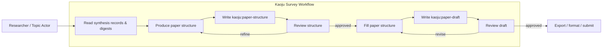
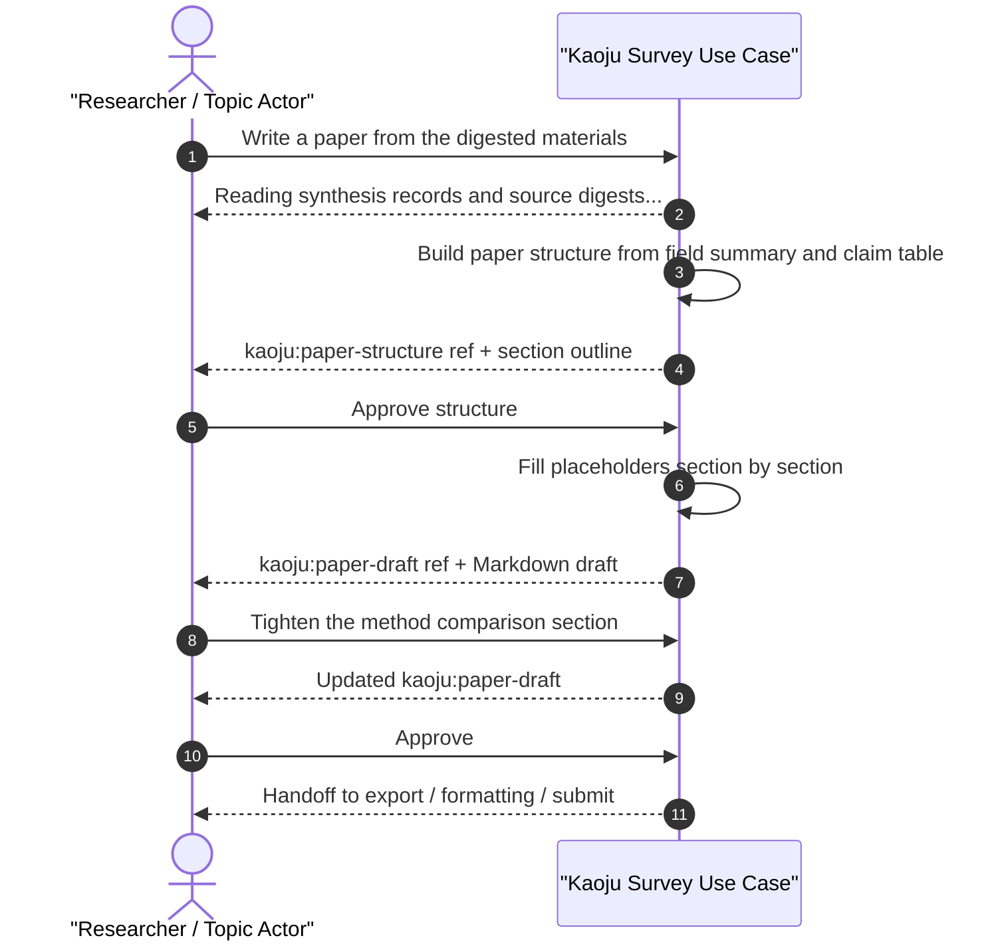

# Use Case 04: Write Paper From Digested Materials

## Actor Goal

As a researcher or Topic Actor, I want the agent to write a survey paper from the digested materials, so that I get a content-first MyST draft that I can review, revise, and later convert to Markdown or LaTeX/PDF.

## Use Case

The system reads the accepted synthesis records (`kaoju:field-summary`, `kaoju:related-work-catalog`, `kaoju:claim-status-table`) and the approved `kaoju:source-digest` artifacts produced by UC-03. The agent first builds a paper structure: a MyST document with section headings and placeholders for each part of the survey paper. It stores this as a durable `kaoju:paper-structure-myst` artifact and asks the human to approve or refine the structure. Once approved, the agent fills the placeholders section by section, grounding every claim in the source digests and synthesis records. The result is a content-focused MyST paper draft stored as `kaoju:paper-draft-myst`. The system can also derive a Markdown view (`kaoju:paper-draft-md`) for human review. The human can review, ask for revisions, or approve the draft. LaTeX formatting, PDF rendering, and citation styling are handled in UC-06.

## Supported Actions

### Produce Paper Structure

Generate a MyST paper structure with placeholders from the digested materials.

- context
  - Actor **has** accepted synthesis records and source digests from prior use cases.
  - System **has** the `kaoju:field-summary`, `kaoju:related-work-catalog`, `kaoju:claim-status-table`, and approved `kaoju:source-digest` artifacts.
- intent
  - Actor **wants** an outline-level plan for the paper before the agent writes full prose.
  - Actor **wonders** "How will the paper be organized, and what will each section cover?"
- action
  - Actor then **asks** the system to produce a paper structure from the digested materials.
- result
  - Actor **gets** a durable `kaoju:paper-structure-myst` artifact — a MyST file with section headings and placeholders — plus a rendered Markdown preview.

### Fill Paper Structure

Fill the approved paper structure with content grounded in the digested materials.

- context
  - Actor **has** an approved `kaoju:paper-structure-myst` artifact.
  - System **has** the structure artifact and all source digests and synthesis records.
- intent
  - Actor **wants** the agent to write the actual paper content.
  - Actor **wonders** "Can you write the paper now?"
- action
  - Actor then **approves** the structure and asks the system to fill it.
- result
  - Actor **gets** a durable `kaoju:paper-draft-myst` artifact in MyST, and optionally a derived `kaoju:paper-draft-md` artifact for review.

### Review And Refine Paper

Review the draft and ask for section-level revisions.

- context
  - Actor **has** the rendered `kaoju:paper-draft-myst` or derived `kaoju:paper-draft-md`.
  - System **has** the draft artifact and the underlying source digests.
- intent
  - Actor **wants** to correct claims, improve flow, or add emphasis before finalizing.
  - Actor **wonders** "This section is too long; can you tighten it and add a comparison table?"
- action
  - Actor then **requests** revisions, **approves** the draft, or **asks** for a specific section to be rewritten.
- result
  - Actor **gets** an updated `kaoju:paper-draft-myst` (and derived Markdown if enabled) and, once approved, a handoff ref to the next stage (PDF generation or submission).

## Main Flow

1. Actor asks the system to write a paper from the currently digested materials.
2. System reads the accepted synthesis records and approved source digests from the state database.
3. System proposes a paper structure: title, abstract, introduction, background, related work, method comparison, discussion, conclusion, references, and any appendices.
4. System writes the `kaoju:paper-structure-myst` artifact as a MyST file with placeholders for each section.
5. Human reviews the structure (optionally via a derived Markdown preview) and approves it or asks for changes.
6. System fills the placeholders section by section, citing source digests and synthesis records.
7. System writes the `kaoju:paper-draft-myst` artifact as a MyST file, and optionally derives `kaoju:paper-draft-md`.
8. Human reviews the draft and requests revisions or approves it.
9. System updates the draft and reports the next allowed stage (PDF generation or submission).

## Alternative And Exception Flows

- **A1. No synthesis records**: If the required synthesis records are missing or unaudited, the system routes to the audit/synthesis stage and reports a blocker.
- **A2. Structure rejected**: If the human rejects the proposed structure, the system rewrites it and repeats the approval step.
- **A3. Section-level fill**: If the human asks for only one section to be filled at a time, the system fills that section and updates the draft incrementally.
- **A4. Formatting request**: If the human asks for LaTeX/PDF formatting, the system explains that formatting is handled by UC-06 and routes there.
- **E1. Claim without source**: If the agent cannot ground a drafted claim in an approved source digest, it flags the claim with a `citation-needed` marker rather than inventing a source.

## Mermaid Flow Diagram

## Mermaid Sequence Diagram

## Durable Outputs

Each durable output below is registered as an entry in the topic workspace state database. The entry contains the artifact metadata and a link to the actual file stored in the topic workspace filesystem, so the agent can look it up by querying the state DB rather than scanning directories.

- `kaoju:paper-structure-myst` — MyST file with section headings and placeholders, approved before full drafting.
- `kaoju:paper-draft-myst` — content-filled MyST survey paper grounded in source digests and synthesis records. This is the canonical paper artifact.
- `kaoju:paper-draft-md` — optional derived Markdown view of the paper draft for human review.
- `kaoju:citation-map` — mapping from draft claims and statements to source-digest locators.
- `kaoju:paper-revision-log` — record of structure and draft revisions requested by the human.

## Paper Structure Placeholders

A `kaoju:paper-structure-myst` artifact contains at minimum these sections as MyST/Markdown headings with placeholders:

| Section | Placeholder Content |
| --- | --- |
| `title` | Proposed paper title. |
| `abstract` | `{{abstract}}` — summary of scope, methods, and key findings. |
| `introduction` | `{{introduction}}` — motivation, problem statement, survey scope. |
| `background` | `{{background}}` — definitions, taxonomy, and concepts. |
| `related work` | `{{related_work}}` — overview of selected works grouped by theme. |
| `method comparison` | `{{method_comparison}}` — comparative analysis of approaches. |
| `discussion` | `{{discussion}}` — trends, gaps, contradictions, limitations. |
| `conclusion` | `{{conclusion}}` — summary and future directions. |
| `references` | `{{references}}` — list of cited sources with stable links. |

## Example Prompt And Expected AI Response

### Event 001 - Produce Paper Structure

> Time: `2026-07-14T10:40:00Z` · Session: `topic:predictive-memory-tiering-survey`

User Prompt:

> Write a paper from the digested materials.

AI:

> I read the Field Summary, Related-Work Catalog, Claim Status Table, and 6 approved Source Digests. I produced `kaoju:paper-structure-myst` (`structure-...`) with the following sections:
>
> 1. Title
> 2. Abstract — `{{abstract}}`
> 3. Introduction — `{{introduction}}`
> 4. Background: Predictive Memory Tiering for LLM Inference — `{{background}}`
> 5. Related Work: OS-Level Far Memory — `{{related_work_os}}`
> 6. Related Work: LLM Inference Offloading — `{{related_work_llm}}`
> 7. Method Comparison — `{{method_comparison}}`
> 8. Discussion — `{{discussion}}`
> 9. Conclusion — `{{conclusion}}`
> 10. References — `{{references}}`
>
> Approve the structure or ask me to change it.

### Event 002 - Fill And Review Paper Draft

> Time: `2026-07-14T10:45:00Z` · Session: `topic:predictive-memory-tiering-survey`

User Prompt:

> Approve the structure and fill it.

AI:

> Structure approved. I filled every section and wrote `kaoju:paper-draft-myst` (`draft-...`). A derived Markdown view `kaoju:paper-draft-md` is also available.
>
> The draft is 2,800 words in MyST. Every claim is tied to a Source Digest or Claim Status Table entry. You can ask for section-level revisions or approve the draft.

## Assumptions And Decisions

- Assumption: Synthesis records (`kaoju:field-summary`, `kaoju:related-work-catalog`, `kaoju:claim-status-table`) have been produced and audited before paper writing begins.
- Assumption: Source digests are approved before their claims are used in the paper draft.
- Assumption: The paper is written in MyST, which is the canonical format; a Markdown view can be derived automatically for review; LaTeX/PDF rendering is handled in UC-06.
- Decision: The agent selects and explains an adaptive typed MyST structure profile based on the accepted survey direction, such as taxonomy, comparison, empirical survey, or general survey; the actor can revise it through the template workflow.
- Decision: Figures and tables are separate file-backed Artifacts. The MyST structure and draft use typed placeholders that reference those Artifacts, and the citation map preserves their evidence and display roles.
