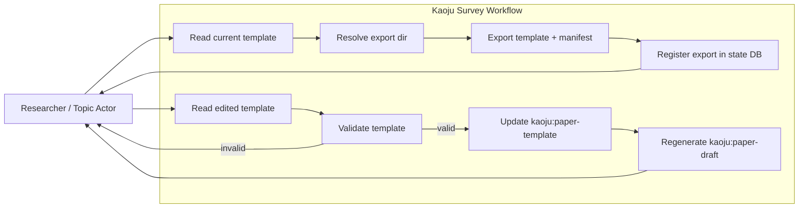
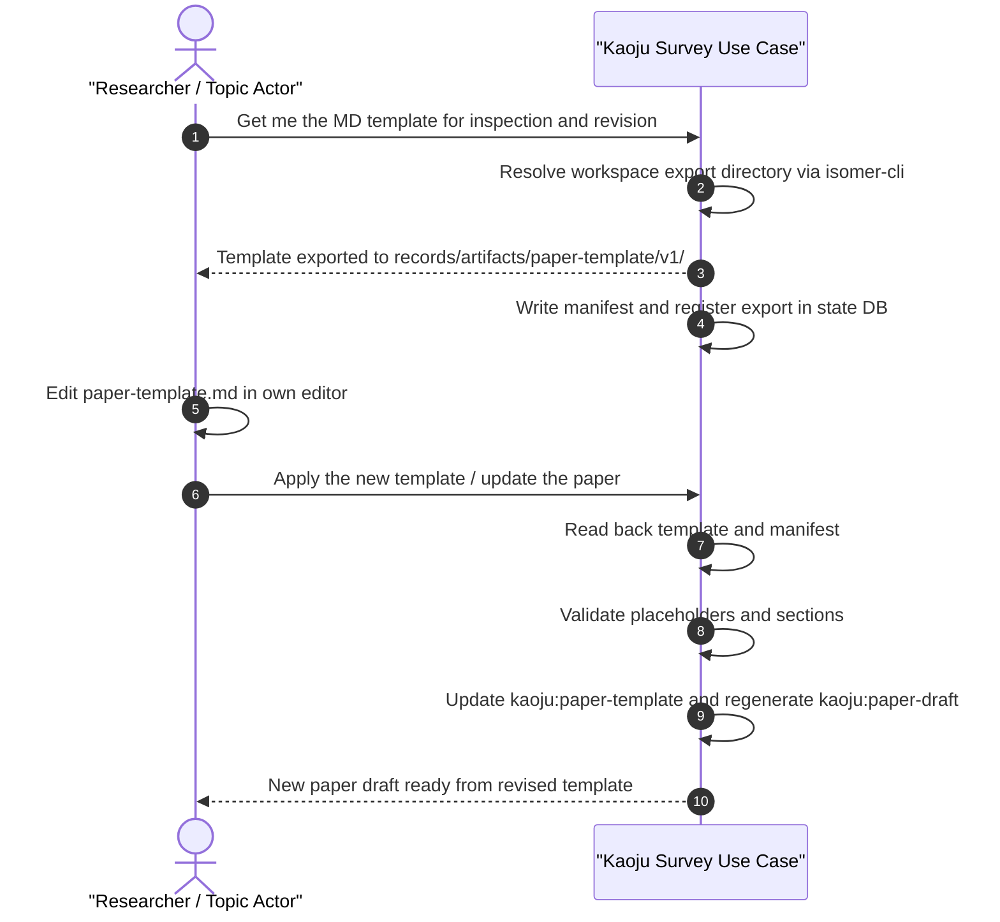

# Use Case 05: Paper Template Manual Editing And Apply

## Actor Goal

As a researcher or Topic Actor, I want to extract the paper template to a workspace directory, edit it manually, and then have the agent apply the revised template and regenerate the paper, so that I can control the paper structure with my own editor while keeping the workflow durable and reproducible.

## Use Case

The system reads the current `kaoju:paper-structure-myst` or `kaoju:paper-template-myst` artifact produced by UC-04. At the human's request, it exports the MyST template to a workspace directory — either a path supplied by the human or a topic-workspace location resolved through `isomer-cli` — along with a manifest that records the template version, source digest refs, and the paper draft it is tied to. The system registers the export in the state database. The human edits the MyST template file (which uses a `.md` extension and Markdown-compatible syntax) with their own tools, adding, removing, or reordering sections and placeholders. When the human says "apply the template" or "update the paper with the new template," the agent reads the edited MyST template back from the workspace directory, validates that placeholders are consistent with the available source digests, updates the durable `kaoju:paper-template-myst` artifact, and regenerates the `kaoju:paper-draft-myst` using the new template. There is no separate Markdown template; the MyST template is the only content template.

## Supported Actions

### Export Paper Template For Editing

Extract the current paper template to a workspace directory with a manifest.

- context
  - Actor **has** a `kaoju:paper-structure-myst` or `kaoju:paper-template-myst` artifact from UC-04.
  - System **has** the template artifact and the topic workspace path resolution through `isomer-cli`.
- intent
  - Actor **wants** to edit the paper structure outside the chat with their own editor.
  - Actor **wonders** "Can I get the MyST template so I can revise it myself?"
- action
  - Actor then **asks** the system to export the paper template for inspection and revision, optionally naming a target directory.
- result
  - Actor **gets** the MyST template written to the workspace directory, a manifest file, and a state-DB entry recording the export location and version.

### Apply Revised Paper Template

Read the manually edited template and regenerate the paper draft.

- context
  - Actor **has** revised the exported template in the workspace directory.
  - System **has** the export manifest and the original source digests and synthesis records.
- intent
  - Actor **wants** the revised template to become the new durable template and the paper to be regenerated from it.
  - Actor **wonders** "I updated the template; now regenerate the paper."
- action
  - Actor then **asks** the system to apply the revised template.
- result
  - Actor **gets** an updated `kaoju:paper-template-myst` artifact and a regenerated `kaoju:paper-draft-myst` (and derived Markdown view if enabled).

## Main Flow

1. Actor asks the system to export the paper template for inspection and revision.
2. System resolves the export directory: use the human-supplied path, or query `isomer-cli` for a topic-workspace directory intended for manual edits.
3. System writes the current MyST template as a `.md` file into the export directory.
4. System writes a manifest file (e.g., `paper-template-manifest.json` or YAML) containing template version, source digest refs, paper draft ref, export timestamp, and the expected apply command.
5. System registers the export in the state database with metadata and a link to the export directory.
6. Actor edits the MyST template manually.
7. Actor asks the system to apply the revised template.
8. System reads the edited MyST template and manifest from the export directory.
9. System validates the template: placeholders are recognized, required sections are present, and referenced source digests exist.
10. System updates the durable `kaoju:paper-template-myst` artifact with the revised template.
11. System regenerates the `kaoju:paper-draft-myst` by filling the revised template from source digests and synthesis records, and optionally derives `kaoju:paper-draft-md`.
12. System writes the new draft, registers it in the state database, and reports the result to the actor.

## Alternative And Exception Flows

- **A1. No prior template**: If no `kaoju:paper-structure-myst` or `kaoju:paper-template-myst` exists, the system routes to UC-04 and reports a blocker.
- **A2. Export already exists**: If the export directory already contains a template, the system offers to overwrite, create a new versioned directory, or cancel.
- **A3. Template validation failure**: If the applied template has unrecognized placeholders or missing required sections, the system reports the issues and asks the actor to fix them before applying.
- **A4. Partial apply**: If the actor wants to apply only section-order changes without regenerating prose, the system updates the template and structure but defers full draft regeneration until requested.
- **E1. Manifest mismatch**: If the manifest does not match the edited template, the system warns the actor and asks whether to trust the file or re-export.
- **E2. Missing source digests**: If the revised template references source digests that no longer exist, the system marks those placeholders as `citation-needed` and reports the gap.

## Mermaid Flow Diagram

## Mermaid Sequence Diagram

## Durable Outputs

Each durable output below is registered as an entry in the topic workspace state database. The entry contains the artifact metadata and a link to the actual file stored in the topic workspace filesystem, so the agent can look it up by querying the state DB rather than scanning directories.

- `kaoju:paper-template-myst` — the durable, currently active MyST paper template.
- `kaoju:paper-template-export` — record of a manual-edit export, including directory path, manifest ref, and version.
- `kaoju:paper-template-manifest` — manifest describing the exported template, its source digests, and apply instructions.
- `kaoju:paper-draft-myst` — regenerated MyST paper draft after the revised template is applied.
- `kaoju:paper-revision-log` — record of template exports, applies, and regeneration events.

## Manifest Fields

The `kaoju:paper-template-manifest` includes:

| Field | Description |
| --- | --- |
| `template_id` | Stable identifier for this template version. |
| `source_template_ref` | Reference to the `kaoju:paper-structure-myst` or `kaoju:paper-template-myst` this export came from. |
| `export_directory` | Workspace directory where the MyST template was extracted. |
| `template_file` | Name of the exported MyST template file (usually `.md`). |
| `source_digest_refs` | List of `kaoju:source-digest` refs used to fill the template. |
| `paper_draft_ref` | Reference to the `kaoju:paper-draft-myst` tied to this template. |
| `exported_at` | Export timestamp. |
| `apply_command_hint` | Suggested user prompt to apply the revised template. |

## Example Prompt And Expected AI Response

### Event 001 - Export Template

> Time: `2026-07-14T10:50:00Z` · Session: `topic:predictive-memory-tiering-survey`

User Prompt:

> Get me the MD template for inspection and revision.

AI:

> Exported the current MyST paper template to `records/artifacts/paper-template/v1/paper-template.md`.
>
> The export includes:
> - `paper-template.md` — the editable MyST template with placeholders (MyST syntax in a Markdown file).
> - `manifest.json` — version, source digest refs, and apply instructions.
>
> I registered this as `kaoju:paper-template-export` (`export-...`) in the state database. Edit the file, then say "apply the template" or "update the paper with the new template."

### Event 002 - Apply Revised Template

> Time: `2026-07-14T10:55:00Z` · Session: `topic:predictive-memory-tiering-survey`

User Prompt:

> Apply the new template.

AI:

> Read back the edited template from `records/artifacts/paper-template/v1/paper-template.md`.
> Validation passed: all placeholders are recognized and required sections are present.
>
> Updated `kaoju:paper-template-myst` (`template-...`) and regenerated `kaoju:paper-draft-myst` (`draft-...`). The paper now follows your revised section order and includes the new "Bandwidth Assumptions" comparison section.

## Assumptions And Decisions

- Assumption: The topic workspace has a directory suitable for manual edits, resolvable through `isomer-cli`.
- Assumption: The human uses a Markdown/MyST-aware editor and edits the MyST template file (`.md` extension); there is no separate Markdown-only template.
- Assumption: Applying a revised template always regenerates the canonical `kaoju:paper-draft-myst` from source digests and synthesis records, and optionally derives `kaoju:paper-draft-md`.
- Decision: Every template export receives an automatic export revision and manifest. A default managed target uses a versioned directory; an actor-selected target is never overwritten without an explicit update or overwrite choice.
- Decision: Applying a template that removes a section with grounded content produces an orphaned-content report and requires explicit confirmation. Removing a required section remains a validation error rather than a warning.
