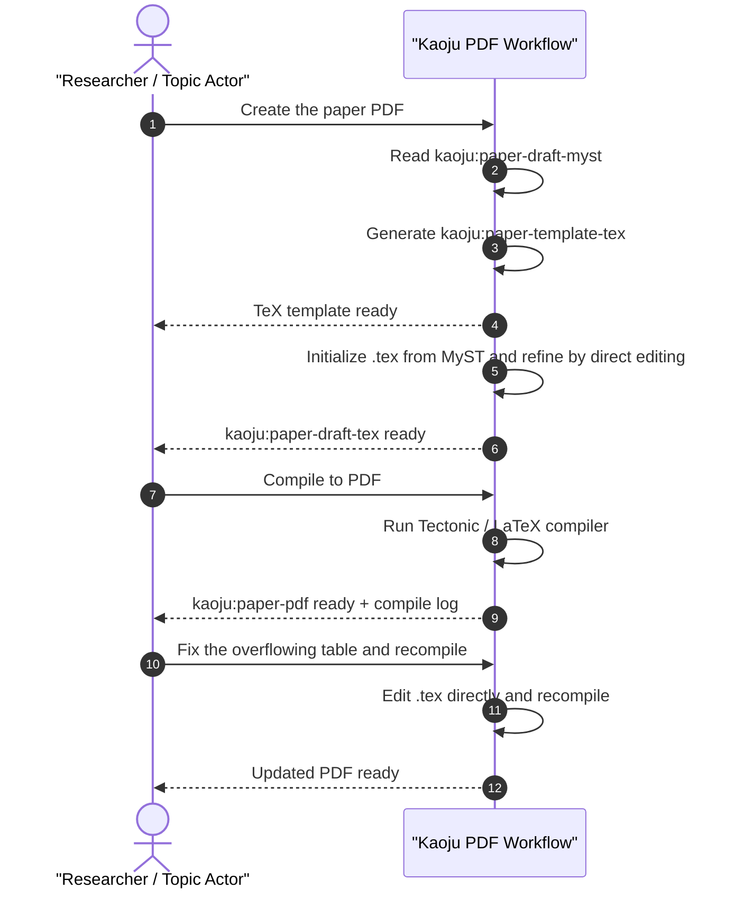

# Use Case 06: Create Paper PDF

## Actor Goal

As a researcher or Topic Actor, I want the agent to generate a PDF version of the accepted paper from the canonical MyST draft, so that I have a publication-ready rendered document.

## Use Case

The system reads the canonical `kaoju:paper-draft-myst` artifact produced by UC-04 (or updated by UC-05) and renders it to PDF through an intermediate LaTeX stage. Because MyST-to-LaTeX conversion is non-trivial, the workflow is staged: first produce a durable `kaoju:paper-template-tex` artifact, then produce a `kaoju:paper-draft-tex`, and finally compile it to `kaoju:paper-pdf`. A scripted conversion may initialize the TeX draft, but the agent is expected to inspect and edit the `.tex` file directly to fix conversion artifacts, adjust floats, tables, citations, and any MyST directives that do not map cleanly. The TeX template and draft are stored as files in the topic workspace and registered in the state database. The human can review the PDF, ask for TeX-level fixes, and request a recompile.

## Supported Actions

### Generate TeX Template

Create a LaTeX template for the paper and store it as a durable artifact.

- context
  - Actor **has** an accepted `kaoju:paper-draft-myst` from UC-04/UC-05.
  - System **has** the MyST draft, paper structure, and a target LaTeX class/style.
- intent
  - Actor **wants** the LaTeX preamble, macros, and section layout established before the full draft is generated.
  - Actor **wonders** "What will the LaTeX setup look like?"
- action
  - Actor then **asks** the system to generate the TeX template.
- result
  - Actor **gets** a durable `kaoju:paper-template-tex` artifact with preamble, packages, and placeholder sections.

### Generate TeX Draft

Convert the MyST draft to LaTeX and refine it by direct inspection and editing.

- context
  - Actor **has** an approved `kaoju:paper-template-tex`.
  - System **has** the MyST draft and the TeX template.
- intent
  - Actor **wants** the paper content rendered as LaTeX.
  - Actor **wonders** "Can you produce the .tex file from the MyST draft?"
- action
  - Actor then **asks** the system to generate the TeX draft.
- result
  - Actor **gets** a durable `kaoju:paper-draft-tex` artifact. The agent may use an initialization script but is expected to inspect and edit the file directly for MyST directives that do not convert cleanly.

### Compile PDF

Compile the TeX draft to PDF.

- context
  - Actor **has** an approved `kaoju:paper-draft-tex`.
  - System **has** the TeX file and a LaTeX compiler available.
- intent
  - Actor **wants** the final rendered PDF.
  - Actor **wonders** "Compile the paper to PDF."
- action
  - Actor then **asks** the system to compile the PDF.
- result
  - Actor **gets** a `kaoju:paper-pdf` artifact and a compile log.

### Refine TeX And Recompile

Fix TeX-level issues and recompile.

- context
  - Actor **has** a PDF with rendering issues or compile errors.
  - System **has** the TeX draft and compile log.
- intent
  - Actor **wants** layout, citation, table, or figure fixes in the rendered output.
  - Actor **wonders** "The table is overflowing; fix it and recompile."
- action
  - Actor then **requests** a specific TeX-level fix.
- result
  - Actor **gets** an updated `kaoju:paper-draft-tex` and a regenerated `kaoju:paper-pdf`.

## Main Flow

1. Actor asks the system to create the paper PDF.
2. System reads the canonical `kaoju:paper-draft-myst` and its structure.
3. System generates or reuses the `kaoju:paper-template-tex` artifact.
4. System initializes a TeX draft from MyST, either with a conversion script or by direct translation.
5. System inspects and directly edits the `.tex` file to resolve MyST directives, tables, citations, floats, and any conversion artifacts.
6. System writes the `kaoju:paper-draft-tex` artifact and registers it in the state database.
7. System compiles the TeX draft to PDF using a LaTeX compiler (e.g., Tectonic).
8. System writes the `kaoju:paper-pdf` artifact and a compile log.
9. Actor reviews the PDF and requests TeX-level fixes or approves the output.
10. System applies fixes, recompiles, and reports the final result.

## Alternative And Exception Flows

- **A1. No MyST draft**: If `kaoju:paper-draft-myst` is missing, the system routes to UC-04 and reports a blocker.
- **A2. TeX template already exists**: If a TeX template exists, the system offers to reuse, replace, or version it.
- **A3. Compile warning**: If compilation succeeds with warnings, the system reports the warnings and asks whether to fix them or accept the PDF.
- **A4. Compile failure**: If compilation fails, the system reports the error log, fixes the TeX draft, and retries up to a bounded retry count.
- **E1. Missing compiler**: If no LaTeX compiler is available, the system records a blocker and suggests installing Tectonic or another engine.
- **E2. MyST directive unsupported**: If a MyST directive cannot be represented in LaTeX, the system records the issue, offers a fallback (plain text, simplified table, or omitted figure), and asks the actor how to proceed.

## Mermaid Flow Diagram

## Mermaid Sequence Diagram

## Durable Outputs

Each durable output below is registered as an entry in the topic workspace state database. The entry contains the artifact metadata and a link to the actual file stored in the topic workspace filesystem, so the agent can look it up by querying the state DB rather than scanning directories.

- `kaoju:paper-template-tex` — LaTeX preamble, packages, macros, and placeholder sections.
- `kaoju:paper-draft-tex` — content-filled LaTeX paper, refined by direct agent editing.
- `kaoju:paper-pdf` — compiled PDF of the paper.
- `kaoju:paper-compile-log` — log from the LaTeX compiler, including warnings and errors.
- `kaoju:paper-pdf-revision-log` — record of TeX fixes and recompile events.

## TeX Draft Refinement Tasks

The agent is expected to inspect and edit the `.tex` file directly for at least these common MyST-to-LaTeX conversion issues:

| Issue | Agent Action |
| --- | --- |
| Tables with merged cells or wide content | Adjust column widths, use `tabularx`/`longtable`, or split tables. |
| MyST admonitions (`:::{note}`) | Convert to framed environments or plain subsections. |
| Cross-references and citations | Ensure `\label`, `\ref`, and `\cite` commands are correct. |
| Figures and subfigures | Set appropriate widths and placements. |
| Math directives and numbered equations | Convert to `equation`/`align` environments. |
| Unicode or special characters | Replace with LaTeX-safe equivalents. |

## Example Prompt And Expected AI Response

### Event 001 - Create Paper PDF

> Time: `2026-07-14T11:00:00Z` · Session: `topic:predictive-memory-tiering-survey`

User Prompt:

> Create the paper PDF.

AI:

> I read the canonical MyST draft (`kaoju:paper-draft-myst`) and generated the TeX template (`kaoju:paper-template-tex`).
>
> I initialized the `.tex` draft and then edited it directly to fix three MyST directives that did not convert cleanly:
> - Converted a wide comparison table to `tabularx`.
> - Replaced an admonition block with a `tcolorbox` note environment.
> - Fixed citation keys for two sources.
>
> `kaoju:paper-draft-tex` is ready. Say "compile to PDF" to render it.

### Event 002 - Compile And Refine

> Time: `2026-07-14T11:05:00Z` · Session: `topic:predictive-memory-tiering-survey`

User Prompt:

> Compile to PDF. Then fix the overflowing table and recompile.

AI:

> Compiled to `kaoju:paper-pdf` with one warning about an overfull hbox in the method-comparison table.
>
> I edited the `.tex` file directly, reduced column widths, and enabled `\small` for that table. Recompiled successfully.
>
> Updated PDF is ready.

## Assumptions And Open Questions

- Assumption: MyST is the canonical paper format; Markdown and LaTeX are derived views.
- Assumption: A LaTeX compiler (e.g., Tectonic) is available in the topic workspace environment.
- Assumption: Scripted MyST-to-LaTeX conversion is only used for initialization; the agent refines the `.tex` file by direct inspection and editing.
- Open question: Should the TeX template be generated once per paper, or should the agent regenerate it when the MyST structure changes significantly?
- Open question: Should compile errors automatically trigger agent fixes, or should the agent pause and ask for approval before editing the `.tex` file?
