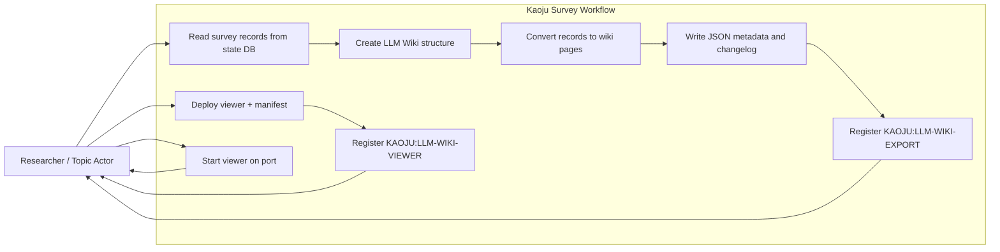
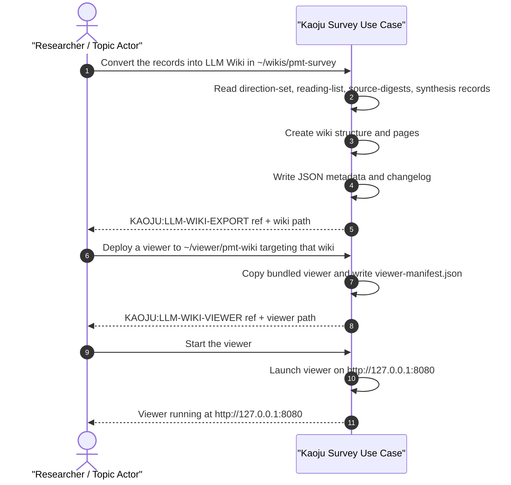

# Use Case 07: Export Survey Records To LLM Wiki And Deploy Viewer

## Actor Goal

As a researcher or Topic Actor, I want to export the survey records into an LLM Wiki and deploy its bundled web viewer, so that I can browse the survey materials, source digests, claims, and synthesis in a cross-linked, navigable knowledge base.

## Use Case

The system reads accepted Kaoju survey artifacts from the state database and converts them into the LLM Wiki representation consumed by a package-owned compatible viewer. The implementation does **not** invoke the external `imsight-llm-wiki` skill workflow. It produces human-readable pages under `wiki/` and one canonical JSON metadata file that maps exact artifact revisions to generated paths. Unless the actor supplies an override, `isomer-cli` resolves managed wiki and viewer targets inside the Topic Workspace. Re-export updates recognized managed files in place through staged writes, preserves unrecognized files, and records a changelog. The deployed viewer manifest points to the wiki root, and the viewer launcher serves the wiki on a local port.

## Supported Actions

### Convert Records To LLM Wiki

Export Kaoju survey records into an LLM Wiki at the resolved Topic Workspace default or an actor-supplied path.

- context
  - Actor **has** accepted survey artifacts in the topic workspace state database.
  - System **has** the artifact records, the LLM Wiki representation contract, and a resolved or actor-supplied target path.
- intent
  - Actor **wants** the survey materials converted into a browseable wiki.
  - Actor **wonders** "Convert the records into an LLM Wiki in `~/wikis/predictive-memory-tiering`."
- action
  - Actor then **asks** the system to convert the records and may provide a target-directory override.
- result
  - Actor **gets** a populated LLM Wiki directory and a durable `KAOJU:LLM-WIKI-EXPORT` record with metadata and a link to the wiki root.

### Deploy Viewer To Target Wiki

Deploy the package-owned compatible viewer to the resolved Topic Workspace default or an actor-supplied directory, configured to point at the wiki.

- context
  - Actor **has** an LLM Wiki export at a known path.
  - System **has** the viewer assets in installed Isomer Labs package resources.
- intent
  - Actor **wants** a local web viewer for the exported wiki.
  - Actor **wonders** "Deploy a viewer to `~/viewer/predictive-memory-tiering` targeting that wiki."
- action
  - Actor then **asks** the system to deploy the viewer and may provide an installation-directory override.
- result
  - Actor **gets** a deployed viewer directory with a manifest file pointing to the wiki root, plus a `KAOJU:LLM-WIKI-VIEWER` record.

### Start Viewer

Launch the deployed viewer on a local port.

- context
  - Actor **has** a deployed viewer directory.
  - System **has** the viewer manifest and an available local port.
- intent
  - Actor **wants** to browse the wiki in a web browser.
  - Actor **wonders** "Start the viewer."
- action
  - Actor then **asks** the system to start the viewer.
- result
  - Actor **gets** the viewer running at a local URL (e.g., `http://127.0.0.1:8080`).

## Main Flow

1. Actor asks the system to convert the survey records into an LLM Wiki, optionally at a supplied path.
2. System reads the accepted survey artifacts from the topic workspace state database.
3. System creates the LLM Wiki directory structure: `README.md`, `wiki/index.md`, `wiki/concepts/`, `wiki/entities/`, `wiki/summaries/`, `raw/`, `audit/`, `log/`, `outputs/`.
4. System converts each survey artifact into wiki pages with YAML frontmatter and canonical wikilinks.
5. System writes canonical JSON metadata describing the exported records, their provenance, and the mapping from Kaoju artifact ids to wiki page paths.
6. System registers the export as `KAOJU:LLM-WIKI-EXPORT` in the state database with metadata and a filesystem link.
7. Actor asks the system to deploy a viewer to a target directory, pointing at the wiki.
8. System copies the bundled viewer source to the target directory and writes a `viewer-manifest.json` (or YAML) file containing the wiki root path, viewer version, deployment timestamp, and default port.
9. System registers the deployment as `KAOJU:LLM-WIKI-VIEWER` in the state database.
10. Actor asks the system to start the viewer.
11. System reads the viewer manifest, resolves an available port, and launches the viewer process.
12. System reports the local URL and process information to the actor.

## Alternative And Exception Flows

- **A1. Managed wiki already exists**: If the target contains a recognized export manifest, the system stages and applies an in-place update of managed files and writes a changelog. An unrecognized non-empty target requires clarification.
- **A2. Viewer already deployed**: If the viewer directory contains a recognized viewer manifest, the system refreshes managed assets in place and records the change. An unrecognized non-empty target requires clarification.
- **A3. Port in use**: If the default port is busy, the system tries the next available port and reports the actual port.
- **A4. Partial export**: If some survey artifacts are missing, the system exports what is available and records the gaps in the metadata.
- **E1. Missing viewer dependencies**: If `node`/`npm` and `bun` are unavailable, the system reports a blocker with installation guidance.
- **E2. Viewer launch failure**: If the viewer fails to start, the system reports the error log and asks whether to retry or reconfigure.

## Mermaid Flow Diagram



## Mermaid Sequence Diagram



## Durable Outputs

Each durable output below is registered as an entry in the topic workspace state database. The entry contains the artifact metadata and a link to the actual file stored in the topic workspace filesystem or the user-specified export path, so the agent can look it up by querying the state DB rather than scanning directories.

- `KAOJU:LLM-WIKI-EXPORT` — record of the exported LLM Wiki, including wiki root path and exported artifact ids.
- `KAOJU:LLM-WIKI-METADATA` — canonical JSON metadata describing the exported records, page mappings, provenance, and managed-path ownership.
- `KAOJU:LLM-WIKI-VIEWER` — record of the deployed viewer, including viewer directory and target wiki.
- `KAOJU:LLM-WIKI-VIEWER-MANIFEST` — manifest file inside the viewer directory pointing to the wiki root and recording deployment settings.

## Wiki Page Mapping

Survey artifacts map to LLM Wiki pages as follows:

| Survey Artifact | Wiki Location | Page Type |
| --- | --- | --- |
| `KAOJU:DIRECTION-SET` | `wiki/concepts/Survey-Directions/index.md` or `wiki/concepts/Survey-Scope.md` | concept |
| `KAOJU:READING-LIST` (per direction) | `wiki/concepts/<direction-slug>/Reading-List.md` | concept |
| `KAOJU:SOURCE-DIGEST` (per item) | `wiki/summaries/<item-slug>.md` | summary |
| `KAOJU:CLAIM-EVIDENCE-LEDGER` | `wiki/concepts/Claims-And-Evidence.md` | concept |
| `KAOJU:FIELD-SUMMARY` | `wiki/concepts/Field-Summary.md` | concept |
| `KAOJU:RELATED-WORK-CATALOG` | `wiki/concepts/Related-Work-Catalog.md` | concept |
| `KAOJU:PAPER-DRAFT-MYST` | `wiki/concepts/Paper-Draft.md` or `outputs/paper-draft.md` | concept / output |

## Metadata Schema

The `KAOJU:LLM-WIKI-METADATA` file includes at minimum:

```json
{
  "wiki_root": "~/wikis/pmt-survey",
  "exported_at": "2026-07-14T12:00:00Z",
  "source_topic_workspace": "predictive-memory-tiering-survey",
  "artifact_mapping": [
    {
      "kaoju_id": "KAOJU:DIRECTION-SET",
      "wiki_page": "wiki/concepts/Survey-Scope.md"
    },
    {
      "kaoju_id": "KAOJU:SOURCE-DIGEST:vllm-cacheconfig",
      "wiki_page": "wiki/summaries/vllm-cacheconfig.md"
    }
  ],
  "viewer": {
    "default_port": 8080,
    "manifest_path": "~/viewer/pmt-wiki/viewer-manifest.json"
  }
}
```

## Example Prompt And Expected AI Response

### Event 001 - Convert Records To LLM Wiki

> Time: `2026-07-14T11:10:00Z` · Session: `topic:predictive-memory-tiering-survey`

User Prompt:

> Convert the records into LLM Wiki in `~/wikis/pmt-survey`.

AI:

> Converting the survey records into an LLM Wiki at `~/wikis/pmt-survey`.
>
> Created the wiki structure and exported 1 direction set, 2 reading lists, 6 source digests, 1 claim-evidence ledger, 1 field summary, 1 related-work catalog, and 1 paper draft.
>
> I also wrote `KAOJU:LLM-WIKI-METADATA.json` with the artifact-to-page mapping and recorded the managed-file changelog.
>
> Registered as `KAOJU:LLM-WIKI-EXPORT` (`export-...`). Next, you can deploy a viewer.

### Event 002 - Deploy And Start Viewer

> Time: `2026-07-14T11:15:00Z` · Session: `topic:predictive-memory-tiering-survey`

User Prompt:

> Deploy a viewer to `~/viewer/pmt-wiki` targeting that wiki, then start it.

AI:

> Deployed the LLM Wiki viewer to `~/viewer/pmt-wiki` and wrote `viewer-manifest.json` pointing to `~/wikis/pmt-survey`.
>
> Registered as `KAOJU:LLM-WIKI-VIEWER` (`viewer-...`).
>
> Started the viewer at `http://127.0.0.1:8080`.

## Assumptions And Decisions

- Assumption: The export and viewer deployment are implemented as a self-contained Isomer Labs system extension or CLI command, not by invoking the external `imsight-llm-wiki` skill.
- Assumption: The exported wiki representation is compatible with the package-owned viewer selected after license and provenance review.
- Assumption: The package-owned viewer can be deployed to a resolved Topic Workspace target or an actor-supplied installation directory and started independently.
- Assumption: The target wiki path and viewer path are either user-supplied or resolved through `isomer-cli`; both are recorded in the state database.
- Decision: The default wiki and viewer targets resolve inside the Topic Workspace. The actor may override either target explicitly.
- Decision: The mapping metadata uses one canonical JSON representation; the exporter does not maintain a second YAML form.
- Decision: Re-export updates recognized managed files in place through staged writes, preserves unrecognized files, reports created, changed, unchanged, stale, and removed managed paths, and writes a changelog. Artifact revisions and checksummed manifests retain durable export history even though the target tree presents the current export.
