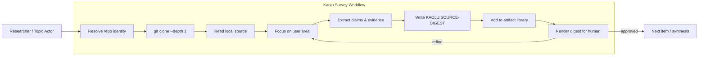
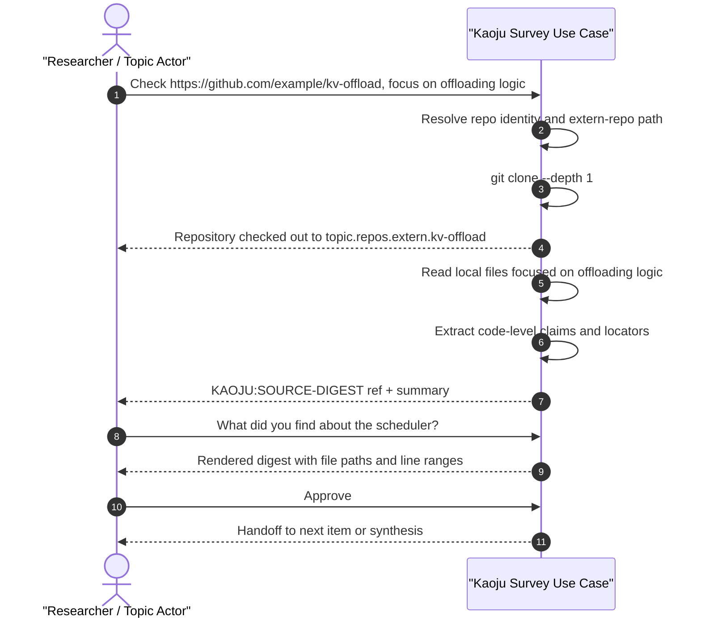

# Use Case 08: Ingest Source Code By Link Or Name

## Actor Goal

As a researcher or Topic Actor, I want to give the agent a source-code URL and ask it to check out and ingest the code in depth, focusing on specific aspects I care about, so that the repository becomes part of the surveyed artifacts.

## Use Case

The actor provides either a source-code URL or a name (e.g., a repository name, project name, or paper title) and tells the agent what to focus on. If a name is given, the system searches online for the most likely repository, verifies it, and clones it with `git clone --depth 1` into the topic workspace's extern-repo location. If the repository cannot be found or is inaccessible, the system reports a blocker and stops. The agent then reads the local copy, focusing on the actor's specified area, extracts code-level claims and evidence grounded in file locators, and produces a structured `KAOJU:SOURCE-DIGEST`. The repository is added to the artifact library and optionally to the current direction's `KAOJU:READING-LIST`. All artifacts are registered in the state database.

## Supported Actions

### Ingest Source Code By Link

Check out a source-code repository from a URL and ingest it in depth.

- context
  - Actor **has** a repository URL or a name (project name, repo name, or paper title) and a focus area.
  - System **has** the topic workspace, extern-repo path resolution through `isomer-cli`, search providers, and Kaoju extraction rules.
- intent
  - Actor **wants** the repository added to the survey and its relevant implementation understood.
  - Actor **wonders** "Check this repo, read the source code, and ingest it in depth, focusing on the offloading logic."
- action
  - Actor then **provides** the URL or name and focus area and asks the system to ingest the repository.
- result
  - Actor **gets** a durable `KAOJU:SOURCE-DIGEST` for the code, the repository checked out in the artifact library, and optionally a new reading-list item.

### Inspect Code Source Digest

Review the structured digest produced from the repository.

- context
  - Actor **has** a `KAOJU:SOURCE-DIGEST` for the ingested code.
  - System **has** the digest artifact and the cloned repository.
- intent
  - Actor **wants** to verify what the agent extracted from the code.
  - Actor **wonders** "What did you find in the repository about the scheduler?"
- action
  - Actor then **asks** the system to show the digest.
- result
  - Actor **gets** the rendered digest with code-level claims, locators, excerpts, and focus-area summary.

## Main Flow

1. Actor provides a repository URL or name, and a focus area.
2. If the actor provided a name, the system searches online for the most likely repository URL and verifies it.
3. If no repository is found or the found repository is inaccessible, the system records a `KAOJU:SOURCE-ACCESS-BLOCKER` and reports a blocker to the actor.
4. System resolves the repository identity and determines a stable name/slug.
5. System queries `isomer-cli` for the resolved extern-repo path (e.g., `topic.repos.extern.<repo-name>`).
6. System clones the repository with `git clone --depth 1` into the extern-repo location.
7. System reads the local copy, focusing on the actor's specified area: key files, modules, README, docs, tests, and configuration.
8. System extracts claims, evidence, code excerpts, contradictions, limitations, and architecture notes, grounding each in file paths and line ranges.
9. System writes the `KAOJU:SOURCE-DIGEST` artifact and adds the repository to `KAOJU:ARTIFACT-LIBRARY`.
10. System optionally appends the repository as a new item to the current direction's `KAOJU:READING-LIST`.
11. Actor reviews the digest and approves it or asks for deeper inspection of specific files.
12. System updates the digest and reports the next allowed stage (next item, synthesis, or paper writing).

## Alternative And Exception Flows

- **A1. Name resolution ambiguity**: If the actor provided a name and multiple candidate repositories are found, the system lists them and asks the actor to pick one.
- **A2. Already cloned**: If the repository already exists in the artifact library, the system offers to pull/refresh, reuse the existing clone, or re-clone.
- **A3. Not a git repository**: If the URL points to an archive or non-git source, the system downloads and extracts it instead of cloning.
- **A4. Focus area too broad**: If the actor's focus area is too broad for the repository size, the system asks for narrower file patterns or modules.
- **E1. Repository not found or inaccessible**: If the system cannot find or access the repository for a given name or URL, it records a `KAOJU:SOURCE-ACCESS-BLOCKER` and reports a blocker to the actor.
- **E2. Clone failure**: If `git clone --depth 1` fails, the system reports the error, records attempted URL and ref, and asks whether to retry or fall back to online browsing.
- **E3. Focus area not found**: If the repository does not appear to contain content relevant to the focus area, the system reports the gap and asks whether to broaden the focus or skip the repository.

## Mermaid Flow Diagram

## Mermaid Sequence Diagram

## Durable Outputs

Each durable output below is registered as an entry in the topic workspace state database. The entry contains the artifact metadata and a link to the actual file stored in the topic workspace filesystem, so the agent can look it up by querying the state DB rather than scanning directories.

- `KAOJU:SOURCE-DIGEST` — structured extraction for the repository, with code-level claims, evidence, locators, excerpts, and focus-area summary.
- `KAOJU:ARTIFACT-LIBRARY` — checked-out source code, plus an index entry mapping the URL to the workspace path.
- `KAOJU:READING-LIST` — optional updated reading list with the new repository item.
- `KAOJU:DISCOVERY-LEDGER` — acquisition and extraction provenance.
- `KAOJU:CLAIM-EVIDENCE-LEDGER` — extracted claims linked to source files and line ranges.

## Source Digest Fields

Each `KAOJU:SOURCE-DIGEST` for a code repository includes:

| Field | Description |
| --- | --- |
| `digest_id` | Stable identifier for the digest. |
| `source_identity` | Repository URL, name, slug, commit/ref, and clone timestamp. |
| `artifact_library_ref` | Workspace label (e.g., `topic.repos.extern.kv-offload`) resolved through `isomer-cli`, plus local path. |
| `focus_area` | The aspect the actor asked the agent to focus on. |
| `claims` | Code-level claims with file-path and line-range locators. |
| `evidence` | Supporting code snippets, configuration, tests, or documentation excerpts. |
| `excerpts` | Reusable code blocks with exact file paths and line numbers. |
| `contradictions` | Contradictions between code and paper claims if a linked paper exists. |
| `limitations` | Scope limits, missing tests, hardcoded assumptions, or TODOs found in code. |
| `related_items` | References to linked papers, issues, or other reading-list items. |
| `extraction_provenance` | Which files and directories were inspected and how. |
| `status` | draft, approved, blocked, or needs-revision. |

## Example Prompt And Expected AI Response

### Event 001 - Ingest Source Code By Link

> Time: `2026-07-14T11:20:00Z` · Session: `topic:predictive-memory-tiering-survey`

User Prompt:

> Check https://github.com/example/kv-offload. Read the source code and ingest it in depth, focusing on the offloading logic.

AI:

> Checking out **https://github.com/example/kv-offload** and ingesting it with focus on the offloading logic.
>
> Cloned the repository into the artifact library as `topic.repos.extern.kv-offload` with `--depth 1` and produced `KAOJU:SOURCE-DIGEST` (`digest-...`).
>
> Key findings:
> - Offloading is triggered in `src/memory/offload.py` around line 142 when GPU memory exceeds a threshold.
> - The scheduler uses a priority queue defined in `src/scheduler/priority_queue.py`.
> - CPU fallback is implemented but not covered by unit tests.
>
> You can ask: "What did you find about the scheduler?"

### Event 002 - Inspect Code Source Digest

> Time: `2026-07-14T11:21:00Z` · Session: `topic:predictive-memory-tiering-survey`

User Prompt:

> What did you find about the scheduler?

AI:

> **Source digest for kv-offload — scheduler focus**
>
> **Claims**
> 1. The scheduler is a multi-level priority queue with GPU-resident, prefetch, and CPU-offloaded tiers. (confidence: high, locator: `src/scheduler/priority_queue.py:34-58`)
> 2. Prefetch decisions are made per-layer and do not consider cross-layer reuse. (confidence: medium, locator: `src/scheduler/layer_policy.py:91-103`)
>
> **Evidence**
> - Code snippet from `priority_queue.py` showing tier insertion logic.
> - Configuration default `prefetch_enabled=True` in `config/defaults.yaml`.
>
> **Limitations**
> - No tests for CPU-offload path in the test suite.
> - Hardcoded threshold at `gpu_memory_fraction=0.85`.
>
> Status: draft. Approve, ask for deeper inspection, or request re-ingestion.

## Assumptions And Decisions

- Assumption: The actor may provide either a repository URL or a name; names are resolved through online search before cloning.
- Assumption: If the repository cannot be found or accessed, the system reports a blocker rather than proceeding with a guess.
- Assumption: The repository is git-based and can be cloned with `git clone --depth 1` when a valid URL is resolved.
- Assumption: The actor provides either a focus area or accepts the agent's default broad inspection.
- Assumption: `isomer-cli` can resolve extern-repo paths for the cloned repository.
- Decision: When given a repository, the agent automatically performs bounded associated-paper metadata discovery. A candidate paper receives no evidentiary authority or deep ingestion until its relationship is verified and it passes the normal selection and approval path.
- Decision: Repository acquisition uses depth one by default and deepens history only when identity resolution or the approved inspection requires historical evidence. Repository size or focus-area inspection alone does not require full history.
