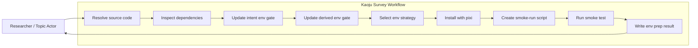
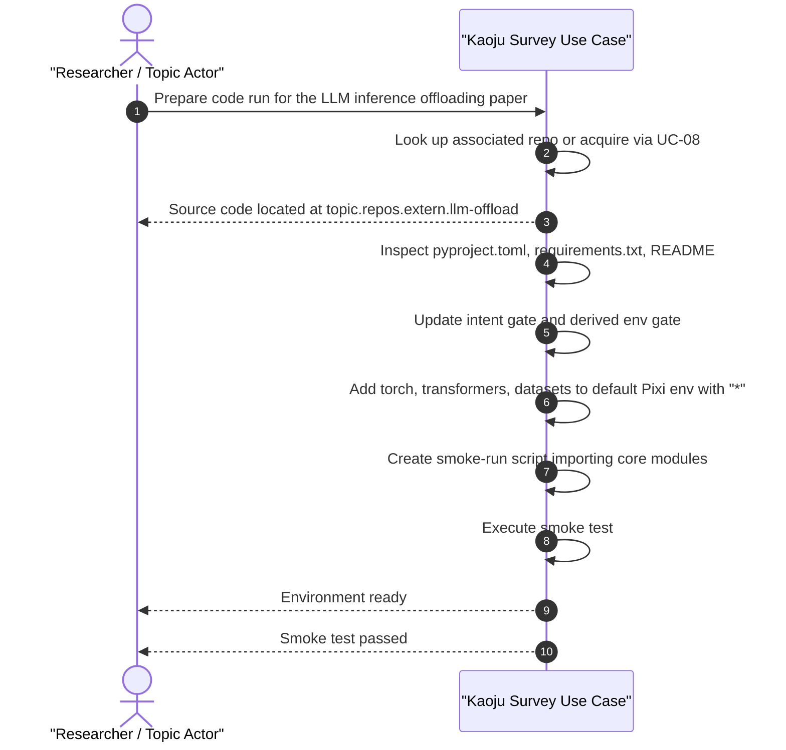

# Use Case 09: Prepare Code Run Environment

## Actor Goal

As a researcher or Topic Actor, I want the agent to prepare the environment for running a paper's or repository's source code, so that the code can be executed without manual dependency setup.

## Use Case

The actor points to a paper or source-code repository and asks the agent to prepare a code-run environment. The system first ensures the source code exists in the topic workspace: if the actor named a paper, the system looks for an associated repository already acquired by UC-03 or UC-08; if none exists, it attempts to find and acquire one. The system inspects the source code for dependency hints, then updates the topic environment gate: it records the intent-level requirements (what the run needs) and the derived gate (what actually gets installed). The system installs packages with Pixi, preferring to reuse an existing environment and add packages without breaking it, preferring the `default` environment. If the requirements cannot be safely added to an existing environment, it creates a new Pixi environment. When integrating dependencies, the agent does not insist on exact versions from the target repository; it uses `*` or compatible ranges so Pixi can resolve a working set. Finally, the system creates a smoke-run script that exercises the task-critical code path to verify the environment is functional.

## Supported Actions

### Prepare Code Run Environment

Inspect a repository, update the topic env gate, install dependencies, and verify with a smoke run.

- context
  - Actor **has** a paper or repository reference.
  - System **has** the topic workspace, source-code acquisition routes (UC-03/UC-08), and Pixi environment management.
- intent
  - Actor **wants** the environment ready for a future code run.
  - Actor **wonders** "Prepare code run for this paper."
- action
  - Actor then **asks** the system to prepare the code-run environment.
- result
  - Actor **gets** updated env gates, an installed/verified Pixi environment, a smoke-run script, and durable records for each.

### Verify Prepared Environment

Run the smoke script to confirm the environment can execute the task-critical code.

- context
  - Actor **has** a prepared environment from the prepare action.
  - System **has** the smoke-run script and the installed environment.
- intent
  - Actor **wants** to confirm the preparation succeeded before the real trial.
  - Actor **wonders** "Did the environment preparation work?"
- action
  - Actor then **asks** the system to run the smoke test.
- result
  - Actor **gets** the smoke-run result and any necessary fixes.

## Main Flow

1. Actor asks the system to prepare a code run for a paper or repository.
2. System resolves the source code:
   - If a repository URL/name is given, route to UC-08 to acquire it.
   - If a paper is given, look for an associated source-code ref in `KAOJU:ASSOCIATED-SOURCE-CODE` or search for one online.
   - If source code cannot be found or accessed, record a `KAOJU:SOURCE-ACCESS-BLOCKER` and report a blocker.
3. System verifies the source code exists in the topic workspace artifact library.
4. System inspects the source code for dependency hints: `pixi.toml`, `pyproject.toml`, `requirements.txt`, `setup.py`, `environment.yml`, `Cargo.toml`, `package.json`, README install instructions, import statements, etc.
5. System updates the topic env gate:
   - `topic.intent.env_requirements` — what the run needs (e.g., "PyTorch + transformers + datasets").
   - `topic.env.derived_gate` — the concrete packages, channels, and version constraints chosen for installation.
6. System selects an environment strategy in this order:
   - If an existing Pixi environment already satisfies the requirements, reuse it.
   - Otherwise, if the required packages can be added to an existing environment (prefer `default`) without breaking it, add them with compatible/`"*"` version constraints.
   - Otherwise, create a new dedicated Pixi environment for this run.
7. System installs the dependencies using the selected strategy.
8. System creates a smoke-run script that imports and exercises the task-critical code path.
9. System runs the smoke script and records the result.
10. System writes durable artifacts and reports the prepared environment to the actor.

## Alternative And Exception Flows

- **A1. Source code already acquired**: If the repository is already in the artifact library, the system skips acquisition and uses the existing clone.
- **A2. Multiple candidate repos**: If a paper has multiple associated repositories, the system lists them and asks the actor to choose one.
- **A3. Existing env already sufficient**: If the current environment already satisfies the inferred requirements, the system records that and creates only the smoke-run script.
- **A4. Smoke run warns but passes**: If the smoke run succeeds with warnings, the system reports the warnings and asks whether to proceed.
- **E1. Source code not found**: If no source code can be found for a paper, the system reports a blocker.
- **E2. Dependency unsatisfiable**: If Pixi cannot resolve a working set even with `*` constraints, the system reports a blocker and asks the actor to provide a channel or environment override.
- **E3. Smoke run fails**: If the smoke run fails, the system captures the error log, attempts a bounded set of fixes, and asks the actor whether to retry or abort.

## Mermaid Flow Diagram

## Mermaid Sequence Diagram

## Durable Outputs

Each durable output below is registered as an entry in the topic workspace state database. The entry contains the artifact metadata and a link to the actual file stored in the topic workspace filesystem, so the agent can look it up by querying the state DB rather than scanning directories.

- `KAOJU:ENV-PREP-PLAN` — plan describing source code, inferred dependencies, and chosen environment strategy.
- `KAOJU:ENV-GATE-REVISION` — record of the updated intent gate and derived gate.
- `KAOJU:PIXI-ENV-REF` — reference to the selected Pixi environment (existing or newly created).
- `KAOJU:SMOKE-RUN-SCRIPT` — the smoke-run script created to verify the environment.
- `KAOJU:SMOKE-RUN-RESULT` — result of executing the smoke-run script.
- `KAOJU:SOURCE-ACCESS-BLOCKER` — if source code cannot be found or accessed.

## Environment Strategy Preference

The agent chooses the environment using this ordered preference:

1. **Reuse existing satisfying env**: If an existing Pixi environment already has the required packages, use it.
2. **Add to existing env**: If the required packages can be added to an existing env without breaking it, prefer the `default` env, then other existing envs. Use `"*"` or compatible version constraints rather than exact repo-specified versions.
3. **Create new env**: If adding the packages would break existing envs or no suitable env exists, create a new Pixi environment dedicated to this code run.

## Example Prompt And Expected AI Response

### Event 001 - Prepare Code Run Environment

> Time: `2026-07-14T11:40:00Z` · Session: `topic:predictive-memory-tiering-survey`

User Prompt:

> Prepare code run for the LLM inference offloading paper.

AI:

> I located the associated repository at `topic.repos.extern.llm-offload` and inspected its dependencies.
>
> Env prep plan (`KAOJU:ENV-PREP-PLAN`):
> - Source: `topic.repos.extern.llm-offload`
> - Inferred dependencies: `torch`, `transformers`, `datasets`, `numpy`
> - Strategy: add to existing `default` Pixi env with `"*"` constraints
> - Smoke test: import `llm_offload.model` and call `build_offload_config()`
>
> Installing packages and running smoke test...
>
> Environment ready. Smoke test passed. You can now run the actual trial.

## Assumptions And Decisions

- Assumption: Source-code acquisition is handled by UC-03 (associated code for papers) or UC-08 (direct link/name).
- Assumption: The agent can infer environment requirements from standard dependency files, import statements, and README instructions.
- Assumption: Pixi is available and the topic workspace has at least a `default` Pixi environment.
- Assumption: Exact dependency versions from the target repository are not required; Pixi can resolve compatible versions when `"*"` or loose constraints are used.
- Decision: `KAOJU:PIXI-ENV-REF` records exact resolved versions and lock identity after resolution while the environment plan retains the actor's flexible intent constraints.
- Decision: The canonical smoke-run script is a file-backed Artifact stored under a resolved owner-preserved `topic.records.*` surface. It is not kept beside external source code or canonically under a Local Tmp Surface; the Run may execute a disposable staged copy.
