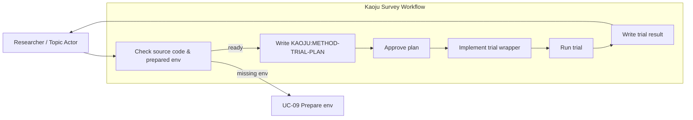
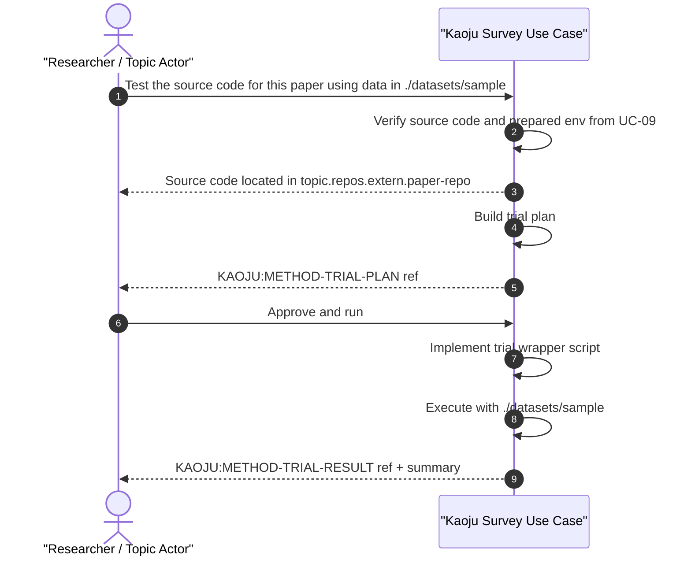

# Use Case 10: Run Source Code Trial

## Actor Goal

As a researcher or Topic Actor, I want to run a paper's or repository's source code with a chosen dataset, so that I can verify claims, reproduce numbers, or observe behavior first-hand.

## Use Case

The actor points to a paper or source-code repository and asks the agent to test its source code with either data from a given dataset path or randomly generated data. The system assumes the source code has already been acquired (UC-03 or UC-08) and the environment has been prepared (UC-09). It produces a `KAOJU:METHOD-TRIAL-PLAN` describing the run command, data strategy, and expected outputs. After the actor approves the plan, the agent implements or adapts the minimal wrapper needed to run the source code with the chosen data, executes it, and records the run and result as durable artifacts. If the source code or prepared environment is missing, the system routes to UC-09 or reports a blocker.

## Supported Actions

### Plan Source Code Trial

Inspect the source code and the chosen data approach and produce a trial plan.

- context
  - Actor **has** a paper or repository reference, acquired source code, and a prepared environment from UC-09.
  - System **has** the topic workspace, source-code acquisition routes (UC-03/UC-08), and the prepared Pixi environment.
- intent
  - Actor **wants** to know what will be run, what data will be used, and what outputs are expected.
  - Actor **wonders** "Can you test this repo on the sample dataset?"
- action
  - Actor then **asks** the system to plan a source-code trial.
- result
  - Actor **gets** a durable `KAOJU:METHOD-TRIAL-PLAN` artifact with source location, data strategy, run command, and expected outputs.

### Run Source Code Trial

Execute the approved trial with the chosen data.

- context
  - Actor **has** an approved `KAOJU:METHOD-TRIAL-PLAN`.
  - System **has** the source code, data path or random-data generator, and a prepared environment from UC-09.
- intent
  - Actor **wants** the code to run and produce observable results.
  - Actor **wonders** "Run the trial now."
- action
  - Actor then **asks** the system to run the trial.
- result
  - Actor **gets** durable `KAOJU:METHOD-TRIAL-RUN` and `KAOJU:METHOD-TRIAL-RESULT` artifacts with execution logs, outputs, and interpretation.

## Main Flow

1. Actor asks to test a paper's or repository's source code with data in `<dataset-path>` or with random data.
2. System checks that the source code exists in the topic workspace artifact library and that a prepared environment is available.
3. If the environment is not prepared, the system routes to UC-09 and reports a blocker for the current run.
4. System produces a `KAOJU:METHOD-TRIAL-PLAN` describing the run command, expected inputs/outputs, data strategy, and environment ref.
5. Human reviews and approves the plan.
6. System implements or adapts the minimal wrapper/script needed to run the source code with the chosen data.
7. System executes the trial and captures stdout, stderr, exit code, artifacts, and timing.
8. System writes `KAOJU:METHOD-TRIAL-RUN` and `KAOJU:METHOD-TRIAL-RESULT` artifacts and registers them in the state database.
9. Actor reviews the result and asks for re-runs, parameter changes, or approval.

## Alternative And Exception Flows

- **A1. Source code already acquired**: If the repository is already in the artifact library, the system skips acquisition.
- **A2. Multiple candidate repos**: If a paper has multiple associated repositories, the system lists them and asks the actor to choose one.
- **A3. Random data requested**: If the actor asks for random data, the system generates or synthesizes a compatible input instead of reading a dataset path.
- **A4. Re-run with different data**: If the actor wants to re-run with a different dataset, the system updates the plan and repeats the run.
- **E1. Source code not found**: If no source code can be found for a paper, the system reports a blocker.
- **E2. Environment not prepared**: If UC-09 has not prepared an environment for this source code, the system routes to UC-09 and reports a blocker.
- **E3. Trial execution failure**: If the run fails, the system captures the error log, reports the failure, and asks whether to fix the wrapper, adjust parameters, or abort.

## Mermaid Flow Diagram

## Mermaid Sequence Diagram

## Durable Outputs

Each durable output below is registered as an entry in the topic workspace state database. The entry contains the artifact metadata and a link to the actual file stored in the topic workspace filesystem, so the agent can look it up by querying the state DB rather than scanning directories.

- `KAOJU:METHOD-TRIAL-PLAN` — plan describing source code, data strategy, run command, and expected outputs.
- `KAOJU:METHOD-TRIAL-RUN` — execution record with command, environment, logs, and timing.
- `KAOJU:METHOD-TRIAL-RESULT` — interpreted results, observed outputs, and comparison to source claims when applicable.
- `KAOJU:SOURCE-ACCESS-BLOCKER` — if source code cannot be found or accessed.

## Trial Plan Fields

A `KAOJU:METHOD-TRIAL-PLAN` includes:

| Field | Description |
| --- | --- |
| `trial_id` | Stable identifier for the trial. |
| `source_ref` | Reference to the source paper or repository. |
| `source_code_path` | Workspace label/path to the checked-out source code. |
| `data_strategy` | `dataset_path` or `random_data`. |
| `dataset_path` | If using real data, path to the dataset. |
| `pixi_env_ref` | Reference to the prepared Pixi environment from UC-09. |
| `run_command` | Proposed command or script to execute the trial. |
| `expected_outputs` | Expected files, metrics, or console output. |

## Example Prompt And Expected AI Response

### Event 001 - Plan Source Code Trial

> Time: `2026-07-14T11:30:00Z` · Session: `topic:predictive-memory-tiering-survey`

User Prompt:

> Test the source code for the LLM inference offloading paper using data in `./datasets/sample-prompts`.

AI:

> I located the associated repository at `topic.repos.extern.llm-offload` and the prepared Pixi environment from UC-09.
>
> Trial plan (`KAOJU:METHOD-TRIAL-PLAN`):
> - Source: `topic.repos.extern.llm-offload`
> - Data: `./datasets/sample-prompts`
> - Pixi env: `default`
> - Run command: `python scripts/run_offload_demo.py --model gpt2 --dataset ./datasets/sample-prompts`
>
> Approve the plan to run the trial.

### Event 002 - Run Trial

> Time: `2026-07-14T11:35:00Z` · Session: `topic:predictive-memory-tiering-survey`

User Prompt:

> Approve and run.

AI:

> Plan approved.
>
> Registered the minimal wrapper as a file-backed Artifact and executed a Run-tied staged copy.
>
> Result (`KAOJU:METHOD-TRIAL-RESULT`):
> - Exit code: 0
> - Throughput: 12.3 tokens/sec with offloading enabled
> - Peak GPU memory: 4.1 GB
> - Raw output registered with the immutable trial Run
>
> The observed throughput is lower than the 18 tokens/sec reported in the paper; the run log and wrapper are available for review.

## Assumptions And Decisions

- Assumption: Source-code acquisition is handled by UC-03 (associated code for papers) or UC-08 (direct link/name).
- Assumption: Environment preparation is handled by UC-09 before this use case runs.
- Assumption: The actor may provide a dataset path or ask for random/synthetic data.
- Decision: The agent always records a minimal durable wrapper. When an upstream or paper command fits the approved task and prepared environment, the wrapper invokes that command and records exact-command fidelity. Otherwise it makes the smallest necessary recorded adaptation and does not label the result as exact-command reproduction.
- Decision: An approved trial may retry an identical request after a transient failure within its recorded bound. Any repair that changes dependencies, source commit, data, wrapper semantics, evaluator or metrics, resource limits, or evidence interpretation requires a revised plan and human Gate; every attempt remains a separate Run.
