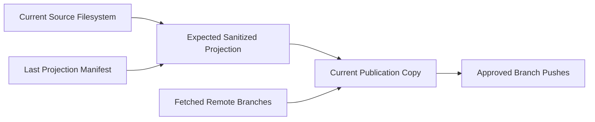

# Topic Workspace Git

Topic Workspace Git provides two optional, disabled-by-default capabilities: local root history inside the canonical Topic Workspace and sanitized remote publication through a disposable copy. They are independent. Neither layer requires, enables, triggers, disables, or mutates the other.

| Local Tracking | Remote Publication | Valid Meaning |
| --- | --- | --- |
| Disabled | Disabled | Default Topic Workspace behavior. |
| Enabled | Disabled | Local root history with no Topic Git remote operation. |
| Disabled | Enabled | Sanitized publication from current filesystem content with no root repository. |
| Enabled | Enabled | Separate local and publication plans, state, outcomes, and recovery. |

Use `$isomer-op-entrypoint use topic-git to <task>` for concrete work. A request that says only “track” or “version” starts with read-only overall status so the operator can distinguish local history from remote publication. Topic Git operations are protected skill workflows, not an `isomer-cli` Git mutation command family.

## Terminology and Topology

Source Topic Workspace is the contextual role of the canonical Topic Workspace when contrasted with published material. It is not another schema type or a fourth workspace.

Topic Publication Copy is an ignored Project-local derived projection used for privacy review, fresh sanitized Git histories, submodule construction, and remote push. It is disposable and rebuildable after a successful publication. It is not a Topic Workspace, Topic Actor Workspace, Agent Workspace, canonical source, Workspace Runtime, Artifact authority, or research record source.

The three-workspace taxonomy remains unchanged:

- Topic Workspace is the topic-level work area declared by the Project Manifest.
- Topic Actor Workspace is a human-orchestrated topic-local work area.
- Agent Workspace is a formal Agent Instance work area.

Topic Main remains the canonical development-repository anchor for Topic Actor and Agent worktrees. Local root tracking excludes those nested repositories. Publication creates fresh sanitized histories and never imports their source ancestry.

## Query and Git Boundary

Topic Git uses `isomer-cli --print-json` only to read selected Project, Research Topic, Topic Workspace, semantic-path, Topic Actor, Agent, and Workspace Runtime information. Typical queries include:

```bash
isomer-cli --print-json project self location
isomer-cli --print-json project self check --scope topic --topic my-topic
isomer-cli --print-json project context show --topic my-topic
isomer-cli --print-json project paths get topic.repos.main --topic my-topic
isomer-cli --print-json project topic-actors list --topic my-topic
isomer-cli --print-json project runtime inspect --topic my-topic
```

The operator pins and validates returned paths, then invokes Git directly with `git -C <validated-path> ...`. It does not guess from sibling directories, rely on ambient cwd, wrap Git in Isomer CLI, or hide Git inside a Python helper. Non-Git helpers may inventory, classify, sanitize, fingerprint, compare, validate schemas, and persist approved support files.

## Local Tracking

Local tracking creates an ordinary local repository at the Source Topic Workspace root after explicit approval. Local init, ignore, and commit require an existing valid Workspace Runtime because their schema-validated state lives under `<topic.runtime>/topic-git/`. Status and planning remain read-only when runtime is missing; Topic Git does not initialize Workspace Runtime or edit `state.sqlite`.

Before initialization, the operator discovers every ancestor Git top level and proves that the Source Topic Workspace and relevant existing content are absent from each ancestor index and effectively ignored. A tracked or unignored relationship blocks init. Topic Git never edits an ancestor `.gitignore` or removes ancestor index entries.

The root managed ignore block preserves user rules and excludes Workspace Runtime, `state.sqlite`, local environments, caches, logs, temporary files, credentials, canonical external repositories, Topic Main, Topic Actor Workspaces, and Agent Workspaces. Already tracked sensitive content blocks the ignore mutation because ignore rules do not untrack files.

Local planning selects exact whole files. Secret-like material produces a redacted warning and needs explicit local-history approval. Commit uses exact pathspec staging and verifies the complete index. Local operations never discover, add, change, fetch, pull, or push remotes.

An optional `topic-workspace-local-version.toml` may record relative nested semantic labels, branches, commit SHAs, and dirty booleans. It records pointers only; the root commit does not preserve uncommitted nested content.

## Publication Destination and Binding

Publication is available as soon as a Research Topic and Topic Workspace are registered. It does not require Workspace Runtime, intent completion, environment setup, Topic Main, actors, agents, local tracking, or local commits. Missing later-stage components are reported as unavailable.

Destination selection reuses a safe existing binding, prefers an effectively ignored Project-root `tmp/`, falls back to an effectively ignored `temp/`, accepts a declared ignored candidate that does not yet exist, and otherwise plans a bounded managed `tmp/` ignore block and directory creation. The default copy path is:

```text
<project-root>/<tmp-or-temp>/topic-workspace-publish/<topic-id>/
```

Project-root publication candidates are separate from the Topic Workspace semantic tmp labels `topic.tmp`, `topic.repos.main.tmp`, and `agent.tmp`. Those semantic surfaces remain local, ignored, disposable, and not durable evidence.

The path must stay inside the Project and outside the Source Topic Workspace, Project Config Directory, generated content root, Houmao state, canonical repositories, and worker workspaces.

A Publication Binding records the Research Topic, Topic Workspace, Project-relative copy path, remote name, credential-safe remote locator, and visibility acknowledgement. Valid visibility values are `private`, `restricted`, and `public`; `unknown` blocks push. Embedded credentials, signed query parameters, and fragments are rejected. Authentication stays in Git credential helpers, SSH agents, or user-selected provider tooling.

Before Workspace Runtime exists, binding, plan, conflict, and outcome state stays in `<topic-publication-copy>/.isomer/topic-git/`. That support root is ignored and excluded from publication commits. A later approved publish init or sync may promote a matching credential-safe binding under `<topic.runtime>/topic-git/`; read-only status does not.

## Privacy Projection

Publication inventories the current Source Topic Workspace filesystem through semantic surfaces. It does not use root Git HEAD, index, or tracked-file state as publication authority, so relevant untracked and uncommitted content remains eligible for review.

Every considered path receives one disposition:

| Disposition | Meaning |
| --- | --- |
| `track` | Copy reviewed current content unchanged. |
| `template` | Create an approved placeholder-bearing or sanitized output only in the Topic Publication Copy. |
| `exclude` | Omit private, runtime, disposable, unapproved, or irrelevant material and record why. |
| `component` | Build a fresh sanitized component repository and represent it as a submodule. |
| `block` | Stop until size, format, credential, private-key, signed-URL, license, or ambiguity risk is resolved. |

Structured sensitive values become descriptive placeholders such as `${OPENAI_API_KEY}`. Explicitly targeted sanitized text copies also stay inside the Topic Publication Copy. Unsupported binary and archive masking blocks publication. The workflow preserves every source file and rescans every output before it becomes eligible for a commit.

The copier never transfers `.git` directories, `.git` worktree files, Git configuration, objects, refs, reflogs, indexes, credential stores, source remotes, or source history. It also excludes Workspace Runtime, `state.sqlite`, local environments, caches, logs, temporary material, canonical external repositories, credentials, and unapproved records by default.

The tracked Publication Projection Manifest and `topic-workspace-version.toml` record relative mappings, transformations, output fingerprints, component branches, and sanitized commits. They omit absolute source paths, credentials, sensitive excerpts, raw private diffs, excluded content, source remote configuration, and source ancestry.

## Components and Same-Remote Submodules

Each plan selects every currently available Topic Main, registered Topic Actor Workspace, and selected-team Agent Workspace resolved through Isomer queries unless the user explicitly excludes it. Newly available topology stales an older plan and requires renewed privacy review.

| Source Component | Fresh Publication Branch |
| --- | --- |
| Topic Main | `topic-owner/main` |
| Topic Actor `<name>` | `per-topic-actor/<name>/main` |
| Agent `<name>` | `per-agent/<name>/main` |
| Sanitized superproject | `topic-workspace/main` |

All component branches and the superproject use the same credential-safe remote. `.gitmodules` names each deterministic branch, and the superproject pins exact sanitized component commits as gitlinks at source-relative paths. A recursive clone of `topic-workspace/main` checks out those unrelated sanitized component histories.

## Synchronization and Recovery

Publish sync compares five inputs:



An unchanged prior output may be updated. An output whose source disappeared may be deleted only while it still matches the last generated fingerprint. A destination-only edit combined with a source change, or an edited destination whose source disappeared, becomes a conflict. Sync overwrites neither side without an explicit resolution.

A missing Topic Publication Copy reports `copy-missing`. Sync can reconstruct it from a runtime binding or a resupplied remote, fetched deterministic branches, and sanitized manifests, then reinventory and rescan current source content. Losing an unpushed pre-runtime copy loses its local plan and requires preparation again.

Sync fetches every selected branch without merging and classifies refs as absent, compatible, or incompatible. Normal explicit-ref pushes cover absent and compatible refs. Each incompatible branch requires a fresh destructive plan that records the observed remote commit, exact replacement commit, displaced commits, push order, and warning, followed by separate branch-scoped approval. Any fetched ref change stales that approval. Topic Git never uses all-ref or mirror pushes and never deletes a remote branch.

Components commit and push first. The superproject then updates `.gitmodules`, gitlinks, the projection manifest, and version file and pushes `topic-workspace/main` last. Per-branch outcomes and a safe resume point make partial failure resumable. Until the final superproject push succeeds, the previously published `topic-workspace/main` remains the authoritative complete version.
