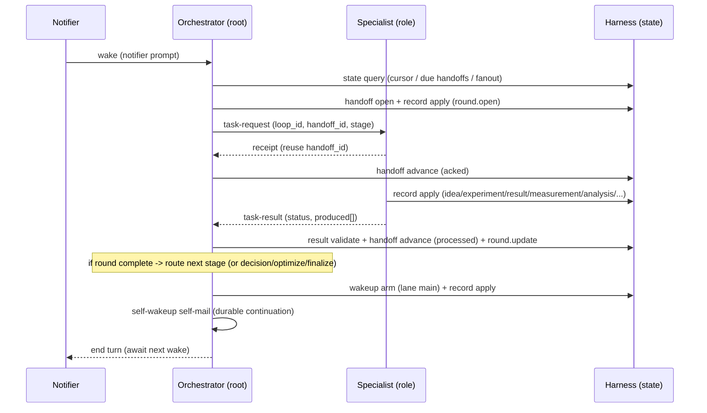

# Collaboration Process Overview — DeepResearch

Canonical process authority for the DeepResearch general-purpose research loop. All derived contracts
(participants, topology, comms, state, workspace, run) and every harness/skills/agent artifact follow
this model. Intention source: `intention/loop-overview.md`. State authority: `specs/state/state-overview.md`.
Comms authority: `specs/comms/templates.toml`.

## Summary

A domain-neutral autonomous research loop. The **Orchestrator** (root) drives a quest through bounded
rounds of a stage machine — `[intake-audit] → scope → baseline → idea → (optimize) → experiment →
analysis → decision → write → review → finalize` (extensible via `stage_catalog`; `intake-audit` is an
optional entry path, `optimize` is the algorithm-first frontier loop) — dispatching one stage at a time
to a specialist
role, collecting the result, recording durable state, deciding the next route, and arming a **durable
self-wakeup** for the next round. Topology is `tree-loop`: every specialist replies to the Orchestrator;
round iteration is the root re-dispatching (a continuation, not a participant cycle), so no
cycle-normalization is required. The loop is general-purpose: domain behavior enters only through
pluggable harness adapters and knowledge packs, never through this process.

## Roles and ownership

- **Orchestrator** (LLM agent, root): owns the quest/round lifecycle, the stage machine, the
  `decision`/`finalize`/`optimize` internal stages, route decisions, acceptance + stop-loss,
  claim/finding/frontier bookkeeping, deterministic harness invocation (state/git/BO/literature/
  validator/runner/manuscript), and the self-wakeup continuation spine. Reply target for every specialist.
- **Scout/Ideator** (LLM agent): owns `intake-audit` (audit + trust-rank pre-existing assets when a quest
  starts from them; recommend adoptions + next anchor), `scope`, `baseline` (framing the comparator +
  metric contract), and `idea` (hypothesis generation + route selection; records BO suggestions).
- **Experimenter** (LLM agent, may fan out to K instances on isolated worktrees): owns `experiment` —
  design, implement, and execute one bounded experiment via the (pluggable) experiment-runner harness.
- **Analyst** (LLM agent): owns `analysis` — slice/ablate results, decompose errors, return a
  `confirms|blocks|inconclusive` verdict against a parent claim.
- **Writer** (LLM agent): owns `outline` (paper plan), `write` (synthesize supported claims + evidence
  into a report/manuscript), and `rebuttal` (map external-reviewer feedback → manuscript deltas +
  response; route new-evidence demands back to experiment/analysis via the Orchestrator). Uses the
  publication-extension harness commands (render plot/polish/slides, manuscript polish/datastmt).
- **Reviewer** (LLM agent): owns `review` — skeptical audit of the draft and the claim↔evidence map.
- **Harness tools** (deterministic, no LLM, NOT participants): State store, Experiment runner,
  Validator, Findings store, Git checkpoint, Artifact compiler, BO refiner, Literature/web. Reached via
  `harness <cmd>` invocations (tool edges), never mail.

## Stages (Orchestrator-driven, one per round)

The Orchestrator selects the next stage from `stage_catalog` (ordered by `ordinal`, re-routable via a
`decision`) and dispatches it to the owning role with a `task-request`:

0. **intake-audit** *(optional entry)* — Scout/Ideator inventories + trust-ranks pre-existing assets in
   the quest repo (`intake_asset.record`); trusted assets are adopted (baseline → gate, results, draft)
   and a next anchor is recommended. Used only when a quest starts from existing assets (else skip to scope).
1. **scope** — Scout/Ideator frames the objective. → state: quest scoped.
2. **baseline** — Scout/Ideator frames the comparator + metric contract; Experimenter may run it. The
   `baseline_gate` must reach `passed`/`waived` before write/review/finalize (invariant).
3. **idea** — Scout/Ideator proposes/selects a hypothesis (≤1 `selected` per branch); if a search space
   exists the Orchestrator may call `bo suggest` and record the point as a new idea/experiment.
3b. **optimize** *(orchestrator-internal, algorithm-first)* — the Orchestrator ranks the candidate
   frontier by primary `measurement` (`frontier.record`), sets the `incumbent`, promotes/parks/fuses
   routes, then dispatches the next `experiment`. Replaces the paper loop for algorithm-first quests.
4. **experiment** — Experimenter executes the locked run contract in an isolated worktree; results +
   measurements are recorded via `record apply`. Failed runs are `status='failed'`, never `done`.
5. **analysis** — Analyst judges results against the parent claim.
6. **decision** — Orchestrator records a route (continue/branch/reset/stop/finalize). A low-quality stop
   is `requires_user_confirm=1` and acts only once `confirmed`.
7. **write** — Writer renders a report from `supported` claims (gated by `evidence validate`).
8. **review** — Reviewer audits coverage + the claim↔evidence map.
9. **finalize** — Orchestrator records a `finalize.record` outcome + paired `quest.update`:
   `complete`/`stop` (terminal), `park` (parked, `reopen_conditions` required), or
   `publish_and_continue` (publish + continue from `next_incumbent_ref`; run stays `running`).

## Events, handoffs, ticks

- **Handoffs** are Houmao templated mail keyed by `schema_id` (see comms contract). Every dispatch is a
  `task-request` carrying the stable `loop_id` (= quest_id) and a stable `handoff_id`. The specialist
  replies with a `receipt` (fast ack, same handoff_id) and then a `task-result` (final).
  Agent→tool calls are `harness` invocations, not mail.
- **On-event skills:** each incoming family wakes the matching on-event skill
  (`deepresearch-on-task-request` / `-on-receipt` / `-on-task-result` / `-on-self-wakeup`), performs one
  bounded action, records via the harness, and stops.
- **On-tick skill:** the Orchestrator tick advances the stage machine — on a `task-result` it records
  and routes; on a notifier wake with no new mail it reconciles (resend due/unobserved handoffs,
  check convergence/budget, "what now").
- **No in-chat waiting:** every agent does one bounded turn then ends the turn (runtime mail model).

## Continuation and wakeup

- Continuation is a **durable self-wakeup**, never a live gateway reminder (reminders die on gateway
  restart). At the end of a round the Orchestrator: writes state → `wakeup arm` (insert `self_wakeup`
  `armed` on the quest's `continuation_lane`, default `main`, with a fresh `handoff_id`) → renders +
  sends the `self-wakeup` self-mail → `wakeup attach` (record its `message_ref`). The mail-notifier
  wakes the loop; the Orchestrator `wakeup resolve`s `armed→delivered`, acts, then `→consumed`.
- **One active continuation lane per quest (initial policy).** The lane field already flows through
  state + comms, so enabling multiple concurrent self-wakeup threads later is: drop the
  `single_continuation_lane_per_quest` invariant and let the Orchestrator mint lane ids — no schema,
  comms, or topology change.

## Handoff / dedup behavior

- Stable `(loop_id, handoff_id)` identifies a logical handoff. On dispatch the Orchestrator `handoff open`s
  it (`pending→sent`) with `receipt_due_at`/`result_due_at`; the receipt advances it to `acked`; the
  result to `result_received→processed`.
- **Resends reuse the same `handoff_id`** and increment `attempt_count`; the receiver dedups a
  `handoff_id` it has already `processed` (no re-work). A supervisor resend fires only when downstream
  is unobservable past its due time; at `attempt_count >= max_attempts` the handoff is `failed` and the
  Orchestrator routes to a `decision`.

## Terminal posture

- **Validity gates are hard:** a result advances to synthesis only if `baseline_gate` is satisfied and
  `result validate` set `validity='valid'`. A `supported` claim needs `supports` evidence from valid
  results/analyses and no `contradicts` link with `resolved=0`.
- **Stop when** any of: acceptance criteria met; convergence (no new admissible finding for
  `convergence_patience` rounds); budget exhausted (`round_index >= max_rounds` or cost); or a confirmed
  stop-loss decision. Terminal output: best valid result + the full evidence trail; the Orchestrator
  emits an operator-facing completion report.

## Recovery posture

- All durable facts (quest/round cursor, branches, ideas, experiments, results, measurements, analyses,
  claims, decisions, findings, self_wakeup, handoff, mail_log) live in the single platform DB
  `runs/state.sqlite`, reconstructable after interruption.
- On `recover`, the Orchestrator tick reads `wakeup list` (open continuations) + `handoff query --due`
  (unobserved handoffs) and resumes the last consistent stage — re-issuing unanswered requests (same
  handoff_id) or re-validating un-checked results — rather than restarting the round.

## Domain / publication extensions (built-in, opt-in)

The DeepScientist domain/publication helpers are integrated but kept off the domain-neutral core path:
- **Stages** (Writer-owned, paper-oriented, optional): `outline` (paper-outline), `rebuttal`.
- **Harness extension commands** (stub-safe, resolve a `knowledge_pack` adapter): `render plot`
  (paper-plot), `render polish` (figure-polish), `render slides` (nature-paper2ppt), `manuscript polish`
  (nature-polishing), `manuscript datastmt` (nature-data); plus core `knowledge query` (science-scipkg
  discovery + pack lookup).
- **Built-in optional `knowledge_pack`s** (`../../packs/`, registered in `seed.toml`, **disabled by
  default**): paper-plot, figure-polish, nature-figure, nature-paper2ppt, nature-data, nature-polishing,
  science-scipkg, mentor-standards. Enable per quest/domain; commands fall back to a generic stub when none enabled.
- **mentor** → the `deepresearch-mentor` companion skill (installed in the Orchestrator) + the
  `mentor-standards` reference pack.

## Defaults (approved)

- **One active quest** at a time (`single_active_quest`), in one platform DB.
- **Findings quest-scoped** by default (`finding_memory.scope='quest'`); global is opt-in.
- **One continuation lane** per quest initially (multi-lane path preserved as above).

## Provisional families

- **Participants:** orchestrator (1), scout-ideator (1), experimenter (1..K), analyst (1), writer (1),
  reviewer (1).
- **Message families (`schema_id`):** `deepresearch.email.task-request`, `.receipt`, `.task-result`,
  `.self-wakeup`, plus freeform operator-control mail.
- **State families:** quest, round, branch, idea, experiment, search_space, experiment_param, result,
  measurement, analysis, claim, claim_evidence, decision, finding_memory, reference, artifact,
  self_wakeup, handoff, mail_log, operator_intent_event, quirk, stage_catalog, knowledge_pack.
- **Harness commands:** state/record/control/email/wakeup/handoff/findings/claim/bo/lit/git (core);
  experiment/result/metric/render (domain-pluggable).
- **Run artifacts:** per-round briefs, run logs, result/measurement blobs, analyses, reports, figures,
  fetched references under `runs/<quest-id>/`.

## Sequence (high-level)



## Process pseudocode

```python
# Orchestrator-owned stage machine. Bounded, prompt-triggered turns (on-event when mail arrives,
# on-tick when the notifier wakes with no new mail). No in-chat sleeping/polling: one bounded step.

def orchestrator_tick(state):
    q = state.active_quest()                          # single_active_quest
    if q is None or q.run_state in ("stopped", "completed", "paused"):
        return

    # 1) collect: fold any arrived task-results into state (done via on-task-result on-event skill).
    # 2) reconcile: resend handoffs past due that are still unobserved (reuse handoff_id), or fail them.
    for h in state.handoffs_due(q):
        if h.attempt_count >= h.max_attempts:
            state.handoff_fail(h); return route_decision(state, q, reason="handoff_failed")
        resend(h)                                      # same loop_id + handoff_id
    if state.awaiting_results(q):
        return                                         # wait for notifier; do not block

    # 3) terminal checks
    if q.round_index >= q.max_rounds:        return finalize(state, q, "round_ceiling")
    if state.converged(q, q.convergence_patience): return finalize(state, q, "converged")
    if state.acceptance_met(q):              return finalize(state, q, "accepted")

    # 4) pick next stage + dispatch to its owning specialist
    stage = state.next_stage(q)                        # stage_catalog ordinal, re-routable by decision
    role  = state.owning_role(stage)                   # e.g. experiment -> experimenter (K)
    for target in state.fanout_targets(q, role):       # 1, or K isolated worktrees
        hid = state.new_handoff_id(q, stage, target)
        state.handoff_open(q, hid, schema="deepresearch.email.task-request",
                           to=target, receipt_due, result_due)
        send_task_request(loop_id=q.id, handoff_id=hid, stage=stage, to=target, ...)
    state.advance_round(q, stage)

    # 5) arm durable continuation on the quest's lane (default 'main')
    wid = state.wakeup_arm(q, lane="main", next_stage=state.peek_next(q),
                           reason=..., next_action=...)
    msg_ref = send_self_wakeup(loop_id=q.id, handoff_id=state.wakeup_handoff(wid), lane="main", ...)
    state.wakeup_attach(wid, msg_ref)
    # end turn; the notifier will wake us on the next reply or on the self-wakeup mail.
```
