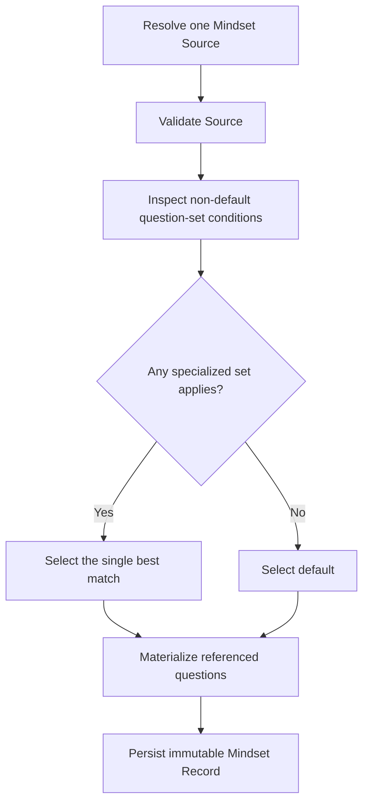

## Context

Kaoju currently resolves one Mindset Source for an applicable Run and materializes every fixed Source question into one immutable `KAOJU:MINDSET-RECORD`. A Mindset Source v1 stores its questions in one ordered array, so it cannot describe task-specific subsets without duplicating whole mindset files or moving selection into stage routing.

The change must preserve the existing mindset key, deterministic topic path, applicability routing, missing-Source posture, Run resolution, collector contract, and user ownership of topic-derived intent. Triggering conditions remain low-authority descriptions interpreted by the agent. They are not executable predicates or instruction surfaces.

## Goals / Non-Goals

**Goals:**

- Let one Mindset Source define reusable questions and alternative task-sensitive question sets.
- Represent question-set membership as a many-to-many mapping without duplicating question content.
- Require one reserved `default` question set in every v2 Mindset Source.
- Select and snapshot exactly one question set for each Mindset Record.
- Preserve existing v1 Sources and historical Mindset Records.

**Non-Goals:**

- Adding multiple mindsets per Workflow Stage or changing mindset-key applicability.
- Selecting or combining multiple question sets for one Mindset Record.
- Adding triggering conditions to individual questions.
- Treating triggering conditions as code, policy, authorization, Gates, or deterministic classifiers.
- Adding a mindset or question-set management CLI.

## Decisions

### 1. Mindset Source v2 Separates Questions from Question Sets

Mindset Source v2 retains the existing metadata, `questions`, and `additional_question_collector` fields and adds `question_sets`. Questions remain the canonical content objects and do not contain triggering conditions.

```json
{
  "schema_version": "isomer-kaoju-mindset-source.v2",
  "mindset_key": "paper.deep-dive",
  "purpose": "Examine a paper in depth.",
  "applicability": {
    "actions": ["examine"],
    "source_kinds": ["paper"],
    "depths": ["deep", "full-text"]
  },
  "questions": [
    {
      "question_id": "survey-role",
      "prompt": "How does this paper relate to the active survey?",
      "additional_notes": "",
      "answer_expectation": "State the paper's role.",
      "required_posture": "answer-or-unresolved",
      "evidence_expectation": "Cite the relevant survey and paper evidence."
    }
  ],
  "question_sets": [
    {
      "question_set_id": "default",
      "triggering_condition": "Use when no specialized question set matches the task and active Run context.",
      "question_ids": "all"
    },
    {
      "question_set_id": "evaluation-focused",
      "triggering_condition": "Use when the task focuses on empirical evaluation quality.",
      "question_ids": ["survey-role", "evaluation-transferability"]
    }
  ],
  "additional_question_collector": {}
}
```

Each `question_ids` value is either the literal `"all"` or an ordered array of references to the canonical `questions` catalog. `"all"` expands to the complete catalog in catalog order. A question may be referenced by several sets, which provides the many-to-many mapping. An explicit reference may occur only once inside one set, every explicit reference must resolve, and every declared question must belong to at least one set after `"all"` expansion.

Every v2 Source contains exactly one set whose `question_set_id` is `default`. The reserved id removes the need for a separate default-set pointer and prevents an invalid or ambiguous fallback configuration. Each set, including `default`, has a nonempty bounded `triggering_condition`.

Alternatives considered:

- Nesting question objects inside sets would encode one-to-many ownership and duplicate shared questions.
- Adding set ids to each question would make question order and set-level inspection less clear.
- Adding per-question triggering conditions would introduce a second selection layer and was explicitly excluded.

### 2. The Agent Selects Exactly One Question Set

After the existing process route resolves one Mindset Source, the entrypoint presents every non-default question-set id and triggering condition to the responsible agent together with the concrete task and pinned Run context. The agent selects the single best-matching specialized set. If no specialized condition applies, it selects `default`.



When several specialized sets appear applicable, the agent chooses the closest fit rather than combining them. This preserves one bounded question inventory and avoids union ordering, duplicate elimination, and conflicting set intent. The selection rationale records why the chosen set fits better.

The typed materialization boundary accepts a selected question-set id, selection kind, and rationale. It verifies that the id exists, `matched` names a non-default set, `default-fallback` names `default`, and the rationale is nonempty. The service cannot independently prove a natural-language match, so the immutable record supplies the audit trail.

### 3. The Mindset Record Preserves Question-Set Selection

The Mindset Record Source snapshot gains `source_schema_version` and `question_set_selection`:

```json
{
  "source_schema_version": "isomer-kaoju-mindset-source.v2",
  "question_set_selection": {
    "question_set_id": "evaluation-focused",
    "selection_kind": "matched",
    "triggering_condition": "Use when the task focuses on empirical evaluation quality.",
    "rationale": "The task asks whether the reported experiments support the central claim."
  },
  "questions": []
}
```

For v2 Sources, `triggering_condition` is copied exactly from the selected set. The materialized `questions` rows follow the selected set's explicit `question_ids` order or the canonical catalog order when `question_ids` is `"all"`, and copy the corresponding canonical question contracts. The additional-question collector remains outside question sets and is always materialized.

The selection block, selected question inventory, Source digest, and survey context form part of the immutable snapshot. Later Source edits or a changed task cannot retarget an active Record.

The existing Mindset Record v1 JSON contract receives additive optional fields so historical records remain valid. Semantic validation requires the fields for newly materialized v2 Sources. This avoids introducing a new Artifact semantic id, binding, profile, or CLI route for an additive snapshot concern.

### 4. Legacy v1 Sources Normalize to an Implicit Default Set

The loader continues to accept Mindset Source v1. At materialization time, its complete ordered `questions` array acts as an implicit `default` set. Newly materialized legacy Records use selection kind `legacy-default`, question-set id `default`, a null triggering condition, and a rationale that identifies v1 compatibility.

Kaoju does not rewrite an existing topic Source during package upgrade, create-missing, or ordinary use. Explicit regeneration or replacement emits v2 only. Existing historical Records without question-set fields remain readable and valid.

### 5. Packaged Defaults and Derived Sources Emit v2

The three packaged default Sources move to v2. Each seed initially gives its `default` set `question_ids: "all"`, which selects its current 8, 6, or 8 fixed questions in catalog order and preserves the current default behavior and exact question text.

Topic creation may derive specialized sets only when the topic overview supports stable task variants. It reuses canonical question ids across sets and may add new questions when necessary. It must retain a valid nonempty `default` set and cannot infer future survey state in triggering conditions.

The checked survey-process contract declares v2 as the emitted Source version while documenting v1 as the accepted compatibility version.

## Risks / Trade-offs

- [Natural-language conditions can produce different choices across agents] → Persist the exact condition and rationale, require one selection before record creation, and keep the choice immutable for the Run.
- [A shared question edit affects every set that references it] → Treat this as the intended reuse model and expose membership in Source rendering and validation diagnostics.
- [A user can create overlapping specialized sets] → Require the agent to choose one best match and explain the choice rather than combining sets.
- [Supporting two Source versions increases validator complexity] → Isolate v1 normalization at the load and materialization boundary and emit only v2 from packaged and generated content.
- [Large set catalogs can overload agent selection] → Bound set count, condition length, question count, and references in the closed schema.

## Migration Plan

1. Add the v2 Source schema and dual-version loading and semantic validation.
2. Extend Mindset Record validation, materialization, and rendering with additive question-set selection fields.
3. Upgrade packaged defaults and the checked process contract to emit v2.
4. Update topic-creation and consumer guidance to derive and select question sets.
5. Update canonical domain language and automated tests.
6. Leave existing topic v1 Sources and historical Records unchanged; convert a Source only through explicit user-authorized regeneration or replacement.

Rollback restores v1 emission and selection-free materialization. Because existing files are not rewritten automatically and the Record changes are additive, rollback can continue reading historical v1 Sources and pre-change Records. V2 topic Sources created during deployment require explicit conversion before an older runtime can consume them.

## Open Questions

None.
