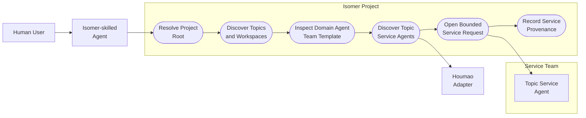
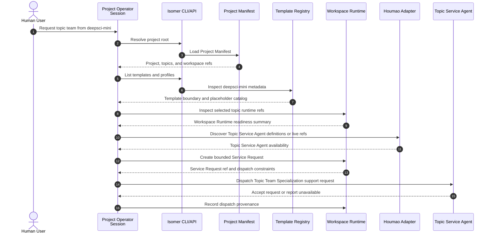

# Use Case 1: Project Operator Discovers Topic Service Support

## User Story

As an Isomer maintainer, I want any agent with Isomer system skills to become project-aware from the current project root, so that it can find Research Topics, topic workspaces, templates, and Topic Service Agents before asking Houmao to launch anything.

## Scenario

The user opens the Isomer Labs repository and asks an Isomer-skilled agent to instantiate a topic team from the `deepsci-mini` Domain Agent Team Template. The agent acts as a Project Operator Session because the current working directory is an Isomer Project root. It discovers the Project Manifest, available Research Topics, Topic Workspaces, Domain Agent Team Templates, existing Topic Agent Team Profiles, Workspace Runtime refs, and available Topic Service Agent definitions or live refs. If topic-scoped support is needed, it opens a bounded Service Request instead of hardcoding Topic Team Specialization in Python.

## Assumptions

- The project root is the current working directory or is supplied explicitly by the user.
- A Project Operator Session can be Codex, Houmao, Claude, Kimi, or another agent surface with Isomer system skills installed.
- The Project Operator Session is not required to be a Houmao-managed Agent Instance.
- Topic Service Agents are Service Team members and are not Agent Team Instance members.

## Step-by-Step Description

1. The user points an Isomer-skilled agent at the Isomer Project root and requests a topic team from `deepsci-mini`.
2. The Project Operator Session resolves the Project root and loads the Project Manifest.
3. The Project Operator Session lists Research Topics and Topic Workspaces and selects the user-requested Research Topic or asks the user to choose when multiple topics are plausible.
4. The Project Operator Session lists Domain Agent Team Templates and confirms that `deepsci-mini` is a reusable template rather than a launchable topic team.
5. The Project Operator Session inspects existing Topic Agent Team Profiles and Workspace Runtime refs for the selected Research Topic.
6. The Project Operator Session discovers available Topic Service Agent definitions or live Topic Service Agent refs for the selected Topic Workspace.
7. The Project Operator Session determines that Topic Team Specialization needs topic-scoped support, such as template inspection, placeholder reconciliation, topic environment readiness, or Agent Workspace setup.
8. The Project Operator Session creates a Service Request that names the Project, Research Topic, Topic Workspace, Domain Agent Team Template, expected support output, authorization scope, Service Dispatch Form, and provenance obligations.
9. The system validates that the Service Request is bounded service work and not a Research Task, Workflow Stage, Gate, or Agent Team Instance launch.
10. The Project Operator Session dispatches the Service Request to a Topic Service Agent through a tool-native or launched-service dispatch form.
11. The Project Operator Session records the Service Request ref and waits for Topic Service Agent support output before reviewing any Topic Agent Team Profile draft.

## Mermaid Use Case Diagram

## Mermaid System Sequence Diagram

## Durable Outputs

- Project root resolution evidence
- Project Manifest topic and workspace discovery output
- Domain Agent Team Template inspection output for `deepsci-mini`
- Topic Service Agent discovery output or unavailable diagnostic
- Service Request with scope, expected output, authorization, dispatch form, and completion observation rules
- Provenance Records linking the Project Operator Session, selected Research Topic, Topic Workspace, template ref, and Topic Service Agent ref when present

## Alternative and Exception Flows

### A1: Project Root Cannot Be Resolved

If the agent cannot resolve an Isomer Project root, it reports a diagnostic and does not create Service Requests or topic-team material.

### A2: Multiple Topics Are Plausible

If multiple Research Topics match the user's request, the Project Operator Session asks the user to choose before dispatching Topic Service Agent work.

### A3: No Topic Service Agent Is Available

If no Topic Service Agent definition or live ref exists, the Project Operator Session records an unavailable diagnostic and can proceed only with deterministic fixtures or user-approved manual support.

## Pass Criteria

This use case passes when a non-Houmao Project Operator Session can discover project and topic surfaces, identify `deepsci-mini` as a Domain Agent Team Template, and route a bounded Service Request to a Topic Service Agent without creating an Agent Team Instance or hardcoding template-specific substitutions.

## Evidence

- Domain language defines Project Operator Session, Topic Service Agent, Service Request, Topic Team Specialization, and Topic Team Instantiation Packet in `.imsight-arts/project-explore/domain-concepts/dc-isomer-platform-language.md`.
- The change proposal requires backend-neutral project discovery and Topic Service Agent discovery in `openspec/changes/add-operator-agent-topic-team-instantiation/proposal.md`.
- The operator workflow scenarios require project discovery, template inspection, and service support in `openspec/changes/add-operator-agent-topic-team-instantiation/specs/operator-agent-topic-team-instantiation/spec.md`.
