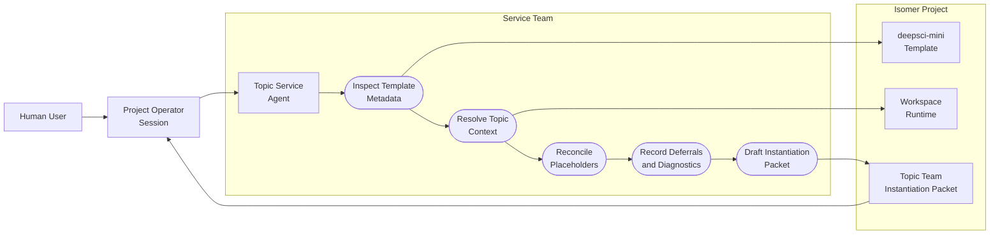
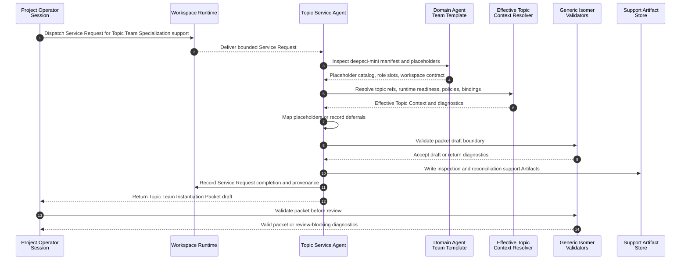

# Use Case 2: Topic Service Agent Drafts an Instantiation Packet

## User Story

As a Project Operator Session, I want a Topic Service Agent to support Topic Team Specialization for `deepsci-mini` and the selected Research Topic, so that the system can produce a reviewable Topic Team Instantiation Packet without encoding topic-specific substitutions in product code.

## Scenario

A Project Operator Session has discovered a Research Topic, Topic Workspace, `deepsci-mini` Domain Agent Team Template, and a Topic Service Agent. The Project Operator Session sends a Service Request asking the Topic Service Agent to support Topic Team Specialization by inspecting the template, resolving topic context, reconciling placeholders, and drafting a Topic Team Instantiation Packet. The Topic Service Agent returns packet material plus support Artifacts and diagnostics. The packet is still review material: it is not an approval record, Topic Agent Team Profile, Agent Team Instance, or Houmao launch payload.

## Assumptions

- The Topic Service Agent has Isomer Service Team skills for template inspection, topic context resolution, placeholder reconciliation, and support Artifact writing.
- The Topic Service Agent may be represented by a live Houmao managed agent or by a deterministic fixture in tests.
- Required placeholders can be resolved or explicitly deferred with launch impact and required action.
- The Topic Service Agent cannot own Gate decisions, Research Claims, Research Tasks, or task routing.

## Step-by-Step Description

1. The Project Operator Session dispatches a Service Request to the Topic Service Agent for Topic Team Specialization support.
2. The Topic Service Agent validates that the Service Request scope names one Project, one Research Topic, one Topic Workspace, and one Domain Agent Team Template.
3. The Topic Service Agent inspects the `deepsci-mini` template manifest, placeholder catalog, role binding slots, workflow stages, workspace contract, instantiation schema, and validation diagnostics.
4. The Topic Service Agent resolves the Effective Topic Context, Research Topic Config, Topic Workspace ref, Workspace Runtime readiness, policy refs, Capability Binding refs, Skill Binding Projection refs, provider refs, and Gate policy refs.
5. The Topic Service Agent maps template placeholders to concrete topic-specific values where the context is sufficient.
6. The Topic Service Agent records explicit deferrals for unresolved required placeholders, including reason, launch impact, required user or service action, and whether the profile can be saved but not launched.
7. The Topic Service Agent rejects packet material that contains runtime truth, credentials, command outputs, Evidence Items, Findings, Gates, Decision Records, or rich Artifact contents.
8. The Topic Service Agent writes support Artifacts that explain the template inspection, topic context resolution, placeholder mapping, and diagnostics.
9. The Topic Service Agent returns a draft Topic Team Instantiation Packet to the Project Operator Session with provenance refs and Service Request output refs.
10. The Project Operator Session validates the packet through generic Isomer validators before presenting the draft profile for user review.

## Mermaid Use Case Diagram

## Mermaid System Sequence Diagram

## Durable Outputs

- Completed Service Request or support-blocking diagnostic
- Template inspection support Artifact
- Effective Topic Context resolution support Artifact
- Placeholder reconciliation support Artifact
- Topic Team Instantiation Packet draft with source template ref, Research Topic ref, Topic Workspace ref, Workspace Runtime ref, target Topic Agent Team Profile Bundle path, role bindings, policy refs, expected Artifacts, approval state, deferrals, Project Operator Session provenance, Topic Service Agent provenance, and validation refs
- Validation diagnostics for rejected runtime truth, missing required values, cross-topic refs, or secret-like fields

## Alternative and Exception Flows

### A1: Required Placeholder Is Unresolved

If a required placeholder cannot be resolved at profile time, the packet records an explicit deferral and launch blocker. The Topic Agent Team Profile may be saveable only when the deferral is valid and approved.

### A2: Packet Contains Runtime Truth

If packet material includes live process ids, mailbox state, gateway state, command outputs, credentials, tokens, API keys, passwords, Evidence Items, Findings, Gates, Decision Records, or rich Artifact contents, validation rejects the packet.

### A3: Service Request Scope Is Too Broad

If the Service Request asks the Topic Service Agent to choose a research direction, approve a Gate, own a Research Claim, or route Research Tasks, the Topic Service Agent rejects or narrows the request before producing packet material.

## Pass Criteria

This use case passes when the Topic Service Agent produces a validated Topic Team Instantiation Packet draft for `deepsci-mini`, records support provenance, and leaves user approval, profile bundle materialization, runtime team creation, and research decisions outside the Topic Service Agent's authority.

## Evidence

- The domain language defines Topic Service Agent authority and Topic Team Instantiation Packet boundaries in `.imsight-arts/project-explore/domain-concepts/dc-isomer-platform-language.md`.
- The change design requires Project Operator Session and Topic Service Agent skills, with Python limited to validation and recording in `openspec/changes/add-operator-agent-topic-team-instantiation/design.md`.
- The research skills spec requires project awareness, Service Request routing, template inspection, topic context resolution, placeholder reconciliation, and bounded Topic Service Agent support skills in `openspec/changes/add-operator-agent-topic-team-instantiation/specs/research-paradigm-skills/spec.md`.
