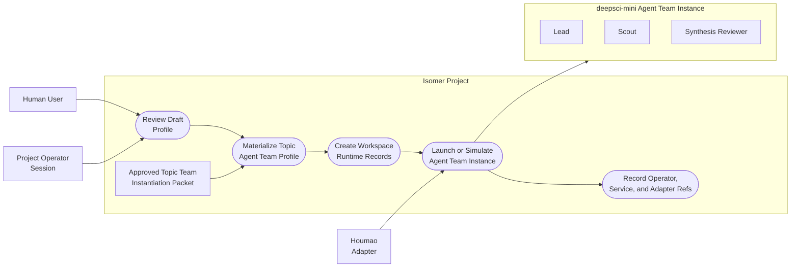
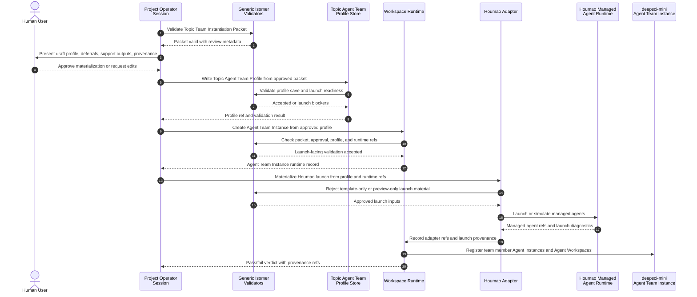

# Use Case 3: Approved Packet Materializes and Launches a Topic Team

## User Story

As an Isomer maintainer, I want an approved Topic Team Instantiation Packet to materialize a Topic Agent Team Profile and launch or simulate a `deepsci-mini` Agent Team Instance, so that runtime records prove Topic Team Specialization and topic-team instantiation are agent-mediated and not a hardcoded template substitution path.

## Scenario

A Project Operator Session receives a valid Topic Team Instantiation Packet from a Topic Service Agent. The Project Operator Session presents the draft Topic Agent Team Profile for user review, records approval or deterministic test approval, writes the authoritative Topic Agent Team Profile, creates or updates Workspace Runtime records, and asks the Houmao adapter to launch or simulate the Agent Team Instance. The adapter consumes approved Isomer profile/runtime material and records adapter refs. It does not inspect `deepsci-mini` directly or choose placeholder substitutions.

## Assumptions

- Deterministic tests may use a fixture Topic Service Agent output instead of a live Houmao Topic Service Agent.
- Live Houmao launch is optional and gated; profile bundle materialization and runtime provenance must still be testable without live Houmao.
- The Houmao adapter can reject template-only launch requests.
- The Project Operator Session remains outside Agent Team Instance membership unless the profile explicitly defines a team operator role.

## Step-by-Step Description

1. The Project Operator Session receives a validated Topic Team Instantiation Packet draft from a Topic Service Agent or deterministic fixture.
2. The Project Operator Session renders a user-facing review that shows selected roles, inactive roles, role binding refs, capability refs, skill projections, Agent Workspace refs, policy refs, expected Artifacts, unresolved placeholders, launch blockers, Service Request outputs, and provenance.
3. The user approves the draft, edits it, rejects it, or the deterministic test harness supplies explicit test approval.
4. If approval is granted, the Project Operator Session calls generic Isomer profile bundle materialization APIs with the approved packet.
5. The system writes the Research Topic's one Topic Agent Team Profile Bundle under `<topic-workspace>/team-profile/`, including `profile.toml`, the approved packet, copied topic-specialized template material, validation outputs, and provenance refs.
6. The Project Operator Session requests Agent Team Instance creation from the approved Topic Agent Team Profile for that Research Topic.
7. Workspace Runtime rejects the request if the packet is missing, invalid, rejected, unapproved, preview-only, has unresolved launch-blocking deferrals, or would create a competing active team for the same Research Topic.
8. Workspace Runtime creates Agent Team Instance runtime records only after packet and profile validation pass.
9. The Project Operator Session asks the Houmao adapter to materialize launch inputs from approved profile/runtime state.
10. The Houmao adapter rejects any request that contains only the `deepsci-mini` Domain Agent Team Template without approved profile/runtime material.
11. The Houmao adapter launches or simulates managed agents for the research team and records adapter refs, launch refs, Agent Instance refs, Agent Workspace path plans, and Topic Service Agent support refs when present.
12. Workspace Runtime records project operator provenance and Topic Service Agent provenance distinctly from research team member Agent Instances.
13. The Project Operator Session reports a pass/fail verdict showing that packet-backed materialization preceded Agent Team Instance creation.

## Mermaid Use Case Diagram

## Mermaid System Sequence Diagram

## Durable Outputs

- Approved Topic Team Instantiation Packet or deterministic test approval packet
- User review record or deterministic test approval context
- Materialized Topic Agent Team Profile with packet provenance
- Workspace Runtime records for Agent Team Instance creation
- Agent Instance and Agent Workspace refs for `deepsci-mini` research team members
- Adapter command and payload records for Houmao launch, quick launch, inspect-live, stop, or reconciliation when used
- Topic Service Agent support refs and Service Request refs when the packet used topic service support
- Diagnostics for preview-only profiles, unapproved packets, unresolved launch blockers, or template-only launch requests

## Alternative and Exception Flows

### A1: User Rejects the Draft

If the user rejects the draft profile, the system records rejection context and does not write an authoritative Topic Agent Team Profile or create an Agent Team Instance.

### A2: Packet Is Saveable but Not Launchable

If the packet has approved deferrals that block launch, the Topic Agent Team Profile may be written, but Workspace Runtime rejects launch-facing Agent Team Instance creation until the deferrals are resolved.

### A3: Preview Profile Is Used for Launch

If a CLI or API path tries to launch from a synthetic preview profile without an approved packet or equivalent explicit approval, Workspace Runtime reports a diagnostic and leaves runtime records unchanged.

### A4: Houmao Adapter Receives Template-Only Input

If the Houmao adapter receives only the `deepsci-mini` Domain Agent Team Template, it rejects the launch request and does not create Houmao launch material or live agents.

### A5: Live Houmao Is Unavailable

If live Houmao launch is unavailable, deterministic profile bundle materialization and runtime provenance tests can still pass through simulated adapter refs. Live launch remains an optional gated validation path.

## Pass Criteria

This use case passes when the system can prove the order of operations: approved Topic Team Instantiation Packet, materialized Topic Agent Team Profile, Workspace Runtime Agent Team Instance record, and Houmao launch or simulation. It must also prove that Project Operator Session provenance, Topic Service Agent provenance, and research Agent Team Instance member refs remain distinct.

## Evidence

- The change proposal requires approved packet-backed profile bundle materialization and forbids template-specific hardcoded substitution in `openspec/changes/add-operator-agent-topic-team-instantiation/proposal.md`.
- The Houmao adapter spec requires approved launch inputs, template-only rejection, project operator provenance, and Topic Service Agent managed-agent separation in `openspec/changes/add-operator-agent-topic-team-instantiation/specs/houmao-cli-adapter-layer/spec.md`.
- The Workspace Runtime spec requires packet/profile links, project operator provenance, Topic Service Agent support refs, and non-membership for operators and service agents in `openspec/changes/add-operator-agent-topic-team-instantiation/specs/workspace-runtime-persistence/spec.md`.
