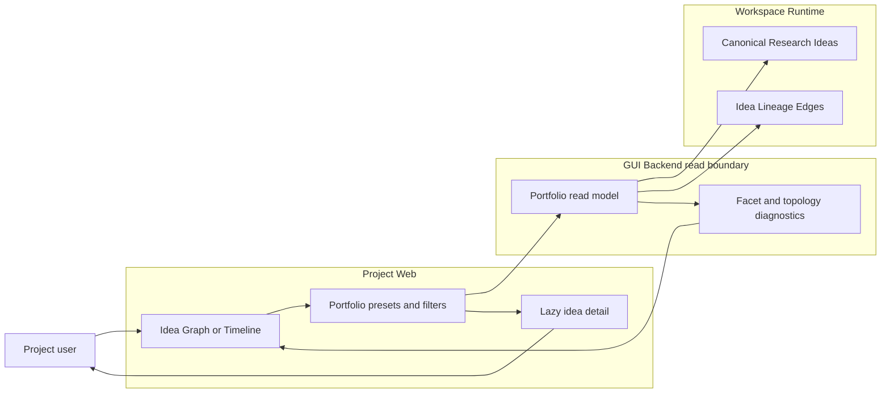
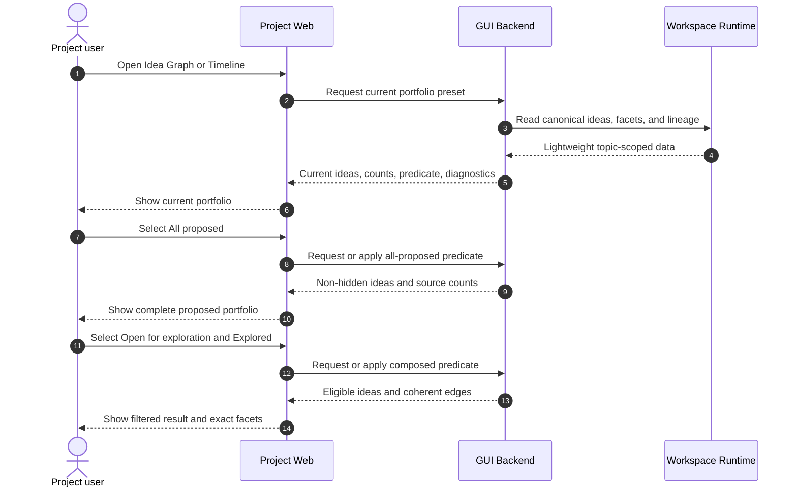

# Use Case 01: Browse and Filter the Research Idea Portfolio

## Actor Goal

As a Project user, I want to see every proposed Research Idea and filter the portfolio by exploration progress and decision disposition, so that I can understand what has happened and choose where to look next.

## Use Case

The user opens the Idea Graph or Idea Timeline for an existing Research Topic. Project Web loads lightweight canonical Research Ideas with independent exploration, decision, evidence, archive, and visibility facets. The user moves between semantic presets and explicit filters to answer which ideas were proposed, which were explored further, which remain unexplored, which are selected, and which need classification.

## Supported Actions

### View Every Proposed Idea

The user expands the view from the current working set to the complete non-hidden idea portfolio.

- context
  - Actor **has** an existing Research Topic selected in Project Web.
  - System **has** canonical Research Ideas, stable display keys, lightweight facet values, source counts, and topology completeness metadata for the Topic Workspace.
- intent
  - Actor **wants** to inspect every user-visible idea, including supporting and archived ideas that the default Primary Idea view omits.
  - Actor **wonders** "What ideas have been proposed during this research topic?"
- action
  - Actor then **asks** the system to apply the `All proposed` preset.
- result
  - Actor **gets** every non-hidden canonical Research Idea with its display key, title, summary, visibility, exploration state, decision state, evidence state, archive state, and diagnostics.

### Show Ideas Still Open for Exploration

The user narrows the portfolio to ideas whose decision disposition explicitly permits continued exploration.

- context
  - Actor **has** the idea portfolio open and can see the active preset and source counts.
  - System **has** explicit decision state that distinguishes `open`, `shortlisted`, and `selected` from `deferred`, `closed`, and `unknown`.
- intent
  - Actor **wants** to remove deferred, closed, and unclassified ideas from the current view.
  - Actor **wonders** "I only want to see the ideas that are still open for exploration."
- action
  - Actor then **asks** the system to apply the `Open for exploration` preset.
- result
  - Actor **gets** the active ideas whose decision state is `open`, `shortlisted`, or `selected`, together with visible-versus-source counts and the exact applied predicate.

### Compare Exploration Progress and Decision Disposition

The user filters by exploration progress without losing independent selection or evidence meaning.

- context
  - Actor **has** canonical idea rows or nodes that expose exploration, decision, and evidence facets separately.
  - System **has** `Unexplored`, `Exploring`, `Explored`, `Selected`, `Deferred`, `Closed`, and `Needs classification` presets plus composable facet filters.
- intent
  - Actor **wants** to compare what was investigated with what the research process selected or set aside.
  - Actor **wonders** "Which ideas were explored further, which have not been explored, and which explored ideas were still deferred?"
- action
  - Actor then **asks** the system to switch presets or combine exploration and decision filters.
- result
  - Actor **gets** a graph or timeline whose nodes retain every independent facet, so combinations such as selected plus unexplored or explored plus deferred remain visible.

### Inspect Ideas That Need Classification

The user isolates migrated or damaged ideas whose history does not justify a complete classification.

- context
  - Actor **has** a topic that may contain legacy Research Idea status values or incomplete canonical writes.
  - System **has** `unknown` facet values and diagnostics rather than heuristic remapping.
- intent
  - Actor **wants** to distinguish incomplete metadata from a real open, closed, unexplored, or assessed state.
  - Actor **wonders** "Are these ideas absent because nobody explored them, or because the old data does not say?"
- action
  - Actor then **asks** the system to apply the `Needs classification` preset and inspect the attached diagnostics.
- result
  - Actor **gets** every non-hidden idea with unknown exploration, decision, or evidence state and a precise list of fields that need explicit classification or repair.

## Main Flow

1. The Project user opens Project Web and selects an existing Research Topic.
2. The user opens Idea Graph or Idea Timeline.
3. Project Web requests the lightweight idea portfolio read model for the current topic and revision.
4. The GUI applies the `Current` preset by default and keeps Primary Ideas with unknown decision state visible as needing classification.
5. The user selects `All proposed` to inspect every non-hidden canonical Research Idea.
6. The GUI shows facet labels, source counts, visible counts, archive state, visibility, and any diagnostics without loading heavy record content.
7. The user selects `Open for exploration` to see the active open, shortlisted, and selected ideas.
8. The user switches to `Unexplored`, `Exploring`, or `Explored` and optionally combines a decision or evidence filter.
9. The user opens one idea detail when more context is needed, then returns to the portfolio with the preset and filters preserved.
10. A later topic revision refreshes the lightweight read model without converting browser filters into canonical research state.

## Alternative And Exception Flows

- If canonical Research Ideas are absent and the backend uses a legacy heuristic fallback, the GUI labels the view heuristic and does not present extracted record facets as authoritative classification.
- If an idea has one or more unknown facets, the default Current view keeps a Primary Idea visible and marks it as needing classification; explicit open, explored, deferred, or closed presets do not guess its membership.
- If a filter removes a parent or child node, the GUI reports omitted cross-boundary edges or filtered-topology diagnostics when available.
- If the source graph is too large to return completely, the backend applies the predicate to a coherent bounded projection and the GUI labels counts and topology incomplete.
- If a preset returns no ideas, the GUI shows the active predicate and a clear empty state instead of falling back silently to another preset.
- If the topic revision changes while the user is filtering, Project Web preserves the current preset and compatible filters, then updates counts and visible ideas from the new revision.

## Mermaid Flow Diagram

## Mermaid Sequence Diagram

## Durable Outputs

- This use case creates no Decision Record, Research Idea transition, Research Inquiry, Research Task, Run, Artifact, or query-index mutation.
- The active preset, explicit filters, selected view, and open detail tab can remain in browser or GUI Runtime State for view restoration.
- Canonical Research Idea facets, Idea Lineage Edges, facet counts, index revision, and diagnostics remain the durable or derived sources read by the GUI.

## Assumptions And Open Questions

- Assumption: `All proposed` includes `primary` and `supporting` Research Ideas and excludes `hidden` ideas unless a future privileged inspection control requests them explicitly.
- Assumption: `Open for exploration` requires explicit `open`, `shortlisted`, or `selected` decision state; `unknown` remains a classification gap rather than an open state.
- Assumption: Graph and timeline predicates produce the same eligible idea ids for the same complete source revision even though their layout and presentation state remain independent.
- Assumption: Full realizations, Decision Record bodies, evidence, Markdown, source JSON, and files remain lazy detail loads.
