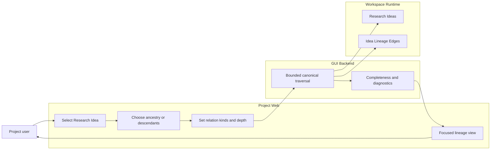
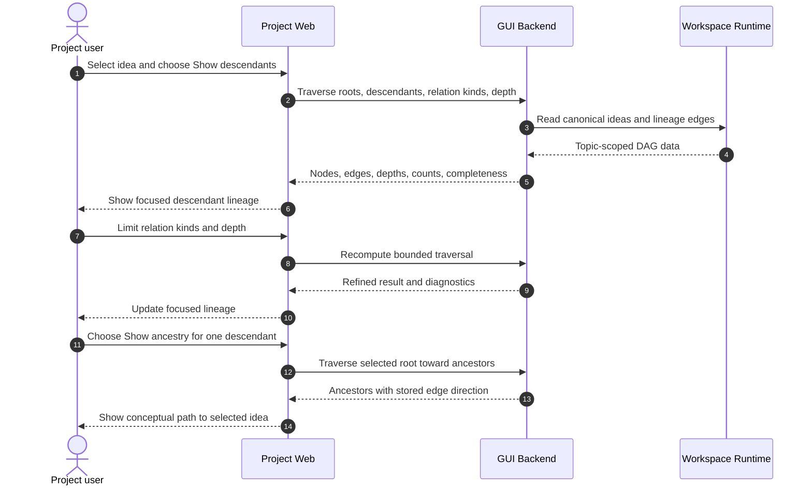

# Use Case 02: Trace an Idea's Ancestry and Descendants

## Actor Goal

As a Project user, I want to trace canonical ancestors and descendants from a specific Research Idea, so that I can understand how later ideas derived from it and where the current direction came from.

## Use Case

The user selects a Research Idea in Idea Graph or Idea Timeline and asks to inspect its lineage in one direction. Project Web traverses canonical Idea Lineage Edges, applies the user's relation-kind and depth choices, reports whether the result is complete, and preserves stored direction and rationale. The workflow does not infer lineage from record ancestry or generated prose.

## Supported Actions

### Show All Descendants of an Idea

The user focuses on every bounded Research Idea reachable from the selected idea through eligible outgoing lineage.

- context
  - Actor **has** a visible canonical Research Idea selected by stable `idea_id` or display key.
  - System **has** canonical Idea Lineage Edges, relation kinds, index revision, traversal bounds, and completeness metadata.
- intent
  - Actor **wants** to see the ideas that developed from the selected idea across more than one generation.
  - Actor **wonders** "Let me check all the ideas that are derived from this specific idea."
- action
  - Actor then **asks** the system to show descendants for the selected idea.
- result
  - Actor **gets** the reachable descendant ideas, induced eligible edges, observed depth, relation labels, source counts, and an explicit complete or incomplete result.

### Show the Ancestry of an Idea

The user traces the selected idea back through the concepts that produced or motivated it.

- context
  - Actor **has** a selected Research Idea whose visible or hidden parents may span several generations.
  - System **has** incoming canonical Idea Lineage Edges and safe traversal in the reverse direction without changing stored edge direction.
- intent
  - Actor **wants** to understand the conceptual path that led to the selected idea.
  - Actor **wonders** "Which earlier ideas led to this one, and where did the selected path diverge from its alternatives?"
- action
  - Actor then **asks** the system to show ancestry for the selected idea.
- result
  - Actor **gets** every bounded ancestor, the canonical parent-to-child edges, lineage kinds, generation context, rationales when present, and completeness diagnostics.

### Refine the Lineage Traversal

The user narrows a large or semantically mixed traversal by relation kind or depth.

- context
  - Actor **has** an ancestry or descendant result that may include selection, follow-up, merge, alternative, or subsumption relationships.
  - System **has** relation-kind filters, optional maximum depth, safety limits, and visible-versus-source counts.
- intent
  - Actor **wants** to isolate the lineage semantics relevant to the current question.
  - Actor **wonders** "Can I show only derivation and follow-up relationships for the first three generations?"
- action
  - Actor then **asks** the system to change the eligible relation kinds or maximum traversal depth.
- result
  - Actor **gets** a recomputed focused subgraph with the active roots, direction, relation filters, depth, counts, and completeness visible.

## Main Flow

1. The Project user opens Idea Graph or Idea Timeline for a Research Topic.
2. The user selects one canonical Research Idea.
3. The GUI exposes `Show descendants` and `Show ancestry` as read-only lineage actions.
4. The user selects `Show descendants`.
5. Project Web requests or derives traversal from the selected root over the current eligible Idea Lineage Edge kinds.
6. The GUI shows reachable descendant nodes, induced edges, depth, counts, and completeness while preserving edge direction.
7. The user narrows the traversal to selected relation kinds or a smaller maximum depth.
8. The user opens one descendant detail, then returns to the focused lineage without losing the traversal root.
9. The user switches to `Show ancestry` for that descendant to inspect how it connects back to earlier ideas.
10. The user exits traversal focus and returns to the prior portfolio preset and filters.

## Alternative And Exception Flows

- If the selected root no longer exists at the current index revision, the GUI reports an unresolved root and returns to the prior portfolio without inventing a node.
- If traversal reaches a node, edge, depth, or response bound, the GUI labels the result incomplete and offers supported relation, depth, or root refinement.
- If canonical data contains a cycle or broken endpoint, validation diagnostics identify the damaged edge and the GUI shows all safely interpretable nodes without claiming complete traversal.
- If the current portfolio filter hides an intermediate ancestor or descendant, the traversal result identifies that it temporarily expands beyond the prior filtered view and restores the previous predicate on exit.
- If no eligible descendants or ancestors exist, the GUI shows a valid empty traversal result with the selected root and relation filter rather than treating the root as missing.
- If prose or record lineage suggests a relationship that lacks a canonical Idea Lineage Edge, the GUI reports missing canonical lineage and does not add an authoritative edge.

## Mermaid Flow Diagram

## Mermaid Sequence Diagram

## Durable Outputs

- This use case creates no Research Idea, Idea Lineage Edge, Decision Record, transition, Research Task, or query-index write.
- Traversal roots, direction, relation-kind filters, depth, and prior portfolio state can remain in browser or GUI Runtime State while the view is open or restorable.
- Canonical Research Ideas and Idea Lineage Edges remain the only authoritative lineage inputs; completeness and diagnostics remain observable read-model outputs.

## Assumptions And Open Questions

- Assumption: Descendant and ancestor traversal is bounded even when the user-facing action says `all`; the GUI must expose incomplete results rather than risk an unbounded response.
- Assumption: The default traversal relation set uses accepted canonical Idea Lineage Edge kinds and can be narrowed by the user.
- Assumption: Record lineage and Idea Realization history remain available in detail views but do not become idea-level ancestry.
- Assumption: Exiting traversal restores the prior portfolio preset, explicit filters, selection, and layout when those nodes still exist.
