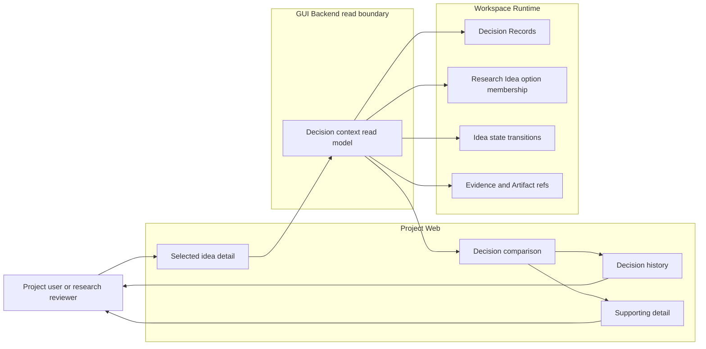
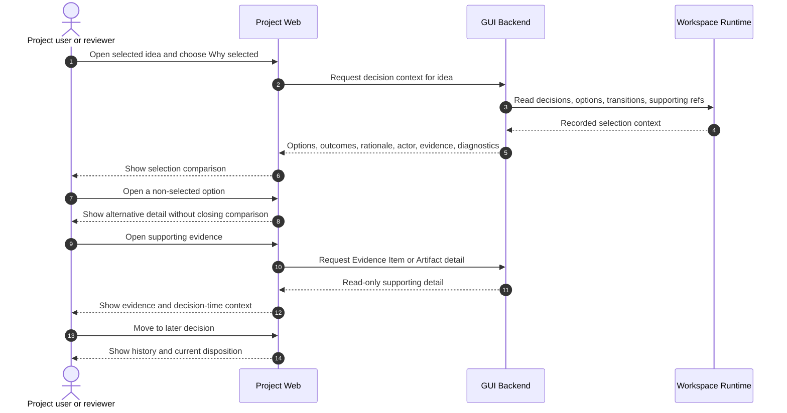

# Use Case 03: Review Why an Idea Was Selected

## Actor Goal

As a Project user or research reviewer, I want to compare a selected Research Idea with every idea considered in the same decision, so that I can understand and evaluate the selection rationale.

## Use Case

The user opens a selected Research Idea and requests its decision context. Project Web loads the linked Decision Record, explicit Research Idea option membership, outcomes, rationale, consequences, actor, timestamp, and supporting refs. The user can compare alternatives and follow evidence without treating a generation group as proof that every sibling participated in the decision.

## Supported Actions

### Open the Selection Explanation

The user asks why the current idea has decision state `selected`.

- context
  - Actor **has** a selected Research Idea open in Idea Graph, Idea Timeline, or idea detail.
  - System **has** current decision state, transition history, Decision Record refs, and explicit option membership when it was recorded.
- intent
  - Actor **wants** to see the meaningful choice that produced the selected disposition.
  - Actor **wonders** "Why was this idea selected, who selected it, and what consequence did that choice have?"
- action
  - Actor then **asks** the system to open the idea's selection context.
- result
  - Actor **gets** the relevant Decision Record summary, selected option, rationale, actor, timestamp, consequences, transition refs, and supporting Evidence Item or Artifact refs.

### Compare Every Considered Idea

The user compares the selected idea with the complete option set recorded for that decision.

- context
  - Actor **has** an open selection context with one or more recorded Research Idea options.
  - System **has** explicit decision option membership and outcome data that remains separate from idea generation groups.
- intent
  - Actor **wants** to inspect the alternatives that were actually evaluated rather than every nearby graph sibling.
  - Actor **wonders** "Let me see all the ideas that were considered and why this one was selected over the others."
- action
  - Actor then **asks** the system to show the considered option set and opens individual alternatives for comparison.
- result
  - Actor **gets** each recorded option's display key, title, summary, decision outcome, rationale or consequence, current facets, and a link to its idea detail while the comparison context stays open.

### Follow the Decision Evidence and History

The user inspects evidence and later decisions that strengthened, reversed, or qualified the selection.

- context
  - Actor **has** a Decision Record with supporting refs or a Research Idea that participated in several decisions.
  - System **has** read-only Decision Record history, state transitions, Evidence Item refs, Artifact refs, and provenance detail.
- intent
  - Actor **wants** to separate the original selection reason from later evidence or reconsideration.
  - Actor **wonders** "Was this selected because of evidence available then, and did later results change the decision?"
- action
  - Actor then **asks** the system to open supporting refs or move through the idea's decision history.
- result
  - Actor **gets** ordered decision events with their option sets, outcomes, state transitions, evidence available to each decision, and current disposition clearly distinguished from history.

## Main Flow

1. The Project user opens a Research Topic's Idea Graph or Idea Timeline.
2. The user selects an idea whose decision state is `selected`.
3. The user invokes `Why selected?` or opens the Decision section of idea detail.
4. Project Web requests read-only decision context for the idea and current topic revision.
5. The GUI Backend reads linked Decision Records, explicit Research Idea option memberships, state transitions, and supporting refs.
6. Project Web shows the selection rationale, actor, timestamp, consequence, and every recorded considered idea.
7. The user opens one non-selected option and compares its title, summary, decision outcome, current facets, and decision-time rationale with the selected idea.
8. The user opens a supporting Evidence Item or Artifact when the decision cites one.
9. If the idea participated in later decisions, the user moves through the ordered decision history and distinguishes the original selection from the current state.
10. The user returns to the graph or timeline with the selection comparison context available or restorable.

## Alternative And Exception Flows

- If a legacy selected idea has no linked Decision Record, Project Web shows an incomplete-decision-context diagnostic and does not invent a rationale from nearby records or prose.
- If the Decision Record identifies the selected option but not every alternative, the GUI labels the option set incomplete and shows only known membership.
- If a generation group contains siblings absent from the Decision Record, the GUI can show them separately as generation siblings but does not label them considered or rejected by that decision.
- If a Decision Record refers to a missing Research Idea, Evidence Item, or Artifact, Project Web keeps the surviving context visible and names each broken ref.
- If several ideas were selected by one decision, Project Web shows every selected option and does not force a single winner.
- If the idea was selected in one decision and deferred or closed later, Project Web shows both events in order and labels the later disposition as current.

## Mermaid Flow Diagram

## Mermaid Sequence Diagram

## Durable Outputs

- This use case creates no new Decision Record, option membership, state transition, Evidence Item, Artifact, or canonical Research Idea update.
- The comparison's selected decision, expanded options, and open supporting detail can remain in browser or GUI Runtime State while the view is open or restorable.
- Existing Decision Records, decision option membership, state transitions, Evidence Item refs, Artifact refs, and provenance remain the durable sources displayed by Project Web.

## Assumptions And Open Questions

- Assumption: Decision option membership, not generation membership or graph proximity, defines the considered set.
- Assumption: A Research Idea can participate in several decisions, and the current decision state does not erase earlier outcomes.
- Assumption: Missing historical rationale or alternatives remain explicit diagnostics because a repair workflow must not fabricate research history.
- Assumption: Full Decision Record, Evidence Item, Artifact, and provenance bodies load only when the user opens them.
