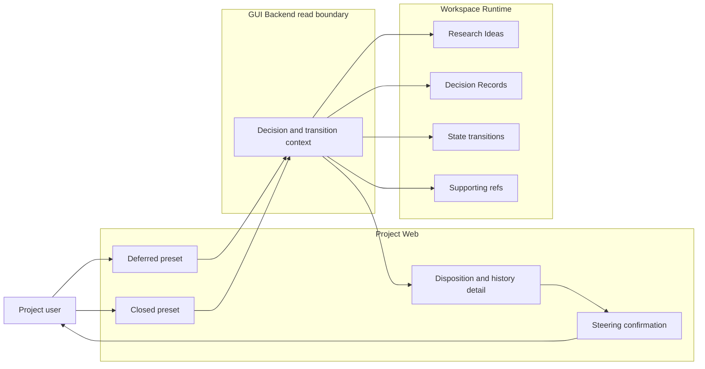
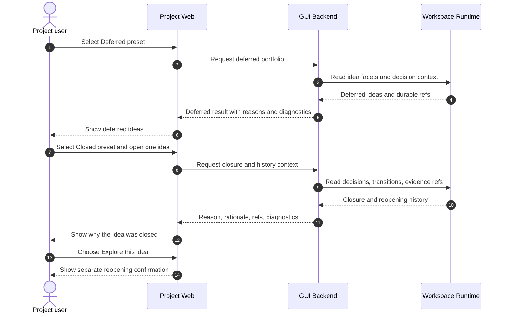

# Use Case 04: Review and Reconsider Deferred or Closed Ideas

## Actor Goal

As a Project user, I want to review deferred and closed Research Ideas with their reasons and history, so that I can identify ideas worth reconsidering without erasing why they were set aside.

## Use Case

The user applies the Deferred or Closed portfolio preset and inspects each idea's current disposition, reason code, rationale, deciding actor, timestamp, evidence, and later reopening history. Project Web keeps refutation separate from closure and makes archived ideas inspectable. If the user decides an old idea deserves more work, the GUI hands off to the explicit steering workflow rather than reopening the idea through ordinary browsing.

## Supported Actions

### Review Deferred Ideas

The user inspects ideas that remain part of research history but are not currently selected for work.

- context
  - Actor **has** Idea Graph or Idea Timeline open for an existing Research Topic.
  - System **has** canonical decision state, deferral transitions, Decision Record refs, rationale, actor, timestamp, and supporting refs when recorded.
- intent
  - Actor **wants** to understand which ideas were postponed and what condition might make them relevant again.
  - Actor **wonders** "Which ideas were deferred, why were they deferred, and were they already explored?"
- action
  - Actor then **asks** the system to apply the `Deferred` preset and opens an idea's disposition detail.
- result
  - Actor **gets** each deferred idea's independent exploration and evidence states, deferral reason, consequence, deciding actor, timestamp, Decision Record, and reopen history when present.

### Review Closed Ideas and Reasons

The user inspects ideas whose current decision disposition is closed.

- context
  - Actor **has** a portfolio with canonical closed ideas or migrated legacy rejection and supersession states.
  - System **has** closure reason codes that distinguish rejection, supersession, duplication, invalidation, user closure, and incomplete legacy context.
- intent
  - Actor **wants** to see closed ideas rather than lose them from the active map.
  - Actor **wonders** "Maybe some closed ideas are still worth looking at; let me see all the closed ideas and why."
- action
  - Actor then **asks** the system to apply the `Closed` preset and inspect closure details.
- result
  - Actor **gets** every closed idea in scope with closure category, rationale, decision and transition refs, evidence available at closure time, consequences, and current archive state.

### Inspect Reopening and Reconsideration History

The user checks whether an idea was previously reopened or whether its closure assumptions changed.

- context
  - Actor **has** a deferred or closed idea detail open.
  - System **has** ordered decision and state-transition history with prior and later dispositions.
- intent
  - Actor **wants** to assess whether the original reason still applies before requesting new work.
  - Actor **wonders** "Has anyone reconsidered this idea, and did later evidence weaken the reason it was set aside?"
- action
  - Actor then **asks** the system to show the idea's disposition and evidence history.
- result
  - Actor **gets** ordered deferral, closure, reopening, selection, and evidence-assessment events with missing context identified explicitly.

### Start Explicit Reconsideration

The user moves from read-only review to a separate confirmed steering flow.

- context
  - Actor **has** identified a deferred or closed Research Idea worth exploring again.
  - System **has** `Explore this idea` and `Explore instead` actions that require reopening rationale and show affected state transitions before mutation.
- intent
  - Actor **wants** to reconsider the idea without silently overwriting its prior disposition.
  - Actor **wonders** "How do I reopen this idea and tell the research actor to investigate it now?"
- action
  - Actor then **asks** the system to begin an explicit steering action for the idea.
- result
  - Actor **gets** a confirmation surface that preserves the prior reason, explains the proposed reopening and task effects, and performs no mutation until the user confirms.

## Main Flow

1. The Project user opens Idea Graph or Idea Timeline for a Research Topic.
2. The user selects the `Deferred` preset.
3. Project Web shows deferred ideas with exploration, evidence, visibility, and archive state retained independently.
4. The user opens one deferred idea and reviews its deferral reason, Decision Record, actor, timestamp, consequence, and supporting refs.
5. The user switches to the `Closed` preset.
6. Project Web shows closed ideas grouped or labeled by closure reason without deleting archived history.
7. The user opens a closed idea and reviews the closure decision, evidence available then, and any later state transitions.
8. The user identifies an idea worth reconsidering.
9. The user invokes `Explore this idea` or `Explore instead`.
10. Project Web opens the separate steering confirmation with reopening consequences and required rationale; read-only review itself has not changed canonical state.

## Alternative And Exception Flows

- If a migrated legacy rejection or supersession has no historical rationale, the GUI shows the preserved legacy reason code and an incomplete-context diagnostic rather than inventing a reason.
- If an idea is archived as well as deferred or closed, the preset keeps it visible and labels archive state separately.
- If evidence state is `refuted` but decision state remains `open`, the idea does not appear in Closed solely because of refutation.
- If an idea was closed and later reopened, Closed history remains visible while the current decision state places it in the appropriate current preset.
- If a referenced Decision Record or Evidence Item is missing, the GUI shows the surviving transition and names the broken ref.
- If the user leaves the steering confirmation without submitting, the idea remains deferred or closed and no Decision Record, transition, task, or handoff is created.

## Mermaid Flow Diagram

## Mermaid Sequence Diagram

## Durable Outputs

- Read-only deferred, closed, decision, transition, and evidence inspection creates no canonical research state.
- The active preset, selected idea, expanded history, and open steering confirmation can remain in browser or GUI Runtime State.
- Existing Research Ideas, Decision Records, decision option membership, state transitions, Evidence Items, Artifacts, and provenance remain the durable history.
- Durable reopening, selection, task, and handoff outputs occur only if the user completes UC-05.

## Assumptions And Open Questions

- Assumption: `closed` is the canonical decision disposition, while reason codes preserve rejection, supersession, duplication, invalidation, and user closure meaning.
- Assumption: Deferred and closed ideas remain inspectable after archival unless a caller explicitly narrows archive state.
- Assumption: Evidence assessment never closes or reopens an idea implicitly.
- Assumption: Reconsideration requires a new Decision Record and transition so prior reasons remain auditable.
