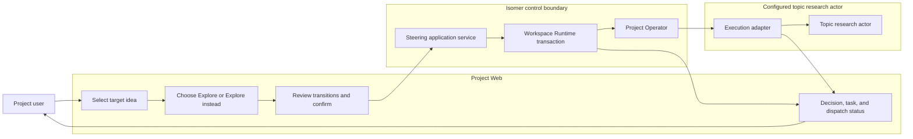

# Use Case 05: Redirect Exploration to Another Idea

## Actor Goal

As a Project user, I want to select another Research Idea and tell the configured topic research actor to explore it alongside or instead of the current direction, so that my choice becomes an explicit, durable research action rather than an ambiguous chat request.

## Use Case

The user selects a target Research Idea in Project Web and invokes `Explore this idea` or `Explore instead`. The GUI shows the exact target, affected ideas, proposed state transitions, reopening consequences, and task effect. After confirmation, one application service records the required Decision Record, option membership, state transitions, Research Inquiry or Research Task refs, provenance, and planned dispatch atomically. The Project Operator then sends an exact, reference-rich instruction to the configured topic research actor through the execution adapter.

## Supported Actions

### Explore an Idea Alongside Current Work

The user starts focused exploration of the target without changing other selected ideas.

- context
  - Actor **has** selected a canonical Research Idea and can inspect its title, summary, facets, lineage, and latest exact Idea Realization refs.
  - System **has** an explicit `Explore this idea` action, current index revision, Project Operator routing, and Research Inquiry and Research Task recording.
- intent
  - Actor **wants** focused work on the target while preserving current selected directions.
  - Actor **wonders** "Can the research actor explore this idea too without replacing the current one?"
- action
  - Actor then **asks** the system to explore the target idea and supplies the research prompt or rationale.
- result
  - Actor **gets** the target moved to exploration state `exploring`, an idea-focused Research Inquiry and bounded Research Task, durable provenance and dispatch refs, and no decision-state change to other ideas.

### Explore an Idea Instead of Current Selections

The user explicitly replaces named currently selected ideas with the target direction.

- context
  - Actor **has** a target Research Idea, the exact selected Research Idea ids to replace, and a reason for changing direction.
  - System **has** current canonical facets, explicit decision option membership, atomic state transitions, expected-revision conflict detection, and a default replaced-idea disposition of `deferred`.
- intent
  - Actor **wants** the target to become the selected direction and the research actor to work on it next.
  - Actor **wonders** "This idea is not good; I want to explore another idea and tell the agent to explore it instead of the current one."
- action
  - Actor then **asks** the system to `Explore instead`, identifies the target and every selection being replaced, confirms their dispositions, and supplies a rationale and prompt.
- result
  - Actor **gets** a Decision Record with the exact option set, target decision state `selected`, target exploration state `exploring`, confirmed transitions for replaced ideas, an idea-focused Research Inquiry and Research Task, and Project Operator dispatch status.

### Reopen a Deferred or Closed Target

The user explicitly reconsiders an idea before steering work to it.

- context
  - Actor **has** selected a target whose current decision state is `deferred` or `closed` and has reviewed its prior reason.
  - System **has** reopening confirmation, Decision Record and transition history, and Gate policy for governed changes.
- intent
  - Actor **wants** to preserve the prior disposition while establishing why the idea is relevant again.
  - Actor **wonders** "What changed since this idea was deferred or closed, and can I reopen it for this exploration?"
- action
  - Actor then **asks** the system to reopen and explore the target, supplies a reopening rationale, and resolves any required Gate.
- result
  - Actor **gets** a new reopening decision linked to the prior disposition, the target's new decision and exploration states, and the same bounded task and dispatch flow as an open target.

### Observe or Retry Topic Research Actor Dispatch

The user distinguishes the accepted research decision from delivery to the configured actor.

- context
  - Actor **has** an accepted steering operation with durable Decision Record, transition, Research Inquiry, Research Task, and handoff or dispatch refs.
  - System **has** dispatch states such as accepted, pending, or blocked and an idempotent retry path through the Project Operator.
- intent
  - Actor **wants** to know whether the topic research actor received the exact instruction and how to recover if delivery failed.
  - Actor **wonders** "Was my decision recorded, did the actor receive the prompt, and can I retry without duplicating the task?"
- action
  - Actor then **asks** the system to inspect or retry the existing dispatch operation.
- result
  - Actor **gets** canonical acceptance and adapter delivery reported separately, with existing refs reused and actionable diagnostics when dispatch remains pending or blocked.

## Main Flow

1. The Project user opens the idea portfolio and selects a target Research Idea.
2. The user chooses `Explore instead`.
3. Project Web loads the target's latest canonical facets, exact Idea Realization refs, current index revision, and the current selected ideas eligible for replacement.
4. The GUI requires the user to name every idea being replaced, confirm each resulting disposition, and provide a rationale and research prompt.
5. If the target is deferred or closed, the GUI shows the prior reason and requires explicit reopening confirmation or Gate resolution.
6. The user reviews the target, replaced ideas, proposed state transitions, task effect, and Project Operator dispatch summary, then confirms.
7. The steering service validates topic scope, expected revision, expected states, idempotency key, refs, and Gate policy.
8. One Workspace Runtime transaction records the Decision Record, exact decision option set, state transitions, Research Inquiry or Research Task refs, Provenance Record refs, and planned handoff or dispatch state.
9. After commit, the Project Operator composes an instruction containing the target `idea_id`, display key, title, summary, latest exact Idea Realization refs, Decision Record, Research Inquiry, Research Task, and the user's prompt.
10. The Project Operator routes the instruction to the configured topic research actor through the execution adapter and records delivery or blocker provenance.
11. Project Web refreshes the affected idea, decision, task, and dispatch read models and shows canonical acceptance separately from actor delivery state.
12. The topic research actor performs the bounded task, and later accepted outputs use the Research Idea Recording contract to update exploration, evidence, lineage, and durable records.

## Alternative And Exception Flows

- If `Explore instead` omits the exact ideas being replaced, the system rejects the request and does not infer them from browser selection, timestamps, generation groups, or a global status.
- If the target is also listed as an idea being replaced, validation rejects the contradictory option set before mutation.
- If the target is deferred or closed and reopening is not confirmed, the system returns a confirmation requirement or Gate and creates no transition or dispatch.
- If the topic index revision or canonical states changed after confirmation opened, the system returns a conflict with current values and requires the user to review the new consequences.
- If any required Decision Record, option, transition, Research Inquiry, Research Task, provenance, or planned handoff write fails, the transaction rolls back and no actor instruction is sent.
- If canonical writes commit but the configured topic research actor or adapter is unavailable, the system preserves the user's decision and task, marks dispatch pending or blocked, and offers an idempotent retry.
- If the same action is retried with the same idempotency key and equivalent input, the system returns the original operation and refs without duplicating decisions, tasks, or handoffs.
- If the target lacks a valid latest exact Idea Realization, the system reports source-integrity diagnostics and either blocks dispatch under policy or sends only when the user accepts the explicitly shown canonical fallback context; it never substitutes a full unrelated record payload silently.
- If the user cancels before confirmation, no Decision Record, transition, Research Inquiry, Research Task, or handoff is created.

## Mermaid Flow Diagram



## Mermaid Sequence Diagram

```mermaid
sequenceDiagram
  autonumber
  actor User as Project user
  participant Web as Project Web
  participant Steering as Steering service
  participant Runtime as Workspace Runtime
  participant Operator as Project Operator
  participant Adapter as Execution adapter
  participant Actor as Topic research actor

  User->>Web: Select target and choose Explore instead
  Web-->>User: Show target, replacements, transitions, task effect
  User->>Web: Confirm rationale and prompt
  Web->>Steering: Submit action, expected revision, idempotency key
  Steering->>Runtime: Validate and atomically record canonical effects
  Runtime-->>Steering: Decision, transitions, inquiry, task, handoff refs
  Steering->>Operator: Dispatch exact durable context
  Operator->>Adapter: Route instruction to configured actor
  Adapter->>Actor: Deliver task prompt and refs
  Actor-->>Adapter: Accept or report delivery failure
  Adapter-->>Operator: Delivery result
  Operator-->>Steering: Record dispatch provenance or blocker
  Steering-->>Web: Canonical acceptance and dispatch state
  Web-->>User: Show new idea state, task, and delivery status
```

## Durable Outputs

- A Decision Record for `Explore instead`, reopening, or another meaningful selection change, including the exact considered Research Idea option set, rationale, actor, timestamp, consequences, and supporting refs.
- Research Idea state transitions for target and replaced ideas, correlated by one operation id and linked to the Decision Record or provenance.
- An idea-focused Research Inquiry when needed and a bounded Research Task that names expected inputs, outputs, and accountable handler.
- Provenance Records and planned handoff or dispatch state created in the same canonical operation.
- Project Operator instruction and adapter delivery, pending, or blocker refs recorded after commit.
- Later accepted research outputs, Evidence Items, Findings, Idea Realizations, and Idea Lineage Edges produced by the topic research actor remain separate follow-on records.

## Example Prompt And Expected AI Response

### Event 001 - Replace the Current Direction

> Time: `2026-07-17T14:00:00+08:00` · Session: `Project Web idea portfolio`

User Action:

> Select `I-7` and choose `Explore instead`. Replace `I-3`, defer it, and tell the topic research actor: "Investigate I-7 as the new primary direction. Start by testing its cheapest falsification path and compare the result with the evidence that supported I-3."

AI:

> The Project Operator records the choice before dispatch. Its response identifies the Decision Record, confirms that `I-7` is selected and exploring, confirms that `I-3` is deferred with the user's rationale, identifies the Research Inquiry and Research Task, and reports actor delivery as accepted, pending, or blocked. It does not claim that the research itself is complete. The dispatched instruction includes both idea refs, the exact latest realization refs, the decision and task refs, and the user's prompt.

## Assumptions And Open Questions

- Assumption: `Explore this idea` changes exploration state but does not select the target or change other ideas unless the confirmation explicitly includes those effects.
- Assumption: `Explore instead` defaults replaced selected ideas to `deferred`, while closure requires an explicit separate disposition and reason.
- Assumption: A user-confirmed action satisfies the ordinary choice boundary; configured policy can still require a Gate for reopening or replacement consequences.
- Assumption: Canonical decision and task recording commits before adapter delivery, so a delivery failure becomes a durable pending or blocked dispatch rather than erasing the user's choice.
- Assumption: Houmao or another provider remains an execution adapter detail behind Project Operator routing and does not appear as canonical Research Idea state.
- Open question: The precise policy for allowing a user-confirmed canonical metadata fallback when the latest exact Idea Realization is unavailable should be resolved during interface design; strict blocking is the safe default.
