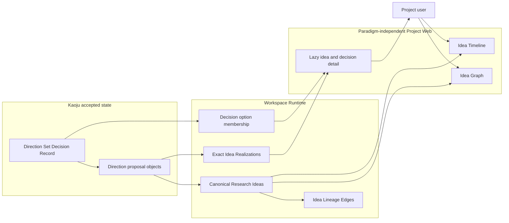

# Use Case 06: Browse Kaoju Directions in the Idea Portfolio

## Actor Goal

As a Project user, I want every proposed Kaoju survey direction to appear in the normal Idea Graph and Idea Timeline, so that I can compare directions, understand the actor's selection, revisit open or closed alternatives, and steer later research without learning a separate Kaoju GUI.

## Use Case

The user opens a Research Topic produced through Kaoju alone or through both Kaoju and DeepSci. Project Web loads one paradigm-independent canonical Research Idea portfolio. Each durable Kaoju Direction Set proposal appears as a Research Idea with its own facets, exact proposal realization, proposal-generation membership, Direction Set decision context, and explicit lineage. The Direction Set remains the Decision Record and survey workflow Artifact; Project Web does not parse it to manufacture graph nodes.

## Supported Actions

### Browse Every Kaoju Direction

The user inspects all actor-reviewed survey directions, including alternatives not selected for the current survey pass.

- context
  - Actor **has** a Kaoju-only or mixed-paradigm Research Topic open in Project Web.
  - System **has** an accepted idea-bearing `KAOJU:DIRECTION-SET` whose durable proposal objects have canonical Research Idea refs and exact Idea Realizations.
- intent
  - Actor **wants** to see all survey directions rather than only the currently selected one.
  - Actor **wonders** "Which Kaoju directions were proposed, and which remain available for exploration?"
- action
  - Actor then **asks** the system to open Idea Graph or Idea Timeline and apply `All proposed` or another portfolio preset.
- result
  - Actor **gets** every eligible Kaoju direction with title, summary, exploration, decision, evidence, visibility, archive state, decision outcome, and diagnostics through the standard Research Idea components.

### Review the Direction Selection

The user compares the selected survey direction with every proposal that participated in the confirmed Direction Set decision.

- context
  - Actor **has** a selected Kaoju-derived Research Idea open.
  - System **has** the Direction Set Decision Record, explicit option membership, actor confirmation, outcomes, and available rationale.
- intent
  - Actor **wants** to understand why the direction was selected and what happened to the alternatives.
  - Actor **wonders** "Why was this survey direction selected over the other proposals?"
- action
  - Actor then **asks** the system to open selection context.
- result
  - Actor **gets** the selected and non-selected proposals, authored outcomes, rationale, actor, timestamp, and current facets without treating a non-selected but still-open proposal as rejected or closed.

### Inspect Exact Kaoju Source Context

The user opens the Kaoju proposal that realizes a Research Idea without loading every Direction Set payload into the graph.

- context
  - Actor **has** a Kaoju-derived Research Idea node or timeline row selected.
  - System **has** an exact Idea Realization path to one object under `$.sections.proposals[<index>]`.
- intent
  - Actor **wants** to inspect the proposal's research question, boundary, source classes, evidence depth, deliverables, and feasibility.
  - Actor **wonders** "What precisely did this direction mean when it was proposed?"
- action
  - Actor then **asks** the system to open the idea's latest realization detail.
- result
  - Actor **gets** the exact proposal object and Direction Set context through lazy canonical detail refs while the graph and filters retain their current state.

### Compare Kaoju and DeepSci Ideas Together

The user inspects one topic whose research history includes ideas from more than one research paradigm.

- context
  - Actor **has** a topic containing canonical Research Ideas realized by both Kaoju Direction Sets and DeepSci records.
  - System **has** one topic-scoped canonical portfolio revision and complete or explicitly bounded topology metadata.
- intent
  - Actor **wants** one coherent view rather than separate extension-specific idea maps.
  - Actor **wonders** "How do the survey directions relate to the hypotheses and follow-up ideas developed later?"
- action
  - Actor then **asks** the system to filter, traverse ancestry or descendants, or open decision context without selecting an artifact family.
- result
  - Actor **gets** the union of eligible canonical ideas and lineage under one predicate, with producing records available only as realization detail.

## Main Flow

1. The user opens a Research Topic that has an accepted Kaoju Direction Set.
2. Project Web requests the canonical idea portfolio for the topic and current revision.
3. The GUI Backend returns every eligible canonical idea regardless of producing extension, including the Direction Set proposals, canonical lineage, facet counts, decision summaries, and completeness diagnostics.
4. Project Web applies the default `Current` preset and renders the selected and open Primary Ideas without a Kaoju-specific component.
5. The user selects `All proposed` and sees every non-hidden direction proposal, including deferred, closed, archived, or needs-classification entries as defined by the preset.
6. The user selects a direction and opens `Why selected?` to compare every proposal in the Direction Set decision.
7. The user opens the selected direction's realization detail and inspects the exact proposal object lazily.
8. In a mixed topic, the user invokes `Show descendants` and sees later Kaoju or DeepSci ideas connected by canonical Idea Lineage Edges.
9. The user returns to the portfolio with the preset, filters, selection, layout, and collapsed controls preserved.
10. If the user later chooses `Explore this idea` or `Explore instead`, Project Web delegates to the existing explicit steering use case using the canonical `idea_id` and realization refs.

## Alternative and Exception Flows

- If Kaoju is installed without DeepSci, the same canonical recording, read, detail, and GUI contracts remain available through the paradigm-neutral Research Idea Recording contract.
- If a legacy Direction Set has proposals but no canonical Research Idea effects, the backend reports an incomplete-portfolio diagnostic and previewable migration route; Project Web does not parse the payload into authoritative browser-only nodes.
- If a confirmed proposal was not selected but has no explicit deferral or closure, the GUI shows decision outcome `not selected` and current decision state `open` rather than inferring rejection.
- If a closed direction lacks a reason because it came from legacy data, the GUI marks the closure context incomplete or the decision state unknown and does not fabricate rationale.
- If an Idea Realization path no longer resolves to one proposal object, the idea remains visible with a broken-realization diagnostic and a repair route.
- If canonical ideas from one paradigm exist but another idea-bearing legacy record lacks projection, the backend labels the portfolio incomplete instead of silently presenting the first paradigm as the complete topic.
- If a reading-list item, paper, repository, method, claim, repair route, or paper section is present, it remains supporting material and does not appear as a Research Idea unless explicitly promoted as a durable concept.

## Mermaid Flow Diagram

## Durable Outputs

- This use case creates no Research Idea, Decision Record, transition, lineage edge, Research Inquiry, Research Task, Run, or Artifact because it is a read-only GUI workflow.
- The accepted Direction Set, canonical Research Ideas, Idea Realizations, proposal generation, decision option membership, transitions, and Idea Lineage Edges already exist from Kaoju recording or explicit migration.
- The active preset, filters, selection, expanded decision, and open realization detail may remain in browser or GUI Runtime State without changing canonical research state.

## Assumptions and Open Questions

- Assumption: A durable Direction Set proposal concept is the Kaoju equivalent of a Research Idea; the Direction Set itself remains a Decision Record.
- Assumption: Top-level survey directions default to Primary Idea visibility, while explicitly promoted subdirections may be primary or supporting according to authored intent.
- Assumption: New Direction Set writes distinguish decision option outcome from current portfolio disposition, so `not selected` can coexist with `open`.
- Assumption: Project Web uses canonical Research Idea fields and detail refs only; it does not import Kaoju profile schemas into graph or timeline components.
- Assumption: Cross-paradigm lineage is allowed when an accepted producer records an explicit, topic-scoped canonical relationship.
