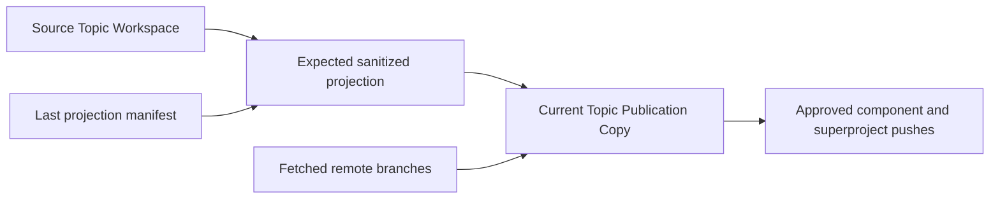

## Context

The canonical Topic Workspace is a Project-local managed directory. Its Topic Main Development Repository, Topic Actor Workspaces, and Agent Workspaces already have their own Git topology: Topic Main is the repository anchor, and actor and agent workspaces are worktrees on deterministic branches. Root Topic Workspace material such as intent, manifests, records, runtime state, and team-profile material sits outside Topic Main.

Users need two separate optional capabilities. In-workspace tracking gives the canonical Topic Workspace root a local Git history. Remote publication produces a privacy-reviewed representation on a user-supplied remote. Remote publication cannot safely push the canonical workspace directly because source history, local configuration, runtime state, worktree metadata, and deleted content may contain sensitive information.

This design therefore distinguishes the **Source Topic Workspace** from a **Topic Publication Copy**. Source Topic Workspace is a contextual role of the canonical Topic Workspace, not a new registered object, subtype, or fourth workspace type. The Topic Publication Copy is a disposable, ignored, Project-local derived projection used only for sanitization, component repository construction, and remote push; it is not a workspace or canonical source.

## Goals / Non-Goals

**Goals:**

- Keep local root tracking and remote publication disabled by default and independently opt-in.
- Preserve the canonical three-workspace taxonomy: Topic Workspace, Topic Actor Workspace, and Agent Workspace.
- Let any of the four enablement combinations work: neither layer, local only, publication only, or both.
- Initialize and manage local root history without remote operations or changes to existing nested Git workspaces.
- Require every ancestor Git repository to treat the Source Topic Workspace as untracked and effectively ignored before local initialization, without letting Topic Git mutate the ancestor.
- Publish from the current Source Topic Workspace filesystem without requiring local tracking or local commits.
- Allow publication after Topic Workspace registration without requiring Workspace Runtime or any later Topic Creator stage.
- Place the Topic Publication Copy under an effectively ignored Project temporary directory and recreate it when lost.
- Sanitize content before it enters any publication Git history.
- Represent every currently available Topic Main, registered Topic Actor Workspace, and selected-team Agent Workspace as a sanitized superproject submodule by default, subject to explicit plan exclusions and privacy approval.
- Use one credential-safe user-provided remote for the superproject and all component branches.
- Treat that remote as dedicated to one Research Topic publication, expect it to be empty initially, and support explicitly approved replacement of incompatible publication branches.
- Compare source, previous projection, current copy, and remote state before synchronization.
- Preserve exact approval, stale-plan, conflict, and partial-push evidence without persisting secret values.
- Use Isomer CLI only as a read-only query plane and teach the operator agent to run path-scoped Git commands directly.

**Non-Goals:**

- Enable tracking during Topic creation, Topic Environment Setup, Topic Actor setup, or Agent Environment Setup.
- Change Topic Main from its current role as the Git anchor for actor and agent worktrees.
- Make local tracking a prerequisite, source, or trigger for remote publication.
- Push the Source Topic Workspace root repository, nested source repositories, or source Git history.
- Create hosting-provider repositories, accounts, credentials, access rules, deploy keys, or multiple component remotes.
- Prove that automated privacy inspection found every sensitive item.
- Use the Topic Publication Copy as a canonical Topic Workspace, research record, Artifact authority, or runtime dependency.
- Model Source Topic Workspace as a distinct schema type or call a Topic Publication Copy a Publication Workspace.
- Pull, merge, rebase, rewrite source history, delete remote branches, force unrelated branches, or resolve remote divergence without a fresh plan and explicit user decision.
- Add `isomer-cli project topic-git ...`, place Git mutation behind another Isomer CLI command, or hide Git execution inside a Python service or helper script.

## Decisions

### Keep a dedicated Topic Git operator subskill

Add protected logical capability `isomer-op-topic-workspace-git` as entrypoint member `topic-git`. It owns context queries, planning, approval, privacy decisions, direct filesystem and Git execution, state validation, and outcome reporting.

The skill exposes an overall status plus two independent operation groups:

```text
isomer-op-entrypoint->topic-git->status()

isomer-op-entrypoint->topic-git->local()->status()
isomer-op-entrypoint->topic-git->local()->init()
isomer-op-entrypoint->topic-git->local()->plan()
isomer-op-entrypoint->topic-git->local()->ignore()
isomer-op-entrypoint->topic-git->local()->commit()

isomer-op-entrypoint->topic-git->publish()->status()
isomer-op-entrypoint->topic-git->publish()->init()
isomer-op-entrypoint->topic-git->publish()->plan()
isomer-op-entrypoint->topic-git->publish()->sync()
```

These names are skill routing vocabulary, not shell commands. The design adds no `isomer-cli project topic-git ...` command family.

Topic Manager recognizes explicit Git tracking and publication intent and delegates it to `topic-git`. It does not add these operations to its own broad storage, actor, team, environment, and reset procedures.

### Separate the Isomer query plane from direct Git execution

For this workflow, Isomer CLI is a read-only information source. The skill uses explicit `--print-json` queries to locate the Project, pin the Research Topic, resolve the Source Topic Workspace and semantic paths, list or inspect Topic Actors, obtain selected Agent Names and bindings, and inspect Workspace Runtime. Existing query surfaces include `project self location`, `project self check`, `project context show`, `project workspaces list`, `project paths get|explain|list`, `project topic-actors list|show`, read-only team-profile or team-instance inspection, and `project runtime inspect`.

The skill pins every accepted Research Topic, Topic Actor, and Agent selector on applicable queries. It consumes the returned paths as data, canonicalizes them, and validates expected Project and Topic Workspace boundaries before running Git. It never scans sibling Topic Workspace directories to replace unresolved Isomer context. If existing query surfaces cannot expose required topology, implementation may add a read-only query, but it must not add a Git mutation endpoint.

After context resolution, the agent invokes the installed Git executable directly. Every repository-scoped command uses `git -C <resolved-path> ...` so ambient cwd cannot redirect an operation. Local root operations target only the resolved Source Topic Workspace. Publication operations target only the validated Topic Publication Copy or one of its fresh sanitized component repositories. Source Topic Main, Topic Actor, and Agent repositories may be inspected directly for branch, commit, and dirty-state evidence but are never mutated by publication.

The direct Git contract uses exact pathspec staging and explicit refs. It forbids broad `git add .` or `git add -A`, `pull`, automatic merge or rebase, `reset`, `clean`, source history rewriting, remote branch deletion, and implicit repair. Before each mutation, the skill recomputes repository identity, HEAD, index, relevant working content, approved fingerprints, and remote refs. Publication fetches without merging and normally proves fast-forward compatibility. An incompatible deterministic publication branch may use plain `--force` only through the separately approved destructive replacement procedure. Publication still pushes approved component refs first and `topic-workspace/main` last.

Non-Git helpers may implement deterministic inventory, privacy scanning, sanitization, placeholder generation, fingerprinting, projection comparison, and schema validation. They must not execute Git or accept an arbitrary shell command. This keeps the operational procedure visible in the skill and prevents Isomer CLI from becoming a second Git interface.

### Model independent opt-in state

The system reports each layer separately:

| Layer | States |
| --- | --- |
| Local tracking | `disabled`, `enabled`, `invalid` |
| Remote publication | `disabled`, `prepared`, `synchronized`, `stale`, `copy-missing`, `blocked` |

All combinations are valid. `local init` does not prepare a Topic Publication Copy. `publish init` does not initialize or use a Source Topic Workspace root repository. Local commits do not trigger publication, and publication does not stage or commit the local root repository. Local mutations require an existing valid Workspace Runtime, but publication requires only a registered Research Topic and Topic Workspace.

When both layers are enabled, local Git status may provide diagnostics, but it is not publication authority. Publication inventories the current Source Topic Workspace filesystem, including relevant files that are untracked or uncommitted in local Git.

Local tracking enablement is proven only when the Source Topic Workspace itself is the Git top level. An ancestor Project repository does not enable it. After Workspace Runtime exists, remote publication enablement is recorded through a namespaced publication-binding support file under the resolved `topic.runtime` directory and the publication-copy and remote evidence that binding describes. Before runtime exists, enablement is evidenced only by the ignored Topic Publication Copy local support state and any successfully pushed sanitized remote manifests.

### Keep in-workspace tracking local and ordinary

`local init` initializes a Git repository at the Source Topic Workspace root after an exact mutation plan. It does not add a remote and does not alter an existing remote if a user previously configured one manually. Local operations never fetch, pull, or push.

Before initialization, the skill discovers every ancestor Git top level with direct read-only Git inspection. For each ancestor, it proves that the Source Topic Workspace and its relevant existing contents are absent from the ancestor index and effectively ignored. A tracked or unignored ancestor relationship blocks `local init`. Topic Git does not edit an ancestor `.gitignore`, run `git rm --cached`, or otherwise repair ancestor state; it reports the exact repository and prerequisite for a separate user-controlled Project operation.

The local root repository tracks user-approved root-owned material. Its managed `.gitignore` block excludes known runtime, database, environment, cache, temporary, credential, canonical external repository, Topic Main, Topic Actor Workspace, and Agent Workspace paths by default.

Topic Main, actors, and agents retain their existing repository and worktree relationships. The local root repository does not absorb them, copy their `.git` metadata, or add unconfigured gitlinks. It may track a sanitized `topic-workspace-local-version.toml` that records relative semantic workspace labels, branch names, commit SHAs, and dirty-state booleans so a root commit can describe the nested state. This manifest does not claim to preserve uncommitted nested content.

Local planning uses exact whole-file selection. It may warn about secret-like material even though no remote is involved, because later manual publication of local history could expose it. An operator may explicitly retain sensitive material in local history after reviewing the warning.

### Treat remote publication as a derived projection

Remote publication reads the Source Topic Workspace but writes publication content only to the Topic Publication Copy. Sanitization never overwrites canonical source files.

The projection inventory assigns each source path one disposition:

| Disposition | Meaning |
| --- | --- |
| `track` | Copy canonical working content into the publication projection unchanged after review. |
| `template` | Create a placeholder-bearing sibling or sanitized derived copy in the projection. |
| `exclude` | Omit the path from publication and record the exclusion reason. |
| `component` | Materialize the selected nested workspace as a sanitized component repository and superproject submodule. |
| `block` | Stop publication until privacy, format, size, license, or ambiguity is resolved. |

The copier never copies `.git` directories, `.git` worktree files, Git configuration, credential stores, source remotes, reflogs, objects, indexes, or source repository history. It also excludes Workspace Runtime, `state.sqlite`, local environments, caches, logs, temporary material, canonical external repositories, credentials, and unapproved records by default.

Structured templates use descriptive placeholders such as `${OPENAI_API_KEY}`. Arbitrary text requires a reviewed sanitized output. Unsupported binaries and archives block rather than receive automatic masking.

Component selection is complete-by-default within current Isomer topology. The skill uses read-only Isomer queries, not directory scans, to select every currently available Topic Main, registered Topic Actor Workspace, and Agent Workspace belonging to the selected team context. A component that has not been created or cannot be resolved at the current lifecycle stage is reported as unavailable and omitted from that plan. Once it becomes available, the next plan selects it automatically. That topology change invalidates an older approved plan and requires renewed privacy review before the component may be committed or pushed. The user may explicitly exclude any available component in the current plan.

### Place the publication copy under Project temporary storage

The default destination is `<project-root>/<temporary-dir>/topic-workspace-publish/<topic-id>/`. Resolution follows this order:

1. Reuse the safe Project-local path from an existing publication binding.
2. Prefer an existing effectively ignored Project-root `tmp/`.
3. Otherwise prefer an existing effectively ignored Project-root `temp/`.
4. Otherwise use a declared ignored `tmp/` or `temp/` candidate even if it does not yet exist.
5. If neither candidate is effectively ignored, plan an Isomer-managed `tmp/` rule in the Project-root `.gitignore` and creation of Project-root `tmp/`.

When the Project belongs to a Git repository, resolution uses effective `git check-ignore` evidence rather than text matching alone. When it does not, it inspects the Project-root `.gitignore` and still prepares a future-safe managed rule. User-authored ignore content remains unchanged outside a stable managed block.

The selected destination must stay inside the Project root and outside the Source Topic Workspace, Project Config Directory, generated content root, Houmao state, and any canonical repository. A custom destination requires the same safety checks.

In this repository, Project-root `tmp/` already exists and is ignored, so the default would be `<project-root>/tmp/topic-workspace-publish/<topic-id>/`.

### Use sanitized submodules backed by one remote

The Topic Publication Copy is a superproject on `topic-workspace/main`. Each default-selected or explicitly retained component is a fresh sanitized repository whose publication history contains no source Git ancestry:

| Source component | Publication branch |
| --- | --- |
| Topic Main | `topic-owner/main` |
| Topic Actor Workspace | `per-topic-actor/<topic-actor-name>/main` |
| Agent Workspace | `per-agent/<agent-name>/main` |

The superproject replaces each selected component path with a submodule gitlink. Every `.gitmodules` entry uses the same credential-safe user-provided remote URL and names its corresponding publication branch. The gitlink pins the exact component commit. Component branches may have unrelated sanitized histories even when their source workspaces share Topic Main history.

This same-remote arrangement was verified with the supported Git version: an independent component branch and superproject branch in one bare remote cloned successfully with `--recurse-submodules`. It avoids creating or requiring separate provider repositories.

The Topic Publication Copy contains a tracked, sanitized `topic-workspace-version.toml` plus a projection manifest. These record schema version, publication binding or plan id, creation time, branch-to-commit mappings, relative output mappings, transformations, and output fingerprints. They omit source absolute paths, source remote URLs, credentials, sensitive excerpts, and excluded content.

### Separate publication preparation from remote push

`publish init` enables remote publication locally as soon as the Research Topic and Topic Workspace are registered. It resolves or creates the ignored destination, stores a credential-safe publication binding, builds the first privacy plan, and may materialize the superproject and every available component repository not explicitly excluded. It does not require Workspace Runtime and does not push. Components whose lifecycle stages are not ready are reported as unavailable and cannot be silently invented from directory scans.

An explicit `publish sync` authorizes comparison and the planned remote synchronization. A task-only request such as “publish this topic now” may run from `publish init` through `publish sync`, but it must preserve the privacy review and remote mutation gate.

The remote URL must not contain embedded passwords, tokens, signed query parameters, or fragments. Authentication remains with Git credential helpers, SSH agents, or user-selected provider tooling. The workflow requires a typed visibility acknowledgement of `private`, `restricted`, or `public`; `unknown` blocks push. One remote is bound to one Research Topic publication. The first publication expects no deterministic publication branches. Existing compatible branches must carry sanitized identity and history consistent with the binding; otherwise they enter the incompatible-branch procedure.

The incompatible-branch procedure fetches current refs and produces a destructive-change plan for each affected deterministic publication branch. The plan names the observed remote commit, exact replacement commit, commits expected to become unreachable from that branch, push order, and recovery warning. Plain `--force` is allowed only after the user explicitly approves those exact replacements. The approval is separate from privacy approval and ordinary remote mutation approval. If any observed remote ref changes before execution, the plan is stale and the skill must fetch, plan, warn, and ask again. The skill never uses `--all`, `--mirror`, remote branch deletion, or force against a branch absent from the approved plan.

### Synchronize with a four-way comparison

`publish sync` compares:



The workflow performs these phases:

1. Resolve the Source Topic Workspace and the publication binding from Workspace Runtime support state when available, otherwise from the validated Topic Publication Copy local support state or explicit user-supplied remote input.
2. Reconstruct a missing disposable copy from the recorded remote, or rematerialize it when no publication exists yet.
3. Fetch the superproject and every selected component branch without merging.
4. Stop on credentials in locators or changed binding identity. For remote divergence or unexpected commits on deterministic publication branches, stop unless a current destructive-change plan has explicit force-push permission.
5. Inventory the current source filesystem and generate the expected sanitized projection.
6. Compare expected output with both the current copy and the last projection manifest.
7. Update an output only when it is unchanged from the last generated version or an approved conflict decision exists.
8. Remove an output only when it still matches the prior generated version; otherwise report a conflict.
9. Rescan every resulting component and superproject blob.
10. Commit and push selected component branches first, using normal push for compatible refs and plain `--force` only for exact explicitly approved incompatible replacements.
11. Update submodule gitlinks, projection manifest, and `topic-workspace-version.toml`.
12. Commit and push `topic-workspace/main` last.

A destination-only manual edit and a simultaneous source change create a conflict. The workflow does not overwrite the destination or source. A missing Topic Publication Copy is recoverable because the remote branches and sanitized manifests are sufficient to reconstruct it; the copy itself is not durable authority.

Multi-branch publication is not atomic. If a component push succeeds and a later push fails, the previously published `topic-workspace/main` version remains authoritative. The publication binding records per-branch results and the safe resume point.

### Persist state according to lifecycle availability

Local plans and publication plans use distinct schema-validated support-file types and identifiers. Local mutations require the skill to obtain an existing valid `topic.runtime` through read-only Isomer queries and write only within `<topic.runtime>/topic-git/`; it never edits `state.sqlite` directly. Local files contain root repository state and exact local path decisions.

Publication may run before Workspace Runtime exists. During that period, its credential-safe binding, plan, projection state, conflicts, and outcomes live in an ignored local support root inside the Topic Publication Copy and are never eligible for publication commits. The copy-local state contains the Source Topic Workspace ref, safe Project-relative copy path, credential-safe remote locator, visibility acknowledgement, selected components, source and output fingerprints, transformations, conflicts, component commits, push outcomes, and resume state. Successfully pushed sanitized manifests provide remote reconstruction evidence but omit source locators and credentials.

When Workspace Runtime later becomes available, the next approved `publish init` or `publish sync` validates the copy-local and remote identities, then records the credential-safe binding and current publication state under `<topic.runtime>/topic-git/`. Read-only status does not perform this promotion. Losing an unpushed pre-runtime publication copy loses its local plan; the user must prepare it again. Losing a successfully pushed pre-runtime copy requires the user to supply the remote again unless a runtime binding has since been recorded.

No support file stores secret values, sensitive excerpts, raw private diffs, source Git configuration, or credential-bearing URLs. Every mutation recalculates the state relevant to its own layer. A stale local plan does not stale a publication plan unless the source filesystem relevant to publication also changed, and a remote change does not invalidate local tracking. Missing or unresolved `topic.runtime` blocks local mutation but never blocks publication for a registered Topic Workspace, and Topic Git never initializes Workspace Runtime.

## Risks / Trade-offs

- [A root local repository gives a false impression that nested uncommitted work is recoverable] → Exclude nested Git workspaces and make the local version manifest state that it records pointers, not nested working content.
- [An ancestor Project repository stages or absorbs the new nested repository] → Require the Topic Workspace to be untracked and effectively ignored by every ancestor before local initialization, and keep ancestor repair outside Topic Git.
- [Automated sanitization misses sensitive material] → Treat scans as diagnostics rather than proof, block high-risk formats, require reviewed dispositions, and never reuse source history.
- [A disposable publication copy is deleted] → Persist the binding and sanitized manifests, reconstruct from remote branches, and rescan source before the next push.
- [An unpushed pre-runtime publication copy is deleted] → Treat its local plan as lost and require publication preparation again; do not introduce a second canonical source-state file solely to preserve it.
- [The destination contains intentional manual edits] → Use last-generated fingerprints for three-way conflict detection and never overwrite destination-only changes silently.
- [The Project temporary directory is not ignored] → Require effective ignore evidence or an approved managed `tmp/` rule before materialization.
- [Same-remote submodules surprise Git users] → Document the branch layout, pin exact gitlinks, include `branch` in `.gitmodules`, and verify recursive clone behavior in integration tests.
- [A source deletion removes important published material] → Delete only unchanged generated outputs and block modified destination files.
- [Multi-branch push partially succeeds] → Push components first, superproject last, record outcomes, and make resume idempotent.
- [Remote visibility is misunderstood] → Require explicit `private`, `restricted`, or `public` acknowledgement and block `unknown`.
- [Plain force push discards remote history] → Require a fresh branch-specific destructive plan, list observed and replacement commits plus displaced commits, obtain separate explicit permission, reject stale approval, and prohibit `--all`, `--mirror`, deletion, or unrelated branch mutation.
- [Direct agent-run Git varies across environments or is invoked against the wrong repository] → Require Git capability checks, use `git -C` with read-only Isomer-resolved paths, pin exact refs and pathspecs, show mutation plans, and revalidate state immediately before each mutation.
- [A future implementation reintroduces a hidden Git wrapper] → Validate the packaged skill and helper sources to reject `isomer-cli project topic-git`, Git subprocess calls from Isomer CLI or helper modules, and publication Git execution outside validated copy paths.

## Migration Plan

This change does not migrate existing Topic Main, actor, or agent repository topology. It replaces only the unimplemented earlier OpenSpec design.

1. Add the protected skill, read-only Isomer query contract, direct Git contract, independent state schemas, and read-only overall status.
2. Author local-only initialization, planning, ignore maintenance, and commit operations using direct Git.
3. Implement non-Git Project temporary-path resolution, support-file persistence, and publication binding validation.
4. Implement sanitized projection and author direct Git materialization of fresh component repositories without source Git metadata.
5. Author direct Git same-remote submodule construction and validate recursive clone behavior.
6. Implement non-Git four-way comparison and author direct Git conflict checks, component-first pushes, and superproject-last publication.
7. Add routing, progressive-disclosure references, documentation, and wrapper-boundary validation.
8. Test all four layer combinations and prove that operations in one layer do not mutate or require the other.

Rollback disables the optional skill operations and leaves canonical Topic Workspace topology untouched. Removing a Topic Publication Copy is safe after preserving its binding and remote state. Deleting local or remote Git history remains an explicit user operation outside this change.

## Open Questions

No blocking design questions remain. The first version allows remote publication as soon as the Research Topic and Topic Workspace exist, selects every available Isomer-resolved topic component by default, expects one initially empty remote repository per Research Topic, permits a branch-specific plain force push only after fresh explicit permission, requires every ancestor Project repository to ignore the Source Topic Workspace before local Git initialization, and treats Source Topic Workspace as a contextual role of the canonical Topic Workspace rather than a new workspace type. It also uses whole-file selection, deterministic component branches, credential-safe remote URLs, independent local and publication state, read-only Isomer CLI queries, and direct Git execution by the operator agent.
