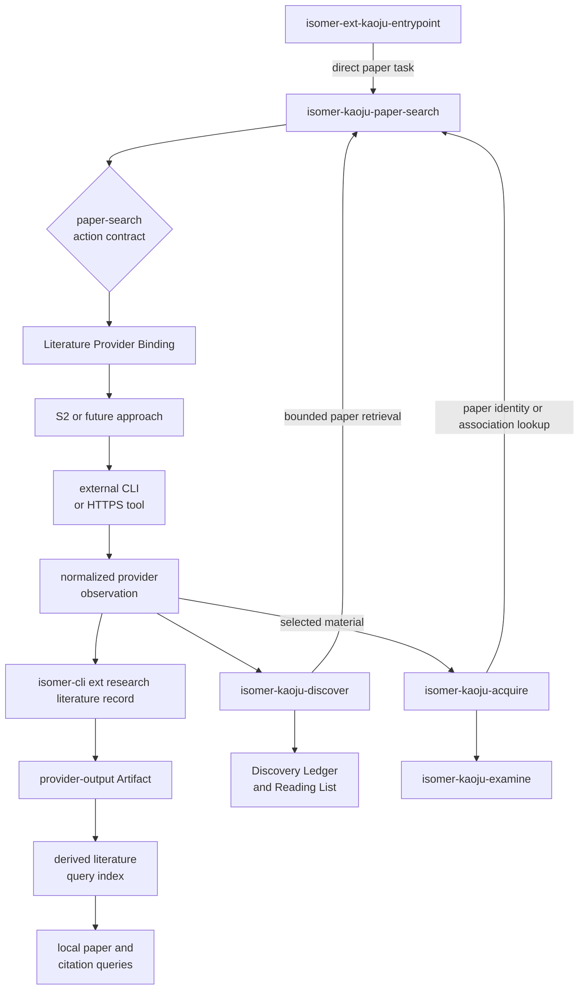

## Context

Kaoju already defines broad discovery, seed expansion, Source Identity, literature-provider boundaries, and evidence acceptance. Paper lookup and citation traversal are nevertheless spread across `isomer-kaoju-discover`, `direction-expansion-pass`, reading-list construction, and bounded metadata discovery in acquisition. None of those bundles contains an executable paper-provider approach.

The referenced `imsight-paper-search` skill contains useful direct Semantic Scholar API guidance, but its top-level model is an endpoint catalog spanning papers, authors, recommendations, snippets, and datasets. Kaoju needs a narrower action model, shared bounds and normalized results, and a clear separation between provider observation and accepted survey evidence.

The canonical Isomer domain language requires a provider-neutral `literature_search` Research Operation Extension Point and a Literature Provider Binding. Provider-specific request bodies, credentials, and payloads must remain outside generic skill and schema surfaces. Packaged protected members must also resolve active resources inside their own bundles.



## Goals / Non-Goals

**Goals:**

- Establish one protected Kaoju owner for paper identity lookup, topic search, forward and backward citation tracing, bounded citation-neighborhood traversal, and adjacent-paper retrieval.
- Present paper-search actions rather than provider endpoints in `SKILL-MAIN.md`.
- Keep `discover` responsible for search strategy, cross-source-class coverage, candidate judgment, reading lists, and durable discovery records.
- Bundle a self-contained S2 approach that can execute the initial actions through the existing literature-provider boundary.
- Normalize provider results, bounds, completeness, provenance, missing fields, and failure posture before downstream use.
- Keep provider execution in agent-selected external tools rather than an Isomer provider wrapper.
- Record normalized observations and expose local paper and citation queries through provider-neutral `isomer-cli ext research literature` data commands.
- Preserve one immutable provider-output Artifact per logical action and derive separately versioned, rebuildable paper and citation indexes.
- Preserve provider output as non-claim-bearing until existing Kaoju acquisition, examination, and evidence-acceptance rules apply.
- Allow another provider approach to implement the same actions without changing the public Kaoju command surface.

**Non-Goals:**

- Adding a public top-level skill or mandatory public survey command.
- Replacing `isomer-kaoju-discover` or moving Reading List and Discovery Ledger producer ownership.
- Treating citation metadata, contexts, intents, or influence labels as verified full-text evidence.
- Adding general author search, Semantic Scholar dataset export, snippet search, or bulk corpus mirroring in the first version.
- Adding a provider API, credential value, or raw provider payload to core Isomer schema.
- Introducing a Semantic Scholar client-library dependency or a new Python service solely for HTTP requests.
- Wrapping, proxying, dispatching, or normalizing provider-specific requests through `isomer-cli`.
- Creating one canonical research record per observed paper or citation edge.
- Requiring raw provider responses for a valid normalized observation.
- Revising Workspace Runtime to v2 solely for derived literature query tables.

## Decisions

### 1. Add a Protected Peer Rather Than a Nested Discover Resource

Create logical capability `isomer-kaoju-paper-search`, member name `paper-search`, and designator `isomer-ext-kaoju-entrypoint->paper-search`. It lives at the manifest-required path `isomer-ext-kaoju-entrypoint/subskills/isomer-kaoju-paper-search/`.

`paper-search` depends on `isomer-kaoju-shared`. Known callers such as `discover` and `acquire` add `paper-search` to their declared dependency closure. `paper-search` does not depend on `discover`, which avoids a dependency cycle and keeps direct bounded search possible.

Alternative considered: keep paper search inside `discover`. This would preserve the current inventory but continue mixing provider mechanics with survey strategy and make direct paper-search tasks load the broader discovery owner.

Alternative considered: nest a second subskill below `discover`. The current system-skill catalog requires protected capabilities directly below the public entrypoint and has no production nested-protected-member pattern.

### 2. Use Six Stable Paper-Search Actions

`SKILL-MAIN.md` exposes the following action table and routes each action to one local command page:

| Action | Internal Designator |
| --- | --- |
| Resolve a target paper | `isomer-ext-kaoju-entrypoint->paper-search->resolve-paper()` |
| Search papers by topic or metadata | `isomer-ext-kaoju-entrypoint->paper-search->search-papers()` |
| Find papers that cite a target | `isomer-ext-kaoju-entrypoint->paper-search->find-citing-papers()` |
| Explore papers cited by a target | `isomer-ext-kaoju-entrypoint->paper-search->explore-cited-papers()` |
| Traverse a bounded citation neighborhood | `isomer-ext-kaoju-entrypoint->paper-search->trace-citation-neighborhood()` |
| Find adjacent papers from seeds | `isomer-ext-kaoju-entrypoint->paper-search->find-related-papers()` |

The top-level table explains research actions, required inputs, and result posture. It does not list base URLs, HTTP methods, endpoint paths, or S2 parameter names.

Alternative considered: expose one generic `search()` action with mode flags. That makes routing less readable and allows forward and backward citation meaning to become ambiguous.

### 3. Split Research Ownership from Retrieval Ownership

`paper-search` owns target resolution, provider selection, request bounds, retrieval, pagination, local filtering when required, normalized provider observations, and completeness reporting.

`discover` owns the broader search plan, terminology variants, source-class portfolio, seed selection, inclusion and exclusion judgments, version-family decisions, target counts, reading-list revisions, and `KAOJU:DISCOVERY-LEDGER`, `KAOJU:READING-LIST`, and catalog-delta writes.

`acquire` owns material access and immutable identity. `examine` owns exact source inspection. `audit` and `synthesize` retain their existing roles. Paper search does not gain an existing Kaoju Artifact binding.

Context-only external results use the provider-output recording required by the existing Literature Provider Extension. When the result participates in a Kaoju survey, `discover` consumes the normalized provider-output ref and records accepted route and disposition data through its existing bindings.

Alternative considered: make paper-search a second producer of the Discovery Ledger. This would create competing current-state ownership and blur the distinction between retrieval and survey judgment.

### 4. Define a Provider-Neutral Action and Result Envelope

Every action resolves:

- Research purpose and evidence-use intent.
- Query, target, positive seeds, or negative seeds.
- Forward, backward, bidirectional, or non-citation relationship.
- Explicit date or year range.
- Result, page, node, per-node, and depth bounds.
- Required normalized fields.
- Literature Provider Binding and credential or Gate posture.
- Stop and continuation conditions.

Every returned result records target identity, candidate identities, available external identifiers, parent seed or query, edge direction, requested and applied filters, provider-side versus local filtering, pages and records inspected, retained count, observation time, searched-through date, completeness, continuation posture, provider provenance, missing fields, and limitations.

Multi-hop traversal defaults to one hop. It tracks visited provider identities, prevents cycles, and stops at every declared depth, node, per-node result, page, resource, or provider limit.

Relative time such as “recent three years” is resolved against the observation date into an explicit inclusive range before execution. The resolved range is recorded so later Runs do not reinterpret “recent.”

### 5. Treat S2 as One Bundle-Local Approach

The first bundle contains:

```text
isomer-kaoju-paper-search/
├── SKILL-MAIN.md
├── agents/openai.yaml
├── commands/
│   ├── resolve-paper.md
│   ├── search-papers.md
│   ├── find-citing-papers.md
│   ├── explore-cited-papers.md
│   ├── trace-citation-neighborhood.md
│   └── find-related-papers.md
└── references/
    ├── provider-selection.md
    ├── result-contract.md
    ├── execution-and-errors.md
    └── approaches/
        └── s2.md
```

`references/approaches/s2.md` contains only the Academic Graph and Recommendations operations needed by the six actions. It documents supported identifiers, field projection, response shapes, citation and reference edge fields, pagination, date-filter differences, retryable failures, and safe curl construction. Author endpoints, Datasets API, snippet search, and unrelated bulk-export recipes are omitted.

Provider selection follows the resolved Literature Provider Binding. An explicit user request for S2 selects S2 only when that approach is available under the binding and applicable policy. Otherwise, the skill reports the missing approach or reduced local-only scope. A future approach adds a local approach reference and binding mapping while preserving action pages and normalized results.

Alternative considered: copy the complete `imsight-paper-search` skill. This would import unrelated APIs, retain an API-first top-level model, and introduce an external source dependency.

### 6. Keep Provider Execution Agent-Driven, Dependency-Light, and Secret-Safe

The paper-search skill lets the agent use an available provider-native or general-purpose CLI tool whenever practical. The S2 approach may use a suitable external tool or direct HTTPS requests constructed with curl guidance rather than a new Isomer client library or `isomer-cli` provider wrapper. Query values use safe URL encoding, requested fields remain minimal, and returned JSON is normalized before Isomer records it.

Authenticated access resolves through an approved credential binding or non-empty `S2_API_KEY` process environment. The approach does not scan arbitrary `.env` files. It never places a key in a URL, rendered command, stdout capture, chat response, normalized result, Artifact, or Provenance Record. Anonymous access may be used only when the provider binding and policy permit it, and its observed limitations are reported.

Throttling and transient failures use bounded retry with server-provided retry guidance when available. Successful earlier pages remain visible in a partial result. Invalid target identity, authorization failure, and non-retryable request errors stop without unbounded retries.

Alternative considered: import environment files using the source skill's key-discovery order. That broadens secret access and conflicts with provider and credential bindings.

Alternative considered: add a generic or Kaoju-specific literature-provider command to `isomer-cli`. This would move provider execution into Isomer and conflict with the preferred agent-direct tool boundary.

### 7. Record One Normalized Observation per Logical Action

The provider approach converts provider-shaped output into `isomer-literature-provider-observation.v1` before recording. One immutable provider-output Artifact covers one logical paper-search action, including every accepted page, resolved bound, partial failure, and continuation posture. Provider pages, candidates, and citation edges do not become independent canonical research records.

The normalized observation includes action and purpose, evidence-use intent, provider and access method, target or query, seeds, direction, requested and applied bounds, paper candidates, citation edges, pagination, filtering location, completeness, limitations, missing fields, unresolved records, observation time, and provider provenance. It does not include credentials, authorization headers, provider-specific request bodies, or required provider-specific response fields.

Redacted raw provider responses are optional file-backed attachments with media type, checksum, and Provenance refs. They are not required for a valid observation and are not the input to the literature query index.

Alternative considered: ask `isomer-cli` to accept raw S2 responses and normalize them. This would place provider-specific adapters in Isomer and make local indexing depend on provider payload compatibility.

### 8. Add a Provider-Neutral Local Literature Data CLI

Add `isomer-cli ext research literature` as a local data group. Its command help states that it records and queries Isomer-owned local data and never contacts a literature provider.

The initial command surface provides:

- `record --payload-file OBSERVATION.json`
- `observations list` and `observations show OBSERVATION_ID`
- `papers query` by DOI, arXiv id, provider-qualified id, and other declared normalized selectors
- `citations query` by normalized paper id and forward or backward direction
- `index rebuild` and `index validate`

Provider-facing verbs such as `search`, `resolve`, `recommend`, `find-citing-papers`, and `explore-cited-papers` remain paper-search skill actions. The CLI may reuse generic research-record storage internally, but callers do not have to assemble low-level record kind, profile, schema, provenance, or index flags.

Alternative considered: expose the commands under `ext kaoju`. Literature observations and local query indexes are provider-neutral and reusable outside Kaoju, so the `ext research` namespace is the stronger ownership boundary.

### 9. Version the Derived Literature Projection Separately

The canonical observation is stored through existing research-record and structured-payload mechanisms. `isomer-literature-query-index.v1` adds derived `literature_observation_index`, `literature_paper_index`, `literature_citation_edge_index`, and projection metadata inside the selected Topic Workspace's Workspace Runtime database.

Each derived row links to its canonical observation record and payload digest. The tables are safe to delete and rebuild. They do not constitute Artifacts, Findings, Evidence Items, or independent paper records.

Read-only literature commands do not create, migrate, repair, or rebuild tables. Recording commits a valid canonical observation even when the compatible projection is missing and reports the required rebuild. Explicit rebuild creates or replaces only derived literature rows. Validation reports schema compatibility, missing source records, digest drift, malformed paper keys, missing citation endpoints, and orphaned rows.

Workspace Runtime remains `isomer-workspace-runtime.v1` because the new tables form a separately versioned disposable projection rather than a change to canonical lifecycle records.

Alternative considered: bump Workspace Runtime to v2. That would require unrelated canonical runtime migration for data that can be regenerated from existing provider-output Artifacts.

### 10. Preserve the Public Survey Command Surface

No new public survey intent is required. Natural-language tasks such as “find recent papers citing X” may route directly from the public entrypoint to the protected member. Existing public commands such as `build-reading-list`, `direction-expansion-pass`, and `landscape-pass` keep their names and use paper-search internally.

The checked survey-process resource and system-skill manifest add the sixteenth protected member. Public welcome command maps do not expose protected action notation as public commands.

### 11. Validate Centralization, Recording, and Resource Boundaries

Validation and unit tests will check:

- Exact sixteen-member Kaoju inventory and dependency closure.
- Entrypoint routing guidance for `paper-search`.
- Complete six-action inventory and local command pages.
- Absence of endpoint tables, base-URL catalogs, credentials, and external checkout paths in `SKILL-MAIN.md`.
- Presence of required S2 operational material in the bundle-local approach reference.
- Discover and other paper-search callers route through the new owner instead of embedding S2 mechanics.
- S2 result normalization, direction, bounds, pagination, filtering location, partial failure, null handling, and redaction guidance.
- Installation and private projection retain every local action and approach resource.
- `ext research literature` performs no provider I/O and accepts only the provider-neutral normalized observation contract.
- One logical action creates one canonical provider-output Artifact while candidates and citation edges remain derived index rows.
- Optional raw attachments are redacted, checksummed, and excluded from normalized indexing.
- Literature observation, paper, and citation queries use only local Workspace Runtime data.
- Read-only queries do not create or repair tables, and rebuild changes only the `isomer-literature-query-index.v1` projection.

## Risks / Trade-offs

- [Centralization creates an extra handoff between discover and retrieval] → Keep the normalized result contract compact, declare dependency closure, and retain discover as the same Run-level controller.
- [S2 fields or limits may change] → Isolate S2 details in one approach reference, cite official documentation, avoid copying unrelated endpoints, and test action-to-operation coverage rather than prose snapshots.
- [Citation traversal can grow rapidly] → Default to one hop and require depth, node, per-node result, page, and stop bounds.
- [Provider metadata may be mistaken for source evidence] → Label edges and metadata as provider-reported and require acquire and examine before claim-bearing use.
- [External tool availability varies across agent environments] → Keep the action and normalized observation contracts tool-neutral, document direct HTTPS as a bounded fallback where permitted, and report a blocked or reduced scope when no compatible provider tool is available.
- [Normalization can drift from provider response changes] → Keep provider mapping in the bundle-local approach, validate normalized output before recording, and preserve redacted raw responses as optional diagnostic attachments.
- [Large observations can produce many derived rows] → Keep the canonical unit at one logical action, use bounded action limits, and rebuild indexed paper occurrences and citation edges from payload digests.
- [A missing or stale literature projection could hide recorded candidates] → Commit canonical observations first, report projection posture on every local query, and provide explicit rebuild and validation commands.
- [A new protected member changes receipts and inventory counts] → Update the manifest, process resource, installer expectations, documentation, and upgrade tests in one change.
- [Duplicated paper-search wording may survive in callers] → Audit active Kaoju skills and command pages, retain only strategy or handoff language outside paper-search, and add validation fixtures for API leakage.

## Migration Plan

1. Add the provider-neutral literature observation schema and record-format profile.
2. Add `ext research literature` recording and local observation-query commands without provider execution.
3. Add the separately versioned literature paper and citation projection, explicit rebuild and validation, and local query commands.
4. Add the protected paper-search bundle, local action pages, normalized result contract, provider-selection guidance, execution policy, and S2 approach reference.
5. Add the capability to the system-skill manifest and checked Kaoju process in deterministic order, with version metadata matching `project.version`.
6. Add the entrypoint protected route and dependency edges from known callers.
7. Revise `discover`, `acquire`, reading-list, landscape, curated-intake, and direction-expansion guidance so paper-specific retrieval routes to paper-search.
8. Update validation, contract, installer, recording, index, projection, and skill-asset tests.
9. Update Kaoju, research-recording, CLI, and packaged-system-skill documentation.
10. Run repository validation, lint, type checking, and unit tests.

No canonical Workspace Runtime or existing Kaoju Artifact migration is required. Existing Discovery Ledgers, Reading Lists, Source Identities, and provider-output Artifacts remain valid. Existing normalized literature observations become locally queryable after an explicit literature-index rebuild.

Rollback removes the new manifest and process entries, restores direct paper-retrieval wording to `discover`, removes the protected bundle and local literature CLI, and deletes only derived literature projection tables. Rollback does not rewrite existing research records.

## Open Questions

- Should a later change add author-centric actions after paper and citation workflows demonstrate stable demand?
