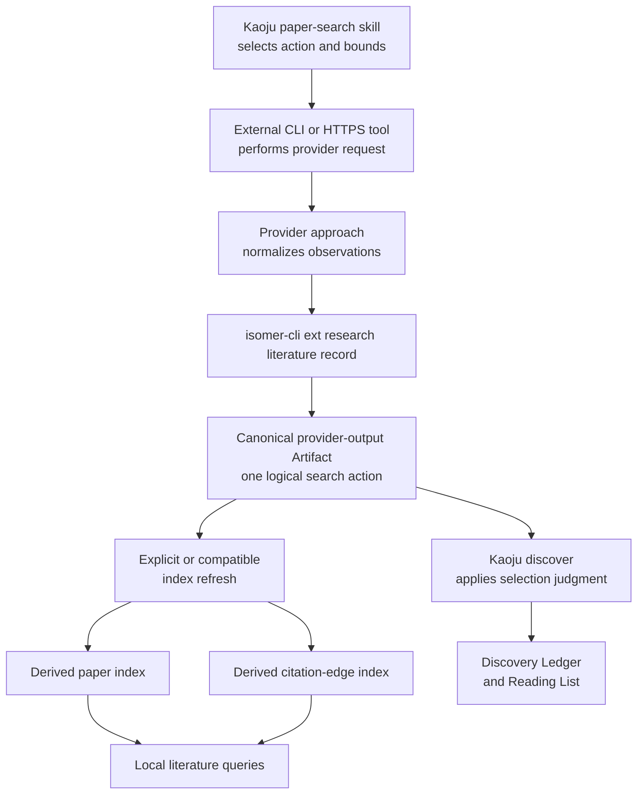

# Paper Search CLI and Schema Boundaries

## Outcome

Kaoju paper search remains an agent-operated workflow. Agents use provider-native or general-purpose CLI tools directly, while `isomer-cli` records normalized literature observations and queries Isomer-owned local projections. Isomer does not proxy provider requests, reproduce provider commands, or normalize provider-specific payloads.

## Intended Reader

This design is for maintainers implementing the `centralize-kaoju-paper-search` OpenSpec change, especially the protected skill, research-recording CLI, normalized observation schema, and literature query projection.

## Accepted Boundaries

| Concern | Accepted Design |
| --- | --- |
| Provider execution | The paper-search skill invokes available external CLI or direct HTTPS tooling. `isomer-cli` performs no provider I/O. |
| Canonical recording unit | One immutable provider-output Artifact records one logical paper-search action, including all bounded pages and partial-failure posture. |
| Paper and citation query | Rebuildable paper and citation-edge indexes derive from canonical observations; candidates and edges are not independent canonical research records. |
| Normalization | The skill's provider approach converts provider output into the provider-neutral observation schema before recording. |
| Raw provider output | Redacted raw responses are optional file-backed attachments. They are neither required nor indexed as canonical metadata. |
| CLI namespace | `isomer-cli ext research literature` records and queries local data and explicitly does not contact providers. |
| Schema evolution | Workspace Runtime stays at v1; the derived projection uses `isomer-literature-query-index.v1` inside the same database. |

## Data Flow



## Agent-Facing Paper-Search Actions

The protected paper-search skill remains the only action-oriented search surface:

- `resolve-paper`
- `search-papers`
- `find-citing-papers`
- `explore-cited-papers`
- `trace-citation-neighborhood`
- `find-related-papers`

The S2 approach may describe provider endpoints, parameters, pagination, and safe direct invocation in bundle-local references. `SKILL-MAIN.md` lists research actions rather than provider APIs.

## Local CLI Contract

The local data surface should provide commands equivalent to:

```text
isomer-cli ext research literature record --payload-file observation.json
isomer-cli ext research literature observations list
isomer-cli ext research literature observations show OBSERVATION_ID
isomer-cli ext research literature papers query --doi DOI
isomer-cli ext research literature papers query --arxiv-id ARXIV_ID
isomer-cli ext research literature papers query --provider-id PROVIDER:ID
isomer-cli ext research literature citations query --paper-id PAPER_ID --direction forward
isomer-cli ext research literature index rebuild
isomer-cli ext research literature index validate
```

The command help must say that these operations access only Isomer-owned local data. Provider-facing verbs such as `search`, `resolve`, `recommend`, `find-citing-papers`, and `explore-cited-papers` do not belong in this CLI group.

`record` validates and commits the canonical observation before refreshing a compatible projection. A missing or incompatible projection does not invalidate a successfully committed observation; the result reports that an explicit rebuild is required.

## Canonical Observation Schema

`isomer-literature-provider-observation.v1` is provider-neutral and represents one logical action rather than one provider request or page. It must cover:

- Stable observation identity, schema version, action, research purpose, evidence-use intent, and observation time.
- Provider binding ref, provider name, access method, and provider provenance without credentials or provider request bodies.
- Query, target paper, seed papers, requested direction, and resolved date or year range.
- Requested and applied result, page, node, per-node, depth, and resource bounds.
- Normalized paper identities, titles, authors, publication dates or years, venues, locators, and available DOI, arXiv, and provider identifiers.
- Normalized citation edges with citing paper, cited paper, route, parent seed, and provider-reported posture.
- Pages and records inspected, retained count, filtering location, continuation state, reached frontier, completeness, truncation, limitations, missing fields, unresolved records, and partial failures.
- Optional redacted raw-payload attachments identified by file ref, media type, checksum, and provenance ref.

The schema must reject credentials, authorization headers, secret values, and provider-specific request bodies. Provider-specific fields may remain only in optional redacted raw attachments.

## Derived Projection

`isomer-literature-query-index.v1` lives in the Workspace Runtime database and contains derived tables for observations, paper occurrences, and citation edges. Each row links back to the canonical observation record and its payload digest.

The projection is disposable. Rebuild deletes or replaces only derived literature-index rows, reads canonical observation payloads, and never rewrites Artifacts, Discovery Ledgers, Reading Lists, Findings, Evidence Items, or Provenance Records.

Read-only commands report missing, stale, or incompatible projection state without mutation. Validation checks projection schema version, source record existence, payload digest agreement, normalized paper keys, citation endpoints, and orphaned rows.

## Evidence and Ownership

Recorded literature observations remain provider output. A paper candidate or citation edge does not support a Research Claim merely because it appears in the canonical observation or derived index.

`discover` owns candidate disposition, version-family judgment, search coverage, the Discovery Ledger, and Reading Lists. `acquire` owns material access and immutable source identity. `examine` owns claim-bearing source inspection.

## Acceptance Signals

- An agent can invoke S2 or another provider tool without an Isomer wrapper, normalize the result, and record one validated observation.
- Recording succeeds without a compatible literature projection and reports the required rebuild.
- Rebuild deterministically produces the same paper and citation rows from unchanged canonical observations.
- Local queries use no network access and expose their projection schema and freshness posture.
- S2-specific payload fields never become required generic schema fields.
- Raw attachments are optional, redacted, checksummed, and excluded from normalized indexing.
- Provider observations remain distinct from accepted discovery and evidence records.

## Decision Records

- [Keep Provider Execution Outside `isomer-cli`](../adrs/0001-keep-provider-execution-outside-isomer-cli.md)
- [Record Search Observations and Derive Literature Indexes](../adrs/0002-record-search-observations-and-derive-literature-indexes.md)
- [Record Normalized Literature Observations](../adrs/0003-record-normalized-literature-observations.md)
- [Add a Local Literature Data CLI](../adrs/0004-add-a-local-literature-data-cli.md)
- [Version the Literature Query Projection Separately](../adrs/0005-version-the-literature-query-projection-separately.md)

## Deferred Scope

Author-centric discovery actions remain deferred until paper and citation workflows demonstrate stable demand. This change does not introduce a provider proxy, a background provider dispatcher, a second database, or a Workspace Runtime v2 migration.
