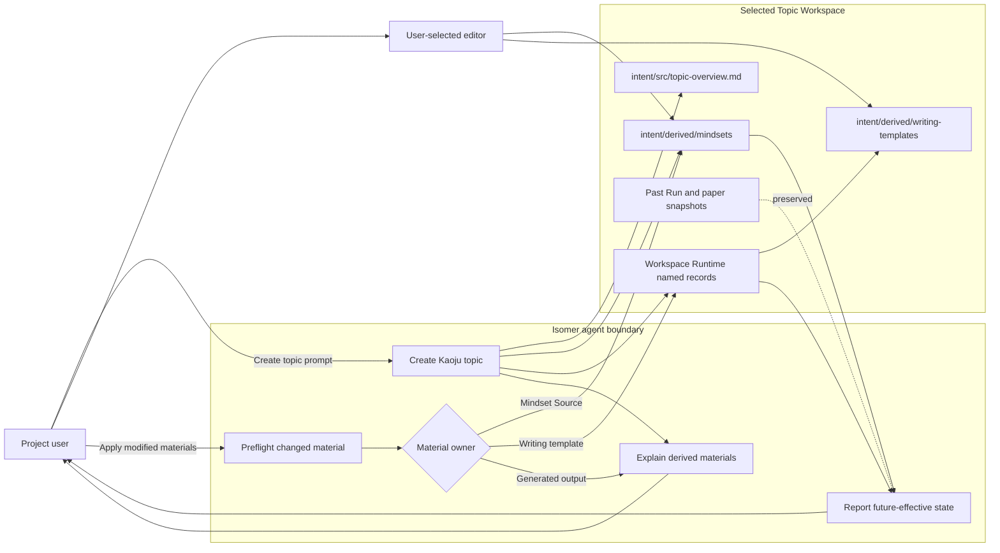
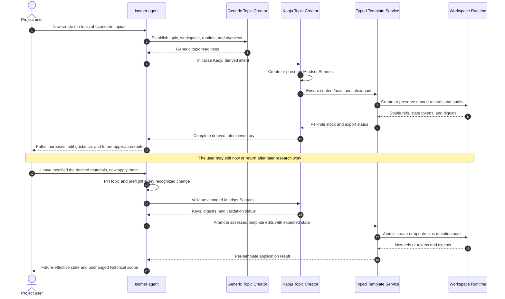

# Use Case 01: Create, Review, and Apply Kaoju Derived Intent

## Actor Goal

As a Project user, I want the agent to create a Kaoju Research Topic, explain its editable derived intent, and apply my later adjustments to future work, so that I can tune the research process without rewriting historical results.

## Use Case

The user asks the agent in natural language to create a topic about concrete subject matter. The agent creates or selects the Project, Research Topic, Topic Workspace, Workspace Runtime, and `topic.intent.overview`, then initializes Kaoju Mindset Sources and content and LaTeX writing-template stock. Before any later initialization or research stage, the agent stops and explains every recognized material currently present under `intent/derived`, what it controls, how the user can adjust it, and whether an edit is direct current intent, a non-canonical working copy that must be promoted, or generated service-owned output. The user may edit supported material immediately or return after later Runs and papers exist. When the user says, “I have modified the derived materials, now apply them,” the agent validates and routes each changed material to its owner so future Runs and newly created paper artifacts observe the accepted state. Existing Run snapshots, Mindset Records, paper drafts, TeX snapshots, PDFs, and other historical Artifacts remain unchanged unless the user explicitly requests a separately scoped retrospective reconciliation.

## Supported Actions

### Create and Review the Topic

The user creates one concrete Kaoju topic and receives an adjustment-oriented handoff before proceeding.

- context
  - Actor **has** a concrete research topic statement and permission to initialize its Project and Topic Workspace.
  - System **has** the generic Topic Creator, the public Kaoju entrypoint, checked Mindset defaults, checked content and LaTeX defaults, Workspace Runtime, and semantic path resolution.
- intent
  - Actor **wants** a ready initial Topic Workspace whose research behavior can still be adjusted before later setup or research begins.
  - Actor **wonders** "What did the agent place in `intent/derived`, what does each item control, and how can I change it?"
- action
  - Actor then **asks** the system to “now create the topic of `<concrete topic>`.”
- result
  - Actor **gets** the selected Research Topic and Topic Workspace, initialization status, and an exact inventory of recognized derived materials with purpose, edit instructions, activation behavior, validation constraints, and the reminder that adjustment remains possible later.

### Adjust Mindset Sources

The user changes the reflective questions that future applicable Kaoju Runs will answer.

- context
  - Actor **has** one or more JSON files under `intent/derived/mindsets/` and understands which workflow selects each `mindset_key`.
  - System **has** the closed Mindset Source schema, deterministic filenames, current file digests, and the rule that Mindset Sources are directly editable topic intent rather than Artifacts.
- intent
  - Actor **wants** future paper reading or source-code ingestion Runs to use revised questions or `additional_notes`.
  - Actor **wonders** "Can I add a topic-specific question without changing the Mindset Records from work that already happened?"
- action
  - Actor then **asks** the system to apply the edited derived materials after changing the selected Mindset Source files.
- result
  - Actor **gets** validation by mindset key and digest, confirmation that valid Sources govern later applicable Runs, and confirmation that active and completed Mindset Records retain their original snapshots.

### Adjust Writing Templates

The user edits exported content or LaTeX working copies and promotes accepted edits to future paper stock.

- context
  - Actor **has** a recognized working copy at `intent/derived/writing-templates/content/main/`, `intent/derived/writing-templates/latex/main/`, or another explicit role-local name with synchronization metadata.
  - System **has** canonical named template records, current state tokens and digests, role-specific validation, and atomic create or update operations with mutation audit.
- intent
  - Actor **wants** future papers to use a revised survey structure, writing guidance, LaTeX presentation, or composition contract.
  - Actor **wonders** "How do I make this edited working directory become the template used by papers created from now on?"
- action
  - Actor then **asks** the system to apply the edited derived materials.
- result
  - Actor **gets** agent-reviewed and validated template changes promoted to the matching named record with a new state token, digest, and audit ref, while existing paper and TeX snapshots remain pinned to the states they previously observed.

### Apply All Recognized Changes

The user uses one natural-language request to validate and route every changed supported material in the selected Topic Workspace.

- context
  - Actor **has** edited one or more recognized derived materials and has selected an unambiguous Research Topic and Topic Workspace.
  - System **has** semantic labels, Mindset validation, template export observations, expected-state tokens, material ownership rules, and selected-context diagnostics.
- intent
  - Actor **wants** accepted edits to govern future operations without manually choosing a different low-level operation for each material type.
  - Actor **wonders** "I changed the derived materials; can the agent validate them and make the changes effective from now on?"
- action
  - Actor then **asks** the system, “I have modified the derived materials, now apply them.”
- result
  - Actor **gets** a per-material result distinguishing validated direct intent, promoted template stock, unchanged material, invalid edits, concurrency conflicts, unsupported generated output, and the exact future-effective boundary.

### Request Retrospective Reconciliation

The user explicitly opts into revising selected past work rather than relying on the default future-only application.

- context
  - Actor **has** named past Runs, paper drafts, TeX snapshots, PDFs, or other Artifacts whose content should be reconsidered against newer derived intent.
  - System **has** immutable historical refs, revision and supersession mechanisms, provenance recording, and the current accepted derived state.
- intent
  - Actor **wants** a bounded set of past material to be regenerated or reconciled while retaining history.
  - Actor **wonders** "Can you revise these two existing papers to use the new template without changing every older paper?"
- action
  - Actor then **asks** the system to reconcile explicitly identified historical material and states the desired scope.
- result
  - Actor **gets** a separate plan or authorized operation that creates new revisions or derived Artifacts with provenance, while original snapshots and unrelated past material remain unchanged.

## Main Flow

1. The Project user says, “now create the topic of `<concrete topic>`.”
2. The agent resolves or creates the Project and delegates Research Topic registration, Topic Workspace creation, Workspace Runtime initialization, and `topic.intent.overview` creation to the generic Topic Creator.
3. The public Kaoju entrypoint invokes the protected topic-creation owner after generic readiness.
4. The topic-creation owner creates missing `paper.deep-dive`, `paper.skimming`, and `source-code.ingest` Mindset Sources and invokes the typed ensure-defaults operation for content and LaTeX `main`.
5. The template service creates or preserves canonical named stock and creates safe non-canonical exports beneath `intent/derived/writing-templates/<kind>/main/`.
6. The agent inspects the actual recognized `intent/derived` contents and stops before any later initialization or research stage.
7. The agent reports each material's path, purpose, supported adjustments, validation rules, activation behavior, and historical effect. It explains that Mindset Sources are direct current intent, writing-template directories require promotion, and other generated derived outputs must be adjusted through their source owner.
8. The user either proceeds without edits, edits the derived materials before the next stage, or returns to the Topic Workspace after later work has accumulated.
9. The user says, “I have modified the derived materials, now apply them.”
10. The agent pins the selected Research Topic and Topic Workspace, inventories only registered or semantically known derived surfaces, identifies changed supported material, and performs a complete read-only preflight before record mutation.
11. For each changed Mindset Source, the agent validates its deterministic path, `mindset_key`, schema, and digest. A valid Source remains current topic intent for later Runs; the agent creates no synthetic Mindset Source Artifact.
12. For each changed writing-template export, the agent checks role, name, source identity, exported digest, current named state, and expected state token. It assesses the edit and invokes typed create or update through the matching content or LaTeX namespace.
13. The template service commits accepted named-template changes atomically and emits the new state token, digest, and mutation audit.
14. The agent reports per-material outcomes and states that future Runs and newly initialized paper work will use the accepted state.
15. Active and completed Runs, Mindset Records, template snapshots, paper drafts, TeX drafts, PDFs, and other past Artifacts retain their recorded input identities and content.
16. If the user later asks to make named past material compatible, the agent treats that as a new explicitly scoped reconciliation and creates new revisions or derived Artifacts rather than rewriting history.

## Alternative And Exception Flows

- If the creation prompt lacks concrete topic substance, the agent pauses before deriving an id, creating a Topic Workspace, or writing topic intent and asks for the missing subject.
- If topic creation completes only partially, the agent reports the ready and blocked resources. A repeated explicit create request preserves valid state and resumes missing work.
- If no local writing-template record or directory exists, ordinary future paper work remains available through the matching packaged default. Applying derived edits reports that no local template change exists.
- If a Mindset Source is malformed, unreadable, mismatched with its filename, or schema-invalid, the apply request reports the exact Source diagnostic. It does not treat the file as missing, use the packaged seed at Run time, or change past Records.
- If a template export is stale relative to its named record, the agent does not overwrite current stock. It presents the base and current identities and requires agentic reconciliation before a state-checked update.
- If an export was created from packaged fallback and no named record exists, applying it uses named-template create rather than update.
- If multiple topics are plausible, the agent asks the user to select one before reading or mutating derived material.
- If the user edits a generated environment target specification or another service-owned derived file, the agent refuses direct promotion, identifies the owning source intent such as `intent/src/topic-env-gate.md` or actor definitions, and offers the correct regeneration route.
- If no recognized material changed, the apply request performs no mutation and reports current validated state.
- If some changed materials validate and others fail, the agent reports per-material posture. It performs no state-record mutation until the complete preflight finishes, then applies only independently authorized, conflict-free record-backed changes; directly editable valid Mindset Sources remain current by their file contract.
- If an active Run or paper line already pinned an earlier Source or template snapshot, applying new derived state does not retarget it mid-operation.
- If the user asks generally to “update old work,” the agent asks for exact historical targets and desired outputs before beginning retrospective reconciliation.

## Mermaid Flow Diagram

## Mermaid Sequence Diagram

## Durable Outputs

- Project Manifest-backed Research Topic and Topic Workspace registration, Workspace Runtime, and `topic.intent.overview`.
- Topic-owned Mindset Source files under `topic.intent.kaoju_mindsets`, including their current validated keys and content digests. They are current intent, not Artifact records.
- Canonical named `KAOJU:PAPER-TEMPLATE-MYST` and `KAOJU:PAPER-TEMPLATE-LATEX` records with managed trees, state tokens, tree digests, authored metadata, audit refs, and query-index state.
- Non-canonical content and LaTeX working copies beneath `topic.paper.template_exchange_root`, with synchronization metadata and registered export observations.
- For an apply request, updated named-template records and mutation audits only for accepted changed templates, plus a per-material result covering validated Sources, promoted stock, unchanged material, conflicts, and unsupported generated output.
- Existing Mindset Records, Run resolutions, paper template snapshots, paper drafts, TeX drafts, PDFs, and their provenance remain unchanged by default.
- An explicitly requested retrospective reconciliation produces new revisions, snapshots, or derived Artifacts linked to the earlier material; it never rewrites the historical input identity.

## Example Prompt And Expected AI Response

### Event 001 - Create a Topic and Explain Derived Intent

> Time: `initialization` · Session: `selected Project`

User Prompt:

> now create the topic of predictive memory management for LLM inference

AI:
> The agent reports the created Research Topic and Topic Workspace, then lists the actual `intent/derived` materials. It explains that `mindsets/*.json` controls reflection for future applicable Runs and can be edited directly; `writing-templates/content/main/` controls future paper structure and guidance; `writing-templates/latex/main/` controls future TeX presentation and composition. It gives validation and apply instructions for each, notes that missing writing templates use packaged defaults, and stops before the next initialization or research stage. A concise response includes: “After editing supported material, tell me ‘I have modified the derived materials, now apply them.’ You can do this now or return later.”

### Event 002 - Apply Later Edits

> Time: `after one or more Runs` · Session: `same selected Topic Workspace`

User Prompt:

> I have modified the derived materials, now apply them

AI:
> The agent pins the topic, preflights recognized changes, and reports each outcome. A representative result says that the three Mindset Sources validate at their new digests, content `main` was promoted with a new state token and audit ref, LaTeX `main` was unchanged, and future Runs and newly initialized paper work will use the accepted state. It explicitly states that existing Mindset Records, paper drafts, TeX snapshots, and PDFs were not rewritten. If retrospective compatibility is wanted, it asks the user to name the past Runs or paper artifacts to revise.

## Assumptions And Open Questions

- Assumption: The natural-language phrase “apply them” targets every recognized changed editable material in one unambiguously selected Topic Workspace, not arbitrary files beneath `intent/derived`.
- Assumption: Topic creation stops after its requested initialization boundary and never advances automatically into environment setup, actor setup, a research Run, or paper drafting.
- Assumption: A valid direct edit to a Mindset Source is already current topic intent. The apply request validates and reports it; it does not manufacture an Artifact record or delay activation behind a separate import.
- Assumption: A writing-template edit remains a non-canonical working-copy change until the agent promotes it through state-checked named-template create or update.
- Assumption: “Future operations” means later Runs and newly created or explicitly reinitialized paper artifacts. An active operation keeps the Source or template snapshot it already pinned.
- Assumption: The agent performs a complete preflight before any template-record mutation and reports independent per-material outcomes rather than promising a filesystem-and-database transaction across unlike material types.
- Assumption: Direct edits to generated environment target specifications and other service-owned derived outputs are unsupported; users adjust source intent and rerun the owning derivation.
- Assumption: The first version creates no aggregate “derived-intent application receipt.” Mindset Source digests, named-template mutation audits, export observations, and the agent's per-material result provide the required evidence without adding a synthetic Artifact type.
