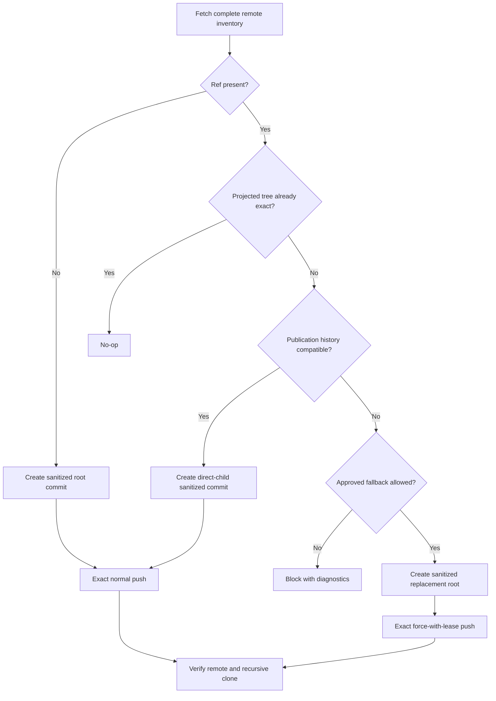

## Context

Topic publication currently projects approved Topic Workspace content into disposable Git repositories, creates fresh root commits, and force-replaces every differing component branch and canonical `main`. This protects source privacy because publication commits have no Source Topic Workspace Git ancestry, but it also discards the ancestry of earlier sanitized publications.

The publication workflow already has the controls needed to make incremental updates safe: a Publication Binding identifies the remote and Topic Workspace, a plan records complete remote refs and tags, projection manifests describe the sanitized output, component commits are pinned from `main`, updates run component-first and `main`-last, and sync rechecks remote state before mutation. The implementation does not currently use ancestry evidence when classifying a differing remote ref.

This change spans Topic Git models and schemas, projection and snapshot planning, packaged operator skills, validation rules, documentation, and tests. It must preserve the direct-Git mutation boundary and must not introduce source commits, source `.git` metadata, credentials, ignored content, or unapproved paths into publication history.

## Goals / Non-Goals

**Goals:**

- Preserve compatible sanitized publication ancestry and commit only the projected delta.
- Select and persist one explicit update strategy for every expected publication ref.
- Use ordinary exact pushes for initial and fast-forward publication.
- Recover a missing disposable Topic Publication Copy from compatible remote state.
- Retain exact replacement and deletion as controlled fallbacks under matching `exclusive_snapshot` authority.
- Keep complete-inventory, stale-state, privacy, conflict, topology, ordering, and recursive-clone checks.
- Read existing bindings and publication metadata while making old approved plans stale.

**Non-Goals:**

- Import or preserve Source Topic Workspace Git ancestry.
- Turn the Topic Publication Copy into a user-maintained working repository.
- Merge, rebase, reset, clean, or otherwise repair a dirty or divergent existing Topic Publication Copy automatically.
- Preserve arbitrary remote edits that do not match a valid Isomer publication lineage.
- Add a Topic Git CLI mutation family or a Git wrapper.
- Guarantee immediate object deletion by a Git provider after a history replacement.

## Decisions

### 1. Separate Source History from Publication History

A publication commit may have one parent only when that parent is a freshly observed, compatible commit from the same sanitized publication lineage. A publication commit must never use a Source Topic Workspace commit as a parent.

The projection pipeline continues to materialize an exact approved tree and stage only that tree. Git ancestry supplies the parent relationship, not additional content. This keeps source privacy independent from whether publication history is incremental.

Alternative considered: continue creating root commits for every version. That design is simple but always requires destructive replacement and loses useful publication provenance.

### 2. Plan a Strategy for Every Ref

The planner assigns each expected ref one of four strategies:

| Strategy | Observed Ref | Compatible Base | Planned Action |
| --- | --- | --- | --- |
| `no_op` | Equals the projected result | Yes | Do not create or push a redundant commit |
| `create` | Absent | Not applicable | Create a sanitized root commit and push normally |
| `fast_forward` | Present and differs | Yes | Create the projected result as a direct child and push normally |
| `force_replacement` | Present and differs | No | Create a sanitized replacement root and push with an exact lease |

Deletion remains a separate planned operation because it has no result commit. Destination conflicts and stale observations are blockers, not strategies.

The plan records the observed commit, chosen base commit, planned result commit, compatibility evidence, fallback reason, and the complete observed and expected remote state. These fields participate in the plan fingerprint and approval boundary.

Alternative considered: infer the strategy during sync. That would let a remote change alter mutation semantics after approval, so the planner must make the decision and sync must only revalidate it.

### 3. Define Publication-History Compatibility Conservatively

A remote ref is compatible only when all available evidence agrees:

- The current Publication Binding matches the remote, Research Topic, Topic Workspace, canonical branch, and `exclusive_snapshot` mode.
- The remote commit is reachable from an exact ref fetched from the freshly observed remote state.
- Supported tracked publication metadata identifies the same binding and canonical topology.
- For `main`, its tracked component pins and generated topology are internally valid.
- For a component ref, the ref identity and its relationship to the previously published `main` metadata are valid.
- The current privacy plan does not require earlier published content to become unreachable.
- The proposed commit can be formed as a direct child of the observed commit without merging another lineage.

Missing, unsupported, contradictory, or malformed evidence produces an incompatible result with diagnostics. It does not silently authorize a force replacement; fallback also requires the matching binding, current mutation approval, and no unresolved blocker.

The compatibility evaluator replaces the current behavior in which `classify_remote_branch` ignores `remote_is_ancestor`. The updated model distinguishes exact equality, compatible ancestry, absence, incompatibility, blocked state, and stale state without treating every difference as replacement.

Alternative considered: accept any remote commit under the expected branch name as a parent. That would preserve unknown edits and could carry unapproved history into the publication lineage.

### 4. Build from the Freshly Observed Base

For a `fast_forward` ref, the publisher checks out the exact fetched observed commit in a validated publication repository, removes paths outside the approved projection, materializes the exact approved tree, stages explicitly, and validates the staged tree before committing. The new commit must have the observed commit as its sole parent.

If the resulting tree equals the base tree, the planner or sync downgrades the action to `no_op`; operational identifiers and timestamps must not create metadata-only publication commits. Tracked publication metadata changes only when content-bearing publication state changes.

An existing Topic Publication Copy may be reused only when it is clean, identifies the expected binding, and resolves to the planned base. If the copy is missing, the workflow may reconstruct it by fetching exact planned refs into a new disposable publication repository. If the existing copy is dirty, divergent, or structurally invalid, sync blocks or uses a separately created and validated disposable recovery repository. It does not repair the existing copy in place.

Alternative considered: require the previous local copy for every incremental update. The remote is the authoritative published state, so local-copy loss should not destroy remote ancestry.

### 5. Use Exact Normal Pushes by Default

`create` and `fast_forward` use exact source-to-destination refspecs without a force marker. `no_op` performs no push. Sync fetches again immediately before mutation and rejects any change from the plan's complete remote refs, tags, or remote `HEAD`.

Components publish in deterministic order before canonical `main`. Until the final `main` update succeeds, the old `main` remains the authoritative complete publication. A retry re-inventories the remote, recognizes already completed exact component outcomes, and plans only the remaining safe work.

Alternative considered: use force-with-lease for all updates. A lease prevents some races but still encodes replacement semantics and can discard history that a normal fast-forward push preserves.

### 6. Constrain Force Replacement to an Explicit Fallback

Force replacement is allowed when a compatible parent cannot be established because of structural or history incompatibility, or when a privacy, credential, license, or withdrawal decision requires old published content to become unreachable. A missing local copy, ordinary projected changes, or a destination conflict is not a fallback reason.

The publisher uses a branch-scoped exact lease such as `--force-with-lease=<destination-ref>:<observed-commit>` and an exact refspec. It does not use a bare `--force`. An absent-ref fallback uses the normal create path rather than a force push.

Fallback scope follows publication topology. If replacing a component lineage would leave canonical `main` history pointing to the withdrawn or incompatible component state, the plan also replaces `main`. The planner reports the closure and reason before approval.

`exclusive_snapshot` continues to authorize exact planned replacement and obsolete-ref or tag deletion. It no longer means that every differing ref should be replaced.

Alternative considered: add a second binding mode. Existing bindings already express exclusive control of the publication namespace, so changing their operational interpretation preserves compatibility and avoids a second authority migration.

### 7. Version Plans and Outcomes, Preserve Binding Compatibility

Publication Binding v1 remains unchanged and readable. A new publication-plan schema version adds per-ref strategy records, compatibility evidence, base and result commits, fallback reasons, and the history-retention or history-purge decision. Existing v1 plans cannot authorize the new sync semantics and become stale.

Publication outcomes gain a new schema version that records the attempted strategy, observed lease, actual result, verification state, and fallback use for every ref. Readers continue to accept earlier outcome versions.

The projection manifest gains a new schema version only if implementation needs tracked lineage evidence that existing fields cannot represent. Its reader continues to accept v1, and legacy manifests qualify as compatible bases only when their existing binding, topology, and commit evidence is sufficient. Otherwise, the planner chooses a documented fallback or blocks.

Alternative considered: extend the closed v1 plan schema in place. That would make existing approvals ambiguous and would break the meaning of stored fingerprints.

### 8. Keep Operational State out of Content Deltas

Approval timestamps, plan identifiers, observed remote state, push attempts, and outcomes stay in ignored support storage. Tracked `.isomer-publication/` files contain stable publication identity, projection, topology, and reproduction information only. Replanning an unchanged projection therefore produces no tracked tree change and no publication commit.

Alternative considered: write every plan identifier into the tracked manifest. That would make every run appear as a content update and defeat no-op synchronization.

### 9. Update the Operator Contract and Validator Together

The packaged `isomer-op-topic-workspace-git` skill explains planning, recovery, incremental commit construction, exact normal push, fallback force-with-lease, deletion, partial resume, and verification. The direct-Git command contract remains narrow: the skill may issue reviewed exact Git commands, but no new project CLI mutation family is introduced.

`scripts/validate_skillsets.py` and skill contract tests must recognize exact normal publication pushes and exact branch-scoped force-with-lease fallback. They should reject bare force, unleased replacement, wildcard refspecs, `main`-before-components ordering, and language that treats force replacement as the normal update path.

Canonical domain documentation must state that a Topic Publication Copy may retain sanitized publication ancestry while excluding Source Topic Workspace Git ancestry.

## Risks / Trade-offs

- [Previously published content remains reachable in compatible history] → Require the privacy plan to distinguish history retention from history purge, and select force replacement for approved withdrawal cases.
- [A force replacement does not guarantee immediate provider object deletion] → Report this limitation and require provider-specific cleanup when the withdrawal policy needs stronger erasure.
- [Malformed legacy metadata can make a legitimate publication look incompatible] → Produce evidence-level diagnostics and allow a separately approved fallback instead of guessing.
- [Component and `main` histories can become inconsistent after partial failure] → Publish components first, keep `main` last, persist per-ref outcomes, and replan from a fresh complete inventory.
- [Concurrent remote mutation can race an approved plan] → Re-fetch before mutation, compare the complete inventory, use normal push checks, and use exact force-with-lease for fallback.
- [Incremental history grows indefinitely] → Accept growth as the cost of provenance; a future retention policy may define planned compaction without changing this default.
- [Operational metadata can cause empty-value commits] → Keep volatile state outside tracked trees and compare projected trees before committing.
- [Recovery may accidentally trust an unrelated remote] → Require the matching binding plus supported lineage and topology evidence before using a remote commit as a parent.

## Migration Plan

1. Add versioned strategy, compatibility, plan, and outcome models and schemas while retaining readers for existing bindings, manifests, and outcomes.
2. Implement conservative history classification and tests before changing packaged skill commands.
3. Add incremental projection construction, missing-copy recovery, exact normal push planning, fallback force-with-lease planning, and partial-resume validation.
4. Update the operator skill, validator, canonical documentation, and manual guidance in the same release.
5. Treat all previously approved publication-plan v1 files as stale and require a fresh inventory and approval. Reuse an existing Publication Binding when its identity and authority fingerprint still match.
6. On the first new sync, extend a legacy publication only when its tracked evidence establishes a compatible sanitized lineage. Otherwise, block or use the explicitly approved force-replacement fallback.
7. Roll back by restoring the prior planner and operator instructions. New metadata remains readable only by the new release, so rollback must require fresh legacy plans and must not reuse approvals created under the new strategy model.

## Open Questions

No open design questions block implementation. The implementation may choose whether the new lineage evidence fits a backward-readable projection-manifest version or requires a new version, but it must preserve the compatibility and no-op behavior defined above.
