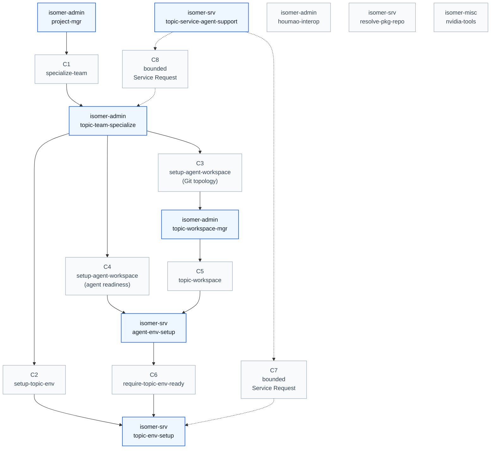

# Skill Call Graph

This graph covers only skills under `skillset/misc/`, `skillset/operator/`, and `skillset/service/`. It shows call paths where both endpoints are top-level skills. Intermediate nodes appear only when they explain the path between skills.

## Calling Conditions

| ID | Caller | Route | Callee | Calling condition and context |
| --- | --- | --- | --- | --- |
| C1 | `isomer-admin-project-mgr` | `specialize-team` | `isomer-admin-topic-team-specialize` | The operator moves from Project lifecycle work into adapting or instantiating a Domain Agent Team Template for one Research Topic. Project-level context is resolved first, then specialization is handed off instead of duplicated. |
| C2 | `isomer-admin-topic-team-specialize` | `setup-topic-env` | `isomer-srv-topic-env-setup` | Topic Team Specialization needs independent Topic Workspace dependency, Pixi, repository acquisition, or topic-root command verification work. The topic must already have manifest-backed Research Topic and Topic Workspace refs plus a resolvable Topic Workspace Pixi binding. The result is Topic Workspace predecessor evidence, not per-Agent Workspace cwd readiness. |
| C3 | `isomer-admin-topic-team-specialize` | `setup-agent-workspace` | `isomer-admin-topic-workspace-mgr` | Specialization needs Git-backed `topic.repos.main`, per-agent `agent.workspace` worktrees, worker-facing support paths, branch plans, semantic path evidence, or workspace boundary material. The workspace manager owns this static Git topology. |
| C4 | `isomer-admin-topic-team-specialize` | `setup-agent-workspace` | `isomer-srv-agent-env-setup` | The operator asks for `agent-env-gate.md`, per-Agent Workspace cwd verification, selected-agent repair, or launch-facing Agent Workspace readiness. Source `agent-env-gate.md`, Topic Workspace predecessor evidence, authoritative Agent Names, and Git topology evidence must exist before the service is called. |
| C5 | `isomer-admin-topic-workspace-mgr` | `topic-workspace` | `isomer-srv-agent-env-setup` | The Git-backed Topic Workspace flow has validated topology and the user also asks for per-Agent Workspace environment readiness. The service consumes the workspace manager's semantic labels, worktree paths, branch plan, and support-path evidence. |
| C6 | `isomer-srv-agent-env-setup` | `require-topic-env-ready` | `isomer-srv-topic-env-setup` | Agent Workspace setup finds missing, stale, blocked, or failed Topic Workspace predecessor evidence. The service reports a dependency repair next action back to topic env setup instead of mutating Topic Workspace dependencies itself. |
| C7 | `isomer-srv-topic-service-agent-support` | bounded Service Request | `isomer-srv-topic-env-setup` | A Topic Service Agent or Topic Service Master receives a bounded Service Request for topic-scoped environment readiness checks, diagnostics, or support artifacts. The service support skill does not own the environment setup workflow; it delegates concrete setup or verification to topic env setup. |
| C8 | `isomer-srv-topic-service-agent-support` | bounded Service Request | `isomer-admin-topic-team-specialize` | A bounded service request supports Topic Team Specialization through template inspection, placeholder reconciliation, copied-material planning, topic edit drafting, diagnostics, or support artifacts. Research decision authority and final specialization ownership remain with the operator specialization skill. |

`isomer-srv-topic-env-setup` may report `per_agent_readiness_status: not checked` and name an operator follow-up when the caller asks about Agent Workspace proof. That is not a skill-to-skill call path, so it is not represented as an edge.

The isolated skills in this graph do not make explicit skill-to-skill calls inside the inspected `misc`, `operator`, and `service` subtree. `isomer-admin-houmao-interop` answers Houmao bridge questions, `isomer-srv-resolve-pkg-repo` resolves package repositories and channels, and `isomer-misc-nvidia-tools` provides CUDA/NVIDIA build preferences.
