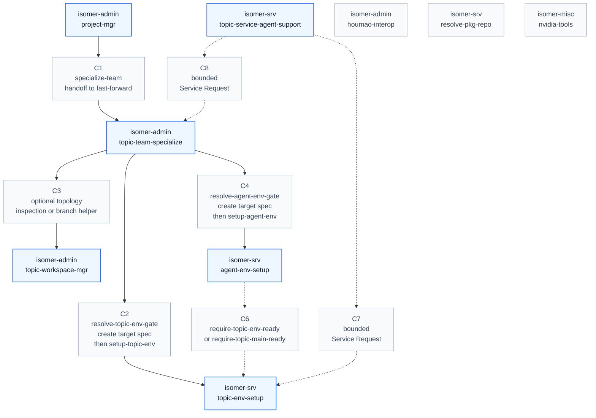

# Skill Call Graph

This graph covers only skills under `skillset/misc/`, `skillset/operator/`, and `skillset/service/`. It shows call paths where both endpoints are top-level skills. Intermediate nodes appear only when they explain the path between skills.

## Calling Conditions

| ID | Caller | Route | Callee | Calling condition and context |
| --- | --- | --- | --- | --- |
| C1 | `isomer-admin-project-mgr` | `specialize-team` handoff to `fast-forward` | `isomer-admin-topic-team-specialize` | The operator moves from Project lifecycle work into full Topic Team Specialization for one Research Topic. Project-level context is resolved first, then the direct natural-language request is handed to the topic-team skill's `fast-forward` flow instead of calling the internal `adapt-team-template` stage directly. |
| C2 | `isomer-admin-topic-team-specialize` | `resolve-topic-env-gate`, create `topic.env.topic_setup_target_spec`, then `setup-topic-env` | `isomer-srv-topic-env-setup` | Topic Team Specialization needs Topic Workspace dependencies, Pixi readiness, Topic Main Development Repository setup, canonical external repository acquisition, external projection materialization, or topic-root/repo-specific verification work. The operator-owned flow creates or validates `topic.env.topic_setup_target_spec` before delegation. The service returns Topic Workspace predecessor evidence, topic-main Git state, projection metadata, blockers, and `per_agent_readiness_status: not_checked`. |
| C3 | `isomer-admin-topic-team-specialize` | optional topology inspection or branch helper | `isomer-admin-topic-workspace-mgr` | The operator asks for read-only topology inspection, branch helper operations, boundary summaries, or legacy compatibility diagnostics. This is optional support and is not the canonical path for creating `topic.repos.main`, external projections, or Agent Workspace worktrees. |
| C4 | `isomer-admin-topic-team-specialize` | `resolve-agent-env-gate`, create `topic.env.agent_setup_target_spec`, then `setup-agent-env` | `isomer-srv-agent-env-setup` | The operator asks for per-Agent Workspace cwd verification, selected-agent repair, or launch-facing Agent Workspace readiness. The route first resolves `topic.intent.agent_env_requirements` or receives an explicit agent env target spec. Topic env readiness, Topic Main Development Repository predecessor evidence, projection evidence when required, and authoritative Agent Names must exist before the service creates worktrees or verifies cwd readiness. |
| C6 | `isomer-srv-agent-env-setup` | `require-topic-env-ready` or `require-topic-main-ready` repair route | `isomer-srv-topic-env-setup` | Agent Workspace setup finds missing, stale, blocked, or failed Topic Workspace, Topic Main Development Repository, or external projection predecessor evidence. The service reports a dependency repair next action back to topic env setup instead of creating, repairing, or projecting topic-main material itself. |
| C7 | `isomer-srv-topic-service-agent-support` | bounded Service Request | `isomer-srv-topic-env-setup` | A Topic Service Agent or Topic Service Master receives a bounded Service Request for topic-scoped environment readiness checks, diagnostics, or support artifacts. The service support skill does not own the environment setup workflow; it delegates concrete setup or verification to topic env setup. |
| C8 | `isomer-srv-topic-service-agent-support` | bounded Service Request | `isomer-admin-topic-team-specialize` | A bounded service request supports Topic Team Specialization through template inspection, placeholder reconciliation, copied-material planning, topic edit drafting, diagnostics, or support artifacts. Research decision authority and final specialization ownership remain with the operator specialization skill. |

`isomer-srv-topic-env-setup` may report `per_agent_readiness_status: not checked` and name an operator follow-up when the caller asks about Agent Workspace proof. That is not a skill-to-skill call path, so it is not represented as an edge.

The isolated skills in this graph do not make explicit skill-to-skill calls inside the inspected `misc`, `operator`, and `service` subtree. `isomer-admin-houmao-interop` answers Houmao bridge questions, `isomer-srv-resolve-pkg-repo` resolves package repositories and channels, and `isomer-misc-nvidia-tools` provides CUDA/NVIDIA build preferences.
