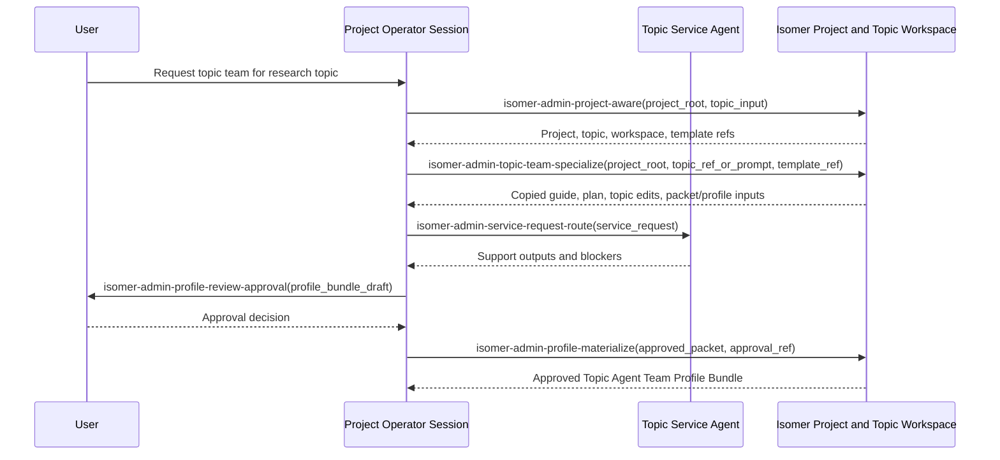
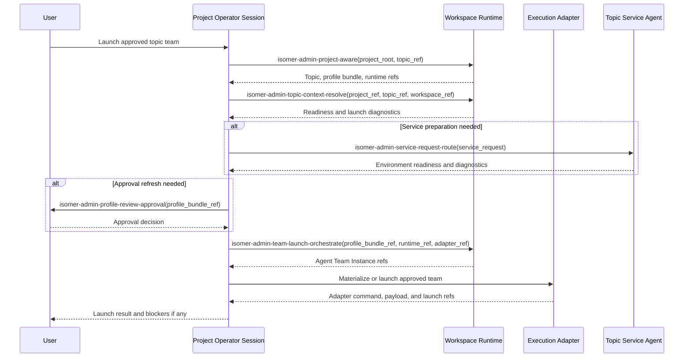

# Operator Admin Skills

This subtree contains skills intended for Project Operator Sessions and Operator Agents. These skills use the `isomer-admin-<purpose>` naming convention because they operate project control surfaces: project discovery, Topic Team Specialization orchestration, Service Request routing, approval provenance, profile materialization, and team launch orchestration.

Install these skills into the agent surface that acts as the Project Operator Session or durable Operator Agent. Ordinary research team members should use research-stage skills from `skillset/research-paradigm/`; Service Team actors should use service skills from `skillset/service/`.

## Skill Purposes

| Skill | Purpose |
| --- | --- |
| `isomer-admin-project-aware` | Establish the operator's project awareness. It resolves the Project root, Project Manifest, selected Research Topic, Topic Workspace, existing Topic Agent Team Profile Bundle refs, Workspace Runtime refs, Domain Agent Team Templates, and known Topic Service Agent surfaces before any mutation. |
| `isomer-admin-topic-team-specialize` | Run the module-level Topic Team Specialization workflow. It resolves project and topic context, copies Domain Agent Team Template material into `<topic-workspace>/team-profile/`, reads or creates `team-specialization-guide.md`, creates `team-specialization-plan.md`, adapts copied material, records a `Final Report`, and reports packet/profile inputs for approval and materialization. |
| `isomer-admin-service-request-route` | Route bounded support work from the operator surface to a Topic Service Agent. It frames the Service Request scope, expected output, authorization, dispatch form, completion observation rules, and provenance obligations. |
| `isomer-admin-template-inspect` | Inspect a Domain Agent Team Template as reusable template material. It checks template manifest data, placeholder catalogs, role binding slots, workflow stages, workspace contracts, copyable material declarations, and diagnostics before Topic Team Specialization. |
| `isomer-admin-topic-context-resolve` | Resolve topic-specific values needed for specialization. It gathers Research Topic Config, Effective Topic Context, Topic Workspace, Workspace Runtime readiness, policy refs, Capability Binding refs, Skill Binding Projection refs, provider refs, and Gate policy refs. |
| `isomer-admin-placeholder-reconcile` | Convert template placeholders into concrete topic-level decisions. It records resolved substitutions, copied material plans, proposed topic edits, explicit deferrals, unresolved blockers, Service Request outputs, and packet-shaped approval provenance in a Topic Team Instantiation Packet. |
| `isomer-admin-topic-profile-draft` | Draft reviewable Topic Agent Team Profile Bundle material. It prepares role selections, copied or rewritten template material, topic edits, expected Artifacts, policy choices, launch blockers, and provenance for user review. |
| `isomer-admin-profile-review-approval` | Turn a draft profile bundle into an approval decision surface. It summarizes what will be written, highlights unresolved placeholders and launch blockers, requests user approval, and prepares bundle-local approval provenance. |
| `isomer-admin-profile-materialize` | Validate and write the authoritative Topic Agent Team Profile Bundle. It calls generic validators and materializers, writes the approved bundle under the Topic Workspace, and records packet, validation, and approval provenance. |
| `isomer-admin-team-launch-orchestrate` | Cross from approved profile material into runtime and adapter work. It creates or selects Agent Team Instance records, checks runtime readiness, preserves operator and service provenance, and routes launch materialization through the execution adapter. |

## Example: Specialize a Domain Team for a New Topic

Use this flow when a user gives a research topic and asks the operator to instantiate a topic-level team from a Domain Agent Team Template such as `deepsci-mini`. In this example, each skill is shown as an operator function call.

1. `isomer-admin-project-aware(project_root, topic_input)` resolves the Project Manifest, Research Topic, Topic Workspace, available templates, existing profile bundle refs, runtime refs, and service surfaces.
2. `isomer-admin-topic-team-specialize(project_root, topic_ref_or_prompt, template_ref)` copies the template into `<topic-workspace>/team-profile/`, reads or creates `team-specialization-guide.md`, creates `team-specialization-plan.md`, adapts copied material, records a `Final Report`, and reports Topic Team Instantiation Packet and Topic Agent Team Profile Bundle inputs.
3. `isomer-admin-service-request-route(service_request)` optionally dispatches bounded support work when the specialization plan needs environment readiness, placeholder reconnaissance, copied material diagnostics, or other operational support.
4. `isomer-admin-profile-review-approval(profile_bundle_draft)` shows the review surface to the user and records approval provenance.
5. `isomer-admin-profile-materialize(approved_packet, approval_ref)` validates and writes the authoritative Topic Agent Team Profile Bundle under `<topic-workspace>/team-profile/`.

## Example: Launch an Approved Topic Team

Use this flow when a Topic Agent Team Profile Bundle already exists and the user asks the operator to create or launch the topic's runtime team. In this example, each skill is shown as an operator function call.

1. `isomer-admin-project-aware(project_root, topic_ref)` resolves the selected Research Topic, Topic Workspace, approved profile bundle, Workspace Runtime, and launch-relevant adapter refs.
2. `isomer-admin-topic-context-resolve(project_ref, topic_ref, topic_workspace_ref)` checks current topic readiness, policy refs, binding refs, and runtime readiness.
3. `isomer-admin-profile-review-approval(profile_bundle_ref)` refreshes approval when the existing bundle has stale approval, unresolved launch blockers, or requires a fresh user decision before launch.
4. `isomer-admin-service-request-route(service_request)` dispatches preparation work when a Topic Service Agent must prepare environments, check Agent Workspace readiness, or collect diagnostics before launch.
5. `isomer-admin-team-launch-orchestrate(profile_bundle_ref, workspace_runtime_ref, adapter_ref)` creates or selects the Agent Team Instance, preserves profile bundle and packet provenance, and routes adapter launch materialization.
6. The operator reports runtime refs, adapter refs, service outputs, launch blockers, and the next operator action to the user.

## Naming Contract

Operator skill folders must be named `isomer-admin-<purpose>`, and `SKILL.md` frontmatter `name:` must match the folder name. If present, `agents/openai.yaml` must use the same skill name for `interface.display_name` and invoke the same skill in `interface.default_prompt`.

Operator skills must preserve Isomer domain boundaries. They can direct validation, approval, materialization, Service Request routing, and launch orchestration, but they must not bypass Isomer validators, Gates, Workspace Runtime recording, or adapter preflight.

`isomer-admin-topic-team-specialize` is the preferred entrypoint for Domain Agent Team Template understanding and topic adaptation. The finer-grained project-awareness, template-inspection, topic-context, placeholder, and profile-draft skills remain useful helper functions for operators that need to debug, test, or override one part of the module workflow.
